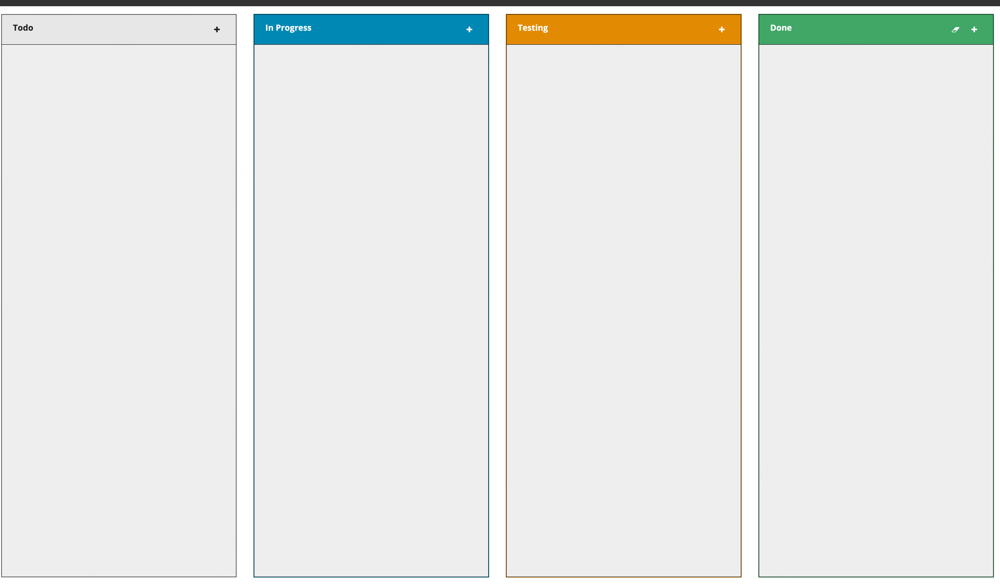

# Kanban

37,514

Marcel J. Kloubert

Kanban board for Visual Studio Code.

### 评价

界面有点简陋，作为看板本身的功能很齐全

## TODO.md Kanban Board

31,985

CodDX

Coddx - a collection of tools that help developers program efficiently. Some useful features like: Kanban Board to manage project tasks in TODO.md, generating multiple files from templ

### 评价

这个界面就更简陋了，功能也不如 Kanban 齐全，但是这个有个好处是，可以拖动事项

本质上应该是对 .md 的渲染

# Todo MD

65,777

Alexander

Todo tracking based on `todo.txt` format.

### 评价

这个也很简陋

# VS Todo

5,594

Sourav Layek

Track your remaining task

### 评价

这个是一个侧边的清单，和 Kanban 的功能不太一样

# Marquee

47,502

stateful

Stay organized with minimal context switching, all inside your VS Code.

### 评价

这个就有点厉害了，卧槽，功能这么多
