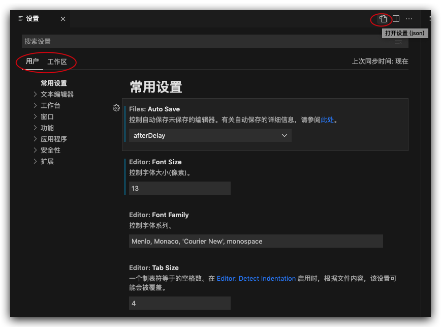

# VSCode

[TOC]

## 1. 我的配置备份

### 1.1. mac

#### 1.1.1. 设置

```json
{
    "[html]": {
        "editor.defaultFormatter": "esbenp.prettier-vscode"
    },
    "[json]": {
        "editor.defaultFormatter": "esbenp.prettier-vscode"
    },
    "[markdown]": {
        "editor.defaultFormatter": "esbenp.prettier-vscode",
        "editor.quickSuggestions": {
            "comments": "on",
            "other": "on",
            "strings": "on"
        },
        "files.trimTrailingWhitespace": false
    },
    "[mermaid]": {
        "files.trimTrailingWhitespace": false
    },
    "[python]": {
        "editor.defaultFormatter": "ms-python.black-formatter"
    },
    "editor.fontFamily": "Menlo, 'Courier New', monospace",
    "editor.maxTokenizationLineLength": 10000000,
    "editor.minimap.showSlider": "always",
    "editor.renderWhitespace": "all",
    "editor.wordSeparators": "`~!@#$%^&*()-=+[{]}\\|;:'\",.<>/?，。、（）：？”“！",
    "editor.wordWrap": "on",
    "files.trimTrailingWhitespace": true,
    "folderTemplates.globalTemplateDirectoryPath": "/Users/chen/Documents/chen/requirement【需求】/.fttemplates",
    "git.autofetch": true,
    "git.confirmSync": false,
    "git.enableSmartCommit": true,
    "json.format.enable": false,
    "json.maxItemsComputed": 10000000,
    "markdown-preview-github-styles.colorTheme": "light",
    "markdown.copyFiles.destination": {
        "/**/*": "images/"
    },
    "markdown.extension.completion.enabled": true,
    "markdown.extension.list.indentationSize": "inherit",
    "markdown.extension.print.absoluteImgPath": false,
    "markdown.extension.toc.levels": "2..6",
    "markdown.updateLinksOnFileMove.enabled": "always",
    "markdown.validate.enabled": true,
    "markdownlint.config": {
        "MD033": false,
        "MD036": false
    },
    "marquee.configuration.name": "chen",
    "marquee.configuration.workspaceLaunch": false,
    "marquee.widgets.github.since": "Weekly",
    "marquee.widgets.todo.showArchived": false,
    "marquee.widgets.weather.city": "Beijing",
    "marquee.widgets.weather.scale": "Celsius",
    "prettier.tabWidth": 4,
    "security.workspace.trust.untrustedFiles": "open",
    "window.openFilesInNewWindow": "on",
    "window.openFoldersInNewWindow": "on",
    "window.zoomLevel": 1,
    "workbench.colorCustomizations": {
        "editor.lineHighlightBackground": "#00000090",
        "editor.lineHighlightBorder": "#ffffff30",
        "tree.indentGuidesStroke": "#008700"
    },
    "workbench.startupEditor": "none",
    "workbench.tree.indent": 16
}
```

#### 1.1.2. 自定义的一些快捷键设置

```json
// 将键绑定放在此文件中以覆盖默认值
[
    {
        "key": "cmd+1",
        "command": "md-shortcut.toggleTitleH1"
    },
    {
        "key": "cmd+2",
        "command": "md-shortcut.toggleTitleH2"
    },
    {
        "key": "cmd+3",
        "command": "md-shortcut.toggleTitleH3"
    },
    {
        "key": "cmd+4",
        "command": "md-shortcut.toggleTitleH4"
    },
    {
        "key": "cmd+5",
        "command": "md-shortcut.toggleTitleH5"
    },
    {
        "key": "cmd+6",
        "command": "md-shortcut.toggleTitleH6"
    },
    {
        "key": "alt+`",
        "command": "markdown.extension.editing.toggleCodeBlock"
    },
    {
        "key": "cmd+e",
        "command": "workbench.view.explorer",
        "when": "viewContainer.workbench.view.explorer.enabled"
    },
    {
        "key": "cmd+e",
        "command": "workbench.action.closeSidebar",
        "when": "sideBarVisible"
    },
    {
        "key": "shift+tab",
        "command": "editor.action.outdentLines",
        "when": "editorTextFocus && !editorReadonly"
    },
    {
        "key": "cmd+b",
        "command": "-workbench.action.toggleSidebarVisibility"
    }
]
```

#### 1.1.3. 插件

| 插件名                                                               | 插件 id                                | 简述              |
| -------------------------------------------------------------------- | -------------------------------------- | ----------------- |
| Better Comments                                                      | aaron-bond.better-comments             | 注释优化          |
| Chinese (Simplified) (简体中文) Language Pack for Visual Studio Code | ms-ceintl.vscode-language-pack-zh-hans | 中文支持          |
| Code Spell Checker                                                   | streetsidesoftware.code-spell-checker  | 拼写检查          |
| Folder Templates                                                     | huuums.vscode-fast-folder-structure    | 快速创建目录      |
| Local History                                                        | xyz.local-history                      | 本地历史插件      |
| Marquee                                                              | stateful.marquee                       | 项目管理          |
| Prettier - Code formatter                                            | esbenp.prettier-vscode                 | 代码格式化        |
| Prettier SQL VSCode                                                  | inferrinizzard.prettier-sql-vscode     | sql 代码格式化    |
| XML                                                                  | redhat.vscode-xml                      | xml 支持          |
| GitHub Copilot                                                       | github.copilot                         | Copilot           |
| GitHub Copilot Chat                                                  | github.copilot-chat                    | Copilot           |
| Jupyter                                                              | ms-toolsai.jupyter                     | jupyter           |
| Jupyter Cell Tags                                                    | ms-toolsai.vscode-jupyter-cell-tags    | jupyter           |
| Jupyter Keymap                                                       | ms-toolsai.jupyter-keymap              | jupyter           |
| Jupyter Notebook Renderers                                           | ms-toolsai.jupyter-renderers           | jupyter           |
| Jupyter Slide Show                                                   | ms-toolsai.vscode-jupyter-slideshow    | jupyter           |
| Black Formatter                                                      | ms-python.black-formatter              | python 代码格式化 |
| Pylance                                                              | ms-python.vscode-pylance               | python            |
| Python                                                               | ms-python.python                       | python            |
| Python Debugger                                                      | ms-python.debugpy                      | python            |
| GitHub Markdown Preview                                              | bierner.github-markdown-preview        | markdown          |
| Markdown All in One                                                  | yzhang.markdown-all-in-one             | markdown          |
| Markdown Checkboxes                                                  | bierner.markdown-checkbox              | markdown          |
| Markdown Emoji                                                       | bierner.markdown-emoji                 | markdown          |
| Markdown Footnotes                                                   | bierner.markdown-footnotes             | markdown          |
| Markdown Preview Enhanced                                            | shd101wyy.markdown-preview-enhanced    | markdown          |
| Markdown Preview Github Styling                                      | bierner.markdown-preview-github-styles | markdown          |
| Markdown Preview Mermaid Support                                     | bierner.markdown-mermaid               | markdown          |
| Markdown Preview with Bitbucket Styles                               | hbrok.markdown-preview-bitbucket       | markdown          |
| Markdown Shortcuts                                                   | mdickin.markdown-shortcuts             | markdown          |
| Markdown Theme Kit                                                   | ms-vscode.theme-markdownkit            | markdown          |
| Markdown yaml Preamble                                               | bierner.markdown-yaml-preamble         | markdown          |
| Markdown+Math                                                        | goessner.mdmath                        | markdown          |
| Mermaid Editor                                                       | tomoyukim.vscode-mermaid-editor        | markdown          |
| Print                                                                | pdconsec.vscode-print                  | markdown          |
| Read Time                                                            | johnpapa.read-time                     | markdown          |
| Word Count                                                           | ms-vscode.wordcount                    | markdown          |
| markdownlint                                                         | davidanson.vscode-markdownlint         | markdown          |

### 1.2. win

#### 1.2.1. 设置

```json
{
    "[html]": {
        "editor.defaultFormatter": "esbenp.prettier-vscode"
    },
    "[json]": {
        "editor.defaultFormatter": "esbenp.prettier-vscode"
    },
    "[jsonc]": {
        "editor.defaultFormatter": "esbenp.prettier-vscode"
    },
    "[markdown]": {
        "editor.defaultFormatter": "esbenp.prettier-vscode",
        "editor.quickSuggestions": {
            "comments": "on",
            "other": "on",
            "strings": "on"
        },
        "files.trimTrailingWhitespace": false
    },
    "[python]": {
        "editor.defaultFormatter": "ms-python.black-formatter"
    },
    "code-runner.clearPreviousOutput": true,
    "code-runner.runInTerminal": true,
    "editor.formatOnPaste": true,
    "editor.minimap.showSlider": "always",
    "editor.renderWhitespace": "all",
    "editor.wordSeparators": "`~!@#$%^&*()-=+[{]}\\|;:'\",.<>/?，。、（）：？”“！",
    "editor.wordWrap": "on",
    "files.trimTrailingWhitespace": true,
    "git.autofetch": true,
    "git.confirmSync": false,
    "git.enableSmartCommit": true,
    "jupyter.askForKernelRestart": false,
    "json.maxItemsComputed": 10000000,
    "markdown.copyFiles.destination": {
        "/**/*": "images/"
    },
    "markdown.extension.list.indentationSize": "inherit",
    "markdown.extension.print.absoluteImgPath": false,
    "markdown.updateLinksOnFileMove.enabled": "always",
    "markdown.validate.enabled": true,
    "marquee.configuration.name": "chen",
    "marquee.configuration.workspaceLaunch": false,
    "marquee.widgets.github.since": "Weekly",
    "marquee.widgets.todo.showArchived": false,
    "marquee.widgets.weather.city": "Beijing",
    "marquee.widgets.weather.scale": "Celsius",
    "prettier.tabWidth": 4,
    "window.openFilesInNewWindow": "on",
    "window.openFoldersInNewWindow": "on",
    "workbench.colorCustomizations": {
        "editor.lineHighlightBackground": "#00000090",
        "editor.lineHighlightBorder": "#ffffff30",
        "tree.indentGuidesStroke": "#008700"
    },
    "workbench.startupEditor": "none",
    "workbench.tree.indent": 16,
    "window.zoomLevel": 1
}
```

#### 1.2.2. 自定义的一些快捷键设置

```json
// 将键绑定放在此文件中以覆盖默认值
[
    {
        "key": "ctrl+1",
        "command": "md-shortcut.toggleTitleH1"
    },
    {
        "key": "ctrl+2",
        "command": "md-shortcut.toggleTitleH2"
    },
    {
        "key": "ctrl+3",
        "command": "md-shortcut.toggleTitleH3"
    },
    {
        "key": "ctrl+4",
        "command": "md-shortcut.toggleTitleH4"
    },
    {
        "key": "ctrl+5",
        "command": "md-shortcut.toggleTitleH5"
    },
    {
        "key": "ctrl+6",
        "command": "md-shortcut.toggleTitleH6"
    },
    {
        "key": "ctrl+e",
        "command": "workbench.view.explorer",
        "when": "viewContainer.workbench.view.explorer.enabled"
    },
    {
        "key": "ctrl+e",
        "command": "workbench.action.closeSidebar",
        "when": "sideBarVisible"
    },
    {
        "key": "ctrl+b",
        "command": "-workbench.action.toggleSidebarVisibility"
    }
]
```

#### 1.2.3. 插件

| 插件名                                                               | 插件 id                                              | 简述                                           |
| -------------------------------------------------------------------- | ---------------------------------------------------- | ---------------------------------------------- |
| Better Comments                                                      | aaron-bond.better-comments                           | 注释色彩，醒目、带分类                         |
| TODO Highlight                                                       | wayou.vscode-todo-highlight                          | 高亮所有 TODO                                  |
| Chinese (Simplified) (简体中文) Language Pack for Visual Studio Code | ms-ceintl.vscode-language-pack-zh-hans               |
| Code Spell Checker                                                   | streetsidesoftware.code-spell-checker                | 单词拼写检查                                   |
| Local History                                                        | xyz.local-history                                    | 本地历史                                       |
| Marquee                                                              | stateful.marquee                                     | 项目管理                                       |
| GitHub Copilot                                                       | github.copilot                                       | Copilot                                        |
| GitHub Copilot Chat                                                  | github.copilot-chat                                  | Copilot                                        |
| Jupyter                                                              | ms-toolsai.jupyter                                   | jupyter 包                                     |
| autoDocstring - Python Docstring Generator                           | njpwerner.autodocstring                              |
| Black Formatter                                                      | ms-python.black-formatter                            | python 代码格式化                              |
| Pylance                                                              | ms-python.vscode-pylance                             | python                                         |
| Python                                                               | ms-python.python                                     | python                                         |
| Python Debugger                                                      | ms-python.debugpy                                    | python                                         |
| Python Indent                                                        | kevinrose.vsc-python-indent                          | python 写的时候，正确自动缩进                  |
| isort                                                                | ms-python.isort                                      | 对 import 进行分类和排序                       |
| GitHub Markdown Preview                                              | bierner.github-markdown-preview                      | markdown 包                                    |
| Markdown All in One                                                  | yzhang.markdown-all-in-one                           | markdown                                       |
| Markdown Preview Enhanced                                            | shd101wyy.markdown-preview-enhanced                  | markdown                                       |
| Markdown Preview with Bitbucket Styles                               | hbrok.markdown-preview-bitbucket                     | markdown                                       |
| Markdown Shortcuts                                                   | mdickin.markdown-shortcuts                           | markdown                                       |
| Markdown Theme Kit                                                   | ms-vscode.theme-markdownkit                          | markdown                                       |
| Markdown+Math                                                        | goessner.mdmath                                      | markdown                                       |
| markdownlint                                                         | davidanson.vscode-markdownlint                       | markdown                                       |
| Markmap                                                              | gera2ld.markmap-vscode                               | markdown 用 markdown 画脑图                    |
| Mermaid Editor                                                       | tomoyukim.vscode-mermaid-editor                      | markdown                                       |
| Print                                                                | pdconsec.vscode-print                                | markdown                                       |
| Read Time                                                            | johnpapa.read-time                                   | markdown                                       |
| Word Count                                                           | ms-vscode.wordcount                                  | markdown                                       |
| Mermaid Markdown Syntax Highlighting                                 | bpruitt-goddard.mermaid-markdown-syntax-highlighting | markdown mermaid 语法高亮                      |
| Mermaid Preview                                                      | vstirbu.vscode-mermaid-preview                       | mermaid 预览                                   |
| Auto Complete Tag                                                    | formulahendry.auto-complete-tag                      | 前端，自动闭合配对标签                         |
| CSS Peek                                                             | pranaygp.vscode-css-peek                             | 前端                                           |
| Color Info                                                           | bierner.color-info                                   | 前端，CSS 快速查看颜色                         |
| HTML CSS Support                                                     |                                                      | 前端，快速补全 HTML 和 CSS                     |
| Image preview                                                        | kisstkondoros.vscode-gutter-preview                  | 前端，图片预览                                 |
| Live Server                                                          | ritwickdey.liveserver                                | 前端，浏览器中实时预览                         |
| javascript console utils                                             | whtouche.vscode-js-console-utils                     | 前端，Cmd + Shift + L 快速出现 `console.log()` |
| JS-CSS-HTML Formatter                                                | lonefy.vscode-js-css-html-formatter                  | 前端                                           |
| open in browser                                                      | techer.open-in-browser                               |                                                |
| C/C++                                                                | ms-vscode.cpptools                                   | C/C++                                          |
| Extension Pack for Java                                              | vscjava.vscode-java-pack                             | Java                                           |
| Test Runner for Java                                                 | vscjava.vscode-java-test                             |                                                |
| CodeSnap                                                             | adpyke.codesnap                                      | 做 PPT 用                                      |
| Polacode-                                                            | √                                                    | 生成代码截图，做 PPT 时用                      |
| Prettier - Code formatter                                            | esbenp.prettier-vscode                               | 代码格式化，额外说明[见](#1231-prettier-说明)  |
| GitLens — Git supercharged                                           | eamodio.gitlens                                      | git 增强                                       |
| LeetCode                                                             | leetcode.vscode-leetcode                             |                                                |
| Rainbow CSV                                                          | mechatroner.rainbow-csv                              | csv 彩虹                                       |
| WakaTime                                                             | wakatime.vscode-wakatime                             |                                                |
| XML Tools                                                            | dotjoshjohnson.xml                                   |                                                |
| indent-rainbow                                                       | oderwat.indent-rainbow                               | 彩虹缩进                                       |
| vscode-icons                                                         | vscode-icons-team.vscode-icons                       |                                                |
| vscode-pdf                                                           | tomoki1207.pdf                                       |                                                |

## 2. Profile

> <https://code.visualstudio.com/docs/configure/profiles#_access-the-profiles-editor>

可以创建一个 Profile，代表一套 的设置、插件、UI 布局、快捷键，可以在不同的工作区，启用不同的 Profile。

例如写 Java 时，用相关的插件、快捷键；写 Python 的时候，切换为另一套。

## 3. 工作区 Workspace

可以将一些目录按需组织在一起，形成一个工作区

### 3.1. 工作区的 Explorer 文件夹顺序

打开保存的 code-workspace 文件，调整里面的 folders 里的顺序即可

打开该文件：F1 >> Open Workspace Configuration File

## 4. 设置

### 4.1. 设置

左下角打开设置，比较方便。


-   用户设置：全局生效
-   工作区设置：只对当前项目生效，优先级更高。保存在`.vscode/settings.json`中，可以提交到 git，共享给团队其他成员。
-   右上角 icon 可以打开 json 文件形式的设置



### 4.2. 常用设置

| 大概含义                                 | 设置名称 | 设置路径                                                                  | 推荐值                    | 图示/说明                                                                                  |
| ---------------------------------------- | -------- | ------------------------------------------------------------------------- | ------------------------- | ------------------------------------------------------------------------------------------ |
| 面包屑导航                               | 1        | 用户设置 -> 工作台 -> 导航路径 -> `Breadcrumbs`                           | `on`                      |                                                        |
| 显示代码行号                             | 1        | `Editor: Line Numbers`                                                    | `on`                      |                                                                                            |
| 右侧显示代码缩略图                       | 1        | `Editor: Minimap`                                                         | `on`                      |                                                                                            |
| 高亮光标当前所在行                       | 1        | `Editor.renderLineHighlight`                                              | `all / line`              | 这里还需要一些其他设置内容，见下方                                                         |
| 文件自动保存                             | 1        | `Files : Auto Save`                                                       | `off`                     | 在配置了保存自动格式化的情况下，会导致写代码的时候一直被自动格式化，很难受。               |
| 保存代码后是否立刻格式化                 | 1        | `Editor.formatOnSave`                                                     | `off`                     |                                                                                            |
| 热退出，关闭时记住未保存的文件           | 1        | `Files: Hot Exit`                                                         | `onExit`                  |                                                                                            |
| 粘贴内容是否自动格式化                   | 1        | `Editor: Format On Paste`                                                 | `off`                     |                                                                                            |
| 字体大小                                 |          | `Editor: Font Size`                                                       |                           |
| 是否根据文件内容自动检测用空格还是制表符 |          | `Editor: Detect Indentation`                                              | `on`                      |                                                                                            |
| 按下键盘上的 Tab 时插入空格              |          | `Editor: Insert Spaces`                                                   | `on`                      |                                                                                            |
| 制表符等于多少空格                       |          | `Editor: Tab Size`                                                        | `4`                       | 这个设置在 Prettier 插件里也可以设置                                                       |
| 保存时自动去掉行末空格                   |          | `Files: Trim Trailing Whitespace`                                         | `on`                      |                                                                                            |
| 直观显示空格和制表符                     |          | `Editor: Render Whitespace`                                               | `all`                     |                                                                                            |
| 删除文件是否弹出确认框                   |          | `Explorer: Confirm Delete`                                                | `on`                      |                                                                                            |
| 在新窗口打开文件/文件夹                  |          | `Window: Open Files In New Window` / `Window: Open Folders In New Window` | `on`                      |                                                                                            |
| 重新打开 VSCode 时， 是否展示之前的窗口  |          | `Window: Restore Windows`                                                 | `all`                     |                                                                                            |
| 文件展示在文件夹之前                     |          | `Explorer >> Sort Order : filesFirst`                                     |                           |
| 中文标点也作为单词分隔符                 |          | `Editor >> Word Separators`                                               | 增加 `，。、（）：？”“！` | 默认情况下，中文标点不会被视为单词分隔符，在使用 alt/option + ←/→ 跳转时会视为一个大单词。 |

**高亮光标当前所在行 其他设置**

设置里还要增加以下内容，意思是 1. 修改光标所在行的背景色 2. 修改光标所在行的边框色

```json
"workbench.colorCustomizations": {
    "editor.lineHighlightBackground": "#00000090",
    "editor.lineHighlightBorder": "#ffffff30"
}
```

## 5. 插件

### 5.1. 插件市场

<https://marketplace.visualstudio.com/vscode>

-   Featured：由 VS Code 团队精心推荐的插件。
-   Trending：近期热门插件。
-   Most Popular：按总安装量排序的插件。
-   Recently Added：最新发布的插件。

### 5.2. 常用插件

#### 5.2.1. Better Comments

> identity: aaron-bond.better-comments

#### 5.2.2. GitHub Markdown Preview

> identity: bierner.github-markdown-preview

#### 5.2.3. Markdown Checkboxes

bierner.markdown-checkbox

#### 5.2.4. Markdown Emoji

bierner.markdown-emoji

#### 5.2.5. Markdown Footnotes

bierner.markdown-footnotes

#### 5.2.6. Markdown Preview Mermaid Support

bierner.markdown-mermaid

#### 5.2.7. Markdown Preview Github Styling

bierner.markdown-preview-github-styles

#### 5.2.8. Markdown yaml Preamble

bierner.markdown-yaml-preamble

#### 5.2.9. markdownlint

davidanson.vscode-markdownlint

#### 5.2.10. Prettier - Code formatter

esbenp.prettier-vscode

#### 5.2.11. Markdown+Math

goessner.mdmath

#### 5.2.12. Markdown Preview with Bitbucket Styles

hbrok.markdown-preview-bitbucket

#### 5.2.13. Folder Templates

huuums.vscode-fast-folder-structure

#### 5.2.14. Prettier SQL VSCode

inferrinizzard.prettier-sql-vscode

#### 5.2.15. Read Time

johnpapa.read-time

#### 5.2.16. Markwhen

markwhen.markwhen

#### 5.2.17. Markdown Shortcuts

mdickin.markdown-shortcuts

#### 5.2.18. Rainbow CSV

mechatroner.rainbow-csv

#### 5.2.19. Mermaid Chart

mermaidchart.vscode-mermaid-chart

#### 5.2.20. Chinese (Simplified) (简体中文) Language Pack for Visual Studio Code

ms-ceintl.vscode-language-pack-zh-hans

#### 5.2.21. Black Formatter

ms-python.black-formatter

#### 5.2.22. Python Debugger

ms-python.debugpy

#### 5.2.23. Python

ms-python.python

#### 5.2.24. Pylance

ms-python.vscode-pylance

#### 5.2.25. Python Environments

ms-python.vscode-python-envs

#### 5.2.26. Jupyter

ms-toolsai.jupyter

#### 5.2.27. Jupyter Keymap

ms-toolsai.jupyter-keymap

#### 5.2.28. Jupyter Notebook Renderers

ms-toolsai.jupyter-renderers

#### 5.2.29. Jupyter Cell Tags

ms-toolsai.vscode-jupyter-cell-tags

#### 5.2.30. Jupyter Slide Show

ms-toolsai.vscode-jupyter-slideshow

#### 5.2.31. Markdown Theme Kit

ms-vscode.theme-markdownkit

#### 5.2.32. Word Count

ms-vscode.wordcount

#### 5.2.33. JSON Parse & Stringify

nextfaze.json-parse-stringify

#### 5.2.34. Print

pdconsec.vscode-print

#### 5.2.35. XML

redhat.vscode-xml

#### 5.2.36. Markdown 增强预览

shd101wyy.markdown-preview-enhanced

#### 5.2.37. Marquee

stateful.marquee

#### 5.2.38. Code Spell Checker

streetsidesoftware.code-spell-checker

#### 5.2.39. Mermaid Editor

tomoyukim.vscode-mermaid-editor

#### 5.2.40. Mermaid Preview

vstirbu.vscode-mermaid-preview

#### 5.2.41. Local History

xyz.local-history

#### 5.2.42. Markdown All in One

yzhang.markdown-all-in-one

#### 5.2.43. 页面展示

| 插件名          | 推荐 | 作用                     |
| --------------- | ---- | ------------------------ |
| vscode-icons    |      | 根据文件后缀显示不同图标 |
| indent-rainbow  |      | 突出显示代码缩进         |
| Better Comments | √    | 注释色彩，醒目、带分类   |

#### 5.2.44. 代码管理

| 插件名          | 推荐 | 作用             |
| --------------- | ---- | ---------------- |
| GitLens         | √    | git 相关         |
| Local History   | √    | 维护本地历史记录 |
| Project Manager |      | 管理常用项目     |
| Waka Time       |      | 统计写代码的时间 |

#### 5.2.45. 代码格式化

| 插件名             | 推荐 | 作用                                                                                             |
| ------------------ | ---- | ------------------------------------------------------------------------------------------------ |
| Code Spell Checker | √    | 单词拼写检查                                                                                     |
| TODO Highlight     |      | 在命令面板中，Todohighlist 可以显示所有的 TODO（必须是大写的）                                   |
| Prettier           | √    | 代码格式化<br/>在项目跟目录下新建 `.prettierrc`<br/>默认使用 2 个空格，可以在通用设置里改为 4 个 |
| ESLint             |      | 代码格式校验                                                                                     |

Prettier 设置文件参考

##### 5.2.45.1. Prettier 说明

在项目根目录下新建 `.prettierrc`

默认使用 2 个空格，可以在通用设置里改为 4 个

```json
{
    "printWidth": 150,
    "tabWidth": 4,
    "semi": true,
    "singleQuote": true,
    "trailingComma": "es5",
    "tslintIntegration": true,
    "insertSpaceBeforeFunctionParenthesis": false
}
```

#### 5.2.46. 前端相关

| 插件名                                        | 推荐 | 作用                                              |
| --------------------------------------------- | ---- | ------------------------------------------------- |
| Live Server                                   | √    | 浏览器中实时预览                                  |
| open in browser                               |      | HTML 文件中，右键菜单增加 Open In Default Browser |
| Auto Close Tag                                | √    | 自动闭合配对标签                                  |
| Auto Rename Tag                               | √    | 同时修改匹配的标签                                |
| HTML CSS Support                              | √    | 快速补全 HTML 和 CSS                              |
| Vetur                                         |      | Vue 集成插件                                      |
| ES7 React/Redux/GraphQL/React-Native snippets |      | React/Redux/react-router 的语法智能提示           |
| JavaScript(ES6) code snippets                 |      | ES6 语法智能提示，支持快速输入                    |
| javascript console utils                      | √    | Cmd + Shift + L 可以快速出现 `console.log()`      |
| JS-CSS-HTML Formatter                         |      | 保存文件自动格式化 HTML CSS JS 代码               |
| Image Preview                                 |      | 鼠标移动到 url 时，预览图片，并显示尺寸           |
| CSS Peek                                      |      | 快速查看某个元素上的 CSS 样式                     |
| Vue CSS Peek                                  |      | 增加了对 Vue 文件的支持                           |
| Color Info                                    |      | 预览 CSS 中颜色的信息                             |

#### 5.2.47. Markdown

| 插件名                          | 推荐 | 作用                        |
| ------------------------------- | ---- | --------------------------- |
| Markdown Preview Github Styling | √    | 以 GitHub 风格预览 Markdown |
| Markdown All in One             | √    | 一些便利的快捷键            |
| Markdown Shortcuts              | √    | 一些便利的快捷键            |

#### 5.2.48. 其他

| 插件名    | 推荐 | 作用                      |
| --------- | ---- | ------------------------- |
| Polacode- | √    | 生成代码截图，做 PPT 时用 |

## 6. 快捷键

### 6.1. 工作区快捷键

| Mac 快捷键           | Win 快捷键               | 作用                                          | 备注                 |
| :------------------- | :----------------------- | :-------------------------------------------- | :------------------- |
| **Cmd + Shift + P**  | **Ctrl + Shift + P**，F1 | 显示命令面板                                  |                      |
| **Cmd + B**          | **Ctrl + B**             | 显示/隐藏侧边栏                               | 很实用               |
| `Cmd + \`            | `Ctrl + \`               | **拆分为多个编辑器**                          | 【重要】抄代码利器   |
| **Cmd + 1、2**       | **Ctrl + 1、2**          | 聚焦到第 1、第 2 个编辑器                     | 同上重要             |
| **Cmd + +、Cmd + -** | **ctrl + +、ctrl + -**   | 将工作区放大/缩小（包括代码字体、左侧导航栏） | 在投影仪场景经常用到 |
| Cmd + J              | Ctrl + J                 | 显示/隐藏控制台                               |                      |
| **Cmd + Shift + N**  | **Ctrl + Shift + N**     | 重新开一个软件的窗口                          | 很常用               |
| Cmd + Shift + W      | Ctrl + Shift + W         | 关闭软件的当前窗口                            |                      |
| Cmd + N              | Ctrl + N                 | 新建文件                                      |                      |
| Cmd + W              | Ctrl + W                 | 关闭当前文件                                  |                      |

### 6.2. 前端相关

快捷输入后，按`Tab`或者`Enter`。

| 快捷输入         | 功能                                                   |
| ---------------- | ------------------------------------------------------ |
| !                | 生成 html 骨架                                         |
| h1 / h2... / p … | h1 等标签                                              |
| .class_name      | 创建一个带有 class 属性，且值为`class_name`的 div 标签 |
| `div.class_name` | 同上                                                   |
| #id_value        | 创建一个带有 id 属性，且值为`id_value`的 div 标签      |
| `div#id_value`   | 同上                                                   |

## 7. 用户片段 / 文件模板 / 文件夹模板

Code >> 首选项 >> 配置代码片段

或者直接在 F1 里输入 snippets，选择 Snippets: Configure Snippets

可以选择针对 某一种语言 / 文件夹 / 全局 配置代码片段

| 内容        | 说明                                                                                                                            |
| ----------- | ------------------------------------------------------------------------------------------------------------------------------- |
| scope       | 设置模板适用文件类型，为空时适用所有文件。如果需要对 markdown 文件生效，需要单独配置                                            |
| prefix      | 用来触发代码片段的词语                                                                                                          |
| body        | 模板内容。每行都要用双引号包围，结束后加逗号，注意字符的转义，可以识别空格。里面可以有`$1`, `$2`, `$final`这样的，用于 tab 定位 |
| description | 对该模板代码的描述                                                                                                              |

如果需要对 markdown 文件生效，需要配置

```json
"[markdown]":  {
    "editor.quickSuggestions": true
}
```

## 8. 问题记录

### 8.1. Windows 上重启后 VSCode 消失/快捷方式失效

在 Windows 更新、VSCode 更新的时候有可能出现这个问题。可以通过快捷方式查看原本 exe 文件所在的目录，原来很多内容都被移动到该目录下的一个新目录`_`中，剪切出来即可。

通常是：`C:\Users\<user>\AppData\Local\Programs\Microsoft VS Code\_`

### 8.2. 回车 Enter 或者 Backspace 失效

看一下后台是不是有疯狂在执行的脚本，ctrl + c 中止后就好了

之前遇到疯狂在执行的 git status 等一大堆不知道什么插件的命令
