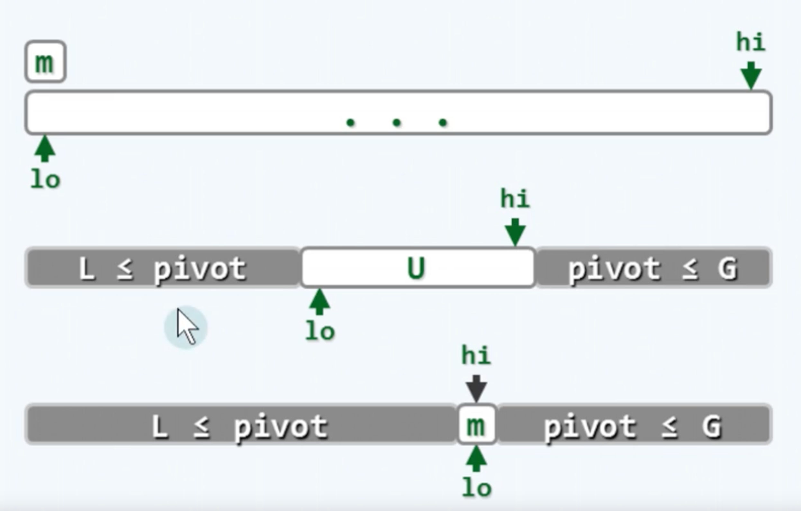
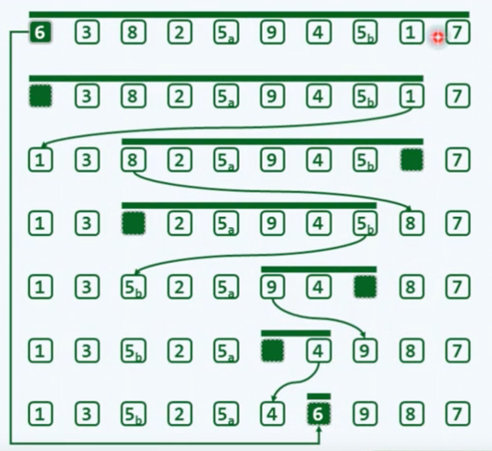
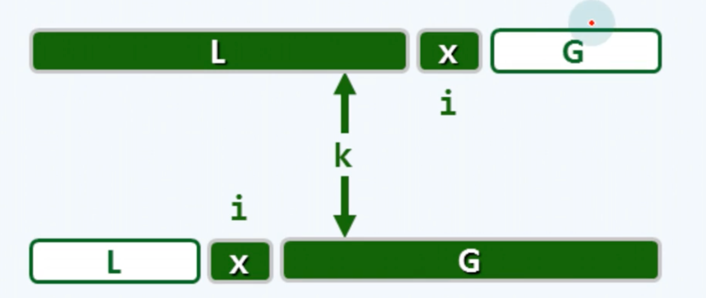
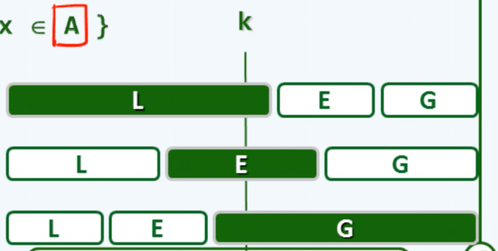
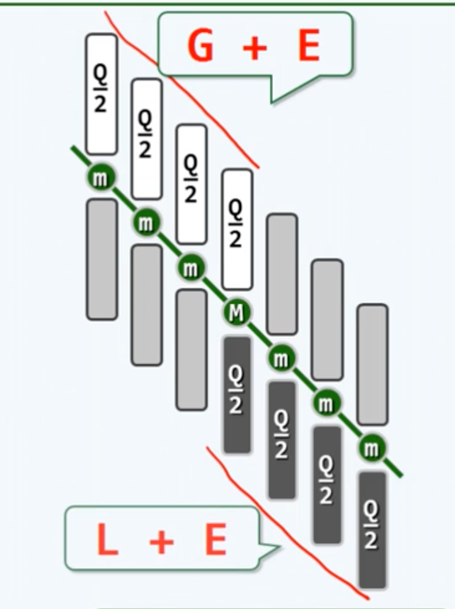

# 2. 向量
## a. 接口与实现
Abstract Data Type抽象数据类型 = **数据模型** + 定义在该模型上的**一组操作**：*说明书*
Data Structure数据结构 = 基于某种**特定语言**，实现ADT的**一整套算法**

### 向量ADT
构造

\_size：当前的实际规模，\_capacity：总容量，初始设定成2倍的size，\_elem：内部数组名

## b. 可扩充向量

创建新数组，扩容后复制，释放原数组

+ 递增式扩容：
初始为0的空向量，插入 n = m*I >> 2个元素
每次扩容时间成本O(n)
+ 加倍式扩容：
初始为0的空向量，插入 n = 2^m >> 2个元素
每次扩容时间成本O(1)


**平均分析 与 分摊分析**

平均复杂度或期望复杂度：概率求期望，会割裂操作相关性和连贯性

分摊复杂度：连续实施足够多操作，总成本分摊


## c. 无序向量
T为可**判等**的基本类型，或已重载操作符“==”或“!=”

### 插入
注意复制从后往前
### 区间删除
复制从前往后
### 查找
从hi开始逆向查找，输入敏感：最好O(1)，最差O(n)
### 单元素删除
视作区间删除的特例[r]=[r,r+1)
### 唯一化
从前往后开始考察。前缀中寻找雷同者，无雷同继续考察后继，有雷同则删除
O($$n^2$$)

### 遍历
## d. 有序向量
T为可**比较**的基本类型，或已重载操作符“>”或“<”
### 甄别：
相邻逆序对的数量，0为有序
### 唯一化
首元素开始，从前往后逐一比对，雷同删除后者，否则向后
O(n^2)

首元素开始，往后比对，有2个标签，i与j。i与j刚开始都指向0，然后j开始向后移动；跳过雷同者，发现不同时，不同的元素向前移至紧邻于i的右侧（复制），i右移一位，j继续移动，最后统一删除尾部
O(n)

## 二分查找
### 接口
search(e,lo,hi)
#### 语义
为了便于自身的维护（插入方便），约定：

1. 失败给出新元素适当的插入位置；

2. 若允许重复，每次都给出最后的秩（考虑插入，为了与插入次序一致）

### 原理（不完全符合语义）
算法A：
  x=S[mi]
当lo<hi

1. e<x，左侧深入
2. x<e，右侧深入
3. e=x，返回x

复杂度：O(logn)

#### 查找长度
**更精细地评估查找算法的性能**：

考察关键码的比较次数：if语句
分别针对成功、失败，从最好、最坏、平均等角度评估
算法A成功、失败时的平均查找长度大致为**O(1.5logn)**

### fib查找

【平衡的用意：回避最坏情况，让失败都出现在最深处的底层】往左右分支时比较次数不同（向左1次，向右2次）

那么就让左边更大，右边更小，更平衡

取mi = fib(k-1) - 1，左边长fib(k-1) - 1，右边长fib(k-2) - 1

#### 复杂度
以A[$$λ_n$$]为轴点分割，二分查找为λ=0.5，Fibonacci查找对应于λ=φ=0.6180339...
设平均查找长度为α(λ)*$$log_2(n)$$，根据递推式求极限，λ=φ时，α(λ)=1.4404...最小

### 二分查找改进

直接将左右分支转向的代价都变成1次比较

#### 版本B：
把中点元素算入右区间，不过这样需要到最后才能确定成功与失败

1< hi-lo
e<x：深入左侧[lo,mi)
x<=e：深入右侧[mi,hi)

相比于A，最好时更坏，最坏时更好，性能更趋稳定

### **版本C：**
**考虑到语义，多个命中元素，返回最靠后者；失败是，返回小于e的最大者（含哨兵[lo-1]）**

```c++
Search(...){
    while(lo < hi){
        Rank mi = (lo + hi) >> 1;
        (e < A[mi]) ? hi = mi; lo = mi + 1;
        }
    return --lo;
}
```

如果e小于中点x，深入左侧，否则，直接深入右侧。如果刚好相当，最后返回的lo-1也正好是mi的值。

## e. 起泡（冒泡）排序
bubbleSort

逐趟扫描交换，每次都把当前最大的放在后面

O($$n^2$$)

### 改进：

有可能在中间的时候就已经全部有序了。

1. 设置整体有序标志 sorted，初值为true；若发生交换，置为false。
2. 若有一次未发生交换，则直接停止
（乱序限于[0,$$\sqrt{n}$$)时，仍然需要O($$n^{1.5}$$)）
### 再改进：

后面一段可能已经有序，但是还会重复排序

1. 设置一个秩last = lo，若逆序，交换时更新last，最后记录最右侧逆序对的位置
2. 下次bubble就只需要在[lo,last]之间进行即可
### 综合评价
起泡排序的三个版本在最好O(n)和最坏O($$n^2$$)时的性能是一样的，差异只在一般情况下而言。

起泡排序算法都具有**稳定性**：重复元素在输入、输出序列中的相对次序是不变的

## f. 归并排序
基于比较式的算法C.B.A(comparision based algorithm)求解排序算法都存在下界Ω(nlogn)
### 原理
分治策略：序列一分为二，子序列递归排序，合并有序子序列
O(nlogn)

### 主算法
1. 递归基：hi-lo<2，单元素区间，自然有序

2. 中点分界，递归两个序列

3. 归并merge()

### 二路归并
关注两个序列的首元素，每次取出首元素中更小的那个元素，后续元素进行顶替
### 实现
归并排序用的其实是一个特例，两个有序向量都来自于一个更大的序列

三个界桩：lo,mi,hi
A[lo,hi) = B[lo,mi) + C[mi,hi)

B新申请一段空间，A不需要，C也不需要

```
for (i,j,k=0;(j<lb)||(k<lc)){//退出条件：B、C元素都越界才退出

    if( (j<lb)&&(lc<=k ||(B[j]<=C[k])) ) A[i++]=B[j++]; //取出BC中更小的放入A。
    B更小的判断：j首先还在B里；然后如果k不在C了，短路算法直接true，如果k还在，判断大小
    
    if( (k<lc)&&(lb<=j ||(C[k]<B[j])) ) A[i++]=C[k++];  //取出BC中更小的放入A
}
```
### 复杂度
j+k=n【每次迭代j+k至少+1（每次循环中可能j会先变，然后会执行2条if）】
最坏情况下merge()复杂度为O(n)

故整体归并排序复杂度可计算：O(nlogn)

# 3. 列表
### 从静态到动态
+ 根据是否修改数据结构，所有的**操作**大致分为两类：
1. 静态：仅读取，数据结构的内容及组成一般不变：get、search
2. 动态：需写入，数据结构的局部或整体将改变：insert、remove
+ 与操作方式相对应，数据元素的**存储与组织方式**也分为两种：
1. 静态：
   数据空间整体创建或销毁
   数据元素的物理存储次序与逻辑次序严格一致
   可支持高效的静态操作
   例如向量
2. 动态：
   为各数据元素动态地分配和回收的物理空间
   逻辑上相邻的元素记录彼此的物理地址，在逻辑上形成一个整体
   可支持高效的动态操作
### 列表list
动态存储的典型结构
+ 基本组成单位：节点 node
+ 相邻接点互称彼此为 前驱（predecessor） 或 后继（successor）
+ 没有前驱/后继的唯一节点称作 首（first/front）/末（last/rear） 节点
### 访问方式
+ 向量：循秩访问call by rank
+ 列表：循位置访问call by position，由节点之间的互相引用找到特定的节点
## 无序列表
### 循秩访问
想重载下标操作符。

平均性能：O(n)

### 查找
顺序查找：O(n)
### 插入
O(1)
### 删除
O(1)
### 复制构造
复制每一个，然后insertAsLast
### 析构
反复删除第一个元素
### 唯一化
从前往后，不断考察前驱有没有相同元素。有的话删除前驱中相同的那个【之所以不删除当前元素，是因为接下来一步后移要找当前元素的后继，删除之前的更安全】

## 有序列表
### 唯一化
两个指针，p指向首节点，q为其后继，如果相同，就删除q；如果不同，p后移至q，q为p的后继
只需要遍历整个列表一趟，O(n)

### 查找
从后向前，相同返回，不同继续向前
最好O(1)，最坏O(n)，等概率时平均O(n)
排序并没有带来什么提升

### 其他
向量像RAM，列表像图灵机，call by rank和call by position

## 选择排序
从一堆里选出最大的，然后选出次大的... 选择排序
起泡排序也是一个选择排序

但是起泡排序的效率很差，最坏要O($$n^2$$)
每次选最大的时候都是一步一步的移动

### 思路
从后往前，每次选择出最大的，放到后面

### 放到后面的几个问题
1. 删除再插入，会导致new和delete，这两个操作非常耗时
2. 直接修改引用
3. 直接互换内容
4. 在找出来的最大值恰好OK的时候，不需要交换，但是并不需要为此加入if判断，这种情况概率很小，会得不偿失

### 选择最大的算法
从头到尾，挨着比对，记下最大的
（画家算法）
为了保证稳定性，取最大的时候，用<=，就算相等也会交换

### 性能
θ($$n^2$$)

看似与起泡算法差不多，但是这个算法的复杂度主要来自于比较操作，起泡算法来自于移动操作。成本相对较低。而且根据堆，可以改进比较操作。

## 插入排序
抓扑克牌
1. 判断位置
2. 插入当该插的地方

### 构思
从前往后，查找插入

in-place算法，就地算法，只需要O(1)的辅助空间
### 复杂度
最好：O(n)
最坏：O($$n^2$$)，查找是个算数级数，从后往前

平均性能：O($$n^2$$)

本质解释：相当于```O(I+n)```，I是逆序对的数量，对应查找，n是插入操作的总和

所以该算法的复杂度取决于规模，还取决于输入的特性（逆序对的数量，逆序程度），称之为**输入敏感算法**

# 12 排序

## 快速排序

### 思路

+ 分而治之

+ 将序列划分为2个子序列 $S = S_L + S_R$
+ $max(S_L) <= min(S_R)$
+ 子序列分别**递归地**排序之后，原序列自然有序
+ 平凡解：单个元素，本身就是解

和 归并排序 mergesort相比，归并排序难点在于 合，快排难点在于 分

### 划分思路

轴点：左侧的元素都不比它大，右侧的元素都不比它小

找到轴点就找到了划分方法。

+ 坏消息：原始序列未必存在轴点。

+ 必要条件：轴点必然已经就位了。

+ 好消息：通过适当交换，任一元素可能成为轴点。
+ 快排：将元素逐个转换为轴点的过程。

### 轴点构造算法 partition算法



先选一个轴点候选`pivot`，通常是首元素。

用两个指针`lo`和`hi`把序列分成`L`，`U`，`G`三段。

+ `L`: 全都小于`pivot` 
+ `G`: 全都大于`pivot` 
+ `U`: 未知 

1. 先将首选元取出，作为候选轴点，首元素的位置空闲
2. 从后面开始考察，如果 `n[hi] >= pivot`，`hi--`
3. 如果 `n[hi] < pivot `。那么将这个元素放在 前面空闲的位置。
4. 然后从前面开始考察。
5. 直到最后U只有一个节点，把候选轴点填进去。



### 性能分析

+ 不稳定，会改变相同元素的位置。

+ 空间复杂度：`O(1)`，就地实现。

+ 时间复杂度：

  取决于最开始选取的候选轴点。

  最好情况下，划分出的2个序列近似，`O(nlogn)`。

  最差情况下，`O(n^2)`

  + 解决思路：
    + 随机选取
    + 随机选取三个，取中间那个
  + 只能降低最坏情况概率，无法杜绝

+ 平均情况`O(nlogn)`，常系数小

## 快排变种

候选轴点还是首元素，顺序从LUG变成LGU


3个区间的界定，用`lo, mi, hi, k`界定
考察子序列U的首元素，k
如果`pivot <= s[k]`，则将G直接拓展`k++`，否则将G滚动后移，L拓展`swap( s[++mi], s[k++] )`

### 代码

```java
public int partition(int low, int high, int[] nums) {
    swap(nums[low], nums[random]);  // 随机交换
    int pivot = nums[low];
    int middle = low;
    for(int k = low + 1; k <= high; k++) {  // 从左向右考察每个nums[k]
        if(nums[k] < privot) {  // 如果[k]小于轴点
            swap( nums[++middle], nums[k])  // 与[mi]交换，L向右拓展
        }
    }
    swap(nums[low], nums[middle]);
    return middle;
}
```

### 分析

+ 就地

+ O(n)

+ 不具有稳定性

## 选取问题

### 众数

k-selection：选中从小到大排列，次序为k的元素

median中位数：从小到大排列，次序为**n/2的下整**的元素

majority众数：和之前的不太一样。是指，无序向量中，有一半**以上**的元素都是m，则称之为众数【严格大于】


必要性1：众数若存在，必然是中位数。

只要能找到中位数，那么只需要遍历一次O(n)，就可以知道是不是众数


必要性2：众数必然是频繁数

mode频繁数：一组数据中出现次数最多的


但是这两个的时空复杂度都不太行。


减而治之：

若去掉一个前缀P（偶数），P中的x恰好出现一半，那么A-P如果有众数m，A也有，而且一样

证明：最后总是要花O(n)验证，假设存在众数，x=m，m与其他元素的的数量差保持不变；不等于数量差也不会变小。


首元素当做x，直到x是P的一半，去掉。用1个计数器。一趟扫描。

## quickselect 选取第k大/小的数

### 思路启迪

借用 quicksort 的思路，选取 轴点。
如果运气好，轴点恰好为答案，那么只需要 `O(n)`
如果一般情况，则可以根据轴点，去掉一部分待考查元素。
减而治之



最坏情况下：$O(n^2)$

### 线性算法 linearSelect

linearSelect(int[] arr, int k)

设定Q为一个小的常数

0. 如果序列长度小于Q，那么直接随便用一个方法选k

1. 把A划分成若干子序列，序列长度为Q，有n/Q个

2. 每个子序列全排列，方法无所谓，找到每个子序列的**中位数**

3. 找到中位数序列的中位数**M**，通过递归调用linearSelect(mid_arr, mid_arr/2)

4. 所有小于M的数归入L，等于的为E，大于的为G。

5. 如果L足够长，L的长度大于等于k，在L中递归寻找k

   再如果k小于L+E的长度，**返回M**

   其他情况就是G足够长，k落在了G里，递归查找G中第k-|L|-|E|个元素



### 复杂度

分析，记总复杂度为`T(n)`：
1. 第0步，长度为Q的数组的排序：`O(QlogQ)`，由于Q是常数，且很小，认为是`O(1)`
2. 第1步，将序列进行划分：`O(n)`
3. 第2步，将所有子序列排序：`O(1) * n/Q = O(n/Q)`
4. 第3步，递归找到中位数的中位数：`T(n/Q)`
5. 第4步，划分子集并计数：`O(n)`
6. 第5步，递归求解子问题：`T(3n/4)`

`T(3n/4)`的解释：



可以看到，至少有1/4的元素会被减少。

n/Q个中位数里，至少有一半不小于M，又各自不大于至少Q/2个元素。
n/Q / 2 * Q/2 = n/4

$T(n) = O(n) + T(n/q) + T(3n/4)$
只需要让`n/q + 3n/4 < n`
即
保证`1/Q + 3/4 < 1`

可以保证O(n)【例如Q=5，但是常系数非常大，该算法更具有理论意义】

## 希尔排序

将输入视为一个矩阵，逐列排序

w列，w-sorting。如果已经有序，w-ordered。然后不断让矩阵更窄。

直到1-sorting

各种w的值构成了一个序列：步长序列step sequence

$$w_1 = 1,w_2,w_3,...$$

序列单调。所以希尔排序也叫递减增量法

不同的步长序列，会有不同的效果。


矩阵重排只需要算一下秩就可以


逐列排序要有输入敏感性：插入排序

由g，h的线性组合所能表示的数里，最大的一个不能表示的数为：

$$x(g,h)=(g-1)*(h-1)-1$$

h-ordered：间隔h的两个数（x，x+h）都是有序的

任何一个序列做过h-sorting后必然是h-ordered

定理：任何一个原先g-ordered的序列，在h-sorting后，还是g-ordered的

一个g-ordered且h-ordered的序列，必然也是g+h - ordered，任何g，h的任何线性组合-ordered


PS序列

Pratt序列

Sedgewick序列
