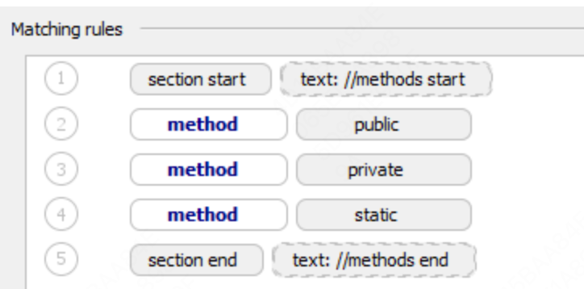

# 1. Code Style. Java

Last modified: 03 April 2025

**File | Settings | Editor | Code Style | Java** for Windows and Linux

**IntelliJ IDEA | Settings | Editor | Code Style | Java** for macOS

使用此页面配置 Java 文件的格式化选项。当您更改这些设置时，**Preview** 窗格会显示这对您的代码有何影响。

# 2. Tabs and Indents 制表符和缩进

| Item                                                                     | 描述                                                                                                                                                                                                                                                                            |
| ------------------------------------------------------------------------ | ------------------------------------------------------------------------------------------------------------------------------------------------------------------------------------------------------------------------------------------------------------------------------- |
| Use tab character <br> 使用制表符字符                                    | 使用 **Tab 键**进行缩进。当未选中此复选框时，IntelliJ IDEA 将使用空格而不是制表符。                                                                                                                                                                                             |
| Smart tabs <br> 智能制表符                                               | + 如果选中此复选框，嵌套代码块的缩进将根据需要使用制表符和空格，而对齐缩进将只使用空格。<br> + 如果未选中此复选框，则只使用制表符。这意味着符合指定制表符大小的一组空格将自动被替换为制表符，这可能会破坏精细对齐。<br>当启用了“使用制表符字符”选项时，“智能制表符”复选框可用。 |
| Tab size <br> 制表符大小                                                 | 在此字段中，指定一个制表符中包含的空格数。                                                                                                                                                                                                                                      |
| Indent <br> 缩进                                                         | 在此字段中，指定每个缩进级别要插入的空格数。                                                                                                                                                                                                                                    |
| Continuation indent <br> 连续缩进                                        | 指定从上一行继续的行的缩进，以明确它们是同一语句或代码块的一部分。当单个语句太长而无法放在一行时，使用连续缩进。                                                                                                                                                                |
| Keep indents on empty lines <br> 在空行上保留缩进                        | 如果选中此复选框，IntelliJ IDEA 将在空行上保留缩进，就好像它们包含一些代码一样。<br> 如果未选中此复选框，IntelliJ IDEA 将删除制表符和空格。                                                                                                                                     |
| Label indent <br> 标签缩进                                               | 在此字段中，指定在标签语句前下一行要插入的空格数。（循环中的 label）                                                                                                                                                                                                            |
| Absolute label indent <br> 绝对标签缩进                                  | 如果选中此复选框，标签缩进将计为绝对空格数。否则，标签缩进将相对于之前的缩进级别计数。                                                                                                                                                                                          |
| Do not indent top level class members <br> 不要缩进顶级类成员            | 选中此复选框，使顶级类成员位于类声明缩进级别。                                                                                                                                                                                                                                  |
| Use indents relative to expression start <br> 使用相对于表达式开始的缩进 | 使用此复选框在两种可能的缩进行为之间切换：<br> + 如果此选项被禁用，代码块将与在新行开始的最近祖先块对齐。 <br> + 如果启用该选项，代码块将按列格式化。                                                                                                                           |

## 2.1. 目前满意的设置

不勾选一切

Tab size: 4
Indent: 4
Continuation indent: 8
Lable indent: 0

## 2.2. 问题

Use indents relative to expression start 这个没看懂，再试一试

# 3. Spaces 空格

选择或清除复选框，以在不同情境下插入、不插入或删除空格。

## 3.1. Before parenthesis 在括号前

### 3.1.1. Method declaration parentheses 方法声明括号

如果选中，在方法声明中的左括号前将插入一个空格。否则，不插入空格。

选中

```java
public void foo (int x, int y) {}
```

未选中

```java
public void foo(int x, int y) {}
```

### 3.1.2. Method call parentheses 方法调用括号

如果选中，在方法调用中的左括号前将插入一个空格。

否则，不插入空格。

选中

```java
System.out.print (a);
```

未选中

```java
System.out.print(a);
```

### 3.1.3. 'if' parentheses 'if'括号

如果选中，在 if 语句中的左括号前将插入一个空格。否则，不插入空格。

选中

```java
if (0 < x && x < 10) {}
```

未选中

```java
if(0 < x && x < 10) {}
```

### 3.1.4. 'for' parentheses 'for'括号

如果选中，在 for 循环中的左括号前将插入一个空格。否则，不插入空格。

选中

```java
for (int i = 0; i < x; i++) {}
```

未选中

```java
for(int i = 0; i < x; i++) {}
```

### 3.1.5. 'while' parentheses 'while'括号

如果选中，在 while 循环中的左括号前将插入一个空格。否则，不插入空格。

选中

```java
while (x != y) {}
```

未选中

```java
while(x != y) {}
```

### 3.1.6. 'switch' parentheses 'switch'括号

如果选中，在 switch 语句中的左括号前将插入一个空格。否则，不插入空格。

选中

```java
switch (e.getCode()) {}
```

未选中

```java
switch(e.getCode()) {}
```

### 3.1.7. 'try' parentheses 'try'括号

如果选中，在 try 语句中的左括号前将插入一个空格。否则，不插入空格。

选中

```java
try (Res r1 = getResource(); Res r2 = null) {}
```

未选中

```java
try(Res r1 = getResource(); Res r2 = null) {}
```

### 3.1.8. 'catch' parentheses 'catch'括号

如果选中，在 catch 块中的左括号前将插入一个空格。否则，不插入空格。

选中

```java
catch (MyException e) {}
```

未选中

```java
catch(MyException e) {}
```

### 3.1.9. 'synchronized' parentheses 'synchronized'括号

如果选中，在 synchronized 块中的左括号前将插入一个空格。否则，不插入空格。

选中

```java
synchronized (this) {}
```

未选中

```java
synchronized(this) {}
```

### 3.1.10. Annotation parameters 注解参数

如果选中，在注解参数的左括号前将插入一个空格。否则，不插入空格。

选中

```java
@SuppressWarnings ({"ALL"})
```

未选中

```java
@SuppressWarnings({"ALL"})
```

### 3.1.11. Deconstruction list 解构列表

如果选中，在解构模式中的左括号前将插入一个空格。否则，不插入空格。

选中

```java
case Rec (String s, int i) r -> {}
```

未选中

```java
case Rec(String s, int i) r -> {}
```

## 3.2. Around operators 围绕运算符

### 3.2.1. Assignment operators (=, +=, ...) 赋值运算符（=，+=，...）

如果选中，在赋值表达式中的赋值运算符周围插入空格。否则，不插入空格。

选中

```java
int[] empty = new int[]{};
```

未选中

```java
int[] empty=new int[]{};
```

### 3.2.2. Logical operators (&&, ||) 逻辑运算符（&&，||）

如果选中，在逻辑表达式中的逻辑运算符周围插入空格。否则，不插入空格。

选中

```java
public void checkValue() {
    if (0 < x && x < 10) {
    }
}
```

未选中

```java
public void checkValue() {
    if (0 < x&&x < 10) {
    }
}
```

### 3.2.3. Equality operators (==, !=) 相等运算符（==，!=）

如果选中，在比较表达式中的相等运算符周围插入空格。否则，不插入空格。

选中

```java
while (x != y) {}
```

未选中

```java
while (x!=y) {}
```

### 3.2.4. Relational operators (<,>,<=,>=) 关系运算符（<，>，<=，>=）

如果选中，在比较表达式中的关系运算符周围插入空格。否则，不插入空格。

选中

```java
if (0 < x && x < 10) {}
```

未选中

```java
if (0<x && x<10) {}
```

### 3.2.5. Bitwise operators (&, |, ^) 位运算符（&，|，^）

如果选中，在位运算符周围插入空格。否则，不插入空格。

选中

```java
y += (y ^ 0x123) << 2;
```

未选中

```java
y += (y^0x123) << 2;
```

### 3.2.6. Additive operators (+, -) 加法运算符（+，-）

如果选中，在加法运算符周围插入空格。否则，不插入空格。

选中

```java
x = f(x * 3 + 5);
```

未选中

```java
x = f(x * 3+5);
```

### 3.2.7. Multiplicative operators (_, /, %) 乘法运算符（_，/，%）

如果选中，在乘法运算符周围插入空格。否则，不插入空格。

选中

```java
x = f(x * 3 + 5);
```

未选中

```java
x = f(x*3 + 5);
```

### 3.2.8. Shift operators (<<, >>, >>>) 移位运算符（<<，>>，>>>）

如果选中，在位移运算符周围插入空格。否则，不插入空格。

选中

```java
y += (y ^ 0x123) << 2;
```

未选中

```java
y += (y ^ 0x123)<<2;
```

### 3.2.9. Unary operators (!,-,+,++,--) 一元运算符（!，-，+，++，--）

如果选中，在一元运算符周围插入空格。否则，不插入空格。

选中

```java
x = y >= 0 ? arr[y] : - 1;
```

未选中

```java
x = y >= 0 ? arr[y] : -1;
```

### 3.2.10. Lambda arrow Lambda 箭头

如果选中，在 Lambda 箭头周围插入空格。否则，不插入空格。

选中

```java
Runnable r = () -> {};
```

未选中

```java
Runnable r = ()->{};
```

### 3.2.11. Method reference double colon 方法引用双冒号

如果选中，在方法引用双冒号周围插入空格。否则，不插入空格。

选中

```java
Runnable r1 = this :: bar;
```

未选中

```java
Runnable r1 = this::bar;
```

## 3.3. Before left brace 左大括号前

### 3.3.1. Class left brace 类左大括号

如果选中，在类声明中的类名和左大括号之间插入一个空格。否则，不插入空格。

选中

```java
public class Main {
}
```

未选中

```java
public class Main{
}
```

仅当“Wrapping and Braces”选项卡中“In class declaration”的“Braces placement”设置为“End of line”时，选中或清除复选框才有意义。

### 3.3.2. Method left brace 方法左大括号

如果选中，在方法声明中的方法参数列表右括号和左大括号之间插入一个空格。否则，不插入空格。

选中

```java
public int add(int a, int b) {
}
```

未选中

```java
public int add(int a, int b){
}
```

仅当“Wrapping and Braces”选项卡中“In method declaration”的“Braces placement”设置为“End of line”时，选中或清除复选框才有意义。

### 3.3.3. 'if' left brace 'if'左大括号

如果选中，在 if 语句中的条件表达式右括号和左大括号之间插入一个空格。否则，不插入空格。

选中

```java
if (0 < x && x < 10) {
}
```

未选中

```java
if (0 < x && x < 10){
}
```

仅当“Wrapping and Braces”选项卡中“Other”的“Braces placement”设置为“End of line”时，选中或清除复选框才有意义。

### 3.3.4. 'else' left brace 'else'左大括号

如果选中，在 if-else 语句中的 else 关键字和左大括号之间插入一个空格。否则，不插入空格。

选中

```java
if (x) {
    System.out.println("Hello from x!");
} else {
    System.out.println(y);
}
```

未选中

```java
if (x) {
    System.out.println("Hello from x!");
} else{
    System.out.println(y);
}
```

仅当“Wrapping and Braces”选项卡中“Other”的“Braces placement”设置为“End of line”时，选中或清除复选框才有意义。

### 3.3.5. 'for' left brace 'for'左大括号

如果选中，在 for 循环中的条件表达式右括号和左大括号之间插入一个空格。否则，不插入空格。

选中

```java
for (int a : X) {
    System.out.print(a);
}
```

未选中

```java
for (int a : X){
    System.out.print(a);
}
```

仅当“Wrapping and Braces”选项卡中“Other”的“Braces placement”设置为“End of line”时，选中或清除复选框才有意义。

### 3.3.6. 'while' left brace 'while'左大括号

如果选中，在 while 循环中的条件表达式右括号和左大括号之间插入一个空格。否则，不插入空格。

选中

```java
while (x != y) {
    x = f(x * 3 + 5);
}
```

未选中

```java
while (x != y){
    x = f(x * 3 + 5);
}
```

仅当“Wrapping and Braces”选项卡中“Other”的“Braces placement”设置为“End of line”时，选中或清除复选框才有意义。

### 3.3.7. 'do' left brace 'do'左大括号

如果选中，在`do-while`循环中的 do 关键字和左大括号之间插入一个空格。否则，不插入空格。

选中

```java
do {
    System.out.println("Count is: " + count);
    count++;
} while (count <= 3);
```

未选

```java
do{
    System.out.println("Count is: " + count);
    count++;
} while (count <= 3);
```

当选中或清除复选框时，仅在“换行和大括号”选项卡中“其他”的大括号位置设置为行尾时才相关。

### 3.3.8. 'switch' left brace “switch”左大括号

如果选中，则在 switch 语句的条件表达式右括号和左大括号之间插入一个空格。否则，不插入空格。

选中状态

```java
switch (e.getCode()) {
}
```

未选中状态

```java
switch (e.getCode()){
}
```

当选中或清除复选框时，仅在“换行和大括号”选项卡中“其他”的大括号位置设置为行尾时才相关。

### 3.3.9. 'try' left brace “try”左大括号

如果选中，则在 try 块的 try 关键字和左大括号之间插入一个空格。否则，不插入空格。

选中状态

```java
try {
    get("x");
} catch (Exception e) {
}
```

未选中状态

```java
try{
    get("x");
} catch (Exception e) {
}
```

当选中或清除复选框时，仅在“换行和大括号”选项卡中“其他”的大括号位置设置为行尾时才相关。

### 3.3.10. 'catch' left brace “catch”左大括号

如果选中，则在 catch 块的 catch 语句参数列表和左大括号之间插入一个空格。否则，不插入空格。

选中状态

```java
try {
    get("x");
} catch (Exception e) {
}
```

未选中状态

```java
try {
    get("x");
} catch (Exception e){
}
```

当选中或清除复选框时，仅在“换行和大括号”选项卡中“其他”的大括号位置设置为行尾时才相关。

### 3.3.11. 'finally' left brace “finally”左大括号

如果选中，则在 finally 块的 finally 关键字和左大括号之间插入一个空格。否则，不插入空格。

选中状态

```java
try {
    get("x");
} catch (Exception e) {
} finally {
}
```

未选中状态

```java
try {
    get("x");
} catch (Exception e) {
} finally{
}
```

当选中或清除复选框时，仅在“换行和大括号”选项卡中“其他”的大括号位置设置为行尾时才相关。

### 3.3.12. 'synchronized' left brace “synchronized”左大括号

如果选中，则在 synchronized 块的 synchronized 关键字和左大括号之间插入一个空格。否则，不插入空格。

选中状态

```java
synchronized (this) {
    switch (e.getCode()) {
}
```

未选中状态

```java
synchronized (this){
    switch (e.getCode()) {
}
```

当选中或清除复选框时，仅在“换行和大括号”选项卡中“其他”的大括号位置设置为行尾时才相关。

### 3.3.13. Array initializer left brace 数组初始化左大括号

如果选中，则在数组初始化的左大括号前插入一个空格。否则，不插入空格。

选中状态

```java
int[] empty = new int[] {};
```

未选中状态

```java
int[] empty = new int[]{};
```

当选中或清除复选框时，仅在“换行和大括号”选项卡中“其他”的大括号位置设置为行尾时才相关。

### 3.3.14. Annotation array initializer left brace 注解数组初始化左大括号

如果选中，则在数组初始化的左大括号前插入一个空格。否则，不插入空格。

选中状态

```java
@SuppressWarnings( {"ALL"})
```

未选中状态

```java
@SuppressWarnings({"ALL"})
```

当选中或清除复选框时，仅在“换行和大括号”选项卡中“其他”的大括号位置设置为行尾时才相关。

## 3.4. Before keywords 关键字之前

### 3.4.1. 'else' keyword “else”关键字

如果选中，则在 if 块的右大括号和 else/elseif 关键字之间插入一个空格。否则，不插入空格。

选中状态

```java
if (x) {
    System.out.println("Hello from x!");
} else {
    System.out.println(y);
}
```

未选中状态

```java
if (x) {
    System.out.println("Hello from x!");
}else {
    System.out.println(y);
}
```

### 3.4.2. 'while' keyword “while”关键字

如果选中，则在 `do` 块的右大括号和 `do - while` 循环的 `while` 关键字之间插入一个空格。否则，不插入空格。

选中状态

```java
do {
    System.out.println("Count is: " + count);
    count++;
} while (count <= 3);
```

未选中状态

```java
do {
    System.out.println("Count is: " + count);
    count++;
}while (count <= 3);
```

### 3.4.3. 'catch' keyword “catch”关键字

如果选中，则在 try 块的右大括号和 catch 关键字之间插入一个空格。否则，不插入空格。

选中状态

```java
try {
    get("x");
} catch (Exception e) {
}
```

未选中状态

```java
try {
    get("x");
}catch (Exception e) {
}
```

### 3.4.4. 'finally' keyword “finally”关键字

如果选中，则在 catch 块的右大括号和 finally 关键字之间插入一个空格。否则，不插入空格。

选中状态

```java
try {
    get("x");
} catch (Exception e) {
} finally {
}
```

未选中状态

```java
try {
    get("x");
} catch (Exception e) {
}finally {
}
```

## 3.5. Within 内部

### 3.5.1. Code braces 代码大括号

如果选中，则始终在代码大括号内插入空格。否则，从不插入空格。

### 3.5.2. Brackets 方括号

如果选中，则始终在方括号内插入空格。否则，从不插入空格。

选中状态

```java
x = y >= 0 ? arr[ y ] : -1;
```

未选中状态

```java
x = y >= 0 ? arr[y] : -1;
```

### 3.5.3. Array initializer braces 数组初始化大括号

如果选中，则始终在数组初始化表达式括号内插入空格。否则，不插入空格。

选中状态

```java
int[] numbers = { 1, 2, 3, 4, 5 };
```

未选中状态

```java
int[] numbers = {1, 2, 3, 4, 5};
```

### 3.5.4. Empty array initializer braces 空数组初始化大括号

如果选中，则在空数组初始化的`{ }`大括号内插入空格。否则，不插入空格。

选中状态

```java
int[] empty = new int[]{ };
```

未选中状态

```java
int[] empty = new int[]{};
```

### 3.5.5. Grouping parentheses 分组括号

如果选中，则始终在复杂表达式中的分组括号内插入空格。否则，不插入空格。

选中状态

```java
y += ( y ^ 0x123 ) << 2;
```

未选中状态

```java
y += (y ^ 0x123) << 2;
```

### 3.5.6. Method declaration parentheses 方法声明括号

如果选中，则在方法声明括号内插入空格。否则，不插入空格。

选中状态

```java
public void foo( int x, int y ){
}
```

未选中状态

```java
public void foo(int x, int y){
}
```

### 3.5.7. Empty method declaration parentheses 空方法声明括号

如果选中，则在空方法声明括号内插入空格。否则，不插入空格。

选中状态

```java
Runnable r = ( ) -> {
};
```

未选中状态

```java
Runnable r = () -> {
};
```

### 3.5.8. Method call parentheses 方法调用括号

如果选中，则在方法调用括号内插入空格。否则，不插入空格。

选中状态

```java
System.out.println( "Hello, World!" );
```

未选中状态

```java
System.out.println("Hello, World!");
```

### 3.5.9. Empty method call parentheses 空方法调用括号

如果选中，则在空方法调用括号内插入空格。否则，不插入空格。

选中状态

```java
switch (e.getCode( )) {
}
```

未选中状态

```java
switch (e.getCode()) {
}
```

### 3.5.10. 'if' parentheses “if”括号

如果选中，则始终在 if 语句的括号内插入空格。否则，不插入空格。

选中状态

```java
for (int num : numbers) {
    if ( x ) {
        System.out.println("Hello from x!");
    } else {
        System.out.println(y);
    }
}
```

未选中状态

```java
for (int num : numbers) {
    if (x) {
        System.out.println("Hello from x!");
    } else {
        System.out.println(y);
    }
}
```

### 3.5.11. 'for' parentheses “for”括号

如果选中，则始终在 for 循环的括号内插入空格。否则，不插入空格。

选中状态

```java
for ( int a : X ) {
    System.out.print(a);
}
```

未选中状态

```java
for (int a : X) {
    System.out.print(a);
}
```

### 3.5.12. 'while' parentheses “while”括号

如果选中，则始终在 while 循环的括号内插入空格。否则，不插入空格。

选中状态

```java
while ( x != y ) {
    x = f(x * 3 + 5);
}
```

未选中状态

```java
while (x != y){
    x = f(x * 3 + 5);
}
```

### 3.5.13. 'switch' parentheses “switch”括号

如果选中，则始终在 switch 语句的括号内插入空格。否则，不插入空格。

选中状态

```java
switch ( e.getCode() ) {
}
```

未选中状态

```java
switch (e.getCode()){
}
```

### 3.5.14. 'try' parentheses “try”括号

如果选中，则始终在 try 语句的括号内插入空格。否则，不插入空格。

选中状态

```java
try ( MyRes r1 = getRes(); MyRes r2 = null ) {
}
```

未选中状态

```java
try (MyRes r1 = getRes(); MyRes r2 = null) {
}
```

### 3.5.15. 'catch' parentheses “catch”括号

如果选中，则始终在 catch 结构的括号内插入空格。否则，不插入空格。

选中状态

```java
try {
    get("x");
} catch ( Exception e ) {
}
```

未选中状态

```java
try{
    get("x");
} catch (Exception e) {
}
```

### 3.5.16. 'synchronized' parentheses “synchronized”括号

如果选中，则始终在 synchronized 语句的括号内插入空格。否则，不插入空格。

选中状态

```java
synchronized ( this ) {
    switch ( e.getCode() ) {
}
```

未选中状态

```java
synchronized (this) {
    switch ( e.getCode() ) {
}
```

### 3.5.17. Type cast parentheses 类型转换括号

如果选中，则始终在类型转换括号内插入空格。否则，不插入空格。

选中状态

```java
int[] arr = ( int[] )g(y);
```

未选中状态

```java
int[] arr = (int[])g(y);
```

### 3.5.18. Annotation parentheses 注解括号

如果选中，则始终在注解括号内插入空格。否则，不插入空格。

选中状态

```java
@SuppressWarnings( {"ALL"} )
```

未选中状态

```java
@SuppressWarnings({"ALL"})
```

### 3.5.19. Angle brackets 尖括号

如果选中，则始终在尖括号内插入空格。否则，不插入空格。

选中状态

```java
class Bar{
    static < U, T > U mess(T t){
        return null;
    }
}
```

未选中状态

```java
class Bar{
    static <U, T> U mess(T t){
        return null;
    }
}
```

### 3.5.20. Record header 记录头

如果选中，则始终在记录头内插入空格。否则，不插入空格。

选中状态

```java
record Rec( String s, int i ){
}
```

未选中状态

```java
record Rec(String s, int i){
}
```

### 3.5.21. Deconstruction list 解构列表

如果选中，则始终在解构列表内插入空格。否则，不插入空格。

选中状态

```java
switch ( o ) {
    case Rec( String s, int i ) r -> {
    }
}
```

未选中状态

```java
switch ( o ) {
    case Rec(String s, int i) r -> {
    }
}
```

### 3.5.22. Inside block braces when body is present 当主体存在时，块大括号内部

选中状态

```java
for (int a : X) { System.out.print(a); }
```

未选中状态

```java
for (int a : X) {System.out.print(a);}
```

## 3.6. In ternary operator (?:) 在三元运算符（?:）中

### 3.6.1. 在'?'之前、在'?'之后、在':'之前、在':'之后、在'?'和':'之间

选中此部分中的复选框，以便在三元运算符中自动在`?`、`:`以及`?`和`:`之间插入空格。

例如，如果选中'?'之前和':'之后，IntelliJ IDEA 会在三元条件表达式中的`?`之前和`:`之后自动插入空格。否则，不会插入空格。

已选中

```java
x=y>=0 ?arr[y]: -1;
```

未选中

```java
x=y>=0?arr[y]:-1;
```

## 3.7. Type arguments 类型参数

### 3.7.1. After comma 逗号之后

如果选中，在具有多个类型的类型参数中的逗号之后会插入空格。否则，不会插入空格。

已选中

```java
Bar.<String, Integer>mess(null);
```

未选中

```java
Bar.<String,Integer>mess(null);
```

### 3.7.2. Before opening angle bracket 在左尖括号之前

如果选中，在类型参数中的左尖括号之前会插入空格。否则，不会插入空格。

已选中

```java
Bar. <String,Integer>mess(null);
```

未选中

```java
Bar.<String,Integer>mess(null);
```

### 3.7.3. After closing angle bracket 在右尖括号之后

如果选中，在类型参数中的右尖括号之后会插入空格。否则，不会插入空格。

已选中

```java
Bar.<String,Integer>mess(null);
```

未选中

```java
Bar.<String,Integer> mess(null);
```

## 3.8. Other 其他

### 3.8.1. Before comma 逗号之前

如果选中，在参数列表、参数列表、数组声明等中的逗号之前会自动插入空格。否则，不会插入空格。

已选中

```java
public void foo(int x ,int y){
}
```

未选中

```java
public void foo(int x,int y){
}
```

### 3.8.2. After comma 逗号之后

如果选中，在参数列表、参数列表、数组声明等中的逗号之后会自动插入空格。否则，不会插入空格。

已选中

```java
public void foo(int x,int y){
}
```

未选中

```java
public void foo(int x, int y){
}
```

### 3.8.3. Before 'for' semicolon 在'for'分号之前

如果选中，在 for 循环中的分号之前会自动插入空格。否则，不会插入空格。

已选中

```java
for(int i=0 ;i<x ;i++){
    y+=(y^0x123)<<2;
}
```

未选中

```java
for(int i=0;i<x;i++){
    y+=(y^0x123)<<2;
}
```

### 3.8.4. After 'for' semicolon 在'for'分号之后

如果选中，在 for 循环中的分号之后会自动插入空格。否则，不会插入空格。

已选中

```java
for(int i=0; i<x; i++){
    y+=(y^0x123)<<2;
}
```

未选中

```java
for(int i=0;i<x;i++){
    y+=(y^0x123)<<2;
}
```

### 3.8.5. After type cast 在类型转换之后

如果选中，在类型转换的右括号之后会自动插入空格。否则，不会插入空格，并且强制转换的变量紧贴着强制转换。

已选中

```java
int[] arr=(int[]) g(y);
```

未选中

```java
int[] arr=(int[])g(y);
```

### 3.8.6. Around '=' in annotation value pair 在注解值对中的'='周围

如果选中，在注解值对中的=运算符周围会自动插入空格。否则，不会插入空格。

已选中

```java
@Annotation(param1 = "value1", param2 = "value2")
```

未选中

```java
@Annotation(param1="value1", param2="value2")
```

### 3.8.7. Before colon in foreach 在 foreach 中的冒号之前

如果选中，在 foreach 循环中的冒号之前会自动插入空格。否则，不会插入空格。

已选中

```java
for(int a : X){
    System.out.print(a);
}
```

未选中

```java
for(int a: X){
    System.out.print(a);
}
```

### 3.8.8. Inside one line enum braces 在单行枚举大括号内

如果选中，在单行枚举的大括号内的常量列表周围会自动插入空格。否则，不会插入空格。

已选中

```java
public enum Day{ MONDAY,TUESDAY,WEDNESDAY }
```

未选中

```java
public enum Day{MONDAY,TUESDAY,WEDNESDAY}
```

## 3.9. Type parameters 类型参数

### 3.9.1. Before opening angle bracket 在左尖括号之前

如果选中，在类型参数的左尖括号之前会自动插入空格。否则，不会插入空格。

已选中

```java
public class Foo <T extends Bar&Abba,U>{
```

未选中

```java
public class Foo<T extends Bar&Abba,U>{
```

### 3.9.2. Around type bounds 在类型边界周围

如果选中，在类型参数的类型边界周围会自动插入空格。否则，不会插入空格。

已选中

```java
public class Foo <T extends Bar&Abba,U>{
```

未选中

```java
public class Foo<T extends Bar&Abba,U>{
```

# 4. 自动换行与大括号 Wrapping and Braces

在此标签中，自定义 IntelliJ IDEA 在重新格式化源代码时将应用的代码样式选项。左侧窗格包含例外列表（重新格式化时保留）、各种代码结构（列表、语句、操作、注解等）的放置和对齐选项。右侧窗格显示预览。

对齐 Alignment 优先于缩进 indentation 选项。

## 4.1. Hard wrap at 硬换行位置

使用“硬换行位置”字段指定元素右侧所需的边距空间。如果选择“默认”选项，则使用全局设置中的右边界值。

## 4.2. Wrap on typing 键入时换行

使用“键入时换行”设置指定编辑后的文本如何适应指定的硬换行位置：

-   默认：在这种情况下，IntelliJ IDEA 使用全局设置中指定的“键入时换行”选项。

-   是：在这种情况下，IntelliJ IDEA 使用“右边界”字段中指定的值。

-   否：在这种情况下，此选项被关闭，行可以超过右边界中指定的值。

## 4.3. Visual guides 视觉引导

使用“视觉引导”字段指定多个右边界。您可以保留默认值或输入边界的空格数。如果要指定多个边界，请输入用逗号分隔的数字。

## 4.4. Keep when reformatting 重新格式化时保留

使用复选框配置 IntelliJ IDEA 在重新格式化源代码时将做出的例外。例如，默认情况下，选择“换行”复选框。如果您的代码包含比标准约定短的行，则可以通过在重新格式化源代码之前禁用“换行 Line breaks”复选框来转换它们。

## 4.5. Wrapping options 包装选项

包装样式适用于左侧窗格中指定的各种代码结构（例如，方法调用参数、方法声明参数或赋值语句）。

### 4.5.1. 包装样式 Wrapping style

从此列表中选择所需的包装样式：

-   不包装：选择此选项时，不应用特殊包装样式。选择此选项时，忽略嵌套对齐和大括号设置。

-   如果长则包装：选择此选项以将超出右边界的行用适当的缩进包装。

-   始终包装：选择此选项以将列表中的所有元素包装，以便每行有一个元素并有适当的缩进。

-   如果长则切分：选择此选项以将超出右边界的列表中的元素包装，以便每行有一个元素并有适当的缩进。

## 4.6. Alignment options 对齐选项

### 4.6.1. Align when multiline 多行时对齐

如果选择此复选框，代码构造在每下一行的同一列开始。否则，代码构造的位置由当前缩进级别决定。

### 4.6.2. `<character(s)>` on next line <字符>在下一行

选择此复选框以在换行时将指定的字符移动到下一行。

### 4.6.3. 'else' on new line 'else'在新行

使用此复选框将相应的语句或字符移动到下一行。

### 4.6.4. New line after `<character>` <字符>后新行

选择此复选框以将指定字符后的代码移动到新行。

### 4.6.5. Special 'else if' treatment 特殊'else if'处理

如果选择此复选框，'else if'语句位于同一行。

否则，'else if'语句将移动到下一行以对应缩进级别。

### 4.6.6. Indent 'case' branches 缩进'case'分支

如果选择此复选框，'case'语句位于对应的缩进级别。否则，'case'语句与'switch'位于同一缩进级别。

## 4.7. Braces placement options 大括号放置选项

### 4.7.1. Braces placement style 大括号放置样式

使用此列表指定类声明、方法声明和其他类型声明中左大括号的位置。可用选项是：

-   行尾：选择此选项以将左大括号放置在声明行末尾。

-   如果换行则下一行：选择此选项以将左大括号放置在多行声明行后的行首。

-   下一行：选择此选项以将左大括号放置在声明行后的行首。

-   下一行缩进：选择此选项以将左大括号放置在声明行后的行首并缩进至对应缩进级别。

-   下一行，每行缩进：选择此选项以将左大括号放置在声明行后的行首并缩进至对应缩进级别，并将下一行缩进至下一个缩进级别。

### 4.7.2. Force braces 强制大括号

从此列表中选择 `if`、`for`、`while` 和 `do() while` 语句的大括号引入方法。可用选项是：

-   不强制：选择此选项以抑制自动引入大括号。

-   多行时：选择此选项以在语句占用多行时自动引入大括号。请注意，IntelliJ IDEA 分析整个语句的行数而不仅仅是其条件。
    IntelliJ IDEA 将自动插入大括号：

-   始终：选择此复选框以始终自动引入大括号。

## 4.8. Chained method calls 链式方法调用

使用以下选项格式化链式方法调用并使其更易于阅读。请注意，无论链式调用的设置如何，构建器方法调用 builder method calls 始终包装。

### 4.8.1. Wrap first call 包装第一次调用

允许在链式方法中包装第一个方法调用。

### 4.8.2. Align when multiline 多行时对齐

对齐多个方法调用。

### 4.8.3. Builder methods 构建器方法

指定要用逗号分隔的方法名称（标识符），您希望将其视为构建器方法。

例如：`withTitle, withYear, addAuthor, withName, withLastName, end, build`

### 4.8.4. Keep builder methods indents 保留构建器方法缩进

保留手动插入的附加缩进不变，重新格式化代码时。

# 5. Blank lines 空白行

使用此标签定义重新格式化后您希望 IntelliJ IDEA 在代码中保留和插入空白行的位置及数量。对于每种类型的位置，指定要插入的空白行数。结果显示在预览窗格中。

### 5.0.1. Keep maximum blank lines 保留最大空白行数

在此区域中，指定重新格式化后在指定位置保留的空白行数。

### 5.0.2. Minimum blank lines 最小空白行数

在此区域中，指定在指定位置存在的空白行数。

> ！ 这些设置不影响第一项之前和最后一项之后的空白行数。

# 6. JavaDoc

## 6.1. Alignment 对齐方式

定义 Javadoc 注释的对齐方式。

-   Align parameter descriptions 对齐参数描述：将参数描述与最长的参数名称对齐。否则，描述与相应的参数名称之间用单个空格分隔。

-   Align thrown exception descriptions 对齐抛出异常描述：将抛出异常描述与最长的异常名称对齐。否则，描述与异常名称之间用单个空格分隔。

## 6.2. Blank lines 空行

定义应在 Javadoc 注释中插入空行的位置。

-   After description 描述后：在 Javadoc 注释的描述部分后自动插入一个空行。

-   After parameter descriptions 参数描述后：在@param 标签组后自动插入一个空行。

-   After return tag 返回标签后：在@return 标签后自动插入一个空行。

## 6.3. Invalid tags 无效标签

在此区域中，定义是否应保留无效标签。

-   Keep invalid tags 保留无效标签：保留`@invalidTag`。

-   Keep empty @param tags 保留空的`@param`标签：保留没有描述的`@param`标签。

-   Keep empty @return tags 保留空的`@return`标签：保留没有描述的`@return`标签。

-   Keep empty @throws tags 保留空的`@throws`标签：保留没有描述的`@throws`标签。

## 6.4. Other 其他

在此区域中，指定 Javadoc 注释的其他格式选项。

-   Enable leading asterisks 启用前导星号：使 Javadoc 注释的每行都以星号开头。

-   Use @throws rather than @exception 使用 @throws 而不是 @exception：使用 `@throws` 标签。

-   Wrap at right margin 在右边距处换行：将超出右边距的文本换行到下一行。

-   Generate "<p>" on empty lines 在空行上生成"<p>"：在空行上自动插入</p>标签。

-   Keep empty lines 保留空行：选择此复选框以保留手动添加的空行。

-   Do not wrap one line comments 不换行单行注释：保持短注释在一行内与开闭标签在一起。

-   Preserve line feeds 保留换行符：如果未选中此复选框（默认情况下），则在重新格式化时不会保留换行符。当注释应在一个段落内格式化以占用最小空间时，这很方便。
    如果选中此复选框，将保留换行符。

-   Parameter descriptions on new line 参数描述另起一行：将 Javadoc 参数的描述（如果有）放在新行上。它使用基于续行缩进值的缩进。

-   Indent continuation lines 缩进续行：缩进多行注释中的后续行。

# 7. Arrangement 排列

此选项卡允许您定义一组规则，根据您的偏好重新排列代码。

> 代码排列不是代码重新格式化的一部分。要重新排列代码，请运行专用操作或配置 IDE 以在保存时自动重新排列代码。
> run the dedicated action or configure the IDE to automatically rearrange code on save

## 7.1. Grouping Rules 分组规则

使用此区域设置分组规则。

-   Keep getters and setters together 保持获取器和设置器在一起

选择此复选框以保持获取器和设置器方法在一起。默认情况下，此复选框被选中。

-   Keep overridden methods together 保持重写方法在一起

选择此复选框以按类和接口将重写方法分组在一起。在顺序列表中，选择保持顺序或按名称排序选项。

-   Keep dependent methods together 保持依赖方法在一起

选择此复选框以将依赖方法分组在一起。在顺序列表中，选择深度优先顺序或广度优先顺序选项。前者将根据嵌套层次结构安排方法；后者将同一嵌套级别的同级方法分组在一起。

Depth-first 深度优先

```java
class foo {
    public function parent() {
        $this->child1();
        $this->child2();
    }

    private function child1() {
        $this->nested1();
    }

    private function nested1() {
        $this->nested2();
    }

    private function nested2() {
    }

    private function child2() {
    }
}
```

Breadth-first 广度优先

```java
class foo {
    public function parent() {
        $this->child1();
        $this->child2();
    }

    private function child1() {
        $this->nested1();
    }

    private function child2() {
    }

    private function nested1() {
        $this->nested2();
    }

    private function nested2() {
    }
}
```

## 7.2. Matching rules 匹配规则

使用此区域将元素顺序定义为规则列表，其中每个规则都有一组匹配项，如修饰符或类型。

-   $➕$ 添加按钮：使用此按钮添加规则。打开空规则区域。

-   $➕_s$ 添加部分规则按钮 ：使用此按钮添加部分规则。部分规则允许您将方法或变量移动到您定义的部分中。
    例如，您可以创建以下部分规则：
    

重新排列后，类中的方法将按照创建的部分规则重新排列，并被注释包围：

```java
//methods start
public void test() {}
private int a() { return 1; }
static void r() {}
//methods end
```

-   $➖$ 移除按钮：使用此按钮从列表中移除规则。

-   $🖋$ 编辑按钮：使用此按钮编辑现有规则。要查看此按钮，请导航到要编辑的规则并单击按钮。在打开的弹出窗口中，修改规则字段。

-   $↑ ↓$ 上移按钮 下移按钮：使用这些按钮将选定规则向上或向下移动。

-   $⚙$ 配置匹配规则：使用此按钮为匹配规则配置别名。在这种情况下，当您创建排列规则时，可以定义包含一系列不同规则的自定义规则（别名）并将其应用于当前规则。

## 7.3. Empty rule 空规则

使用此区域创建新的匹配规则或编辑现有规则。您可以从以下过滤器中选择：

-   Type 类型：使用此过滤器为您的规则选择类或方法。
    请注意，单击类型关键字两次会否定该条件。

-   Modifier 修饰符：使用此过滤器选择规则的修饰符类型。
    请注意，单击修饰符关键字两次会否定该条件。

-   Name 名称：使用此字段指定规则中的条目名称。此过滤器仅匹配条目名称，例如字段名称、方法名称、类名称等。过滤器支持正则表达式并使用标准语法。匹配是针对整个名称进行的。

-   Order 顺序：使用此列表选择规则的排序顺序。当多个元素使用相同的匹配规则时，此选项非常有用。在这种情况下，选择保持顺序将保持重新排列前设置的相同顺序，选择按名称排序将按名称对使用相同匹配规则的元素进行排序。

-   Aliases 别名：此选项显示在规则别名定义对话框中定义的别名。您可以删除不需要的别名。

## 7.4. $↓^a_z$ 按字母顺序排序按钮

当您从顺序列表中选择按名称排序时，此图标会出现。该图标指示此规则中的项目按字母顺序排序。

# 8. Imports 导入

此表列出了在优化导入时要执行的操作。

## 8.1. General 常规

在此区域中，配置常规导入选项。

选项：

-   Use single class import 使用单个类导入：在代码生成或导入优化期间，仅从包中导入特定类。否则，将插入导入整个包的语句。

-   Use fully qualified class names 使用完全限定的类名：在代码生成或导入优化期间，使用要导入类的完全限定名称。否则，将插入普通导入语句。

-   Insert imports for inner classes 为内部类创建导入：为代码中引用的内部类创建导入。

-   Use fully qualified names in JavaDoc 在 JavaDoc 中使用完全限定名称：在 Javadoc 中使用完全限定的类名。否则，将导入类。

-   Class count to use import with '`*`' 使用'`*`'导入的类数量：指定从单个包中导入的类的数量，直到所有导入单个类的语句被替换为导入整个包的语句为止。

-   Names count to use static import with '`*`' 使用'`*`'进行静态导入的名称数量：在此字段中，指定从单个类中导入的成员数量，直到所有导入单个成员的语句被替换为导入整个类的语句为止。

## 8.2. JSP Imports Layout JSP 导入布局

在此区域中，配置如何在代码中组织 JSP 导入语句。所做的更改将显示在下面的预览窗格中。

选项：

-   Prefer comma separated import list 首选逗号分隔的导入列表：选择此选项以导入按逗号分隔的列表组织的语句。

-   Prefer one import statement per page directive 每个页面指令首选一个导入语句：选择此选项以在每行创建一个导入语句。

## 8.3. Packages to Use Import with '`*`' 始终使用'`*`'导入的包

在此区域中，配置始终完全导入的包和类的列表。

选项：

-   Static 静态：选择此复选框，如果要为选定的类声明静态导入。

-   Package 包：在此列的文本字段中，指定始终完全导入的包和类。
    请注意，IntelliJ IDEA 会在您完成输入后自动在包名末尾添加.\*。

-   With Subpackages 包含子包：选择此复选框以完全导入选定包的所有子包。

-   Add Package 添加包：单击此按钮以向包和类列表中添加新条目。

-   Add Blank 添加空白：单击此按钮以向包和类列表中添加空分隔符。

-   Remove 移除：单击此按钮以从列表中删除选定的包或类。

## 8.4. Import Layout 导入布局

在此区域中，配置如何在代码中组织导入语句。您可以设置某些类的位置，放在第一位、最后或一个接一个。导入的类将按其包进行分组，并在包内按字母顺序排序。

选项：

-   Layout static imports separately 单独布局静态导入：如果选中此复选框，所有静态导入将保留在单独的部分中。否则，所有导入语句将根据指定的布局规则进行排序。

-   Static 静态：选择此复选框，如果要为选定的包声明静态导入。

-   Package 包：在此列的文本字段中，指定要导入的包。

-   With Subpackages 包含子包：选择此复选框以使 IntelliJ IDEA 将布局规则应用于选定包的所有子包。

-   Add Package 添加包：单击此按钮以向包列表中添加新条目。

-   Add Blank 添加空白：单击此按钮以在选定条目后插入空行，这表示应在相应的导入语句之间插入空行。

-   Move Up / Move Down 上移/下移：单击这些按钮以在列表中上下移动包或空行，从而定义导入语句的顺序。

-   Remove 移除：单击此按钮以从列表中删除选定的包。

# 9. Code Generation 代码生成

## 9.1. Naming 命名

-   Prefer longer names 优先使用较长的名称：在代码完成的查找列表中突出显示最长的名称。如果禁用，将突出显示最短的名称。

-   Name prefix and Name suffix 名称前缀和名称后缀：指定使用 IntelliJ IDEA 代码生成功能生成新符号命名建议的前缀和后缀。对于空白字段，将使用默认名称建议，不带前缀或后缀。当您添加前缀值时，IntelliJ IDEA 会自动将建议的基本名称的首字母转换为大写。

例如，如果静态字段的前缀定义为 `s`，字段的类型为 `Counter`，则建议的静态字段名称将为 `sCounter`。

> 此前缀不影响 getter 和 setter 方法名称的生成。因此，在这种情况下，访问器名称将为 getCounter 和 setCounter。

## 9.2. Default Visibility 默认可见性

选择生成字段和方法的默认访问级别。

您可以显式指定它，或选择升级以自动将其提升到必要的级别。

## 9.3. Variable declaration 变量声明

指定是否要默认使用 final 修饰符生成局部变量和参数。

## 9.4. Comment Code 注释代码

使用此区域配置生成注释的代码样式（line ` ⌘Cmd``/ ` 和 block ` ⌘Cmd``⌥Option``/ `）：

-   Line comment at first column 在第一列开始行注释：在第一列开始行注释（` ⌘Cmd``/ `）。如果禁用此选项，注释将与您的代码对齐。

-   Add a space at comment start 在注释开头添加空格：在行注释字符与注释行的第一个字符之间插入空格。

-   Enforce on reformat 在重新格式化时强制执行：在重新格式化代码时，在行注释字符与注释行的第一个字符之间插入空格。请注意，第一个字符必须是字母数字符号，否则不会插入空格。例如，`//&Lorem ipsum`注释将被格式化器忽略。
    当在注释开头添加空格启用时，此选项可用。

-   在第一列开始块注释：在第一列开始块注释（`⌘Cmd`⌥Option`/）。如果禁用此选项，注释将与您的代码对齐。

-   在块注释周围添加空格：在块注释字符与注释文本的第一个字符之间插入空格。

## 9.5. Override Method Signature 重写方法签名

-   Insert @Override annotation 插入@Override 注解：在重写方法时插入 `@Override` 注解。

-   Repeat synchronized modifier 重复同步修饰符：在重写同步方法时添加 `synchronized` 关键字。

-   Annotations to Copy 要复制的注解：指定应复制到重写方法的注解。

-   Use external annotations 使用外部注解：提示指定是否希望注解存储在源代码中或外部存储。如果禁用，注解将默认添加到源代码中。

## 9.6. Lambda Body Lambda 主体

如果 lambda 表达式调用现有方法，则最好通过方法引用按名称引用该方法。这些复选框影响 Lambda 可以用方法引用替换的检查。如果启用，相应的 lambda 表达式将被高亮显示为警告，并附带相关快速修复。如果禁用，代码将不会被高亮显示，但仍然可以使用将 lambda 表达式替换为方法引用的意图。

-   Use Class::isInstance and Class::cast when possible 尽可能使用 Class::isInstance 和 Class::cast

例如，将 `obj1 -> obj1 instanceof Foo` 替换为 `Foo.class::isInstance`，将 `obj -> (Foo)obj` 替换为 `Foo.class::cast`。

-   Replace null-check with Objects::nonNull or Objects::isNull 尽可能使用 Objects::nonNull 或 Objects::isNull 替换 null 检查

例如，将 `x -> x != null` 替换为 `Objects::nonNull`。

-   Use Integer::sum, etc. when possible 尽可能使用 Integer::sum 等

例如，将 `(a, b) -> a + b` 替换为 `Integer::sum`。
