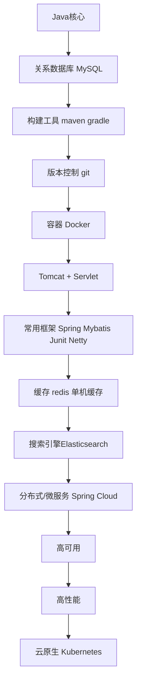

分布式/微服务：

1. 理论算法：CAP BASE Paxos Gossip  Raft
2. 远程调用：OpenFeign
3. API网关：SpringCloud Gateway
4. 服务注册、配置中心：Nacos
5. 分布式ID：雪花算法
6. 分布式事务：Seata
7. 分布式链路追踪：Skywalking

高可用：

1. 限流&降级&熔断
2. 排队
3. 集群
4. 超时和重试

高性能：

1. CDN
2. 消息队列
3. 读写分离&分库分表
4. 负载均衡

# Java

Java 核⼼技术卷 1+卷 2

# Java并发

Java 并发书籍的话，挺多写的还不错的，⽐如《实战 Java ⾼并发程序设计》、《Java 并发 编程之美》、《Java 并发实现原理：JDK 源码剖析》

尚硅谷：[尚硅谷JUC并发编程（对标阿里P6-P7）_哔哩哔哩_bilibili](https://www.bilibili.com/video/BV1ar4y1x727/)

# JVM

《深⼊理解 Java 虚拟机》 

[尚硅谷宋红康JVM全套教程（详解java虚拟机）_哔哩哔哩_bilibili](https://www.bilibili.com/video/BV1PJ411n7xZ/)

[尚硅谷JVM精讲与GC调优教程（宋红康主讲，含jvm面试真题）_哔哩哔哩_bilibili](https://www.bilibili.com/video/BV1Dz4y1A7FB/)

# 数据库

[数据库系统原理_北京师范大学_中国大学MOOC(慕课) (icourse163.org)](https://www.icourse163.org/course/BNU-1002842007)

# MySQL

⽐如《⾼性能 MySQL》 和《MySQL 技术内幕》

另外，强推⼀波 《MySQL 是怎样运⾏的》 这本书，内容很适合拿来准备⾯试。讲的很细 节，但⼜不枯燥，内容⾮常良⼼

# Redis

免费的视频教程的话，推荐慕课⽹的 《Redis ⼊⻔》（⼀些简单的使⽤） 和尚硅⾕的 [尚硅谷Redis零基础到进阶，最强redis7教程，阳哥亲自带练（附redis面试题）_哔哩哔哩_bilibili](https://www.bilibili.com/video/BV13R4y1v7sP/)（阳哥出品，内容更全⾯，Redis 版本更新，强烈推荐）。 书籍的话，强烈推荐 《Redis 设计与实现》和 《Redis 核⼼原理与实践》 这两本书。 《Redis 核⼼原理与实践》这本书出版⽇期相对近⼀些，主要是结合源码来分析 Redis 的重 要知识点⽐如各种数据结构和⾼级特性

# IDEA

[GitHub - judasn/IntelliJ-IDEA-Tutorial: IntelliJ IDEA 简体中文专题教程](https://github.com/judasn/IntelliJ-IDEA-Tutorial)

[主页 | IDEA 高效使用指南 (javaguide.cn)](https://idea.javaguide.cn/)

# Maven

[四十五图，一万五千字！一文让你走出迷雾玩转Maven！ - 掘金 (juejin.cn)](https://juejin.cn/post/7238823745828405308)

# Git

[Learn Git Branching](https://learngitbranching.js.org/?locale=zh_CN)

# Docker

[Docker核心概念总结 | JavaGuide](https://javaguide.cn/tools/docker/docker-intro.html)

[Docker实战 | JavaGuide](https://javaguide.cn/tools/docker/docker-in-action.html)

[前言 - Docker — 从入门到实践 (gitbook.io)](https://yeasy.gitbook.io/docker_practice/)

# 设计模式

# Linux

[Linux 基础知识总结 | JavaGuide](https://javaguide.cn/cs-basics/operating-system/linux-intro.html)

[Shell 编程基础知识总结 | JavaGuide](https://javaguide.cn/cs-basics/operating-system/shell-intro.html)

# HTML+CSS+JS

[The Modern JavaScript Tutorial](https://javascript.info/)

# Servlet

Servlet 属于⽐较古⽼的技术了，现在你⼏乎不会直接使⽤到 Servlet 相关的 API。不过，学 习 Servlet 有助于我们搞清各种封装的⽐较好的 Web 框架的原理，⽐如 Spring MVC 不过就 是对 Servlet 的封装，它的底层还是依赖于 Servlet 。

 在 Java Web 程序中， Servlet 主要负责接收⽤户请求 HttpServletRequest , 在 doGet() , doPost() 中做相应的处理，并将回应 HttpServletResponse 反馈给⽤户。 

你可以通过书籍《Head First Servlets & JSP（中⽂版）》或者《Servlet 和 JSP 学习指南》 来学习 Servlet 基础知识。 

注意：JSP 就不要学了，过时的技术，已经被淘汰了！

# Tomcat

[深入拆解 Tomcat & Jetty (geekbang.org)](https://time.geekbang.org/column/intro/100027701?code=ganzuBOpvoF-hAMry58WVIdOeMJTk6Si21ftBkXI228%3D)

# Nginx

[Nginx 核心知识 150 讲 (geekbang.org)](https://time.geekbang.org/course/intro/100020301?code=AycjiiQk6uQRxnVJzBupFo-Sf2JCzTwL9ofo4d9B4VE%3D)

# Spring / Spring Boot

[Spring Boot](https://spring.io/projects/spring-boot#learn)

[【尚硅谷】SpringBoot2零基础入门教程（spring boot2干货满满）_哔哩哔哩_bilibili](https://www.bilibili.com/video/BV19K4y1L7MT/)

# MyBatis

MyBatis-Plus

# 单元测试

[阿里是如何进行单元测试培训的？（附回放视频） (qq.com)](https://mp.weixin.qq.com/s/wzGxqNv58Zig9_Izi3VhDg)

[javaguide.cn](https://javaguide.cn/system-design/basis/unit-test.html)

[Integration Testing in Spring | Baeldung](https://www.baeldung.com/integration-testing-in-spring)

[Getting Started | Testing the Web Layer (spring.io)](https://spring.io/guides/gs/testing-web)

[可能是全网最好的 Spock 单测入门文章！ (qq.com)](https://mp.weixin.qq.com/s/axNE8OjFh9V9SGgaCZVgOw)

[单元测试框架Mockito落地实践分享 (qq.com)](https://mp.weixin.qq.com/s/6s_5XSzKp8fckKuojSvXUw)

[如何写出有效的单元测试 (qq.com)](https://mp.weixin.qq.com/s/Y75fSX92kysSmYrhEH6QFQ)

# Netty

《Netty实战》

[黑马程序员Netty全套教程， netty深入浅出Java网络编程教程_哔哩哔哩_bilibili](https://www.bilibili.com/video/BV1py4y1E7oA/)

# ES

[【尚硅谷】ElasticSearch教程入门到精通（基于ELK技术栈elasticsearch 7.x+8.x新特性）_哔哩哔哩_bilibili](https://www.bilibili.com/video/BV1hh411D7sb/)

[Elastic 博文：案例、教程、发布信息 | Elastic Blog](https://www.elastic.co/cn/blog/)

[Elastic中文社区 (elasticsearch.cn)](http://www.elasticsearch.cn/)

[Elasticsearch 核心技术与实战 (geekbang.org)](https://time.geekbang.org/course/intro/100030501?code=X-TT5WHMMfydsUE6leXwGRbuj8d7oNBgKFFwCXqhJfM%3D)

# 分布式/微服务

《深⼊理解分布式系统》这本书⾮常不错。这本书的作者⽤了⼤量篇幅来介绍分布式领域中 ⾮常重要的共识算法，并且还会基于 Go 语⾔带着你从零实现了⼀个共识算法的⿐祖 Paxos 算

《从零开始学架构》这本书的内容⽐较全⾯，分布式、微服务、⾼并发、⾼可⽤这些都有涉 及到。这本书对应的是极客时间的专栏—《从零开始学架构》，⾥⾯的很多内容都是这个专 栏⾥⾯的，两者选⼀个阅读就⾏了

[从 0 开始学架构 (geekbang.org)](https://time.geekbang.org/column/intro/100006601?code=i00Nq3pHUcUj04ZWy70NCRl%2FD2Lfj8GVzcGzZ3Wf5Ug%3D)

余⽼师的 《软件架构设计：⼤型⽹站技术架构与业务架构融合之道》这本书类似于《从零开 始学架构》，内容同样⽐较全⾯，也很不错

公开课：

MIT6.824: Distributed System 这⻔公开课挺经典的。这⻔课每节课都会精读⼀篇分布式系统 领域的经典论⽂，并由此传授分布式系统设计与实现的重要原则和关键技术。

 如何的才能更好地学习 MIT6.824 分布式系统课程？ 

[如何的才能更好地学习 MIT6.824 分布式系统课程？ - 知乎 (zhihu.com)](https://www.zhihu.com/question/29597104)

MIT6.824: Distributed System（中⽂翻译 wiki） 

[简介 - MIT6.824 (gitbook.io)](https://mit-public-courses-cn-translatio.gitbook.io/mit6-824/)

MIT6.824: Distributed System - CS ⾃学指南

[MIT 6.824: Distributed System - CS自学指南 (csdiy.wiki)](https://csdiy.wiki/并行与分布式系统/MIT6.824/)

## 理论算法协议

4个，Javaguide里有

## 远程调用

不同服务之间的调⽤⼀般有两种⽅法：

RPC：RPC（Remote Procedure Call） 即远程过程调⽤，通过 RPC 可以帮助我们调⽤ 远程计算机上某个服务的⽅法，这个过程就像调⽤本地⽅法⼀样简单。Dubbo 是⼀款国 产的 RPC 框架，由阿⾥开源，国内⽤的最多。 

HTTP 客户端 ：通过 HTTP 协议调⽤其他服务的 RESTful API。Feign 和 OpenFeign （Spring Cloud 官⽅基于 Feign 开发的，⽤于替代已经进⼊停更维护状态的 Feign） 是 ⽬前最常⽤的 HTTP 客户端

## Nacos

[Nacos 快速开始](https://nacos.io/zh-cn/docs/v2/quickstart/quick-start.html)

[Nacos架构&原理-藏经阁-阿里云开发者社区 (aliyun.com)](https://developer.aliyun.com/ebook/36)

[55张图吃透Nacos，妹子都能看懂！ - bucaichenmou - 博客园 (cnblogs.com)](https://www.cnblogs.com/cbvlog/p/15636683.html)

[图文解析 Nacos 配置中心的实现 - 掘金 (juejin.cn)](https://juejin.cn/post/6844904050840993805)

[Nacos 帮我们解决什么问题？—— 配置管理篇](https://nacos.io/zh-cn/blog/5w1h-what.html)

## API网关

[API网关基础知识总结 | JavaGuide](https://javaguide.cn/distributed-system/api-gateway.html)

[Spring Cloud Gateway常见问题总结 | JavaGuide](https://javaguide.cn/distributed-system/spring-cloud-gateway-questions.html)

[6000 字 | 16 图 | 深入理解 Spring Cloud Gateway 的原理 (qq.com)](https://mp.weixin.qq.com/s/XjFYsP1IUqNzWqXZdJn-Aw)

[Spring Cloud Gateway夺命连环10问？ - bucaichenmou - 博客园 (cnblogs.com)](https://www.cnblogs.com/cbvlog/p/15493160.html)

[Spring Cloud Gateway 整合阿里 Sentinel网关限流实战！ - bucaichenmou - 博客园 (cnblogs.com)](https://www.cnblogs.com/cbvlog/p/15512189.html)

[实战 Spring Cloud Gateway 之限流篇 - aneasystone's blog](https://www.aneasystone.com/archives/2020/08/spring-cloud-gateway-current-limiting.html)

## 分布式ID

javaguide里有

## 分布式事务

## 分布式链路追踪

# 高性能

## CDN

掌握概念和原理

## 消息队列

## 读写分离&分库分表

掌握概念和原理

## 负载均衡

负载均衡系统通常⽤于将任务⽐如⽤户请求处理分配到多个服务器处理以提⾼⽹站、应⽤或 者数据库的性能和可靠性。 开发过程中，我们接触到的负载均衡可以简单分为 服务端负载均衡 和 客户端负载均衡 这两 种。服务端负载均衡可以通过硬件（⽐如 F5、A10、Array ）或者软件（⽐如 LVS、Nginx、 HAproxy ）实现。Java 领域主流的微服务框架 Dubbo、Spring Cloud 等都内置了开箱即⽤的 客户端负载均衡实现。Dubbo 属于是默认⾃带了负载均衡功能，Spring Cloud 是通过组件的 形式实现的负载均衡，属于可选项，⽐较常⽤的是 Spring Cloud Load Balancer（官⽅，推 荐） 和 Ribbon（Netflix，已被启⽤）。 个⼈建议学习⼀下 Nginx 和 Spring Cloud Load Balancer。 负载均衡的常⻅概念、算法和技术⽅案可以看看这篇⽂章：负载均衡常⻅问题总结

# 高可用

## 限流&降级&熔断

[阿里限流神器Sentinel夺命连环 17 问？ (qq.com)](https://mp.weixin.qq.com/s/w8lhJfhLdh7POpPw2MyPwA)

[Sentinel为什么这么强，我扒了扒背后的实现原理 (qq.com)](https://mp.weixin.qq.com/s/FewOTrevjiCfooVIVwo4Xg)

[Sentinel 流控滑动窗口算法设计 (qq.com)](https://mp.weixin.qq.com/s/Q3C3DxtCJvTE5CCl3EWF9w)
