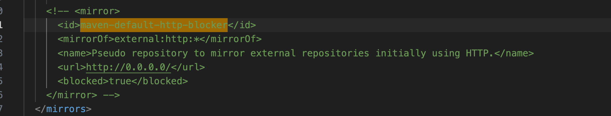

# 在一个之前没有用 lombok 的类里快速使用，并删除无用方法

# 堆内存不足

IDEA Help >> Change Memory Settings 增大 IDEA 的运行内存，Settings >> Build, Execution, Deployment >> Compiler >> Build Process >> Shared heap size 增大程序堆内存

# Maven 报错 Blocked mirror for repositories

可以通过以下方式解决：应用程序 >> IDEA 显示包内容 >> `../Contents/plugins/maven/lib/maven3/conf/settings.xml` 文件中注释掉 `maven-default-http-blocker` 相关内容

# Code Style

勾选了所有的 align when multiline

# 代码优化小技巧

选中整个项目，reformat

# 本地 IDEA 运行项目 | java.lang.OutOfMemoryError | GC overhead limit exceeded

Settings > Build, Execution, Deployment > Compiler > Build Process > Shared heap size 增大程序堆内存

# 插件

| 插件               | 说明                 |
| ------------------ | -------------------- |
| Key Promoter X     | 快捷键提示、学习     |
| CodeGlance Pro     | 右侧缩略图           |
| GenerateAllSetter  | 快速生成所有 setter  |
| Github             | -                    |
| Maven Helper       | maven 依赖分析       |
| Rainbow Brackets   | 彩虹括号             |
| RestfulToolkit-fix | restful 接口快速查询 |
| SequenceDiagram    | 调用顺序图           |
| Statistic          | 统计分析代码量       |

# 设置

Editor > General > Appearance > Show method separators

Editor > General > Appearance > Show whitespaces

# debug 时变量按照字母顺序排序

> https://stackoverflow.com/questions/51512452/how-to-sort-properties-by-name-in-intellij-idea-debugger

debug 工具窗口 "Sort Values Alphabetically"

