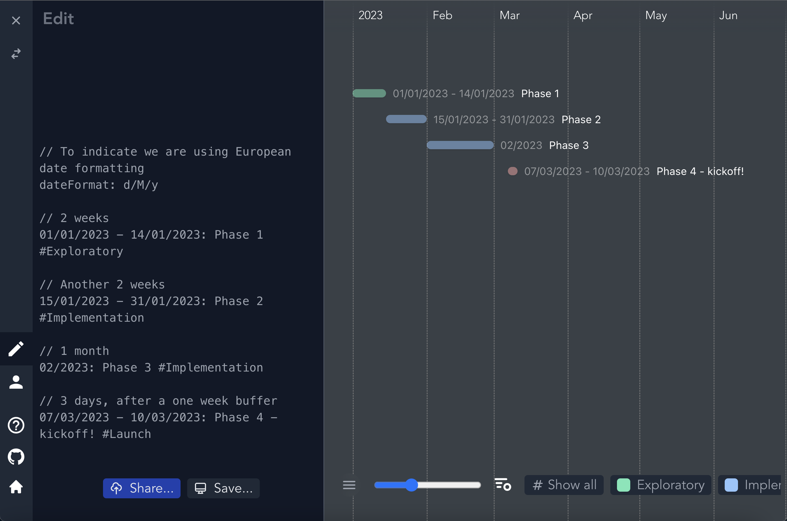
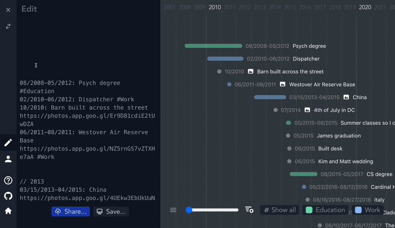

# Markwhen

## 1. 介绍

Markwhen 是一种类似 Markdown 的日志语言 。你编写类似 Markdown 的文本，它会被转换成 JSON，然后可以渲染到时间轴或其他视图中。

## 2. 语法 Syntax

下面的示例已缩进了，但缩进并非强制。不过，如果您像以下示例一样需要缩进，则建议使用等宽字体。

[例子](example.mw)

### 2.1. 事件 Events

事件是一个日期范围（date range），后跟冒号，后跟事件描述（event description）：

```mw
12/2012: End of the world
 
1961: Year after 1960
Later, 1962 would happen
 
1 year: 1962, just as predicted
 
2020-02-22T12:13:14Z-now: How long the pandemic has been going on?
12/7/1941: Pearl Harbor attacked
Launched US into WWII
 
2022-02-22T16:27:08.369Z: More specific thing
2021-01-02T06:27:00Z-2022: ongoing project work until the end of 2022
 
1892/2021-08-12: Example of EDTF date range
```

### 2.2. 日期和范围 Dates and Ranges

Markwhen 支持多种日期格式和表达时间段的机制。

扩展日期时间格式 (Extended date time format, EDTF) 是用于表达日期和范围的推荐语法。解析时，EDTF 优先于此处提到的其他日期格式。如果日期范围的表达方式存在歧义，且符合 EDTF 范围格式，则会将其解析为 EDTF。

每个事件都有一个关联的日期范围，无论其是否明确写明结束日期。日期范围是指从一个日期到另一个日期的时间段。

#### 2.2.1. EDTF Date

EDTF 日期本质上是完整 ISO8601 日期的第一部分，其正则表达式可以表示为 `\d{4}(-\d{2}(-\d{2})?)?`

```text
1981
2012-05
2022-01-30
```

#### 2.2.2. EDTF Date Ranges

Markwhen 目前符合 0 级 EDTF 标准，支持的范围包括：

```text
1964/2008
2004-06 / 2006-08
2004-02-01/ 2005-02-08
2004-02-01 /2005-02
2004-02-01/2005
2005/2006-02
2005/now
2018/6 months
```

Open-ended ranges（开放式范围）不支持.

Ranges start and end with either a EDTF Date or Relative Date or the special keyword now.
范围有开始和结束，可以是 EDTF 日期或相对日期或特殊关键字 now。

> NOTE
>
> 虽然 `now` 关键字现在和将来都会得到支持，但由于其歧义性而不建议使用。`now` 既可能表示作者编写 markwhen 文档的时间，也可能表示文档被解析的时间等。请尽量使用具体日期（即 `2025-03-01` 而不仅仅是 `March` ）。

#### 2.2.3. 非 EDTF 日期 Non-EDTF Dates

除了 EDTF 之外，其他日期格式也开箱即用。支持人类可读的日期，例如 `1665` `03/2222` `09/11/2001` `18 March 2026` `Aug 30 9:45am` ，以及 IO8601 日期，例如 `2031-11-19T01:35:10Z` 。人类可读的日期格式默认为美式月/日/年，但可以通过 Header 更改为欧式格式。

#### 2.2.4. 非 EDTF 日期范围 Non-EDTF Date Ranges

非 EDTF 日期范围通常是 `Date[-Date]`；也就是说，一个日期后面可以跟着破折号 ( `-` ) 或单词 `to` 和另一个日期。

如果未指定结束日期，则范围与其粒度一样长。例如，事件

```mw
2001: A Space Odyssey
```

从 2001 年 1 月 1 日开始，持续至 2001 年 12 月 31 日。

| 例子                                        | 推断出的范围 开始时间  | 推断出的范围 结束时间  | 解释                                                                                                                                                                 |
| ------------------------------------------- | ---------------------- | ---------------------- | -------------------------------------------------------------------------------------------------------------------------------------------------------------------- |
| `2024`                                      | `2024-01-01T00:00:00Z` | `2025-01-01T00:00:00Z` | 从 2024 年初到 2024 年底                                                                                                                                             |
| `04/1776`                                   | `1776-04-01T00:00:00Z` | `1776-05-01T00:00:00Z` | 从 1776 年 4 月初到 1776 年 4 月底                                                                                                                                   |
| `01/01/2024`                                | `2024-01-01T00:00:00Z` | `2024-01-02T00:00:00Z` | 2024 年 1 月 1 日开始，至 2024 年 1 月 1 日结束（全天）                                                                                                              |
| `11/11/2024-12/12/2024`                     | `2024-11-11T00:00:00Z` | `2024-12-13T00:00:00Z` | 从 2024 年 11 月 11 日开始，到 2024 年 12 月 12 日结束。                                                                                                             |
| `2031-11-19T01:35:10Z-2099-08-04T18:22:48Z` | `2031-11-19T01:35:10Z` | `2099-08-04T18:22:48Z` | 与 ISO 日期所说的完全一样具体。                                                                                                                                      |
| `January 3 - Apr 6`                         | `2025-01-03T00:00:00Z` | `2025-04-07T00:00:00Z` | 由于本文档撰写于 2025 年，因此年份推断为 2025 年。请注意，该范围延伸至 4 月 6 日结束 ，因此它对应 4 月 7 日的开始 。由于缺乏明确的年份，因此不建议使用此类日期范围。 |
| `now - 10 years 6 months 3 days`            | `now`                  | 10 年 6 个月 3 天后    | `now` 是每次时间轴渲染的时间，并不是写文档的时间。`10 years 6 months 3 days` 是一个相对日期                                                                          |
| `3:30pm - 4:30pm`                           | 今天日期的 `15:30`     | 今天日期的 `16:30`     | 当时间单独出现时，它基于最后看到的日期，如果没有，则是今天                                                                                                           |
| `1 Jan 1998 to 11/11/2011 8am`              | `1998-01-01T00:00:00Z` | `2011-11-11T08:00:00Z` |                                                                                                                                                                      |
| `Nov 11 02:30`                              | `2011-11-11T02:30:00Z` | `2011-11-11T02:30:00Z` | 当指定时间（小时/分钟）时，粒度是瞬间                                                                                                                                |

> 模糊格式 Ambiguous formats
>
> Markwhen 的设计目标是易于上手并立即使用。这种简单性的一部分体现在它支持可能比预期更模糊的日期和日期范围。例如， `April 1 - June 18` 、 `Nov 11 2:30` 和 `2020 - now` 都是完全有效的 markwhen 日期范围，但由于它们可能缺少年份或范围会变化，在未来解析时可能代表不同的含义。你应该三思而后行，避免使用任何模糊的日期语法，以确保它确实是你想要的。

#### 2.2.5. 相对日期 Relative Dates

如果你有基于其他事件或相对于其他事件的事件，你可以描述它们之间的关系以获得你想要的范围。

例如，假设你正在使用一个项目追踪器。你可以通过使用绝对日期来概述你的项目阶段，如下所示：

```mw
// To indicate we are using European date formatting
dateFormat: d/M/y
 
// 2 weeks
01/01/2023 - 14/01/2023: Phase 1 #Exploratory
 
// Another 2 weeks
15/01/2023 - 31/01/2023: Phase 2 #Implementation
 
// 1 month
02/2023: Phase 3 #Implementation
 
// 3 days, after a one week buffer
07/03/2023 - 10/03/2023: Phase 4 - kickoff! #Launch
```



然而，一旦发生变更（比如出现疏漏或估计错误），你就必须逐个检查所有事件并手动修改它们的日期。如果变更发生在早期，这将尤其麻烦。

使用相对日期，我们可以这样表达相同的时间线：

```mw
// 2 weeks
01/01/2023 - 2 weeks: Phase 1 #Exploratory
 
// Another 2 weeks
2 weeks: Phase 2 #Implementation
 
// 1 month
1 month: Phase 3 #Implementation
 
// One week after phase 3 ends, a 3 days kickoff event
1 week - 3 days: Phase 4 - kickoff! #Launch
```

相对日期基于前一个日期，这可以追溯到我们的第一个日期， `01/01/2023`。

#### 2.2.6. 事件 ID Event IDs

这种方式对于每个日期都依赖于前一个日期的串行日期来说已经足够好，但如果我们有多个事件都依赖于同一个事件呢？我们可以使用事件 ID 来实现这一点：

```mw
01/01/2023 - 2 weeks: Phase 1 #Exploratory
id: Phase1

// Another 2 weeks
after !Phase1 2 weeks: Phase 2, in parallel with Phase 3 #Implementation

// 1 month
after !Phase1 1 month: Phase 3, in parallel with Phase 2 #Implementation

// 3 days, after a one week buffer
1 week - 3 days: Phase 4 - kickoff! #Launch
```

单词 `after` 是可选的，我们也可以说 `!Phase1 2 weeks: Phase 2, in parallel with Phase 3 #Implementation` 来达到同样的效果。

相对日期将首先尝试引用由提供的事件 ID 指定的事件。例如，对于 `!Phase1 2 weeks: Phase 2` ，系统会查找 ID 为 `Phase1` 的事件，检查该事件何时结束，并将其用作 `2 weeks` 的参考。

如果我们找不到事件 ID，或者没有提供事件 ID，则相对日期将基于时间轴中的最后一个日期——这里的“最后一个”指的是最近写入的日期，因为时间轴是从上到下解析的。因此，如果我们有一条这样的时间轴：

```mw
2020: Pandemic
2021 - 2023: More pandemic
1 year: Less pandemic?
```

`1 year` 是基于最后看到的日期，即 `2023` ，或者更具体地说，是 `2023` 年底。

这也意味着我们可以根据开始日期确定结束日期：

```mw
12/25/2022: Christmas
5 days - 3 days: New Years' stuff
```

这里， `5 days` 是先前看到的日期（ `12/25/2022` ）的五天之后，也就是 `12/30/2022` ，而 `3 days` 是前一个日期（即我们的开始日期 `12/30/2022` 的三天之后。

因此，两个相对日期合在一起，如 `x days - y weeks: ...` ，基本上可以读作 `x days after the previous event and lasts for y weeks` 。

唯一的例外是简写单数相对日期，如 `x years:...` ，表示 `immediately after the last event and lasts for x years` 。

#### 2.2.7. 截止日期 Due dates

就像你可以表示一个事件发生在另一个事件之后一样，你也可以表示一个事件应该发生在另一个事件之前 。假设我们想在圣诞节前完成一些事情：

```mw
2022-12-25: Christmas
id: Christmas
before !Christmas 1 month: Buy presents
before !Christmas 2 weeks: Get a tree
```

通过使用事件 ID ，我们可以指定截止日期，并指定该事件发生前的时间间隔。与所有事件 ID 一样，该 ID 必须在文档中提前定义，以便能够引用；类似下面的代码将**无法正常工作**：

```mw
before !Christmas 1 month: Buy presents
before !Christmas 2 weeks: Get a tree
2022-12-25: Christmas !Christmas
```

因为 ID 为 `!Christmas` 的事件排在引用它的事件之后。解决这个问题的一个好方法是在时间线的开头定义已知日期，然后查看 sorted view 以按顺序查看它们。

与依赖于先前事件的相关事件类似，具有截止日期的事件也可以具有开始和结束时间：

```mw
2022-12-25: Christmas !Christmas
before !Christmas 1 week - 1 month: Buy presents
```

此处， `Buy presents` 活动在圣诞节*前一周结束* ，持续一个月。处理相关事件时，范围的第一部分（如果有）可视为“缓冲区”，而第二部分则为持续时间。如果只有一部分（无范围； `before !Christmas 1 month` 而不是 `before !Christmas 1 week - 1 month` ），则它将与其所依据的事件相邻，并具有指定的持续时间。

与其他相关事件类似，如果没有指定事件 ID，它将依赖于前一个事件。

`before` 和 `by` 都可以用来表示发生在另一事件之前。它们等效：

```mw
by !Chistmas 1 day: ...
before !Christmas 1 day: ...
```

#### 2.2.8. 工作日 Week days

当使用相对日期时，您还可以利用指定 `week days` 的功能 - 这将根据所需的非周末天数来计算持续时间。

例如：

```mw
July 13, 2022 - 5 week days: Item estimate
10 week days: Second part of item
```

2022 年 7 月 13 日是星期三，我们计算 5 个工作日，因此我们先计算星期三、星期四、星期五（3），然后是接下来的星期一和星期二（2），这样我们就到了 7 月 19 日的结束（技术上是 7 月 20 日午夜，星期三）。

第二个活动在第一个活动之后开始，持续 10 个工作日，这将持续到未来的两个星期三，即 14 个日历日。

使用工作日时，支持在 `day` 前添加 `Week` 、 `work` 和 `business` 作为前缀。这些前缀完全相同：

```mw
10 business days: ...
10 weekdays: ...
10 work days: ...
```

工作日不计算节假日，只计算周末。遗憾的是，它还假设每周工作 5 天。 希望很快就能变成 4 天 。

#### 2.2.9. 重复事件 Recurring events

要使事件重复一定次数，您可以在事件范围和事件描述之间使用重复语法：

```mw
October 7, 1989 every year for 10 years: ...
2025-03-04 every week for 12 weeks: ...
2022-01/2022-03 every 2 years x9: ...
Feb 1 2023 every 6 months for 10 times: ...
```

递归语法本质上采用以下形式

```mw
every (duration) (for (number of times | duration)) | x(amount)
```

### 2.3. 属性 Properties

Events、groups 和 sections 都可以包含可选属性。属性是键值对，其形式为 `key: value` ， **紧跟在事件或群组定义的第一行之后** ，即

```mw
2025-04-30: Carpooling to work
  riders: [Tom, Jerry]
  fee: $4
 
  Some day I'll have my own car
```

> 缩进
>
> 虽然有些示例是缩进的（如上所示），但 markwhen 中的缩进是可选的。

在此示例中， `riders: [Tom, Jerry]` 是一个键值对， `fee: $4` 是另一个键值对。它们作为对象存储在 `event.properties` 字段中，可供可视化使用。 **属性必须位于 event 或 group 定义之后的行**。 您不能将属性放在活动描述的末尾或中间。

> WARNING
>
> 与 header 不同，事件属性不能使用多行列表语法来表示数组——破折号语法将被解释为列表，并作为事件描述的一部分。如果您希望事件或组属性使用数组值，则需要使用流式样式 ：
>
> 不能这样写：
>
> ```mw
> 2025-09-04: Meeting
>   recipients:
>     - Melissa
>     - Roger
>     - Don
> ```
>
> 要这样写：
>
> ```mw
> 2025-09-04: Meeting
>   recipients: ["Melissa", "Roger", "Don"]
> ```

#### 2.3.1. 时区 Timezone

`timezone` 或 `tz` 是事件的特殊属性，用于具体设置其时区：

```mw
2025-08-03 10am: Meeting
timezone: America/Los_Angeles
 
2025-08-04 11am: Return flight
tz: -5
```

#### 2.3.2. 事件 id

事件 ID 可用于创建相对日期并让后续事件引用它：

```mw
2025-08-03 10am: Meeting
id: meeting
```

#### 2.3.3. 属性顺序

组和事件上有一个附加字段 `propOrder` ，它是按照文档中定义的顺序排列的键的 `string[]` 。

例如在以下 markwhen 文档中：

```mw
2026: Event
fun: yes
travel: ['America', 'Europe', 'Africa']
people: Family
```

事件的属性是：

```json
{
    "fun": "yes",
    "travel": ["America", "Europe", "Africa"],
    "people": "Family"
}
```

而 propOrder 将是：

```json
["fun", "travel", "people"]
```

如果需要，您可以使用 `propOrder` 来维护属性定义的顺序。

### 2.4. 事件描述

事件描述是指事件日期范围之后到**下一个事件**的所有内容。事件描述可以跨越多行。例如，对于 `12/2012: End of the world` ，事件描述仅为 `End of the world` 。对于以下事件：

```mw
1961: Year after 1960
Later, 1962 would happen
```

事件描述是

```mw
Year after 1960
Later, 1962 would happen
```

事件描述可以包括标签 tags、 链接 links、 照片 photos 和参考资料 references。

#### 2.4.1. Tags

事件可以添加标签，直观地表明其所属类别。只需在事件描述的任意位置添加标签文本即可：

```mw
2022: Happy 95th Birthday Queen Elizabeth #UK #Royalty
```

#### 2.4.2. Links

链接类似于 markdown 链接：链接显示文本在括号中，后跟括号中的 url：

```mw
2018 - 3 years: [Google](www.google.com)
```

#### 2.4.3. Locations

对于支持位置的可视化，向事件添加一个属性：

```mw
09/2018: Road trip to Seattle
locations: [Devil's Tower, Glacier National Park, Seattle]
 
1999-05-25: A fond memory
location: Sam's bar and grill
```

#### 2.4.4. Photos

支持 Markdown 样式的图像： ``

#### 2.4.5. Task list

支持 Markdown 任务列表：

```mw
now: Things to do
- [ ] unfinished task
- [x] finished task
```

#### 2.4.6. Percent

通过在事件中包含 `0` - `100%` 来指示事件已完成的百分比，事件栏将部分填充以显示完成百分比。

当没有百分比时，将使用任务的完成率来表示完成百分比，并在事件栏中显示。

### 2.5. Groups 和 Sections

事件可以分组。要指定组，请在行首写 `group` 或 `section` 。使用关键字 `endSection` 或 `endGroup` 结束组或部分。所有到结束关键字或页面末尾（以先到者为准）的事件都包含在该组中。



例如，

```mw
group The 90s // The title for this group is "The 90s"
 
  1991: Desert Storm
  1994: Friends premiered
  05/14/1998: Series finale of Seinfeld
 
  // Nested groups are allowed
  group The 2000s
 
    03/2005: Premiere of The Office (US)
 
  // Explicitly end the inner group
  endGroup
 
  2020: Pandemic
 
endGroup
 
// This event is not part of a group
2022: Other things happen
...
```

虽然 section 的行为类似，但延伸到整个时间线的宽度，并由 `section` 和 `endSection` 关键字激活


sections 和 groups 之间的唯一区别在于它们如何通过视图来设置样式。

### 2.6. 标题 Header / Frontmatter

timeline 的标题指定了 timeline 的相关信息，例如视觉偏好设置和元数据。它是时间线的第一部分；也就是说，第一个事件之前的任何内容都被视为标题。

标题会被解析为 yaml 文件，类似于某些 Markdown 解析器中的 frontmatter。此外，与 frontmatter 类似，你可以（但并非必须）将标题夹在三个短划线 ( --- ) 之间。

```mw
---
title: Timeline
key:
  - entry
---
 
Dec 29 2029: Some date
```

与下面的解析结果相同

```mw
title: Timeline
key:
  - entry

Dec 29 2029: Some date
```

自定义可视化可能会规定一些特殊标题值。

#### 2.6.1. Header 快速参考 Header Quick Reference

| Item                                                  | Syntax                       | Example                                         |
| ----------------------------------------------------- | ---------------------------- | ----------------------------------------------- |
| Coloring tags                                         | `#[tag name]: <color>`       | `#Movies: aquamarine`                           |
| Date format. Change the formatting to European style. | `dateFormat: d/M/y`          | `dateFormat: d/M/y`                             |
| Title of the page                                     | `title: <title>`             | `title: My timeline`                            |
| Description of the page                               | `description: <description>` | `description: If anything looks off here, lmk!` |
| Viewers                                               | `view: <viewer emails>`      | `view: you@example.com`                         |
| Editors                                               | `edit: <editor emails>`      | `edit: otherperson@example.com`                 |
| Timezones                                             | `timezone: <timezone>`       | `timezone: +5 or timezone: America/New_York`    |

一些典型的标题项如下：

#### 2.6.2. Timezone

指示此 markwhen 文档相对于哪个时区：

```mw
timezone: Europe/London
```

或者

```mw
timezone: -6
```

#### 2.6.3. Title

通过添加标题属性来指示页面的标题：

```mw
title: Party Planning
```

这也将显示为浏览器选项卡的标题。

#### 2.6.4. Description

如果标题描述性不够，或者您想添加更多背景信息，请在时间轴中添加描述：

```mw
description: These are the main events for the party, try to stick to the plan!!
```

#### 2.6.5. Viewers / Editors

> 在标题栏中指定 viewers / Editors 是 Meridiem 特有的功能。

通过添加 `meridiem.view:` 条目来限制对时间线的访问：

允许其他人使用标题中的 `meridiem.edit` 字段编辑您的共享文档：

```mw
meridiem:
  view:
    - onlymypeople@example.com
    - myteam@example.com

  edit:
    - onlymypeople@example.com
    - myteam@example.com
```

还支持通配符：

```mw
meridiem:
// Anyone can view
  view: "*"

// Anyone can edit
  edit: "*"
```

标题中缺少 `meridiem.view` 或 `meridiem.edit` 条目表明该文档是私有的。除了所有者之外没有人可以编辑它。

#### 2.6.6. Tags

您可以指示希望某些标记事件显示的颜色，如下所示：

```mw
#Travel: blue
#Education: green
#Economics: #abc // hex color
```

支持十六进制颜色（例如 #a13bbb ）。

因此，如果您有类似以下的事件

```mw
2012-2013: Germany and Italy #Travel
```

它在时间线视图中将显示为蓝色。

#### 2.6.7. Date formatting

非 ISO8601 日期默认采用美式格式（月/日/年）。您可以在标题区域（任何事件之前）添加以下行，将其更改为 `d/M/y` 格式：

```mw
dateFormat: d/M/y
```

此行代码为硬编码，任何其他格式的尝试均无效。[支持的日期格式详见](#22-日期和范围-dates-and-ranges)

#### 2.6.8. Imports

> 导入其他文档是 Meridiem 特有的功能。


### 2.7. Tags

markwhen 中的事件可以用 `#` 语法标记：

```mw
2020: Mostly uneventful year #covid
```

此处，该事件带有标签 `#covid` 。在支持不同颜色的视图中，此事件将具有与其他未标记事件不同的颜色。

#### 2.7.1. 颜色

您可以在标题中指定标签的颜色：

```mw
---
#covid: blue
---
 
2020: Mostly uneventful year #covid
```

#### 2.7.2. 多个标签

events、groups 和 sections 都支持多个标签，但它们具有给定属性的行为变得未定义 - 或者至少定义较少。

基本上，不要指望标签属性的智能合并：

```mw
#school: red
#work: yellow
 
2021: Was working while in school #school #work
```

同时带有 `#school` 和 `#work` 标签的活动不会被标记为橙色，因为 #school 是红色，而 #work 是黄色。活动会以其中一种颜色显示。时区也类似——一个活动不能同时包含两个不同的时区。您应该明确指定标签。

### 2.8. 时区

我们可以（并且应该）通过添加 `timezone` 或 `tz` 标头条目以及类似的事件来为我们的 markwhen 文档指定时区：

```mw
---
timezone: America/New_York
 
#covid: blue
#london:
  color: green
---
 
2020: Mostly uneventful year #covid
 
group year abroad #london
  2023-06-01: the king was coronated
    timezone: Europe/London
  ...
endGroup
```

这样，任何未明确指定区域的事件（如 `2023-06-01: the king was coronated` ）都将位于 `America/New_York` 区域。

时区可以通过其名称指定，例如 `America/Los_Angeles` ，或者通过偏移量指定，例如 `+5` 或 `-3` 。

> Luxon  
>
> markwhen 的大部分解析，包括时区解析，都是使用 Luxon 完成的。有关时区的更多信息，请参阅 Luxon 的文档。

> 何时指定时区
>
> 一般来说，你应该总是指定时区，因为这样可以减少歧义，避免误解。如果你开始使用像 markwhen 这样的工具来安排日程或跟踪任务，特别是当你的事件具体到小时和分钟而不是天、月、年时，就更需要指定时区了。

#### 2.8.1. 起点和终点用不同的时区

如果事件的开始和结束的时区不同，请使用 from 和 to 分隔时区：

```mw
2025-06-09 11am / 2025-06-09 6:40pm: 🛫 Going home to NYC from LA
  timezone: 
    from: America/Los_Angeles
    to: America/New_York
```
