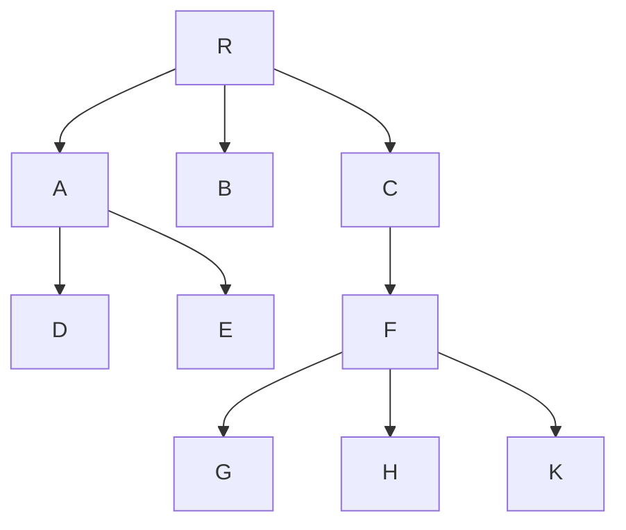
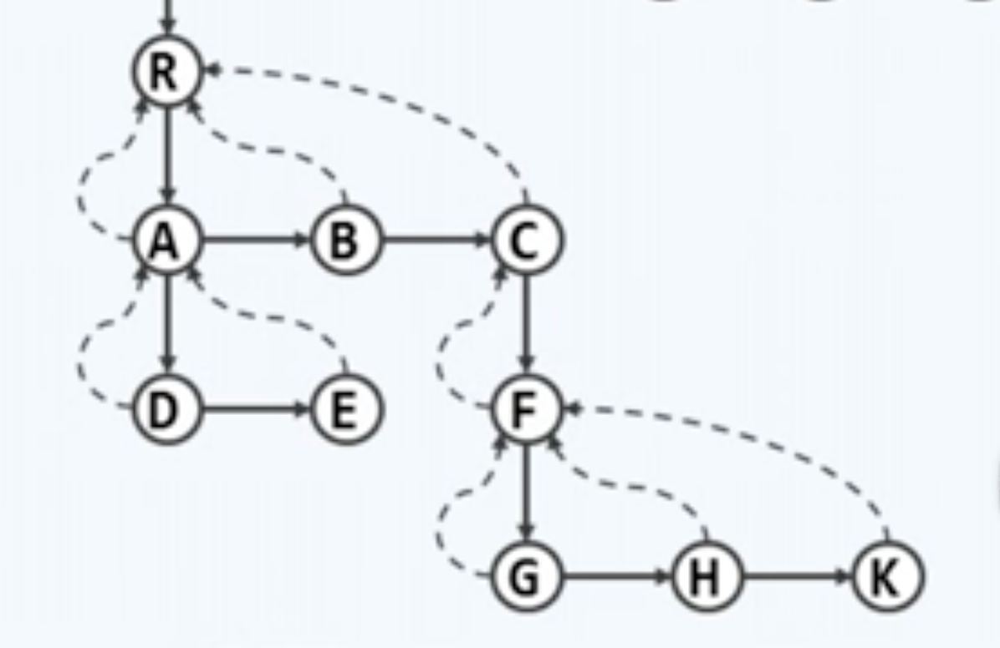
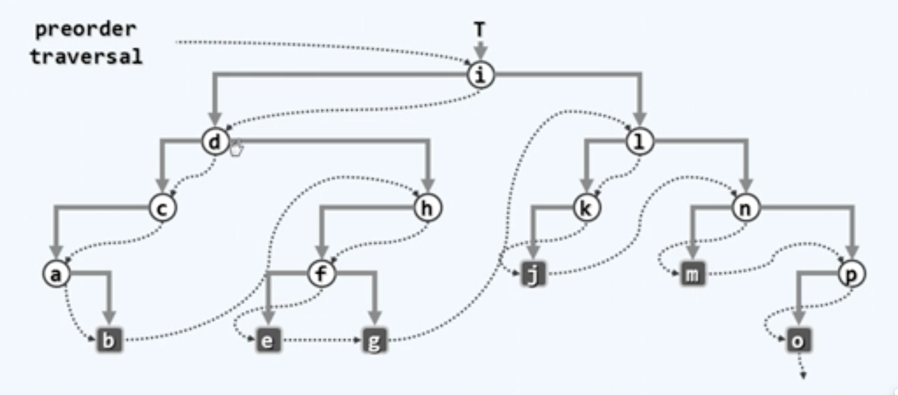
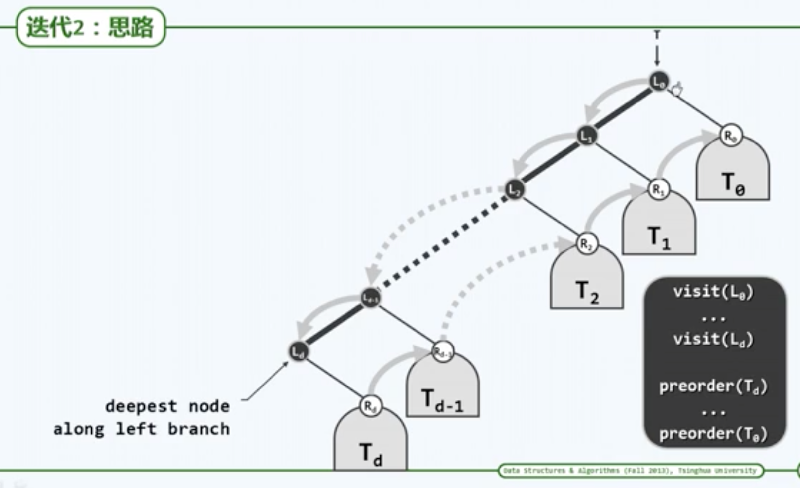
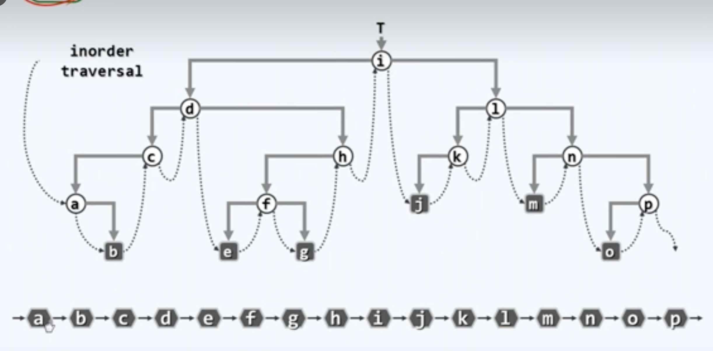
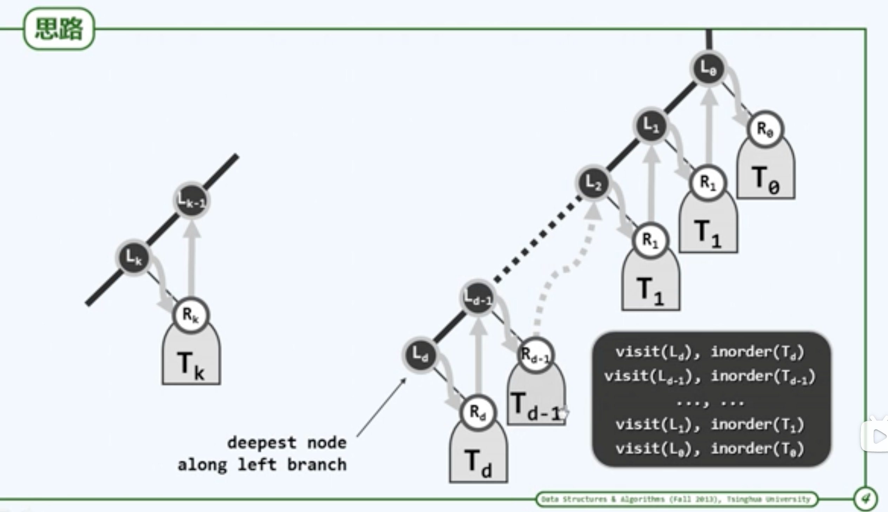
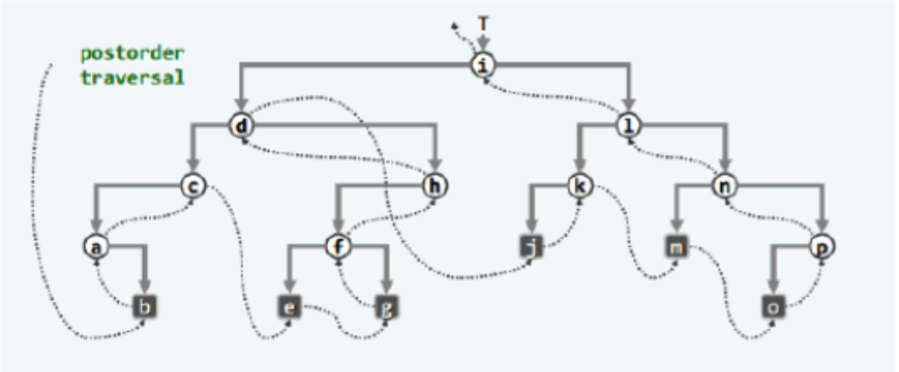
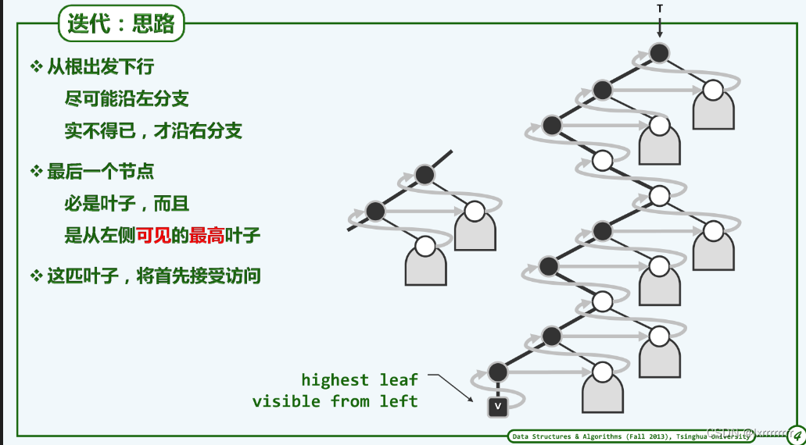

# 5.1 树
向量、列表：线性结构

树：半线性结构（不是线性结构，图是非线性结构，为了和图区分，称树为半线性结构）
## 5.1.1 一些概念
特殊的图

顶点：vertex    边：edge

+ 有根树：和数学图论中的树不同，计算机里的树通常要选择一个顶点作为根。

+ 子树

+ 孩子child，兄弟sibling，父亲parent

+ 度（出度）degree：任何一个节点的孩子的数量

+ 有序树：兄弟间定义有次序的树

$$
e = \sum_{r∈V}degree(r) = n-1 = Θ(n)
$$
$$
边数=度数的和=节点数-1
$$

+ 故n+e与n同阶，所以之后讨论复杂度时，以n为参照

+ 通路/路径（path）：图中的k+1个节点通过k条边相连接，就叫路径/通路。
+ 衡量通路的长度，用边的数量。
+ 如果两个点的路径可以成环，称为环路loop。

+ 连通图：任意两个节点间都有路径（边不会太少）
+ 无环图：不含环路（边不会太多）

+ 树：**无环连通图。极小连通图。极大无环图。**边数不会太多也不会太少。
  + 故：任一节点v与根之间存在唯一路径。路径长度称为**深度**。

+ path(v)上的节点，都是v的祖先，v是它们的后代

+ 根节点深度为0。

+ 叶子：没有后代的节点

+ 高度：所有叶子深度中最大者。

+ 空树高度取作-1

## 5.1.2 树的表示

除了根以外，所有节点有且只有一个父结点。




### 父亲孩子表示法

#### 可能的方法1

创建一个表（序列），记录下每个节点的内容 + 父节点 + 孩子节点。

rank（编号） | data（值） | parent（父节点） 
-- |-- |--
0 | R | -1
1 | A | 0 
2 | B | 0 
3 | C | 0 
4 | D | 1 
5 | E | 1 
6 | F | 3 
7 | G | 6 
8 | H | 6 
9 | K | 6 

获取父节点O(1)，查询根节点O(1)，但是获取子节点和兄弟节点都需要O(n)

#### 可能的方法2


rank（编号） | data（值） | children（子节点向量或列表） 
-- |-- |--
0 | A | -> 3 -> 5 
1 | B | ^ 
2 | C | -> 6 
3 | D | ^ 
4 | R | -> 0 -> 1 -> 2 
5 | E | ^ 
6 | F | -> 7 -> 8 -> 9 
7 | G | ^ 
8 | H | ^ 
9 | K | ^ 

查找子节点的复杂度O(出度)，但是获取父节点的性能很差。

#### 可能的方法3

将1和2合并起来。时间复杂度都还好。但是孩子节点长度分布不平均，规整性非常差。

### 长子兄弟表示法

对于每个节点，其实可以通过设置2个引用来表达所有节点：

1. 纵：firstChild。找到长子。
2. 横：nextSibling。找到兄弟。



每个节点空间仍是常数，且空间接近，规整

基于这种方法，所有的树都可以用二叉树表示。

# 5.2 二叉树
## 概念
每个节点度数**不超过2**的树

+ 左孩子、左子树
+ 右孩子、右子树
+ 隐含有序，一般认为左在先，右在后

深度为k的节点，最多有$$2^k$$个

在含n个节点、高度为h的二叉树中
$$
h < n < 2^{h+1}
$$

当n = h + 1时，退化为一条单链

当n = $$2^{h+1} - 1$$时，为**满二叉树**

+ 真二叉树：不含出度为1的二叉树

## 用二叉树描述多叉树
**有根**且**有序**的树都可以用二叉树来表示

长子兄弟法

# 5.3 二叉树实现
## 5.3.1 节点类BinNode

|        |  data  |        |
| :----: | :----: | :----: |
| lChild | parent | rChild |
| height |  npl   | color  |

npl是左式堆要用的，color是红黑树要用的。

### 接口

```java
BindNode<T> parent, leftChild, rightChild;
T data; int height;	// 高度
int size();	// 规模
BinNode<T> insertAsLeftChild(T val);	// 作为左孩子插入节点
BinNode<T> insertAsRightChild(T val);	// 作为右孩子插入节点
BinNOde<T> successor();	// 中序遍历意义下的直接后继
List<T> traverseLevel();		// 子树层次遍历
List<T> traversePreorder();	// 子树先序遍历
List<T> traverseInorder();	// 子树中序遍历
List<T> traversePostOrder();	// 子树后序遍历
```

### 常用接口实现

#### insert

```java
// 作为左孩子插入节点
BinNode<T> insertAsLeftChild(T val) {
  this.leftChild = new Node(val, this);
}
public Node(T data, Node parent) {
  // ...
}
// 作为右孩子插入节点，略
```

#### size

树的规模，包括当前节点，所有后代节点的总数

先计入自身，s=1。然后递归的计算左子树和右子树，分别加入s中。

O(n)

```java
public int size() {
  int s = 1;
  s += this.leftChild.size();
  s += this.rightChild.size();
  return s;
}
```

## 5.3.2 二叉树类

```java
public BinTree {
  int size; // 二叉树的规模
  BinNode root; // 根节点
  
  abstract int updateHeight(BinNode x);	// 更新节点x的高度，由于不同的树定义不同，实现方法不同，定义为abstract方法
  void updateHeightAbove(BinNode x);	// 更新x及其祖先的高度
  
  public int size() {
    return size;
  }
	public boolean empty() {
    return root == null;
  }
  public BinNode root() {
    return root;
  }
  
  // ...
}
```

### 接口实现

#### 高度更新

```java
// 常规二叉树
public int updateHeight(BinNode x) {
  return Math.max(x.leftChild.height(), x.rightChild.height()) + 1;
}

// O( n = depth(x) )
// 更新x及其历代祖先的高度
public void updateHeightAbove(BinNode x) {
  while(x != null) {
    updateHeight(x);
    x = x.parent;	// 可优化，当x的高度不变时，就可以停止
  }
}

```

#### 节点插入

```java
// x节点没有右孩子的情况
BinTree<T> insertAsRightChild(BinNode x, T e) {
  this.size++;
  x.insertAsRightChild(e);	// 将e封装成一个节点，接到x的右侧。
  updateHeightAbove(x);	// x祖先的高度 可能增加，其余节点 必然不变
  return x.rightChild;
}
```

# 5.5 二叉树相关算法
二叉树是**半线性结构**，想办法转换为**线性结构**。

转换方法：遍历

## 遍历
按照**某种次序**访问树中各节点，每个节点被访问**恰好一次**

一个局部的子树可以分为：树根，左子树，右子树

T = V ∪ L ∪ R

+ 如果**根节点**先于左右子树：**先序 preorder**。V | L | R

+ 如果**根节点**位于左右子树中间：**中序 inorder**。L | V | R

+ 如果**根节点**在左右子树之后：**后序 postorder**。L | R | V

+ 层次遍历（广度遍历）：自上而下，先左后右

## 先序遍历
### 递归
递归基：节点非空

访问当前节点，递归访问左子树，递归访问右子树

```java
void traverse(BinNode x, Consumer<T> visit) {
  if (x == null) {
    return;
  }
  visit(x);
  traverse.leftChild(x, visit);
  traverse.rightChild(x, visit);
}
```

复杂度：线性 $$T(n) = O(1) + T(a) + T(n-a-1) = O(n)$$

这个线性只是渐近意义上的。实际的情况下，因为递归的实现机制，其实还可以做得更好。

### 迭代

+ 注意到：这里的递归是**尾递归** (tail recursiving)，即递归调用出现在递归方法的尾部。尾递归可以方便的转换为迭代形式。

#### 迭代思路1

用一个辅助栈S，用来存放节点

根节点先入栈

循环：先弹出并访问当前节点，如果有右孩子，入栈；如果有左孩子，入栈。
直到栈为空

右孩子先入后出，左孩子后入先出。

```java
void preorder(BinNode root) {
  Stack<BinNode> stack = ...;
  stack.push(node);
  
  while(!stack.isEmpty()) {
    BinNode node = stack.pop();
    visit(node);
    if (node.rightChild != null) stack.push(node.rightChild);	// 右孩子先入后出
    if (node.leftChild != null) stack.push(node.leftChild);	// 左孩子先出后入
  }
}
```

但是这个版本无法推广到中序遍历和后序遍历上。

#### 迭代思路2

控制权一开始在树根，访问后给了左孩子，左孩子访问完之后，给了右孩子



+ 定义：对于任何一棵子树，起始于树根，不断沿着左侧分支下行的链，称为左侧链。
+ 任何一个二叉树都可以抽象成：一条左侧链，和左侧链沿途的每个节点的一个右子树。



那么访问顺序就是，先访问左侧链，然后从低到高遍历访问右子树。

##### 实现
###### 左侧链访问实现
访问当前节点，右孩子入栈。当前节点指向左孩子，直到为空。

```java
void visitAlongLeftBranch(BinNode x, Stack stack) {
  while(x != null) {
    visit(x);	// 访问当前
    stack.push(x.rightChild);	// 右孩子入栈
    x = x.leftChild;	// 沿左侧链
    下行
  }	// 只有右孩子和null会入栈
}
```

###### 主算法
全局只用1个辅助栈。

循环：左侧链访问。然后栈弹出值作为下一个子树的根。一直到栈空break。

```java
void preorder(BinNode x) {
  Stack stack = new ...;
  while (true) {
    visitAlongLeftBranch(x, stack);	// 访问子树x的左侧链，右子树入栈
    if (stack.isEmpty()) break;	// 栈空退出
    x = stack.pop();	// 弹出下一个子树的根，进入到以x为根的子树
  }
}
```

## 中序遍历
### 递归
处理递归基

递归左子树，根，递归右子树

```java
void traverse(BinNode x, Consumer<T> visit) {
  if (x == null) {
    return;
  }
  traverse(x.leftChild, visit);
  visit(x);
  traverse(x.rightChild, visit);
}
```

O(n)

### 迭代

+ 右子树的递归还是尾递归，但是左子树的并不是

控制权先在根，然后把控制权给了左孩子，直到末端。与先序遍历类似。



+ 与先序遍历同理，同样将二叉树抽象为一根左侧链与左侧链节点的右子树。



局部上：先访问左孩子，再访问左孩子的右子树，再访问根节点

从根出发，沿左分支下行，直到最深的节点，它就是全局首先被访问的

全局上：访问左侧链上的某个节点，然后遍历其右子树，然后访问左侧链上的上一个节点，然后遍历右子树。

#### 左侧链下行
用一个栈，将左侧链的每个节点都入栈

```java
void goAlongLeftBranch(BinNode x, Stack s) {
  while (x != null) {
    s.push(x);
    x = x.leftChild;
  }
}
```

#### 主算法

循环：

每抵达一个节点，都认为进入了以这个节点为根的子树。

先将左侧链入栈。

然后pop，访问。

然后将当前节点的指针指向其右子树

直到栈为空

```java
void inorder(BinNode root) {
  Stack s = ...;
  
  while(true) {
    goAlongLeftBranch(x, s);	// 从当前节点出发，逐批入栈
    if (s.isEmpty()) break;	// 所有节点处理完毕
    x = s.pop();	// x的左子树为空或者已处理完（等效于空），故可以
    visit(x);	// 访问
    x = x.rightChild;	// 再处理右子树，注意可能为空，会在goAlong..里处理，没有实质动作
  }
}
```

O(n)，常系数更小

## 后序遍历



首先还是分析，哪个节点最先被访问，每个节点的直接后继是谁？

从根节点出发，不断沿着左子树下行，直到没有左子树，然后进入到该节点的右子树。重复以上过程。

所以最先被访问的是，最高左侧可见叶节点。即，从左边向右看过去，未被遮挡的最高叶子节点，该节点既可以是左节点，也可以是右节点。



当一个节点被访问完，代表着以该节点为根的子树被访问完。当该节点为左孩子时，应该访问右子树。当该节点为右孩子时，应该访问父节点。

### 实现

#### 到左侧最高可见节点

```java
void gotoHighestLeafVisibleFromLeft(Stack s) {	// 在以s顶节点为根的子树中，找到最高左侧可见叶节点
  while (BinNode x = s.peek() != null) {
    if (x.leftChild != null) {	// 尽可能向左
      if (x.rightChild != null) s.push(x.rigntChild);	// 有右孩子，先入栈
      s.push(x.leftChild);	// 才转至左孩子
    } else {	// 实不得已
      s.push(x.rightChild);	// 才向右
    }
    s.pop();	// 返回之前，弹出栈顶的空节点
  }
}
```

#### 主算法

```java
void postorder(BinNode x) {
  Stack s = // ...
  if (root != null) s.push(x);	// 根节点入栈
  while(!s.isEmpty()) {
    if(s.peek() != x.parent) {	//若栈顶非当前节点的父亲（则必为其右兄），此时需
      gotoHighestLeafVisibleFromLeft(s); //在以其右兄为根的子树中，找到HLVFL（相当于递归深入其中）
    }
    x = s.pop(); //弹出栈顶（HLVFL）（即前一节点的后继），并访问
    visit(x);
  }
}
```

## 层次遍历
垂直方向次序：有根后的深度
水平方向次序：二叉树，左右节点，同辈节点的次序。

自高向低，自左向右

前三个都是有逆序的，子节点会先于父节点被访问，而层次遍历是顺序的
#### 实现
引入一个队列
根节点入队

循环：
取出队首节点访问。左孩子入队，右孩子入队。
直到队列为空。

## 二叉树的重构
任何一个二叉树，都可以导出其先序、中序、后序的遍历序列。
那么在知道遍历序列后，能否重新获得二叉树？

#### 先序/后序 + 中序
r为树根
先序序列：
**r**	——L——	——R——
中序序列
——L——	**r**	——R——

可以对r进行定位，从而可以区分左子树和右子树。

由于L与R可能是空树，只凭借先序和后序序列是不行的。必须要有中序。

#### （ 先序 +  后序 ）× 真
真二叉树可以用先序和后序序列重构。
真二叉树：度数必须是偶数（0和2）

先序：
**v**	**l**——L——	**r**——R——
后序：
——L——**l**	——R——**r**	**v**

可以区分出左右子树

# 6. 图

## 术语
数学意义而言的图：定点 + 边 $$G = (V; E)$$
vertex：n = |V|
edge|arc：e = |E|
被边相连的两个点，存在**邻接关系**（点与点）
点与邻接关系的关系，叫**关联关系**（点与边）

若邻接顶点u和v的次序无所谓，则$$(u,v)$$为**无向边**。
所有边均无方向的图，即**无向图**。

反之，**有向图**中**均**为**有向边**。
u，v分别称作边（u，v）的尾（tail）、头（head）

混合图


本课重点关注**有向图**。有向图可以表示和实现无向图和混合图。

路径

简单路径：不含重复节点
路径：一般性的
环：头尾相同。有简单环和一般环。
有向环图DAG
欧拉环：经过所有边一次，恰好一次
哈密尔顿环路：经过所有点，且恰好经过一次

## 实现
邻接矩阵与关联矩阵

### 邻接矩阵
点与点的n×n矩阵

### 关联矩阵
点与边的n×e矩阵

### Vertex

状态status：UNDISCOVERED（初始值），DISCOVERED，VISITED
inDegree、outDegree、data
遍历相关：
dTime，fTime
parent、priority（优先级）

### Edge
data、weight
状态status：UNDETERMINED，TREE，CROSS，FORWARD，BACKWARD

### 图的实现
顶点集：一个向量
边集：一个二维向量，邻接矩阵。

### next neighbor
点与点的连边关系保存在邻接矩阵里。
点i的连边都在i行里。
从后往前依次遍历。

### first neighbor
```
return nextNbr(i,n); //n可以认为是一个和谁都相邻的哨兵，来启动算法
```

### 边的插入删除
指向对应的矩阵位置。更新边数、出度、入度即可。

### 顶点插入
1. 邻接矩阵增加一列
2. 邻接矩阵增加一行，边集合增加一个元素
3. 顶点集合增加一个元素

删除一样，先删除行，再删除列，最后删除顶点

### 分析
缺点：空间会浪费。有$$n^2$$的空间用于存边，但通常不可能这么多。

平面图：可以嵌入于平面的图（画在平面上边不相交）。根据欧拉公式，空间利用率1/n

## 相关算法
化繁为简，通过遍历，转换为树

## 广度优先搜索BFS
在图中的遍历，更多的体现为，针对某种目标的查找过程，所以称为搜索。

### 思路
自顶点开始广度优先搜索：
先访问顶点，然后访问它的所有邻居（**尚未访问**的邻接顶点），并保留顶点与之的边。依次访问它们所有**尚未访问**的邻接顶点，并保留通往它们的边。如此反复。

然后就形成了一棵**支撑树**。

而且也就是树的层次遍历。

### 代码实现
一个队列。
预处理：顶点入队。状态转换：UNDISCOVERED --> DISCOVERED
循环：
  顶点出队，访问（可能会有各种各样的操作）
  考察所有邻居，根据邻居的状态分别处理
    UNDISCOVERED，转换为DISCOVERED，入队；
      对应的边，UNDETERMINED-->TREE，是最后构成支撑树BFS Tree的边，顶点为邻居的父亲
    else：对应的边置为CROSS
  邻居全部访问完，状态转换为：VISITED
直到队列为空

### 考虑不连通的情况
主算法：
检查每一个顶点，如果是UNDISCOVERED，就对其进行一次BFS搜索

### 复杂度
理论$$O(n^2)$$
实际O(n+e)：n×n中的一个n，for循环遍历某一行找邻居引入的，1操作简单，2地址连续，在高速缓存中

### 最短路径
留下的支撑树的边刚好是最短通路

## 深度优先搜索DFS

### 算法
访问顶点s
若s有**尚未被访问**的邻居，则任取其一u，**递归**执行DFS(u)
否则，返回

即：先访问s，然后访问s的邻居u，如果u没有邻居，会回到s，再找s的邻居

### 框架
访问v，状态转为DISCOVERED
循环：
  枚举v的每一个邻居u：
    UNDISCOVERED：v，u的边置为TREE；v为u的父亲；递归DFS(u)
    DISCOVERED：v，u的边置为BACKWARD
    VISITED（switch里的default）：看v和u谁更早被发现，v更早标位FORWARD；u更早标记CROSS（通过每次访问v时记录dTime）
将v状态转为VISITED

边的状态的说明：
BACKWARD会是有向图里，从后代回连到祖先。一旦发现BACKWARD边，就会出现一个回路。
FORWARD：从祖先连到后代
CROSS：子代之间的连接

### 有向图的可达域问题
有向图有的节点可能会在一次DFS算法里访问不到。
参照BFS算法，外设循环。

## 嵌套引理（括号引理）
在图遍历算法里有2个时间标签，dTime和fTime，前者在v第一次访问的时候记录时间，后者在彻底访问结束后（遍历完所有邻居）记录。

定义 顶点的活动期=(dTime, fTime)
括号引理：
给定有向图及其任一DFS森林。
两个节点的祖先后代关系与活跃期的包含关系对应：

u是v的后代：祖先的活跃期包含后代的活跃期（子集关系）	
u是v的祖先：
u与v“无关”：活跃期互不相交（交集为空）

# 7 二叉搜索树BST
BBST：平衡二叉搜索树

## 规范
### 寻关键码访问
call-by-key
数据项之间依照**关键码**区分彼此

关键码：支持**大小比较**和**相等比对**

变量\_hot
### 有序性
顺序性：
任一节点均**不小于**/**不大于**其**左**/**右**后代
【左小右大】

从而BST的**中序遍历序列**，必然**单调非降**

## 算法
### 查找
从上往下查找，对应在中序遍历序列上就是二分查找。

#### 实现
##### 递归版
递归基：树为空
相等返回
不等，在判断一次大小后，递归调用左子树或右子树

O(h)

##### \_hot变量
初始置null，每次递归下一层前，记录当前（非空）节点

查找成功：返回目标关键码的父节点
查找失败：返回最后访问的真实存在的节点（目标空节点的父节点）

引入假想哨兵，返回值总是等效于命中节点，hot为命中节点的父亲

### 插入
先用search。返回值是应该插入的位置，hot是父亲。更新高度
复杂度：O(h)

### 删除
查找，删除节点，更新高度

#### 删除节点细节：
##### 情况1：有一个子树是空的
删除然后替换为其另一个子树

##### 情况2：两个子树都还在
找到直接后继：BinNode中有实现。先进入右子树，然后沿着左侧分支不断下行到底。

然后当前节点和直接后继进行对换。变成了情况1，删除

修改hot变量的指向，更新高度

#### 复杂度
O(h)

### 复杂度分析
都与高度有关
极端情况下，退化成列表，就成O(n)了

估算高度
#### 随机生成
关键码全排列，然后生成树，有n！个（从高到低长）
高度$$O(logn)$$

#### 随机组成
考察所有的拓扑情况，数量catalan(n)
高度$$O(\sqrt{n})$$

#### 比较
随机生成会有所重复，不同的关键码可能会生成相同的BST，过于乐观

#### 理想平衡
节点固定，子树高度越接近，全树高度越低

n个点的二叉树，高度不低于$$\lfloor log_2n\rfloor$$，那么高度恰为$$\lfloor log_2n\rfloor$$时候，称为理想平衡

#### 适度平衡
理想平衡出现概率极低，维护成本过高，适当放松标准

高度渐进不超过$$O(logn)$$

适度平衡的BST，平衡二叉搜索树BBST

### 中序遍历的歧义性
同一个中序遍历序列可能会对应不同拓扑结构的树

称它们为等价BST。
等价BST：
上下可变
左右不乱

### 等价BST变换
zig(v)：绕v顺时针旋转
zag(v)：绕v逆时针旋转

## AVL
定义**平衡因子**：$$balFac(v) = height( lc(v) ) - height( rc(v) )$$
左子树的高度减去右子树的高度
AVL树的条件：
$$\forall |balFac(v)| \le 1$$

### 插入、删除与失衡
插入与删除都可能会导致AVL的失衡。

插入算法的失衡可能会发生在其历代祖先上，但是只需要一次恢复即可。

删除的失衡可能会发生在父节点上，只有一个节点失衡，但是恢复可能会引入新的失衡。
### 插入
搜索，创建，插入

从父节点出发，依次检查各代祖先是否失衡。一旦发现失衡，祖孙三代开始恢复。恢复后祖先们的高度不变（子树高度不变）。
否则只需要更新高度既可以。

### 删除
搜索，删除

从父节点向上检查各代祖先。一旦失衡，恢复，并更新高度。全树的高度可能下降。

### 3+4重构
祖孙三代：g、p、v【最低的失衡节点，其较高子树的根，较高子树的较高子树的根】
按中序遍历命名：a、b、c
子树：$$T_0、T_1、T_2、T_3$$
命名过程：穷举4种情况，依次处理。

重新拼接为：
         b
      a      c
$$T_0、T_1、T_2、T_3$$

### 综合评价
查找、插入、删除均O(logn)
O(n)存储空间

缺点：
1. 要额外维护平衡因子
2. 实测性能与理论值有差距
3. 动态变化后，拓扑结构的变化量可能高达Ω(logn)【删除】

# 8. 高级搜索树
## 伸展树
### 想法
想利用局部性：

如果节点v被访问，随即转移至树根。

### 转移方法：
#### 一步一步：逐层伸展
转移复杂度过高，均摊O(n)，难以接受。【一系列的zig和zag旋转】

#### 一次2步的提升：双层调整
之字形的情况一样，跟一步一步
但是在zig-zig和zag-zag不一样
先旋转祖父节点，再旋转父节点

这样调整后，整个树的树高会大致缩减为原来的一般

有路径**折叠效果**：一旦访问坏节点，**对应路径**的长度将随之**减半**
分摊复杂度O(logn)

### 伸展算法
找到父亲和祖父，通过判断左右孩子区分zig、zag的情况，分别处理：类似3+4重构

每次伸展后更新高度

直到结束（有可能会有一次单旋）

### 查找
成功伸展至树根
失败把\_hot伸展至树根

### 插入
先查找
\_hot已经被换到了树根
然后把v插入成树根【原根与一个子树为一个子树，另一个子树为另一个子树】

### 删除
先查找
要删除的已经成为了树根
删除后然后把两个子树合并即可

合并：可以从右子树里找到最小的【左侧链下行】，成为新树根。

### 总和评价
1. 不用记录高度和平衡因子
2. 分摊复杂度O(logn)
3. 存在局部性的时候，效率可能会更高

缺点：不能保证单次最坏情况的出现，不适用于效率敏感的场合

## B树

### 引入动机
实现高效IO

### 定义

平衡的多路搜索树

m阶B-树，即m路平衡搜索树

**外部节点**的深度统一相等

所有**叶节点**的深度统一相等

树高 **h=外部节点的高度**

内部节点：
分支不超过m个，关键码不超过m-1个
不少于$$\lceil m/2 \rceil$$，树根只需要大于等于2

所以一般也叫(3,5)树，(2,4)树

### 实现
#### BTNode
一个指向父亲的引用
两个向量：第一个用来存关键码，n个；另一个用来存孩子的引用，n+1个

### 查找
在节点中顺序查找【1. 查找相比IO本来就小，没啥优化的必要；2. 在这里节点里的元素数目在几百K左右，二分查找效率反而更低】，如果没找到，就从引用往下一层。

失败查找必然终止于外部节点

#### 复杂度：O(h)
N个关键码的m阶B-树
最大树高：$$O(log_mN)$$，若m=256，树高只是BBST的1/7
最小高度：$$\Omega(log_mN)$$，若m=256，是1/8

B树高度的变化幅度有限

### 插入
查找，失败。\_hot标明了插入位置。
在节点中查找插入位置，插入，增加一个空子树指针。更新规模
如，上溢，分裂

#### 分裂
上溢的节点应该刚好有m+1个分支，m个关键码

取中位数$$s = \lfloor n/2\rfloor $$，左侧s个，中间一个，右侧剩下的，分为3部分

然后$$k_s$$上升一层，剩下两部分作为左、右孩子

父节点也可能会上溢

复杂度O(h)

### 删除
查找，返回的节点v。
如果v不是叶子，深入到v的右子树中，沿着最左侧向下，找到v的直接后继r。然后把v和后继r互换。
然后删掉v和引用。更新大小

如果下溢，做处理

#### 旋转
若v下溢，那么必然恰好是$$\lceil m/2 \rceil -2 $$个关键码，$$\lceil m/2 \rceil - 1$$个分支

下溢的节点先左顾右盼，如果兄弟有多的关键码，就借一个。借的时候要带上父节点，父节点下来，兄弟的上去

#### 合并
如果左右兄弟不存在或者借不出来。但是一定会存在一个兄弟。

直接把父亲拉下来，一起合并成一个大节点。

#### 复杂度O(h)

## 红黑树

目的：
一致性结构（Persistent structure）：支持对历史版本的访问

考虑空间复杂度
希望将版本间的差异空间复杂度控制在logn

红黑树可以将空间差异控制在O(1)

### 定义之一
增设外部节点，使之成为真二叉树

1. 树根：必为黑色
2. 外部节点：均为黑色
3. 其余节点：若为红，只能有黑孩子 //红之子、之父必黑
4. 外部节点到根：途中黑节点数目相等 //黑深度

### 直观理解
提升变换：把所有红色节点都提升到和它们的父亲同一层。

提升变换后就会变成一个(2,4)B-树

### 定义
高度需要重写，黑高度。

### 插入

搜索，插入的点x必然是末端节点。
插入，染红

如果它的父亲p是红的，需要修复

#### 双红缺陷
祖父节点必然存在且为黑，因为父亲是红的

考察p的兄弟，即x的叔父u

##### u是黑的
B树的对应节点是：
红 红 黑

需要一次3+4重构和一次染色

红 黑 红

##### u是红的
B树的对应节点是：
红 红 黑 红

处理上溢：以中为界【黑】，分为左右，中点上升

对应在红黑树上只需要改变颜色：
颜色：
p与u转黑，g转红

双红缺陷可能会向上传播

#### 复杂度
u为黑，有1-2次旋转，2次染色，随后完成
u为宏，没有旋转，只有3次染色，随后可能会再次双红，但必然上升2层

则总共最多1次重构，O(logn)次的染色

### 删除

直接调用BST的删除算法。

删除算法相当于删掉当前节点，然后用子树r替代

若x与r中有一个是红的，把r改为黑色即可。

#### 双黑缺陷
相当于是把一个节点删掉了，相当于B树的下溢缺陷

那么考虑x的父亲p和x的兄弟s。

##### BB1：s是黑的，且有一个红孩子t
将t的两个孩子，s的孩子，和p的孩子做3+4重构

染色：
tsp重命名为abc
r保持黑，a、c染黑，b继承p的颜色

相当于可以找兄弟借一个的情况

##### BB2：s是黑的，且两个孩子都是黑的
###### BB2-R：p为红
r保持黑，s转红，p转黑

而且不会影响上方
###### BB2-B：p为黑
s转红，r与p保持黑

可能会影响上方

##### BB3：s为红色
对p做一次旋转，把s和p的颜色互换
【相当于B树sp互换颜色】

此时情况转换为BB-1或BB-2R


#### 复杂度
1，旋转1-2，染色3，完成
2R，旋转0，染色2，完成
2B，旋转0，染色1，但可能继续双黑，但会上升
3，旋转1，染色2，转换为1或2R

最多
O(logn)次染色，1次3+4,1次单旋

# 9. 词典
## 散列Hashing
也可以译为哈希

call by value

存储每个元素称为桶bucket，直接存放或间接指向一个词条

散列函数：hash()

### 散列表和散列函数

尽可能降低冲突概率

#### 常用函数

##### 除余法

hash(key) = key % M

为了冲突概率小，M取素数。覆盖最充分，分布最均匀

##### MAD法

除余法的缺点：

	1. 不动点：hash(0) = 0
	2. 相邻的关键码也必然相邻

改进：

hash(key) = ( a × key + b ) % M【b解决问题1，a解决问题2】

##### 更多的函数

数字分析selecting digits，挑选出某几位构成地址

平方取中mid-square，平方后取中间的几位

折叠法folding，分组后相加，也可以叠饼一样的折返加

位异或法XOR，分组后异或

##### 伪随机数法

不同平台的不同版本的伪随机数法不同，移植性很差，

#### 字符串转换为hashcode关键码

##### 多项式法

每个字符转换为一个整数，然后视作一个多项式的系数，然后算出来值

改进：不做多项式计算，把数的前5个比特和后27个比特互换位置，再累加


### 指定可行的预案

发生冲突，尽快排解

#### 多槽位multiple slots

桶单元细分槽位

但是：应该给每个桶预留多少个槽呢？过多浪费；无论预留多少，极端情况下都可能不够

##### 独立链

解决：用列表串接冲突词条separate chaining。缺点：指针需要额外空间；节点动态申请需要很多成本；空间未必连续，缓存功能几乎失效

#### 开放定址

open-addressing ~ closed hashing

每个词条都可能存放在任意一个桶中。

每个桶事先约定若干备用桶，构成一个查找链probing sequence/chain

##### 线性试探

一旦冲突，试探后一个紧邻的桶。

优点：充分利用缓存

缺陷：以往的冲突会导致后续的更多冲突clusting

##### 懒惰删除

冲突的一组词条存放在一个查找链里，如果删除的时候直接删除会切断查找链：后续词条明明存在，却访问不到。

lazy removal：仅做删除标记

#### 平方试探

一旦冲突，下一次试探$$[ \ hash(key) + 1^2,2^2,3^2...]\%M$$

优点：缓解数据聚集现象

缺点：若涉及外存，I/O激增，会损失一定的局部性，但是还可以，除非太倒霉

##### 明明存在空桶，却可能无法发现

M为素数，也只能涉及到$$\lceil M/2 \rceil $$，恰由查找链的前$$\lceil M/2 \rceil $$项取遍

故，如果M为素数，且装填因子不超过0.5，就一定能找出，否则不见得。【目前只装了不到50%的量进去，这样试探一定能找到一个空桶】

#### 双向平方试探

冲突后分别向前向后试探：+1 -1 +4 - 4 

若M=4k+3，则恰好能覆盖整个散列表

### 桶排序、计数排序

取决于规模n与取值范围[0,M)

复杂度：O(n+M)

若取值范围有限，存在大量重复，则会能在O(n)完成排序

#### 思路

例如随机输入的一段英语文本：

数一数每个字母的个数count，然后记下累计值accum【包括小的部分的总和】

该字母的位置应该就是[ accum(n-1),accum(n) )

# 10 优先级队列

循优先级访问

## 实现

### 向量

插入O(1)

删除Max$$\Theta (n)$$

获得Max$$\Theta (n)$$

难以接受

#### 有序序列

get和delete O(1)

插入O(n)

### 列表

列表同理，也不行

### BBST

O(logn)

但是BBST功能其实过于强大了

### 完全二叉堆

我们只需要偏序关系

向量为形，树为神。

完全二叉树：平衡因子处处非负的AVL【一棵满树，除了最底层的右侧缺失一段】

逻辑上等同于完全二叉树，物理上用向量实现。

若有父节点：$$ (i-1)/2 $$

左孩子：$$ 1+ 2 * i$$

右孩子：$$ (1+i)*2 $$

## 完全二叉堆实现

### 堆序性

每个节点的优先级不大于父节点

全局最大元素就应该是H[0]

### 插入和上滤

直接插到向量的末尾

#### 保证堆序性：上滤

若堆序性不满足，那么直接互换插入元素和它的父亲的位置。

while（e有父亲）：

比较父子大小，逆序交换，否则break

#### 复杂度

O(logn)

每次交换要3次赋值，3logn。可以做一些改进。

### 删除和下滤

删除，然后把末元素放到首元素的位置，先恢复结构性

#### 下滤

元素与孩子中较大的交换

j取i和i的两个孩子中最大的

while（i不等于j）交换

#### 复杂度

O(logn)

### 批量建堆

Heapification

#### 自下而上的下滤

自下而上，自右而左 下滤

不需要考虑叶子节点，只需要考虑内部节点即可。

##### 复杂度

每个节点调整需要的时间正比于**高度**

O(n)

## 堆排序

### 选择排序

初始化：建堆：O(n)

迭代取出最大元素排序；O(logn)

算法复杂度：O(nlogn)

#### 就地

每次对换堆秩0与秩-1

然后堆减1，下滤

## 左式堆

为了有效完成堆合并

保持堆序性，加入新条件：

单侧倾斜：节点分布偏向于**左侧**，合并操作只涉及到右侧

复杂度可以到O(logn)

结构性破坏了，但是堆序性才是本质

### 空节点路径长度

Null Path Length：NPL

引入所有的外部节点，转换为一棵真二叉树。

npl(NULL)=0

$$npl(x) = 1+ min(\  npl( lc(x) ), npl(rc(x))\  )$$

npl(x) = x到外部节点的最近距离，也是以x为根的最大**满子树**的高度

### 左倾性&左式堆

npl( lc(x) ) >= npl( rc(x) )

左倾：左孩子的npl不小于右孩子的npl

左式堆：每个节点都是左倾的

推论：左式堆的npl(x) = 1+右子堆的npl

左倾性与堆序性，相容而不矛盾

左式堆倾向于分布在左侧分支，但是不意味着左子堆的规模和高度一定大于右子堆

### 右侧链

从x出发，一路按右分支前进

根的右侧链的终点，一定是全堆最浅的外部节点

这意味着，右侧链长d的左式堆，一定有一个高度为d的满子树，至少有$$2^{d+1}-1$$个节点，如果总节点是n个，d最多O(logn)

### 左式堆实现

左式堆不满足结构性，所以用二叉树来派生

### 递归合并

a、b两个子树，先把a的右子树和b合并，合并完作为a的右子树。最后比较NPL，如果有必要交换一下。


#### 实现

递归基：如果一个为空，返回另一个

比较a、b的大小，保证数值上a>=b

递归地将a的右子堆与b合并

合并后的子堆作为a的右子堆，判断一下npl大小，有必要的话互换，更新npl

#### 复杂度

合并过程只涉及到了右侧链，故O(logn)

### 插入与删除

借用合并。

#### 插入

就认为是一个只有一个节点的左式堆，进行合并

#### 删除

delMax

直接删除根节点，然后把子堆合并
