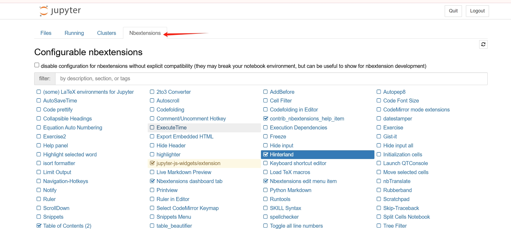

# 扩展

> https://github.com/ipython-contrib/jupyter_contrib_nbextensions

```shell
pip install jupyter_contrib_nbextensions
jupyter contrib nbextension install --user
```

## 扩展管理器

> https://github.com/Jupyter-contrib/jupyter_nbextensions_configurator


```shell
pip install jupyter_nbextensions_configurator
jupyter nbextensions_configurator enable --user  # can be skipped for notebook >=5.3
```



## 自动补全

[Hinterland](https://jupyter-contrib-nbextensions.readthedocs.io/en/latest/nbextensions/hinterland/README.html)


