> 本笔记整理自《UML精粹 第3版 标准对象建模语言简明指南》(UML Distilled)Martin Fowler著，徐家福译。**翻译非常拉跨，很不推荐。有条件读原版英文或其他翻译版本**。
> 
> 基于UML2.0

# 一 UML简介

Unified Modeling Language (UML)，统一建模语言，是一种图示法，可以用来表示和设计软件系统。

## 1.1 UML的常见使用场景

UML有两种使用场景和三种使用方式：正向工程和逆向工程，草图、蓝图和编程语言。

正向工程是在编码前绘制UML图，而逆向工程是根据现有的代码来绘制UML图。

|      | 正向工程        | 逆向工程    |
| ---- | ----------- | ------- |
| 草图   | 讨论设计问题，内容粗略 | 理解代码的逻辑 |
| 蓝图   | 作为开发模板，内容完备 | 作为文档    |
| 编程语言 | 用于自动化生成代码   | /       |

> **更加推荐用UML来做草图**
> 
> + 当用作正向工程的蓝图时，其实很难在设计时就确定好之后的开发细节的，这基本不可能；在开发过程中发现需要修改设计甚至需求，简直太常见了。
> 
> + 当用作逆向工程的蓝图时，这种图非常的臃肿庞大，有这时间直接去看代码就好，这种图画出来通常又费事儿又没用。
> 
> + 用作编程语言时，无所谓正向逆向工程，这样用需要一个好的可以用UML图生产代码的工具，目前还没啥成熟的。
> 
> + 当然其他的用法不是完全不好，根据场景因人而异，通常很少这么用。

## 1.2 用UML画草图

画草图的时候，重点是**取舍**，`less is more`。

在做正向工程的时候，要聚焦在接下来要马上做的部分，和重点想要讨论的设计，不要想把全部东西都画出来，不需要追求完备到每个细节，重点是方便交流。

在做逆向工程的时候，只画那些在深入到代码前值得讨论的东西，不需要把每个类画出来。

UML图有很多种类型，UML的标准中指明每种类型上会有一些成份的画法。但是不意味着这些成份的画法只能出现在这种类型的图上，也可以合法地画在其他类型的图上。标准只是指出了典型情况。

虽然UML有一套标准，但是我们在草图阶段使用UML的时候，不需要一定和标准保持一致，重点是和一起交流的人达成统一。

要特别注意，UML标准中规定了很多默认，但是UML还有一个通则：对一个特定的图来说，任何信息均可以被省略。所以对于任何一张陌生的UML图，如果有一个信息没有标注，那么不能对其做出推断，即使有规定默认值。

**一个有好的设计但是不合法的UML，远比合法但是设计垃圾的好。**

所以当你在画图的时候，有一些非UML的画法可以很好地说明你的设计，大胆地使用它们。总之，原则就是，**好用就用，不好用就不用**，别整那些虚头巴脑的自缚手脚。**UML图的目标是顺畅地沟通**。

## 1.3 UML图的种类

```
图
|--结构图
|    |--类图
|    |--构件图
|    |--复合结构图
|    |--部署图
|    |--对象图
|    |--包图
|
|--行为图
     |--活动图
     |--用例图
     |--状态图
     |--交互图
          |--时序图
          |--通信图
          |--交互改观图
          |--定时图
```

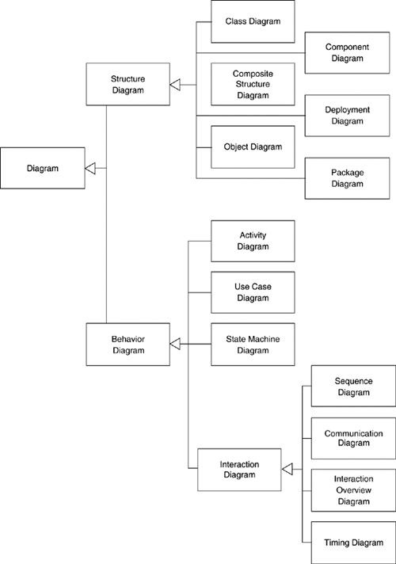

| Diagram              | Purpose                                           |
| -------------------- | ------------------------------------------------- |
| Activity             | Procedural and parallel behavior                  |
| Class                | Class, features, and relationships                |
| Communication        | Interaction between objects; emphasis on links    |
| Component            | Structure and connections of components           |
| Composite structure  | Runtime decomposition of a class                  |
| Deployment           | Deployment of artifacts to nodes                  |
| Interaction overview | Mix of sequence and activity diagram              |
| Object               | Example configurations of instances               |
| Package              | Compile-time hierarchic structure                 |
| Sequence             | Interaction between objects; emphasis on sequence |
| State machine        | How events change an object over its life         |
| Timing               | Interaction between objects; emphasis on timing   |
| Use case             | How users interact with a system                  |

# 二 开发过程

如何使用UML其实是与开发过程息息相关的，不同的开发过程中，使用UML的方式也不同。

## 2.1 瀑布过程和迭代过程

瀑布过程和迭代过程是最有代表性的两个开发过程，这也是软件过程相关争论里分歧最大的点。两者之间的本质区别在于，如何将一个项目过程进行分解。

假如有一个持续1年的项目：

瀑布过程是基于开发活动来分解的。为了完成一个项目，需要进行一些活动：需求分析、设计、编码以及测试等。那么就可能会分为2个月的需求分析阶段，4个月的设计阶段，3个月的编码阶段，3个月的测试阶段。

迭代过程是基于软件功能来分解的。如将整个系统的功能分成4块，每次3个月的迭代。在每次迭代里，取四分之一的需求，进行需求分析、设计、编码、测试。在第一个迭代结束后就已经有了一个实现四分之一功能的软件系统。

以上是一个简化的描述，实际过程中可以掺杂进很多别的过程和细节。

瀑布过程在两个阶段之间，通常会有一个阶段过渡的仪式，如完成需求文档，交付设计团队（也可能是同一批人），那么在设计阶段就不进行需求分析的工作了。但是这在实际中是不可能的，编码到一半的时候可能会遇到一些严重的问题，导致需要重新回去做需求分析和设计。要做的是尽可能的减少这种事情（但是不可能避免，仿佛墨菲定律一般）。

使用迭代过程时，在真正开始迭代开发前，需要有一个分析阶段，对软件的全部需求有一个整体的把握，好进行需求的分解。迭代过程也有很多五花八门的分支，细节有所不同。

采用纯瀑布过程去做的话，前两个月做完了需求分析，但是等半年后发现需求有问题，这样原本预留的时间很可能就不够了。所以不**推荐采用纯瀑布过程的方式去开发**。当然有一些混合模式，比如先用半年进行需求分析、设计，然后把编码和测试过程进行迭代，编码测试完一部分系统，再编码测试另一部分……

不过要注意的是，有很多人，说是自己在做迭代开发，其实还是在用瀑布过程。我觉得重点在于，每次迭代后的产物，是不是一个已经达到（或者非常接近）最终生产质量的软件系统。所以对于迭代过程来说，**不要允许有在项目结束时再调整的活动**。

### 时间框定法

迭代过程中有一种常用的技术：时间框定法。

让每次迭代的时间固定。如果在某次迭代里发现功能实现不完，那么就要搁置一些功能，并且**一定不能延期**。

通常搁置功能都比较困难，这种方法就会逼迫人们发现并学到什么是真正优先的功能。对于某次大型交付，对到底应该延期还是不实现一些功能，会做出更合适的判断。

迭代开发还有一个很重要的点：**项目后期的迭代中要重写并删除之前写的代码**。对于软件来说，重写代码要比给之前辣鸡的设计打补丁更靠谱。

## 2.2 制定开发计划

瀑布开发经久不衰的一个重要原因就是人们对于可预见性的渴望，但是事实上，开发一个新软件需要的时间和费用很难预计。

**预见性的计划**（predictive planning）是希望能在项目早期，对项目之后的进行有一个准确的估计，什么时候进行到哪一步，什么时候能搞完。

对于一个软件项目的开发过程来说，最大的问题出在，需求变化。可能是一开始需求指定的不精确，导致在开发过程中发现需求有误；也有可能是市场发生了变化，需求不得不跟着做出调整。一种观点是在需求分析的时候，尽可能地做得更为详细、精准，以减少需求变化。还有一种观点认为，对于大多数项目，需求变化是不可避免的，我们应该制定**适应性的计划**（adaptive planning）。

一般适应性的契约假定，客户和开发组合作，进行定期的功能评估，如果进展过慢，项目取消，客户按照变动范围来付钱。一开始约定预算多少，什么时候交付，但是一开始是规定不了最后要交付的软件功能的。

但是一般很少这么干，感觉不靠谱。但是，如果需求不精确，不要轻易制定预见性计划。

预见性计划用迭代和瀑布都可以做，适应性计划职能用迭代。

> 敏捷过程
> 
> 近年来敏捷过程特别火，它的主要思想是，开发软件最重要的因素是开发者的素质和能力。是面向人和适应性的。只要人牛逼，爱咋地咋地，爱用啥用啥。

## 2.3 过程适配项目

不同的软件项目差别可能会很大，而选择软件开发过程的方式取决于很多因素，所以我们要先考察项目，思考什么样的过程更适合这个项目。

在选定了一个过程或一些过程后，接着要思考为了让过程适配项目需要做哪些适应性的工作。不过大部分过程在实际使用前，其实很难对它做出正确的评价，这时往往应该先用它做两次小迭代试试。如果对要用的过程非常熟悉，可以直接开始使用并进行改良，通常是先根据自己的团队情况做一点小的改良，然后再做更大的改动。

在每次迭代结束后，一定要进行迭代回顾。重点在下面三点：

+ 保持的事情：已经做的不错的点，以后继续保持

+ 遇到的问题：工作得不太好的一些方面

+ 打算的尝试：之后要对过程进行的改良尝试

记得留存每次迭代回顾后形成的文档，这非常有用。在一个项目结束后，或者一次重要交付后，最好进行一次正式的大型项目回顾，以此学习经验。

## 2.4 UML 适配过程

### 2.4.1 需求分析

这个过程中可能有用的图有：

+ 用例图：描述人和系统的交互

+ 概念角度的类图：理解领域概念

+ 活动图：表名软件与人的活动交互的细节

+ 状态图：描述复杂概念的状态改变

这里要注意的是，重要的是和客户交流，少用图示法，不要让领域专家看不懂。否则除了臭显摆你会画两个图以外，没有任何好处，甚至会降低你们交流的效率和准确度。

【领域：我们开发的软件通常是要在别的领域使用的，如银行系统，是涉及到金融领域的。】

### 2.4.2 设计

+ 软件角度的类图：表明软件里的类和它们的关系

+ 常用用例的顺序图：一些重要的用例是如何交互的

+ 包图：软件的组织结构

+ 状态图：有复杂生命周期的类的状态图

+ 部署图：软件的物理布局，如何部署

人们在这里通常是画蓝图。但是蓝图很难正确无误。也可以先画草图，然后在某一部分决定要开发前，细化为蓝图。

### 2.4.3 文档

**设计**中的所有图都很适合留作文档。

不过文档里最好还是用草图画一些重点，更详细的东西应该阅读代码或者用代码生成的文档。文档不要搞特别多很复杂的图，不会有人会看的；应该只在关键和非常复杂的地方画图来说明。文档和图应该是在看代码前，一个纲领性的东西。

#### 重要：文档中一定应该有的是，有哪些设计我们未采用，并且说明理由。

### 2.4.4 理解旧代码时

关键结构的草图可以帮助你学习

+ 类图

+ 顺序图：看出多个对象在处理复杂方法时如何合作时，会非常有用

# 第三章 类图

类图是UML里用的最多的图。主要描述各个对象的类型以及它们之间存在的静态关系。类图也示明类中的属性、操作以及对象之间的约束。

**何时使用类图：**

类图是UML的支柱，所以一定是会使用类图的，但是注意：

+ 不要试图画出所有能画的东西，只需要画出必要的。

## 3.1 基本概念

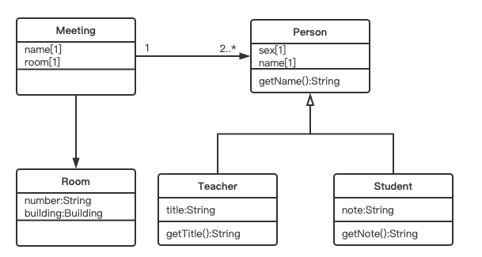

上图是个随手画的 会议 简单类图，里面有很多的省略，但是已经足够说明类图的一些基本概念了。

这个类图描述“会议”（Meeting）相关的一些关系：一个会议要在教室（Room）里开，会议有若干参与者（Person），参与者包括老师（Teacher）和学生（Student），由老师决定会议的主体，而学生要在会议上做笔记。

类图里的类是有3个框的长方块，第一个框写名字，第二个框里写类的属性和字段，第三个框里写类里的方法。在UML里，一切都可能省略，所以你也许会看到框里没东西，如Meeting和Room，也有可能看到只有2个框甚至只有1个框的图。

在Java里，一个类里会有若干的字段和若干的方法，如下面这个简单的类：

```java
public class Teacher {
    private String title;

    public String getTitle() {
        return this.title;
    }
}
```

UML将类里的字段称为`property`，也就是这里的`private String title`，将方法称为`operation`。`property`和`operation`统称`feature`。

> 这些词如果翻译过来会有点混乱，property和之后的attribute都可以翻译为属性，也有人译property为特性，并且在C#里这两个词的意义和这里又有些不同。而Java称为field，一般译为字段。所以之后我会尽量写英文单词，下面捎带一个翻译。
> 
> operation：操作/方法
> 
> feature：特征

### 3.1.1 property

UML里的`property`还被细分了2个概念：`attribute`和`association`。

> association：关联

先简单介绍一下两者的含义和区别，再来说具体的绘制细节。

在Meeting类和Person类上有一个连线，实线黑箭头，这个就是`association`，表示一个会议上可以有多人参加。看这么一段代码：

```java
public class Meeting {
  // 会议名称
  private String name;
  // 会议地点
  private Room room;
  // 参会者
  private List<Person> paticipators;
}
```

在这段Java代码里有3个字段，前两个在 会议简单类图 以`attribute`的形式画了出来，而参会者以`association`的形式画了出来。

所以说`attribute`和`association`在代码里其实是一回事儿，至于用哪种表示方法，取决于你是否需要强调这种关联关系。如果不强调，Meeting类完全可以画成这个样子：

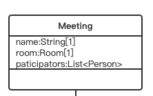

#### attribute：属性

`attribute`的写法是，在类框的第二个框里，写一行文字，完整的格式是：

```
可见性 名字:类型 重数 = 默认值 {特性字符串}
```

例如：

```uml
- name:String[1]="小明"{readOnly}
```

> + 可见性：可选的有：+-~#，+表示public，-表示private，-表示package，#表示protected。虽然提供了4种可见性，但是后两个通常意义不大
> + 名字：字段名
> + 类型：该字段的类型
> + 重数：详见下方
> + 默认值：创建对象时未赋值的属性的默认值
> + 特性字符串：一些附加特性，如这里的只读

> 注意，省略其他只有名字时，只写名称就可以了，如 `order`。
> 
> 如果省略其他只有类型时，要带上冒号，如`:Order。`

#### association：关联

所有的`attribute`都可以画成`association`，所有的`association`也都可以画成`attribute`。主要看是否需要画成`association`来强调什么。

箭头是由类指向它的字段。

#### 重数

重数是UML来表示关系模型的记号，常见的有：

> + 1（一个会议在一个教室里开）
> + 0..1（0或1）
> + *（一个会议可以有多个参会者，零或多）
> + m..n （m为下界，n为上界）

在重数里还有一些术语，但我觉得应该不常用……因为看上去就很复杂

> optional    下界为0
> 
> mandatory    下界为1或更大
> 
> single-valued    上界为1
> 
> multivalued    上界大于1

重数上也可以加一些特性字符串，如`{ordered}`来表示有序，`{nonunique}`来表示可重复，`{bag}`表示无序不唯一。

+ `attribute`默认重数是1，但是UML什么都可以省略，如果一个UML图没写重数，不能假定它是1。

#### attribute与get方法

以Java为例，如果一个类里有一个get方法，但是并不对应于一个字段，也是可以画作一个`attribute`的。如下方代码中的`orderAmount`：

```java
public class Order {
    private int goodsUnitPrice;   // 货物单价
    private int goodsQuantity;    // 货物数量

    public int getOrderAmount() {
        return this.goodsUnitPrice * this.goodsQuantity;
    }
}
```

+ 在面向对象的设计中，如果get方法返回的是一个集合，最好是返回只读集合，不要让其他对象随意修改集合内容。

#### bidirectional association 双向关联

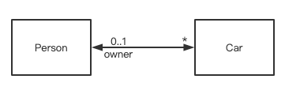

双向关联表示我既可以从车主对象获得他的车辆，也可以从车的对象获得车主。

这里用owner来表示两者的关联关系。还有一种画法，是用一个动词Owns来表示两者的关联关系，更为常见。

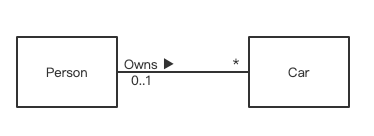

UML里在关联的两端都有箭头或者都没有箭头都表示双向关联。如果想要强调双向关联的话，双箭头会更直观。

在代码里实现双向关联需要注意双方的数据同步，以下是个模板实现方式（据说有很多代码生成器可以生产）。

```java
public Class Car {
    private Person owner;

  public Person getOwner() {
    return this.owner;
  }

  public void setOwner(Person person) {
    if(owner != null) {
      owner.getFriendCars().remove(this);
    }
    this.owner = person;
    if(owner != null) {
      owner.getFriendCars().add(this);
    }
  }
}
```

```java
public Class Person {
  private List<Car> cars = new ArrayList<>();

  public List<Car> getCars() {
    return Collections.unmodifiableList(cars);
  }

  public void addCar(Car arg) {
    arg.setOwner(this);
  }

  public List<Car> getFriendCars() {
    // should only be used by Car.Owner
    return this.cars;
  }
}
```

> 首先这种关系应该由其中一方来控制，通常选择属性为单值的一方，比如这里的Car，它的属性owner只有一个，然后在Car的setOwner方法去操作Person里的数据。Person这时候暴露了一个只在这种情况下要调用的方法getFriendCars，让Car可以直接操作Person里的数据。
> 
> （原书代码为C#，但我C#不太行……大概用Java意思了一下）

### 3.1.2 operation

`operation`是类可以执行的动作。基本上对应类中的方法。一般来说不需要写明get/set方法。

`operation`的写法是，在类框的第三个框里，写一行文字，完整的格式是：

```
可见性 名字(参数表):返回值类型 {特性字符串}
```

例如：

```uml
+ calSum(a:int, b:int):int
```

> + 可见性：可选的有：+-~#，+表示public，-表示private，-表示package，#表示protected。虽然提供了4种可见性，但是后两个通常意义不大
> + 名字：方法
> + 返回值类型：返回值的类型
> + 特性字符串：一些附加特性，后文会介绍
> + 参数表：参数的列表
>   + 参数按照类似attribute的方式给出
>   + 完整格式为：  `方向 名称:类型=默认值`
>     + 方向是指参数是`in`还是`out`或者`both`，不写默认是`in`

+ 画草图建立概念模型的时候，不要用`operation`来指明类的接口，应该写类的主要职责

#### query和modifier

这两个单词都可以作为`operation`的特性字符串，`query`是指不改变系统状态的操作（类似get，幂等），`modifier`指哪些改变系统状态的操作（类似set/put，非幂等）。不过这里的概念更接近幂等和非幂等，主要是指从系统的外部观察到的情况，而get/set方法相比就太微观了，是类内部的事情，用户从系统外部不一定能观察到。

#### operation和方法（method）的不同

准确的说，operation和方法不完全一样，比如有一个类有方法a，它有3个子类都override了这个方法，那么就有1个operation和4个方法。

### 3.1.3 泛化 generalization

对应到Java就是继承extends与实现implements。用空心的箭头表示。

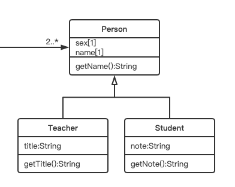

### 3.1.4 注释

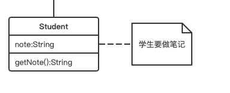

注释用折了一个角的方块表示。可以连一根虚线用来解释某一部分。也可以不连线放在一边。

### 3.1.5 依赖

如果改变一个东西（element），另一个东西会随之改变，那么就称两者之间存在依赖（dependency）。我们把前者称为supplier（主动改变的一方），后者称为client（被动改变的一方）。依赖是单向的，且不传递的。

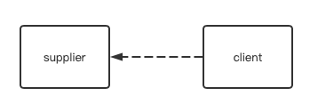

依赖是非常重要的事情，随着系统的越来越大，如果依赖关系很复杂，那么就会牵一发而动全身。所以一定要控制好系统的依赖。

对类来说，存在依赖的原因有很多：一个类和另一个类会通信；一个类的是另一个类的属性；一个类是另一个类方法的参数；继承关系里子类依赖父类……类上的依赖会非常复杂且繁琐，这是ok的。但是对于包这个层次，要尽可能的减少他们上面的依赖，并且不要出现循环的依赖。

UML定义了很多种依赖，有一些关键词（基词），非常多这里就不列了。一般直接画一道依赖，不用带关键词就已经可以说明问题了，如果想详细说明这个依赖的情况，再带上关键词。

**通过工具来分析现有代码的依赖，是非常有用的。**

#### 依赖不传递的说明

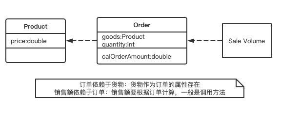

如果我将Product类的价格类型改为long，那么Order里计算订单价格的方法也要随之改变。但是只要Order对外的接口不变，那么计算Sale Volume的代码就不需要改变。所以Product和Order之间有依赖，Product的改变要导致Order代码的改变；但是由于依赖不会传递，Product的改变不会导致Sale Volume的代码需要修改。

### 3.1.6 约束规则

之前介绍的重数、泛化、关联等，都是为了说明类与类之间的约束关系，而通过这些方法还不够说明类之间复杂的约束关系。在UML里可以用两个大括号来说明约束关系。大括号里面的可以是任何语言，比如UML规定的谓词、编程语言，甚至自然语言。自然语言就是一个很好的选择，因为用那些谓词要确保你和看你的图都能理解。

格式：`{约束名:约束内容}`。比如说我可以在最开始的会议简单类图上加上一句`{校内会议：学生、老师必须是A大学的，教室必须位于A大学}`。

### 其他

本书在这里插入了一段`Design by Contract`，主要讲述如何加断言，同时讨论了一下有子类的情况下，子类只能加强不变式（invariant）和后置条件，只能减弱前置条件，但我认为这不太重要（因为我们根本不用……）

我觉得这里很重要点是：

当我定义了一个开根号的函数，要求$参数>=0$，那么谁来做这个校验。**这里一定要约定好！**核查过少会导致代码出问题；核查过多则会导致有很多重复核查的代码，显著增加程序的复杂性。

## 3.2 高级概念

### 3.2.1 关键词 Keywords

图示法有一个很大的问题在于，画图的人和读图的人都必须记住图上符号的含义。而有时候符号太多，很难记全。UML的做法是，减少图上的符号种类，改用一些keyword来补充说明。如果想表示一种建模关系，但是UML里没有，就可以用接近的UML符号，然后标一个keyword来说明。

比如说，UML里只定义了泛化的概念，在Java里抽象类和接口都是泛化，所以一般会在接口上标注`《interface》`。有的keyword会写成`{abstract}`。至于用书名号还是大括号，这都无所谓……这两个常见的缩写是：`《I》{A}`

UML里书名号是用于`stereotype`的，但是`stereotype`这个概念比较复杂，此处不表。

### 3.2.2 职责

有时候想描述一下类的功能或者职责。可以在类图框里的某一个框里用注释的形式写。如：`-- my responsibility`。可以给该框起名`Responsibilities`，但是没必要。

### 3.2.3 静态操作与静态属性 static

`attribute`或者`operation`带下划线

### 3.2.4 聚合与组合 aggregation & composition

组合和聚合都属于关联关系的一种，只是额外具有整体-部分的意义。至于是聚合还是组合，需要根据实际的业务需求来判断。可能相同超类和子类，在不同的业务场景，关联关系会发生变化。只看代码是无法区分聚合和组合的，具体是哪一种关系，只能从语义级别来区分。聚合关系中，整件不会拥有部件的生命周期，所以整件删除时，部件不会被删除。再者，多个整件可以共享同一个部件。组合关系中，整件拥有部件的生命周期，所以整件删除时，部件一定会跟着删除。而且，多个整件不可以同时共享同一个部件。这个区别可以用来区分某个关联关系到底是组合还是聚合。两个类生命周期不同步，则是聚合关系，生命周期同步就是组合关系。

UML里的聚合是下图，空心菱形。指的是整体与部分的关系，但是这个东西没意义，如果看见了需要仔细了解，也许是用法不一样。

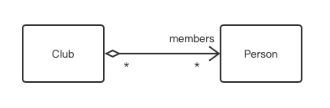

UML里的组合是这样的，实心菱形。

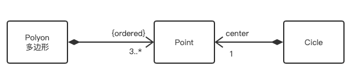

组合有一些特点：

+ 实例**排他**：点的一个实例可以是多边形的一部分，也可以是一个圆的圆心。但是一个实例只能是其中一种。
+ 删除多边形，多边形的点也应该删除。

### 3.2.5 导出特性 derived property

`attribute`上可以加一个`/`来表示这个字段是通过计算得出的。如：

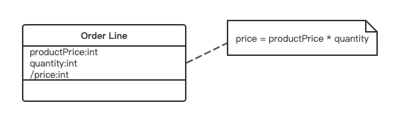

表示price可以由productPrice和quantity计算得到，通常是这么理解的。但是也可以理解成这表示三者的约束关系，至于谁是计算值谁是原始值不重要。

### 3.2.6 抽象方法和抽象字段

抽象方法或者抽象字段（比如只有get方法）可以用斜体写。斜体在白板上比较难写，也可以在后面加上`:{abstract}`

### 3.2.7 依赖接口与提供接口

如果类实现了一个接口，那么就是提供了一个接口 provides an interface。如果是需要调用别的接口，那么就需要一个接口 requires an interface，本质上就是一个依赖。

UML有3种方法表示这两种关系：

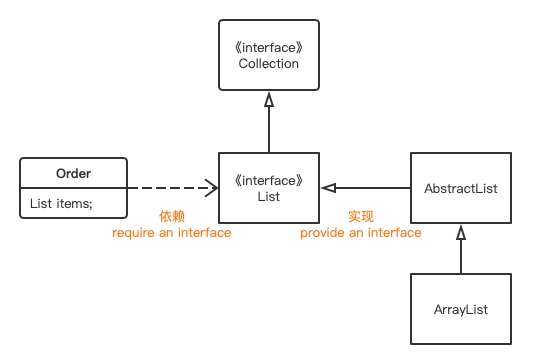

下面两种表示会更紧凑，接口用球来表示。

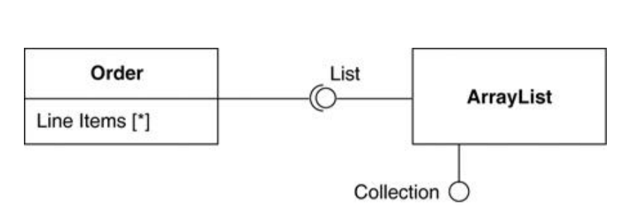

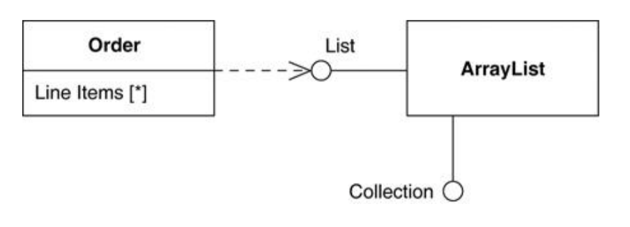

### 3.2.8 只读与冻结

`{readOnly}`表示只读。UML1里有个`{frozen}`，在类上用会比较好用，表示类所有的字段和方法都已经冻结，不再改变。

### 3.2.9 受限关联 qualified association

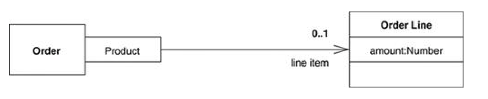

受限关联是描述Map关系的，如图是说，在一个订单里，对于某一种产品，只可能有1个订单行。对应到代码里可能是：

```java
public class Order {
  public OrderLine getOrderLine(Product product);
  public void addOrderLine(Product product, Long amount);
}
```

### 3.2.10 分类和泛化 classification & generalization

有人会将继承关系描述为“is a”关系，比如说之前的Teacher继承了Person类，可以理解成“Teacher is a Person”。但是这种思考方式并不准确，因为“is a”有时候代表的是分类关系，有时候代表的是泛化关系。

看下面这些句子：

1. Shep is a Border Collie.
2. A Border Collie is a Dog.
3. Dogs are Animals.
4. A Border Collie is a Breed.
5. Dog is a Sepecies.

> 1. Shep是一只牧羊犬。
> 2. 牧羊犬是一种犬。
> 3. 狗是动物。
> 4. 牧羊犬是一个属（生物概念：界门纲目科属种）。
> 5. 狗是一个种（生物概念：界门纲目科属种）。

组合这些句子，1和2组合可以得到：Shep is a Dog（Shep是一只狗）；2和3组合：A Border Collies are animals（牧羊犬是一种动物）；组合1、2、3：Shep is an animal（Shep是动物）；这些都没问题。但是组合1和4，Shep is a Breed（Shep是一个属）；组合2和5：A Border Collie is a Species（牧羊犬是一个种）；就有问题了。

问题在于，像1这种是一个分类`classification`，对象Shep是牧羊犬类型的一个实例；而2是一个泛化`generalization`，牧羊犬类型是犬类型的一个子类型。泛化可以传递，但是分类不行；分类后可以接泛化，但是反之不行。

UML的泛化符号（空心三角箭头）表示的是泛化，如果要表达分类，可以用带关键词`《instantiate》`的依赖。

### 3.2.11 多重分类与动态分类 Multiple and Dynamic Classification

分类是指对象和类型之间的关系，主流编程语言都是假定的一个对象只属于一个类。但是还有其他分类情形。

在单一分类的情况下（single classification），一个对象只属于一个单一的类，当然这个类还可能继承了别的类；在多重分类的情况下（multiple classification），一个对象可能有多个类型，这些类型不一定都是用继承关系来表示。

注意多重分类不是多重继承（multiple inheritance）。多重继承是说一个类可以继承多个类，但是一个对象只能是一个类型的实例；多重分类是允许一个对象有多种类型，不需要根据多种类型的组合情况去定义很多的细分的类。

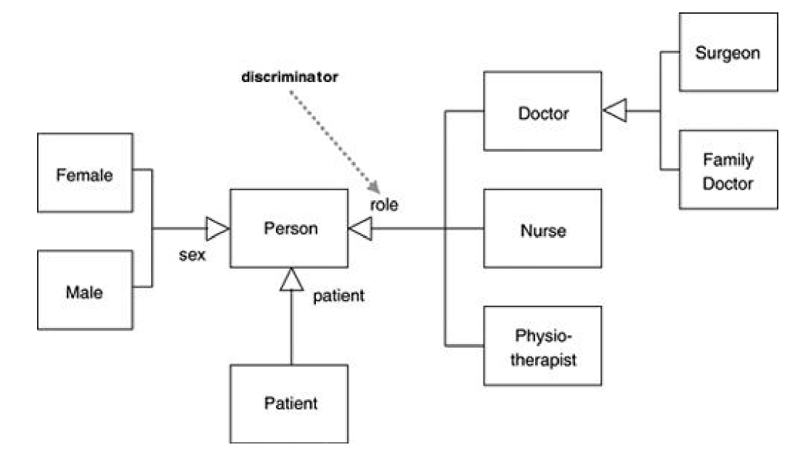

考察上图的情况，Person类有子类型，Female/Male，Patient，Doctor/Nurse/Physiotherapist。多重分类允许一个对象同时具有所有合法的类型组合。

可以看到Doctor/Nurse/Physiotherapist这三个类型的泛化关系公用了同一个泛化箭头，并且在箭头上有个一个名字。他们三者就共同组成了一个泛化集（generalization set）。默认情况下，同一个泛化集中只能选取一个类型，所以一个Person对象可以是（Male，Nurse）（男护士），但不能是（Male，Doctor，Nurse）。

还有一个问题在于，对象能不能修改类的信息。比如说当一个银行卡账户已透支，这个对象能否override它的提款等方法。如果对象可以修改类的信息，就是动态分类（dynamic classification）；如果不能就是静态分类（static classification），静态分类要将类型和状态分开。

多重分类在对概念建模的时候是有用的，但是大多数语言都不支持这种实现，所以一般默认都是单一静态分类。

### 3.2.12 关联类 association class

关联类可以对关联添加属性、操作等。如图所示，一个人可以参加多个会议，那么可以添加一个关联类“参加 attendence”，里面有个attribution“专注度 attentiveness”。

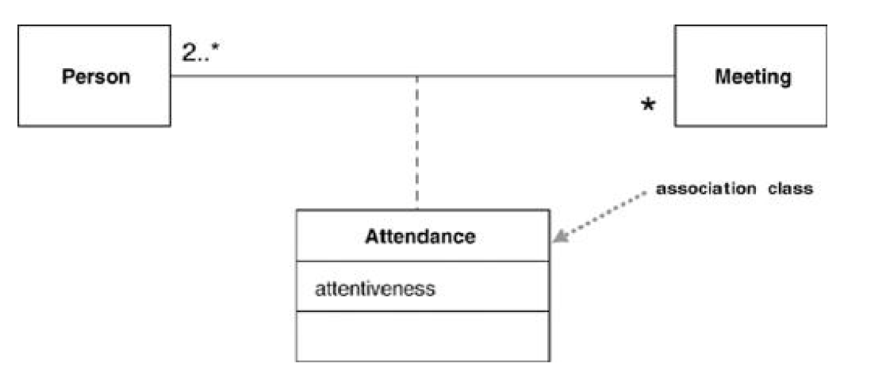

这个图还有一种画法：

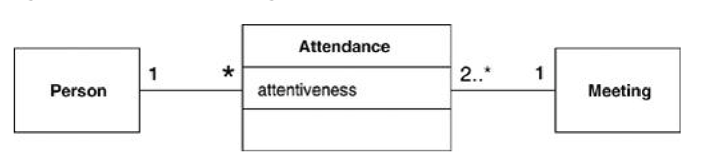

这时 attendence 作为一个独立的类，这时候要注意他们之间的重数关系。

关联类有一个隐含的约束，就是对于关联类两边的两个类来说，他们的两个对象之间只能有一个关联类的实例。比如说对于一个Person对象和一个Meeting对象，他们之间只能有一个Attendance的实例。如果不满足这个关系，如下图，一个公司在一个合同里如果可以同时存在多个角色，那么就不应该使用关联类，所以在这种情况下，下图是非法的，应该将Role类作为一个独立的类去画。

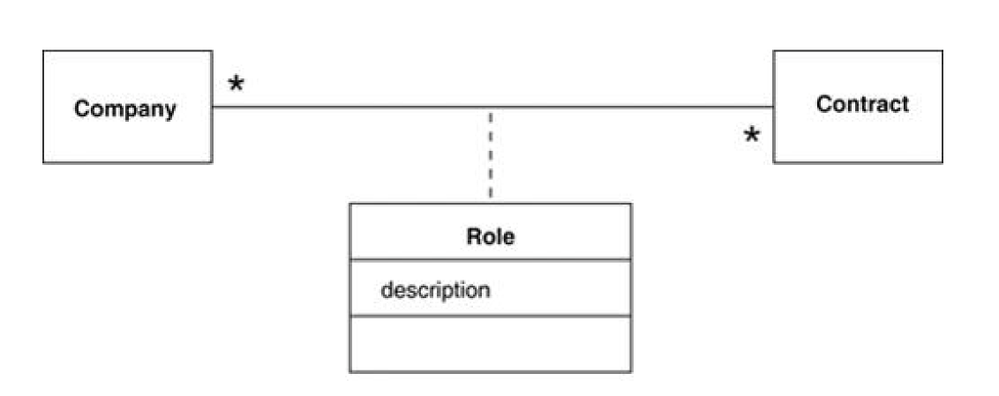

有的时候会有一些带有时间因素的关联。如下图所示，一个人在某一段时间只能被一家公司雇佣，但是在一个比较长的时间跨度里，他可能在多家公司任职过。下图并不能很好的说明这个特点，甚至可能造成一些不必要的误解。

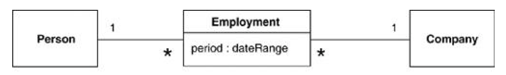

可以在人和公司的关联上加上一个关键词《temporal》来描述这个关系。《temporal》并非UML标准中定义的关键词，但我们可以像下图这样，在需要的时候自己定义一些关键词。

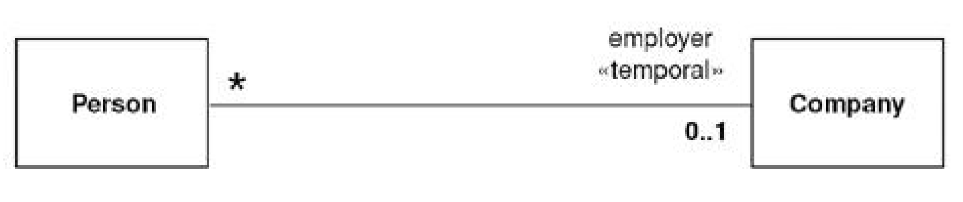

它可以对应这么一段代码：

```java
public class Person {
  public Company getEmployer();    // 获取当前工作的公司
  public Company getEmployer(Date date);    // 获取date时候工作的公司
  public void changeEmployer(Company newEmployer, Date changeDate); // 换公司
  public void leaveEmployer(Date changeDate);    // 离职
}
```

### 3.2.13 模板类 Template(Parameterized) Class

C++里叫做Parameterized Class，Java里叫泛型。如

```java
public class Set<T> {
  void insert(T newElement);
  ...
}
```

UML用下图来表示：

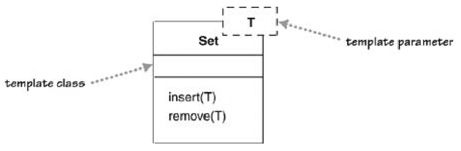

模板类使用的时候要指定泛型，例如`Set<Long>`，UML里称为一个导出`derivation`。可以有两种方法来表示。第一种方法是用C++的语法，用`<泛型名::实际类型>`来表示，如果只有一个泛型，通常省略。

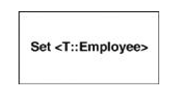

另一种方法如下图所示，还可以对derivation重新命名为EmployeeSet。这里的关键词《bind》是一个描述`refinement`关系的`stereotype`。表示EmployeeSet和Set的接口完全一致，并且不允许增添新的字段或者方法。

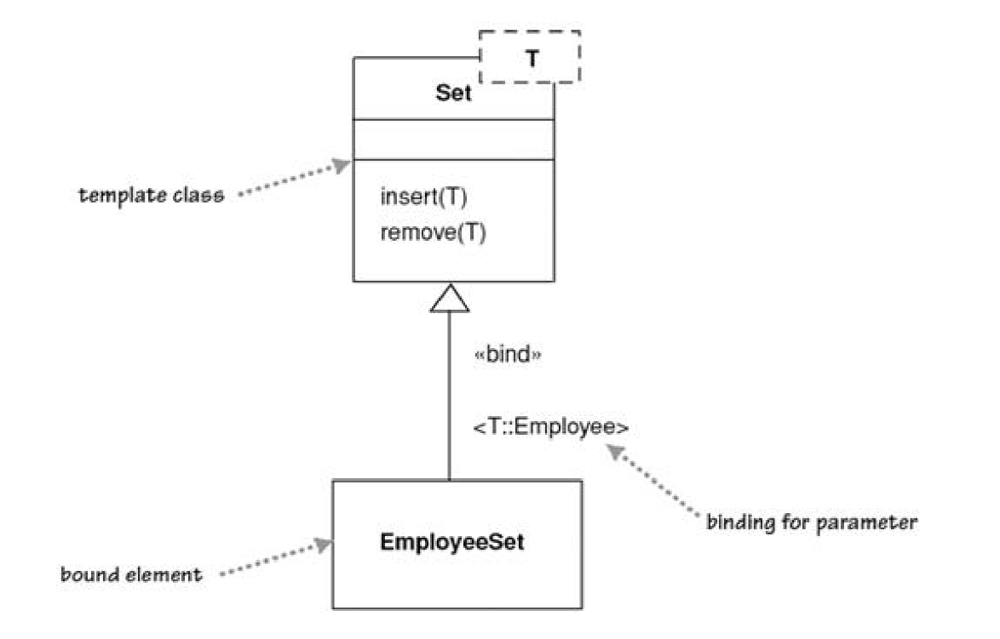

### 3.2.14 枚举

用带有关键词《enumeration》的类来表示枚举类。

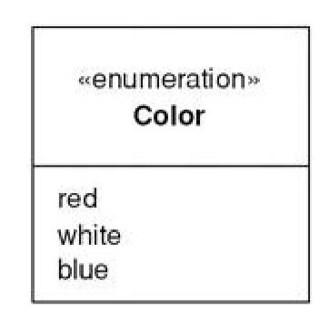

### 3.2.15 主动类 active class

主动类的每个实例有自己的线程。典型的例子就是命令行，在命令行对象内有线程执行别的任务。

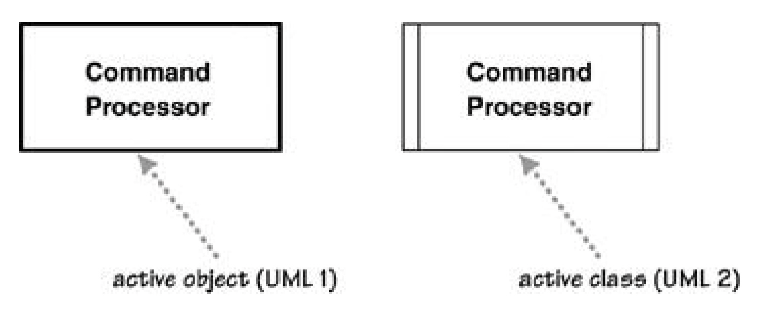

### 3.2.16 消息

UML标准里的类图是没有消息的。但是有时候为了方便也可以加上箭头来说明类之间消息的传递。

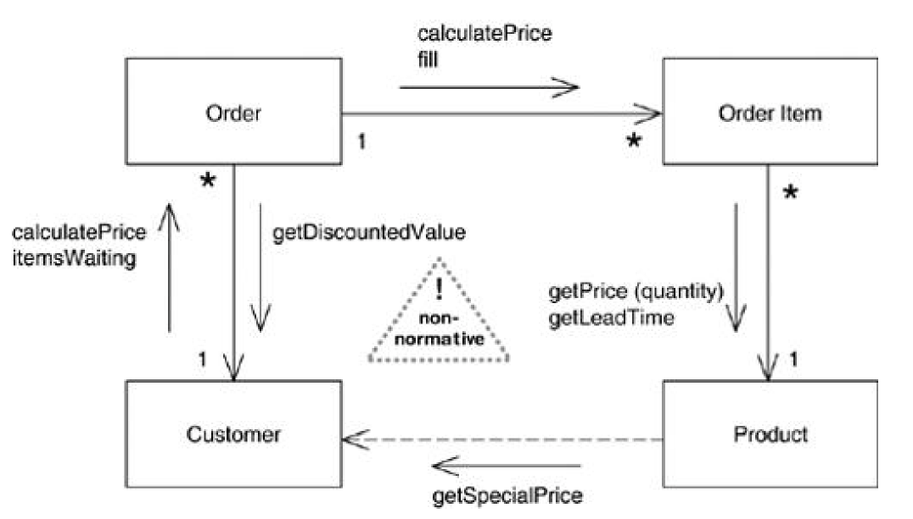

# 第四章 顺序图

顺序图表示一些对象在一次use case里如何交互。顺序图是十分容易理解的。

下图表示了计算一个订单的价格过程中各个对象的交互。

> 订单大概长这个样子：
> 
> 订单A：
> 羊肉串，5个
> 鸡翅，10个
> 烤土豆，3个
> 烤面包，2个
> 
> 订单中的每一项称作 order line，如“羊肉串，5个”是一个 order line

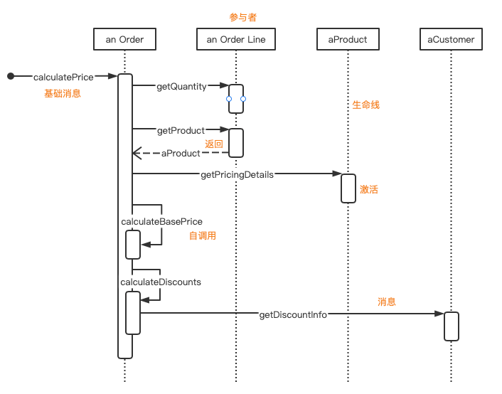

这张图还有一些问题，比如getQuantity、getProduct这些方法对于每一个 order line 都要调用1次，而calculateDiscounts这个方法整个订单只需要调用1次，从这个图上是无法看出这一点的。之后会有一些其他的符号来表示这一点，但是这其实不是顺序图主要想说明的问题。**顺序图不擅长表明像循环、条件分支这种算法细节，它主要用在清晰地支出参与者的交互方式。**

这里的参与者不仅仅可以是某个对象，可以根据需要选择。上图的 an Order 是省略了类型的写法，也可以写完整如 `an Order : Order`。

每个对象下方的垂线叫做生命线（lifeline）。线上的黑框叫做激活框（activation），表示该对象何时参与到这个use case中，可以不画，但是画上更好看。图中的命名应该有对应关系，如`getProduct`的返回就是`aProduct`。返回可以不画，除非必要。最开始的消息并不是参与者（participant）发送的，这个叫做基础消息（found message）。

### **另一种设计**

计算价格这个 use case 还有另一种设计，如图。可以看到，上一张图是由 an Order 来计算所有的价格，其他各个对象只能为 an Order 提供数据。而这张图里， an Order 要求每个 an Order Line 计算好自己的价格，然后 an Order Line 将数量作为参数，给了 aProduct，由 aProduct 计算出了每个 order line 的价格。最后优惠后的订单价格则是由 aCustomer 来完成计算的。

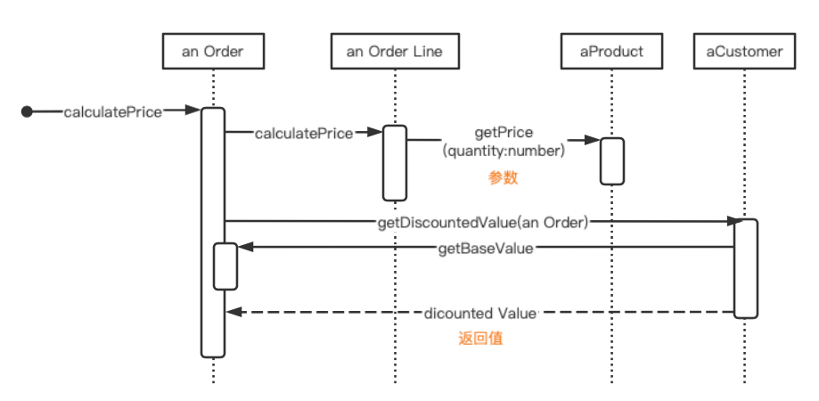

前者是集中式控制，由一个对象来负责处理所有事情，其他对象提供数据；而后者是分布式控制，处理会分摊给各个参与者，每个人负责一部分。集中式控制编写相对简单，因为所有的处理代码都写在Order里就好了，而后者的代码会分散在各个类里。

但是我们更推荐用分布式控制，虽然这有点难。理由主要有2点：

1. 一个好的设计应该使变动的影响很小。数据和处理数据的代码放在同一个地方，更符合面向对象的设计。这样便于修改。
2. 使用分布式控制可以方便的使用多态。如果Product要发生一些改变，那么可以直接换个一个Product的子类来实现。

### 参与者的创建和删除

顺序图可以显式的画出某个参与者的创建与删除，如图。

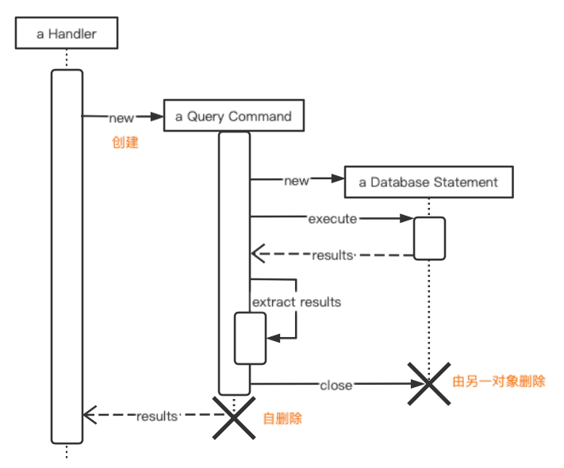

创建的时候可以不写new，但是写上挺好。Java有垃圾回收，不需要我们来删除对象，但是用X指出何时不再需要这个对象，并且准备回收，也是有价值的。

### 循环、条件等

UML标准里的循环和条件，可以用下图所示的方式表示，但是我觉得这个很丑很乱。不如用下面那个。

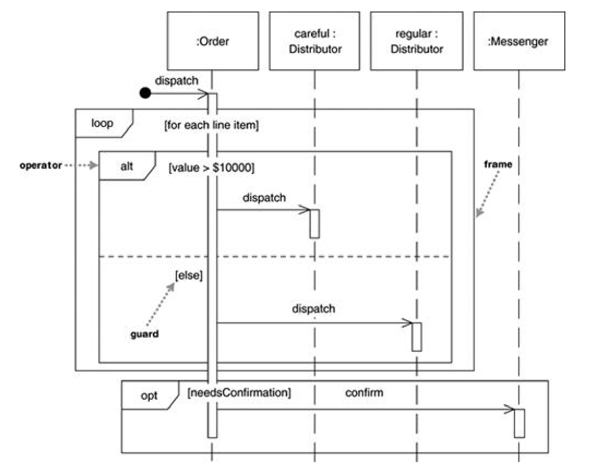

下图是个不符合标准的图，但是能更好地说明一些问题，而且看上去更干净。

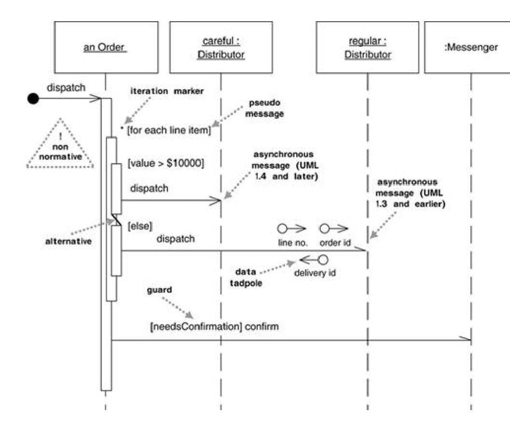

图1无法显式说明 if else 的两个条件互斥。图2在循环上和条件上有一个伪消息框（pseudo message），也可以涂成灰色强调这个是个伪消息，并不是一个真实的调用。数据蝌蚪（data tadpole）可以方便的指出数据的移动，虽然这不是UML的内容。

### 同步调用和异步调用

在上面那个不符合标准的图里有个小细节，在UML2里用实心的箭头表示同步调用，用普通的箭头表示异步消息。但是这非常不起眼，之前是用半个箭头表示异步消息的，这个更突出一点。

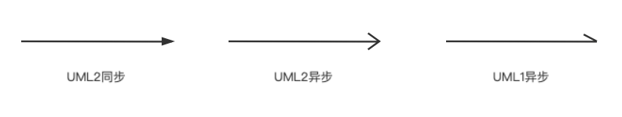

# 第五章 对象图/实例图 Object Diagram/Instance Diagram

对象图是描述某个时间点上系统中各个对象的关系。对象的名称表示为：`对象名:类名`，两部分都可以省略。

下面两个图第一个是一个类图，第二个是其对应的对象图。

我觉得这里的Party不是很好理解，我不太懂这个Party的含义究竟是什么，最接近的意思应该是党派？但是还是觉得怪怪的。

Person（人）和Organization（组织）都继承自Party，继承了字段location。同时类图上有个约束，表示Organization可以作为Party的父级，这个类似于文件夹和文件的关系。Organization下可以有Organization或者Person，但是Person一定是最底层的。

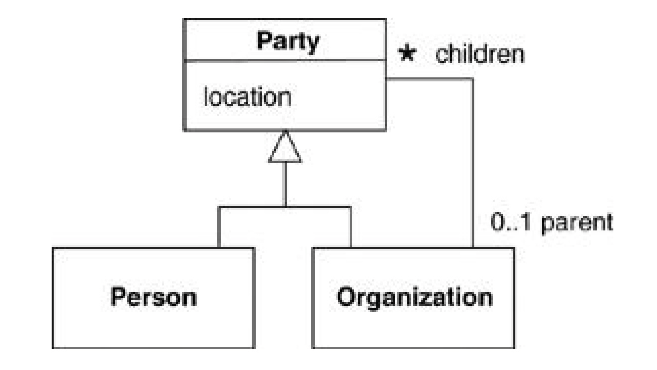

在对象图上，可以示明属性的值和连接的值。

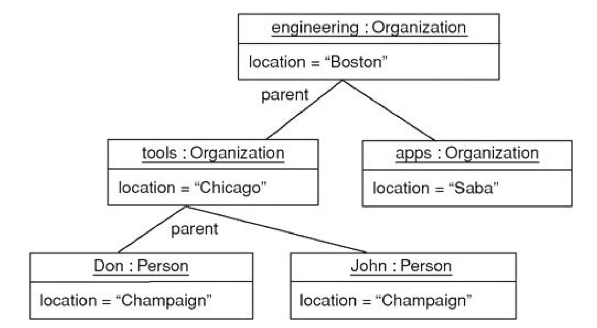

# 第六章 包图

类图十分有用，但是在表示拥有上百个类的大型系统时，就需要包图了。包图表示的是编译时的聚组机制。

将UML里的任意元素合并成一组，叫做一个包。通常的做法是将一堆类合并成一个包。包名用双冒号隔开，如`Lemon::Util::Date`。包图是用有一个小耳朵的框来表示的。

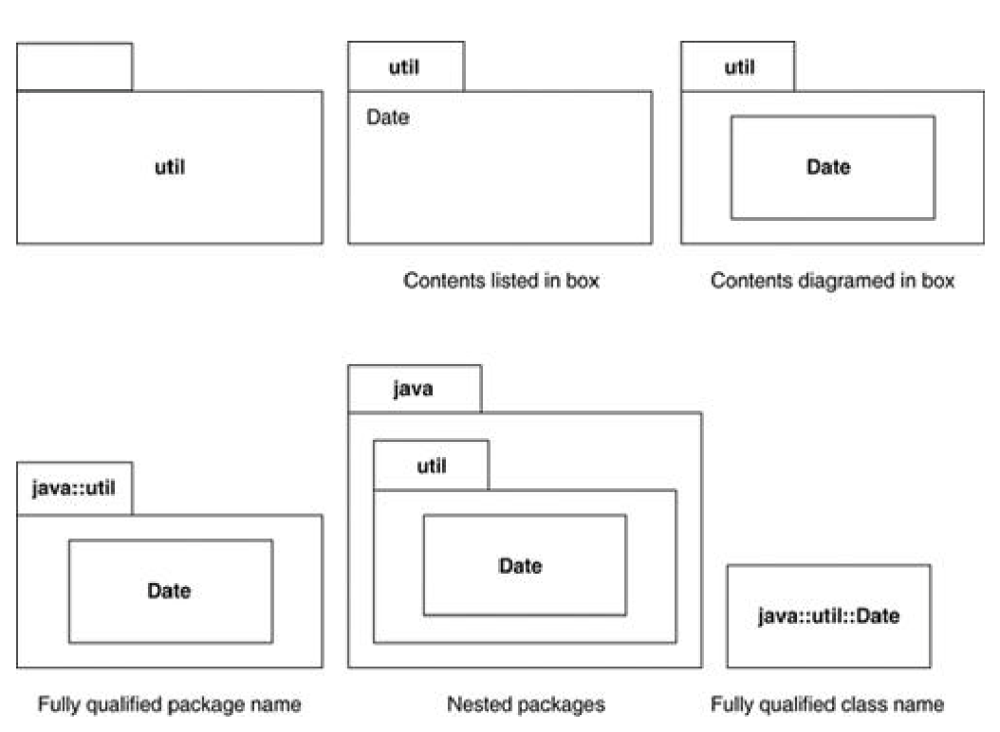

上面6张图，第一张包图里写了包的名字；第二张里列出了包里的内容；第三张则是在包里绘制了内容的图；第四张则是写了包的全限定名；第五张包图里嵌套了包图；第六张是Date类的全限定类名的类图。

包里面的类可能是public的，也可能是private的。public的类对别的包可见，private的类只对自己包可见；这个规则会随着编程语言的不同而不同，应该遵循编程语言的习惯。

这里有个非常有用的技巧。将包里所有的类都设为private，然后设置一些额外的类来暴露出那些需要暴露给别的包的接口，这些额外的类叫做虚包类。

应该把哪些类放在哪些包里，是一个非常难以处理的问题，有两个原则可能会游泳：共同封闭原则（Common Closure Principle）、共同复用原则（Common Reuse Principe）。共同封闭原则是说，一个包里的类应该根据相似的原因改变。共同复用原则是说，一个包里的类应该一起被复用。聚类成包通常都是和包之间的依赖有关，接下来会讨论这个问题。

## 包与依赖

包图上可以绘制出包及其依赖。在大型系统上绘制出其包图对理解大型系统非常有用，理想情况下，应该直接根据代码本身生成。好的包图应该有清晰的依赖流程，下图就是有一个结构良好且流程清晰的包图。leasing是租赁的意思，asset是资产。这里的依赖流程大部分都是单向的，除了leasing data mapper，这里是一个Mapper设计模式。

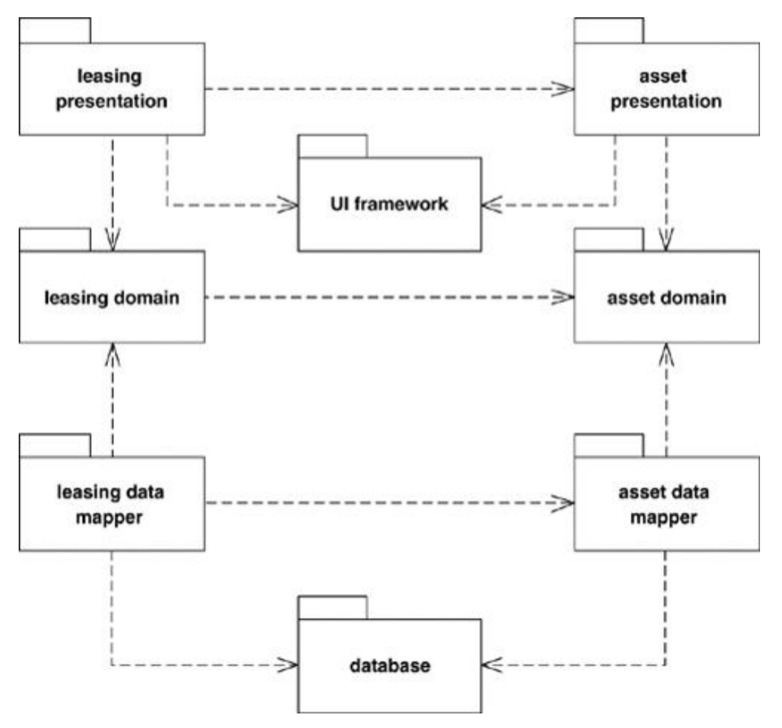

有很多人认为依赖中不应该有循环，Martin则认为可以有循环，但是循环应该局部化。

包的依赖越多，这个包就应该需要更稳定，因为这个包的一点变动都会波及到它依赖的所有包（稳定依赖原则 Stable Dependencies Principe）。同时，根据稳定抽象原则（Stable Abstraction Principe），有更高比例的接口和抽象类的包更稳定。

## 包面 Package Aspects

仔细考察上图，上图其实有2个结构。一个是应用中的层次结构：persentation、domain、mapper、database。一个是业务结构：leasing、asset。可以将这两部分分开，画成下面这样的图，有时候很有用：

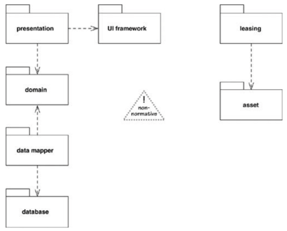

这样可以清晰的看出这2个结构，但是这两个切面都不是真正的包，无法给某个包放入类。

## 实现包 Implementing Packages

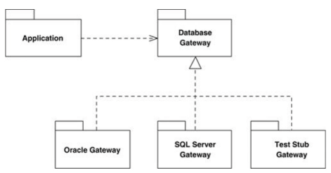

可以像图中的Database Gateway一样，该包只定义接口，而具体的实现由其他包来完成。

# 第七章 部署图

部署图展示了软件在硬件上部署的情况。

`node`表示可以作为软件宿主的东西。

`node`可以有`device`（硬件），也可以有`execution environment`（软件，执行环境，如操作系统）。

`node`里有一些`artifact`，是软件的物理体现，通常是可执行文件、数据文件、配置文件等。`artifact`可以直接写在`node`里，如`herculesClient.exe`。也可以写成一个类框，如`JoveGL.exe`，写成类框的时候要写上关键词《artifact》或者画个文档符号。

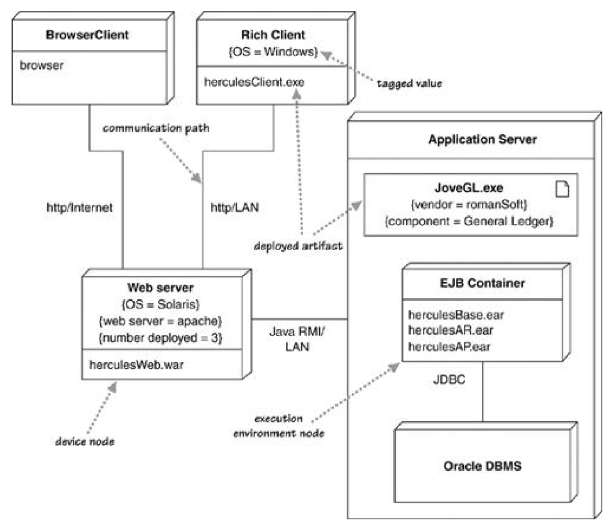

# 第八章 用例 Use Cases

用例是描述用户和软件系统之间的交互的。是用来获取系统功能需求的。

在介绍用例前，我们先看一个场景（scenario）。场景是对用户和系统之间一次交互的步骤的描述。例如一个用户“购物”的场景：

*客户在浏览了目录，并向购物车里添加了一些要买的商品。当客户付款时，填写送货地址和银行卡信息，并对此进行确认。系统核查银行卡许可后对这笔订单进行确认，并给用户发一份电子邮件。*

这一场景还可能出现其他情况，比如核查银行卡许可时可能失败（场景2），也许这个客户是个常客，不需要提供送货地址和银行卡信息（场景3）。这样场景细节不同，但是有一点是相同的，就是用户的目标都是“购物”。用户操作不一定成功，但是目标却一直不变。

**一个用例就是由一个共同的用户目标联系起来的一组场景。**

用例里将客户称为参与者（actor）。参与者是客户相对于软件系统而言扮演的角色，一名参与者可以参与很多的用例，一个用例也可以有多个参与者。

UML里的用例图用来描述用例之间的关联，不过对于用例来说，其**几乎全部价值都在于用例的内容**，图的价值不大。

## 用例的内容

用例内容没有标准格式。下面给出一种常见的样式。先从各个场景里选出一个作为主成功场景（main success scenario），用一列带编号的步骤来描述。然后在主成功场景后，用一些变形来描述其他场景（extension,，扩展），其他场景可以是成功的，也可以是失败的。

> 购物
> 
> 级别：海级
> 
> 主成功场景（MSS）：
> 
> 1. 客户<u>浏览目录并选择要买的东西</u>
> 2. 客户去结账
> 3. 客户填写收货地址
> 4. 系统给出包括运费在内的全部价格信息
> 5. 客户填写银行卡信息
> 6. 系统核定银行卡许可
> 7. 系统确认订单
> 8. 系统向客户发送电子邮件
> 
> 扩展：
> 
> 3a：客户时常客
> 
> ​    .1：系统显示默认的收货地址，展示全部价格信息
> 
> ​    .2：用户可以接受或修改默认信息，返回到MSS的第6步
> 
> 6a：系统核定银行卡许可失败
> ​    .1：客户可以再输入银行卡信息或取消

被用例满足目标的用户称为主参与者，通常是用例的发起人，在用例里也可以有别的参与者与系统交互，称为次参与者（secondary actor）。用例的每一个步骤是一句对**参与者意图**的简单描述，要指明参与者，并且注意是参与者的意图，不是进行的技术内容。用例中不会出现系统的具体接口，通常都是在设计接口前编写用例。

在扩展部分，先对别的情况进行命名，简要说明它和主成功场景（MSS）中的不同点，然后是一些带编号的步骤，最后以在何处返回到（如果需要的话）MSS来结束一个扩展场景。

应该在一开始就尽可能地考虑到不同的各种场景，这里非常有用的一个方法是，对MSS的每一个步骤都思考：这一步骤有没有其他不同的执行方式？特别是这一步会不会失败？

用例里的某些复杂的步骤可能是另一个用例，在UML标准里，我们称为一个用例包含（includes）另一个用例。没有标准的方法在用例里体现这种关系，比较常用的方法是用超链接（或者单纯的下划线）来表示，如“购物”用例里的第一步，“浏览目录并选择要买的东西”。

如果一个用例多次重复出现，或者会让主用例逻辑变得混乱，可以考虑把它抽成一个独立用例，让主用例包含它；否则不要把时间放在把用例分解成子用例、子子用例上，这样除了浪费时间没有任何意义。

除了场景的各个步骤外，用例里还可以添加一些常用信息：

+ 前置条件（pre-condition）：在系统执行用例前，确保为真的条件。告诉编程人员在代码里无需校验。
+ 保证（guarantee）：用例结束后，系统要保证的事情。一般很少有在所有场景下都要成立的保证，通常是写一些成功情况下的保证。
+ 引发装置（trigger）：启动用例的事件

注意对于用例来说，应该做到简明易读，写的过少要比写的过多更好。详细的长用例通常会很难读，甚至会描述不清目的。

用例描述的细节程度取决于读用例时的歧义程度。通常在一开始，只需要对少量关键步骤添加细节，其他的可以在实现之前再添加。而且无需写下所有的细节，口头通信也非常有效。

## 用例图

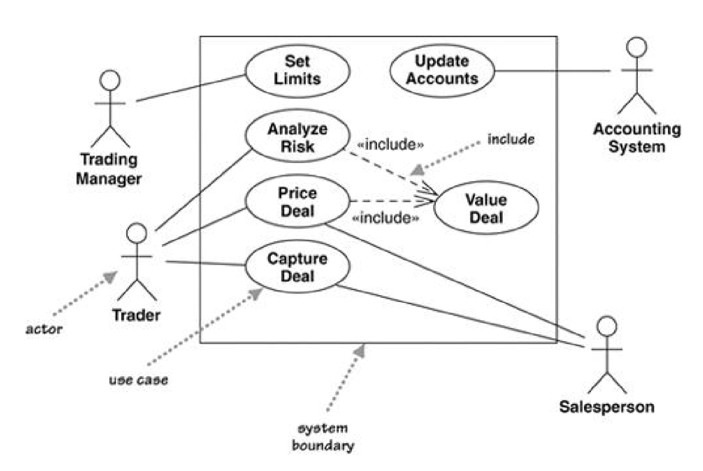

图示为UML标准定义的用例图，这种图有时候会有用。在用例阶段，应该集中关注于用例内容，不必过多的致力于图。

用例图可以理解成用例集合的图表，表明了哪些参与者参与什么用例、什么用例包含别的用例。

## 用例级别

针对用例有一个很普遍的问题是：太过于注重用户和系统的交互，而忽略了，解决问题的最佳办法其实是改动一下业务流程。

人们有时候用系统用例（system use case）和业务用例（business use case）来讨论用例。系统用例指与软件的交互，业务用例指业务如何响应客户或者事件。但是这种描述并不准确。

Cockburn提出了一种用例级别的框架。将用例定义为海级（sea-level）、鱼级（fish-level）、风筝级（kite-level）。海级用例是最核心的用例，表示主参与者与系统之间的一次离散交互。如果用例里包含了海级用例的，是鱼级用例。最高的是风筝级，风筝级描述了海级用例如何和更广的业务进行交互。风筝级用例通常是业务用例，海级和鱼级是系统用例。

## 注意

用例是了解系统功能需求的一种工具。在早期先生成一版用例，更详细的版本应该在开发那个用例之前再完善。

要注意的是，用例是描述系统与外部的交互，所以不要在用例里与系统内部的各个类有联系。

用例的全部价值在于其正文内容。

用例不应该复杂。做的太复杂会难以阅读、难以理解；而当你做的很少时，至少还可以当做一个简略文档，后续以此对细节展开、提问、讨论。

# 第九章 状态图/状态机图 State Machine Diagrams

状态图用来展现一个对象的生命周期。

Martin在书里写了这么一个例子。

> 古老的中世纪，在一座哥特式城堡里，城堡的主人将贵重物品放在一个隐秘的保险箱里。保险箱的锁，必须在门关闭的时候，移开烛台上的蜡烛才能看到。看到锁之后，就可以把钥匙插入锁中。但是为了更加安全起见，还需要把蜡烛放回原处才可以安全地打开保险箱，否则就会有一个怪物出现吃掉开锁人。

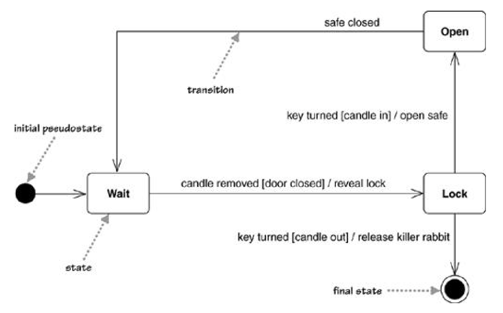

我们用一个控制器类来实现上述的这个安全系统，上图就是这个控制器类的状态图。

状态图以该控制器对象创建的状态开始，这里是Wait状态。图上有个初始伪态（initial pseudostate）指向Wait状态；初始伪态并不是一个真正的状态，表示对象在初始化过程中（也可以说之前，主要作用就是指出真正初始化时的状态）。

从图上可以看出来，控制器可以有三种状态：Wait、Lock、Open。这个图也用连接各个状态的箭头给出了状态改变的规则，我们把这些规则叫做转接（transition）。

转接表示的是一个状态到另一个状态的改变，在每一个转接上都有一个由三部分组成的标记：`触发事件 [条件] / 活动`（`trigger-signature [guard]/activity`）。这三部分都是任选的，需要的话可以省略其中一部分。触发事件通常是一个单一事件，也可以包含多个事件和参数，它引发了状态的改变；监护是一个布尔条件，只有为真时才会发送状态改变；活动是转接中执行的行为。

在某一个状态下发生了某一事件，只能引发一次转接；如果想以同一事件引发多次转接，监护就必须互斥，如Lock状态下的两个转接。

如果发生某些事件而没有转接发生，就可以略去这些时间，比如在Wait状态时，在门敞开的情况下移开蜡烛。

终态表示状态机完成，即控制器对象的删除。比如有人不小心落入了开锁时的陷阱，控制器对象终止，于是我将把兔子怪物关在笼子里，擦干净地板，重新启动系统。

注意，状态机只能示明对象直接观察的或激活的。像在保险箱打开的情况下往里面放些东西或者拿走什么，这些不能放在状态图里，因为控制器是无法识别这些的。

一般开发人员在讨论对象的时候，通常会认为对象的状态是对象字段全部可能数据的各种组合。但是状态机图里的状态是更为抽象的状态概念。从本质上说，不同的状态意味着对事件不同的反应方式。

## 内部活动 Internal Activitites

状态可以通过内部活动来对事件做出响应。直接在状态框里写`触发事件 [条件] / 活动`。内部活动有点像是指向自己的一个转接（自转接），但是还是有一点区别，在下面会说。

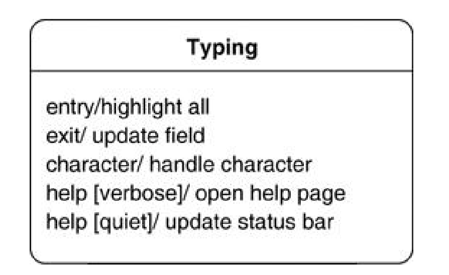

上图展示了一个有内部活动的状态，有字符事件（character/handle character）和帮助事件（help[...]/...），这些按钮一般会在UI的text里。

> character/handle character：可以理解为，在软件菜单栏里有一个字体按钮，点一下就可以修改字体的信息
> 
> help：help按钮按下的时候，如果是verbose（详情）状态，就打开帮助页，如果是quiet状态，就更新状态栏

在这里面还有2个特殊的活动，entry和exit，进入和退出。entry只在进入一个状态时触发；exit只在离开一个活动时触发；这两个都不会因为内部活动触发。这就是内部活动和自转接的区别，内部活动不能触发entry和exit活动，但是自转接可以。

## 活动状态 Activity States

之前提到状态下，对象在遇到事件前都是静止的。但是也可以有一些状态，在这些状态下，对象一直在持续进行某项工作。

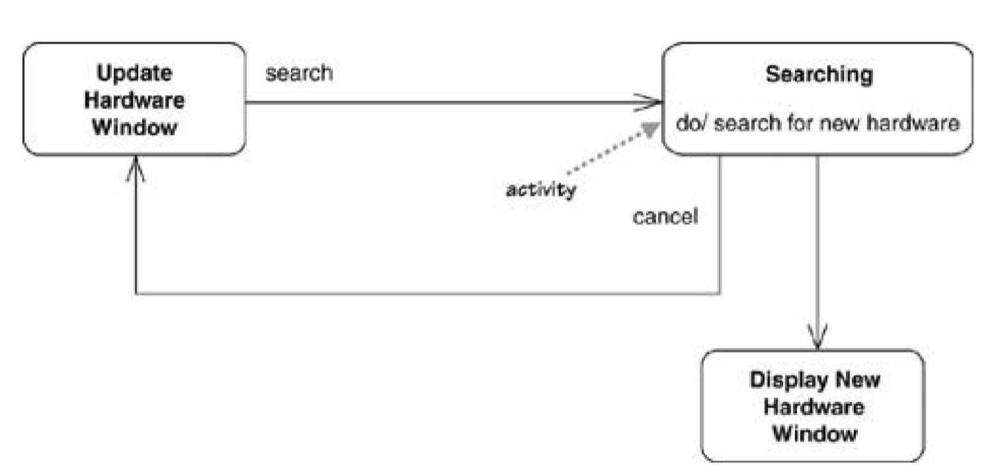

上图中的`Searching`状态就是这样一个活动状态（activity state）。在活动`search for new hardware`前面加上`do/`，因此又称为进行活动（do-activity）。一旦搜索完成，找到了新的硬件，就进行无触发事件的转接：显示新硬件窗口。如果在活动状态中发生了取消事件（cancel），则回到更新硬件窗口状态（Update Hardware Window）。

进行活动和普通的活动都表示实施某一行为。二者的主要区别在于：普通活动“瞬时”出现并且不能由正常事件终端。“瞬时”的含义会随系统而异，硬件实时系统可以是少许机器指令执行时间，桌面软件可以是几秒钟。

UML1里将普通的活动称为action，activity一词只用于进行活动。

## 超态 Superstates

有时候会出现这种情况，有几个状态都有相同的转接和内部活动。这个时候就可以把他们作为子状态，然后在外面套一个超态，将共同行为放在超态上。如下图所示，如果没有超态，就需要给`Enter Connection Details`里的三个状态都画一条`cancel`转接。

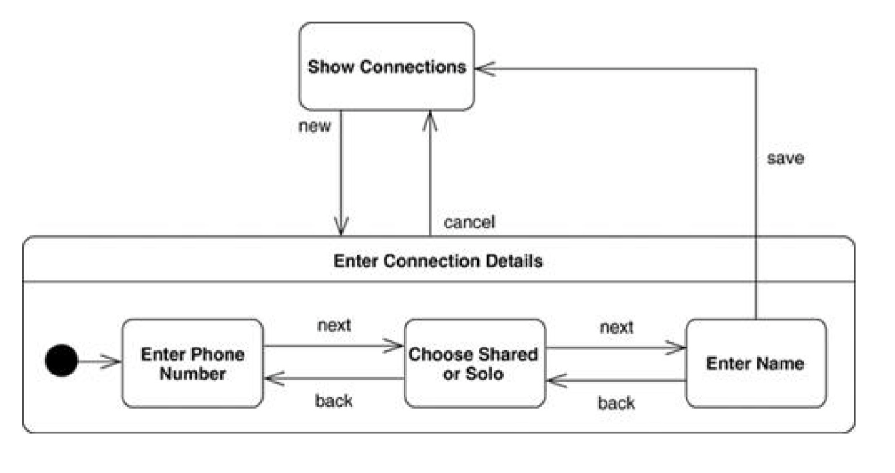

## 并发状态 Concurrent States

可以把一些状态拆分成几个正交的状态，这些正交的状态并发运行。下图是一个闹钟的状态图，这个闹钟可以播放CD或者收音机（只能是其中一个），同时还可以显示现在的时间或闹钟时间（只能是其中一个）。

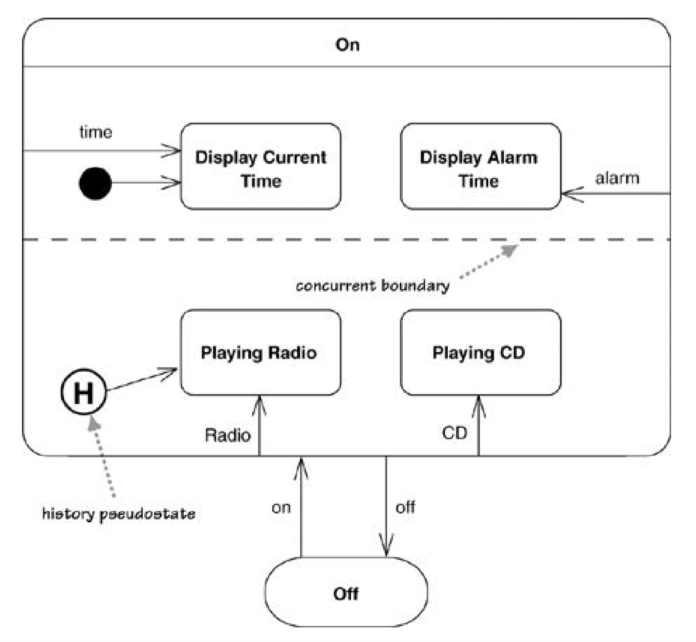

播放 CD/收音机 和 当前时间/闹钟 都是正交的选择，如果要用一个非正交状态图来表示的话，会非常的复杂混乱。

上图还包含了一个历史伪态（history pseudostate）。这表示当闹钟是开启状态（On）时，CD/收音机这个状态会回到之前关闭（Off）闹钟时的状态；而历史伪态指出的是，当没有历史状态时，首次呈现的状态。

## 状态图的实现 Implementing State Diagrams

一个状态图可以用三种方式来实现：嵌套switch语句、状态模式、状态表。

最直接的方法就是嵌套switch，但是这种方法非常冗长和容易失控，比如本章最开始的那个安全系统实现如下：

```java
public void handleEvent(PanelEvent event) {
    switch(currentState) {
    case PanelState.OPEN:
        switch(event) {
        case PanelEvent.SAFE_CLOSED:
            currentState = PanelState.WAIT;
            break;
        }
        break;
    case PanelState.WAIT:
        switch(event) {
        case PanelEvent.CandleRemoved:
            if(isDoorClosed) {
                revealLock();
                currentState = PanelState.LOCK;
            }
            break;
        }
        break;
    case PanelState.LOCK:
        switch(event) {
        case PanelEvent.KEY_TURNED;
            if(isCandleIn) {
                openSafe();
                currentState = PanelState.OPEN;
            } else {
                releaseKillerRabbit();
                currentState = PanelState.FINAL;
            }
            break;
        }
        break;
    }
}
```

状态模式是建立一系列的状态类来控制状态的变化。每一个状态都对应了一个子状态类，在Controller里对每一个事件都设置一个只用于状态转换的方法。

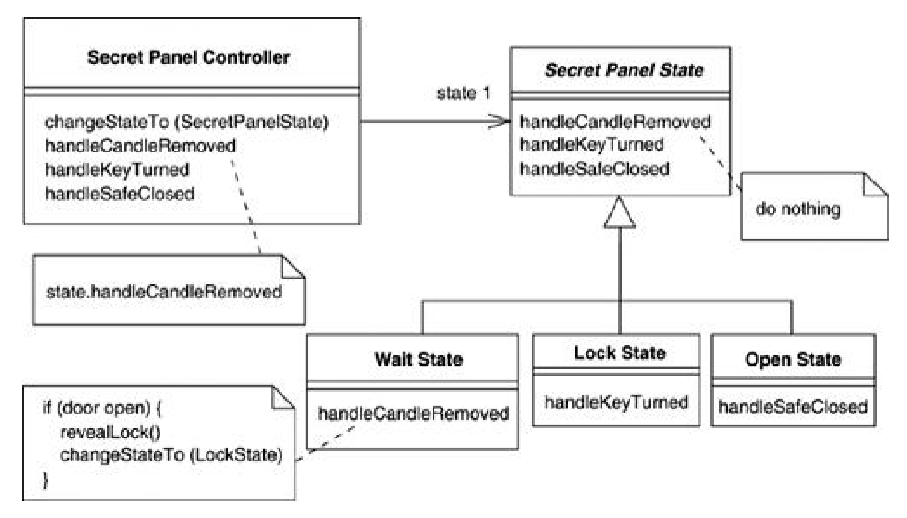

在层次的最上方是一个抽象类，所有的`handle-event`方法都是空，然后在每一个具体的状态类里，override该状态类有转接的方法。

状态表展现了状态图上的所有信息。之后可以通过一个基于状态表的代码生成工具或者可以运行时解释状态表的解释程序来工作。

| Source State | Target State | Event          | Guard      | Procedure             |
| ------------ | ------------ | -------------- | ---------- | --------------------- |
| Wait         | Lock         | Candle removed | Door open  | Reveal lock           |
| Lock         | Open         | Key turned     | Candle in  | Open safe             |
| Lock         | Final        | Key turned     | Candle out | Release killer rabbit |
| Open         | Wait         | Safe closed    |            |                       |

这只是极少的几种实现方式。每种实现方式都有标准的代码实现方法，通常最好直接用代码生成程序来实现状态图。

## 什么时候使用状态图

状态图擅长描述跨用例的对象行为。不是所有时候都需要状态图，结合实际工作去选择要不要用。也最好只对那些复杂的类去用，一般如UI和控制对象。

# 第十章 活动图 Activity Diagrams

活动图有点像是一个流程图，主要区别在于活动图增加了并发相关的画法。

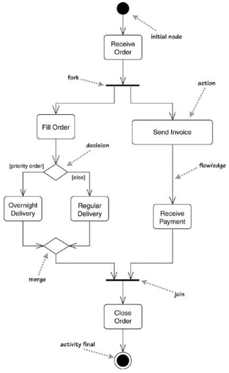

从初始节点开始（initial node），随后是接收订单，接着遇到了一个分岔（fork），分岔有一个入流和若干个并发的出流。

这个分岔意味着，之后供货和开发票以及他们的后继动作都是并发进行的。在关闭订单前有一个合并（join），只有当所有的入流均已到达，才能继续处理流。所以仅当收款和交付都完成后，才可以关闭订单。

大家可能注意到了，图上将一个节点称为action，而不是activity。准确的说，一个activity是一系列actions。

条件是用decision和merge来表述的。UML1里将decision称为branch。每个decision有一个入流和多个出流，出流上会有监控（guard，条件），监控是用两个方括号括起来的布尔表达式，彼此互斥。每当到一个decision的时候，只能选择一个出流。merge则是有多个入流和一个出流，标志着由decision开始的条件行为的结束。

在上图中，每个action都只有一个入流和一个出流。UML里可以省略decision或merge，但是在不同UML版本里是不一样的，所以还是推荐大家对action使用单个入流和出流，并显式标明所有的decision和merge。

## 动作的分解 Decomposing an Action

可以把一些action分解成子activity，比如可以把上面的交付展开为一个活动，这样原来的图上就可以用一个叉齿符号（rake）表示有子活动图。

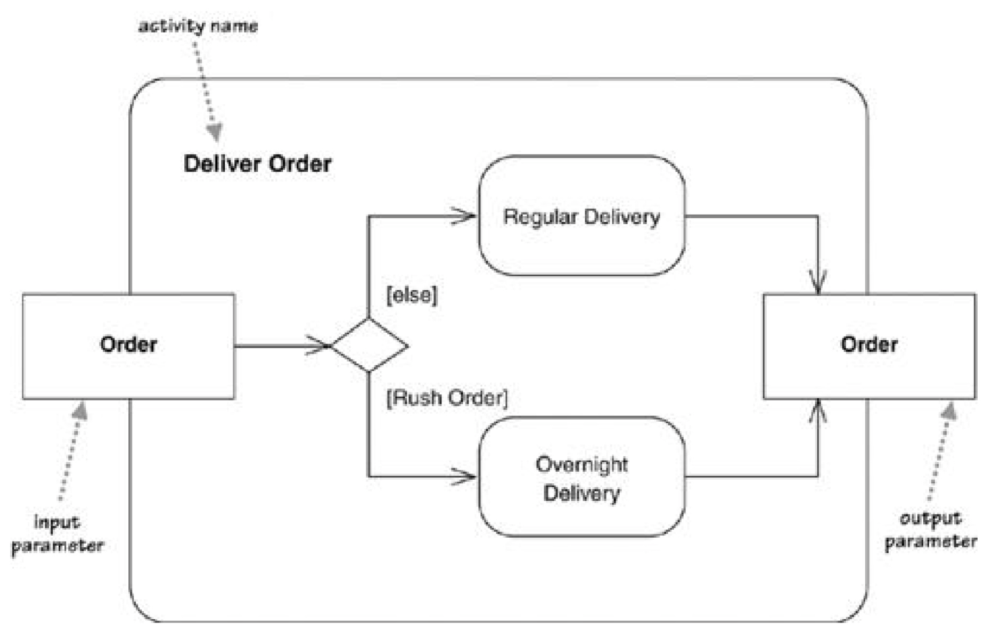

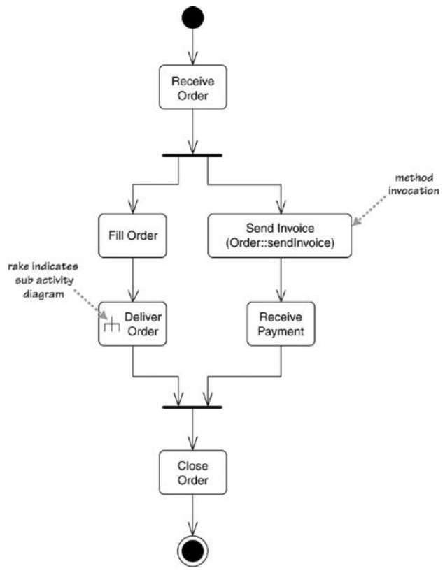

每个action除了可以是子活动外，还可以是类上的一个方法，用`类名::方法名`来表示；如果不止一个方法，甚至可以写一段代码在action框里。

## 分划 Partitions

活动图示明了要做什么，但是没说谁来做。在编码中，这指的是，图里没有表达出每一种活动是由什么类来负责。在业务建模中，是指，图里没有表达出机构的哪一个部门做什么。这一点不一定重要，因为大多数情况下，集中精力去搞清楚做了什么，比谁来做更重要。

如果需要表明谁来做，就要把一个活动图分成几个分划。如图所示，UML1里把这种方式称为泳道（swim lane），因为只可以进行一维划分，UML2已允许使用二维的格子去划分活动图。

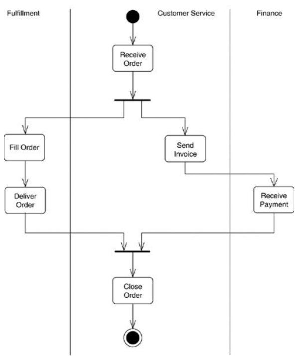

## 信号 Signals

在之前的活动图里，是有明确指明initial node的。在某些情况下，action也可以是一个信号。信号是来自外部的一个事件。

比如说随着时间的推移会出现时间信号（time signal）。

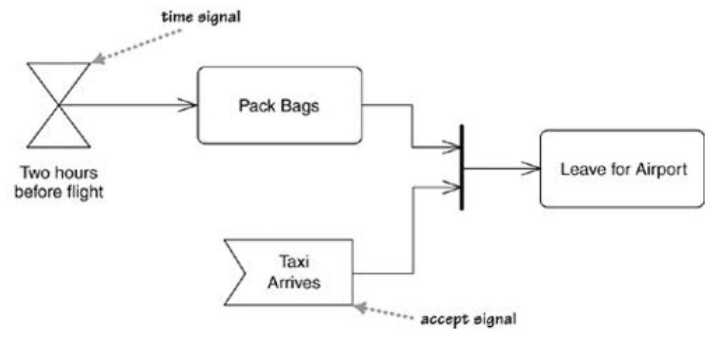

上图给出了一个监听两个信号的活动。活动会在不断地监听信号，图定义了当接收到信号后如何反应。

上图是说，在航班2小时前（时间信号）需要开始收拾行李。另一个信号是出租车的到达。只有当行李收拾好，且出租车到达了，可以出发去机场。

除了接收信号以外，还可以发送信号。下图就表示，在预定行程后，发送行程信号，这时会看之后那个信号先到，再决定做什么。

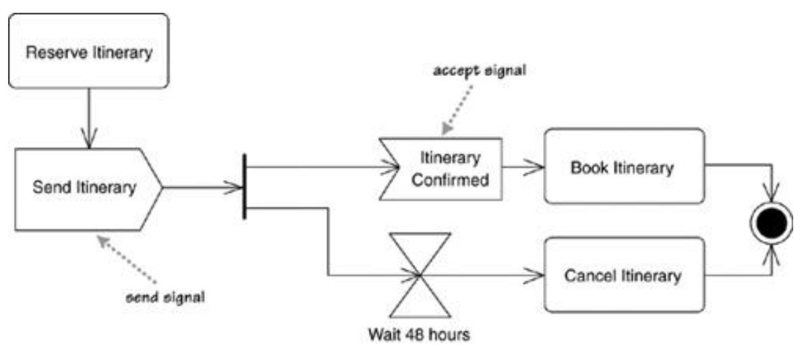

虽然信号通常都是一个外部事件，但是我们也可以像上图一样，画一个流流入接收信号中，表示该流引发接收之前，不能监听信号。

## 权标 Tokens

在UML标准里对token有很深入的讨论。

初始节点创建一个token，然后传递给下一个action，下一个action会对token做出一些操作然后传递给下一个action。在fork上，会在每一个流上都产生一个token；在join上合并为一个token。在很复杂的活动图上，token可以让一些东西可视化。

## 流与边 Flows and Edges

flow和edge在UML2里是同义词，指的是活动图里连接两个action的符号。最简单的就是一个箭头。

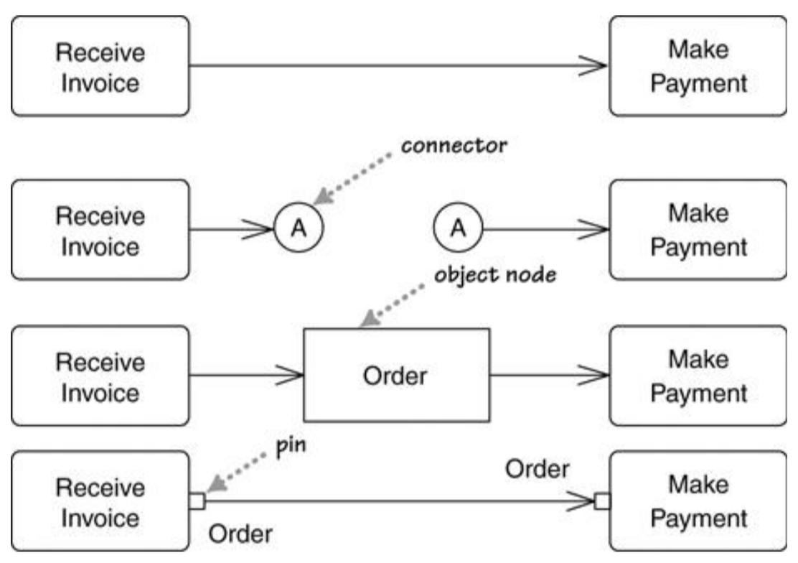

如果线很难画，可以考虑使用连接符，连接符必须成对使用，使用同样的标号，如上图的第二个。但是尽可能不要用这种方式，会影响到控制流的形象化，不好读。

边上也可以传递一些东西，比如说对象。对象可以是在边上增加一个类框，也可以使用pin来表示。

## 饰针与转换 Pins and Transformations

action可以像方法一样有参数。活动图上不需要标明action的参数，如果需要，可以使用pin。当严格绘制活动图的时候，一个action输出的pin要和另一个action输入的pin相匹配；如果不匹配可以指明一个转换（transformation）让二者匹配。

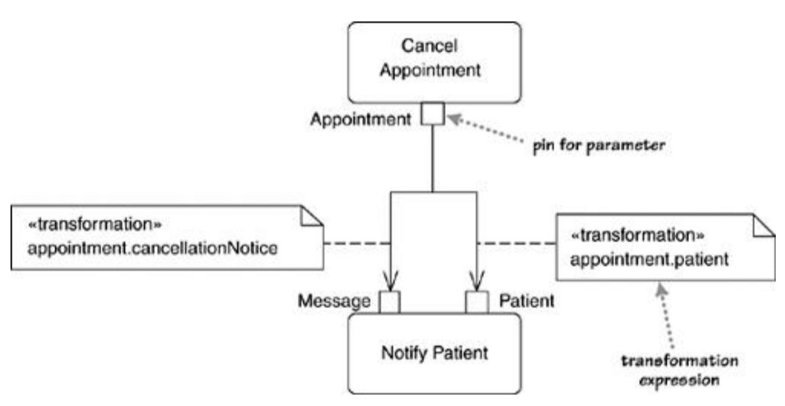

注意这里有一个隐式join。

## 展开区域

在画活动图的时候可能会遇到这样的情况，一个action的输出会引起另一个action的多次调用。有好几种方法可以表示这种情况，但是最好的方法还是用一个展开区域（expansion region）。展开区域里的每一个action每次都会执行一次。

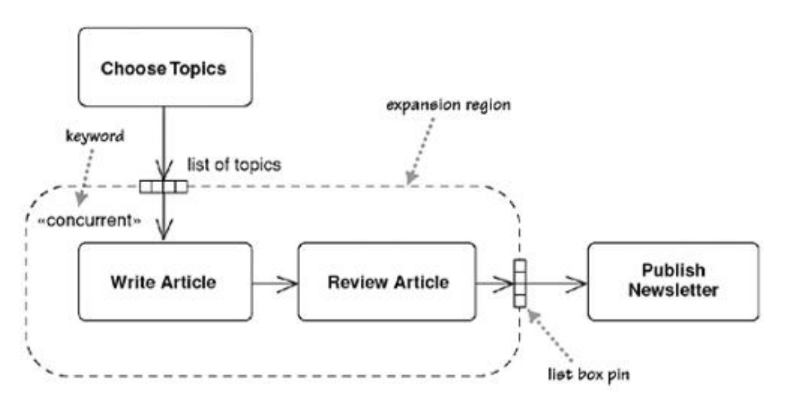

在上图中，选择主题动作会输出一个主题表。表中的每一个元素就会成为写文章动作的输入token。评审文章也会生成一个单篇文章作为输出token，添加到展开区域的输出表中。当主题表里所有的主题都处理后，整个展开区域生成一个token，开始出版业务通讯。

这种情况下的展开区域的输入组合输出组的项目数相同，不过输出也可以少于输入。在上图中，写和审两个动作是并行的，用关键词《concurrent》来标记。

如果只有一个动作多次进行，也可以用下图的方式。下图简略并假定了并发进行，多个准备工作是同时进行的。


## 流终 Flow Final

像在展开区域里一样，一旦有多个token，就说明有一些流。当整个活动尚未停止的时候，流可能停止，这就是流终（Flow Final）。

如图所示，当评审文章后可能会被拒用，该token就会被流终摧毁。

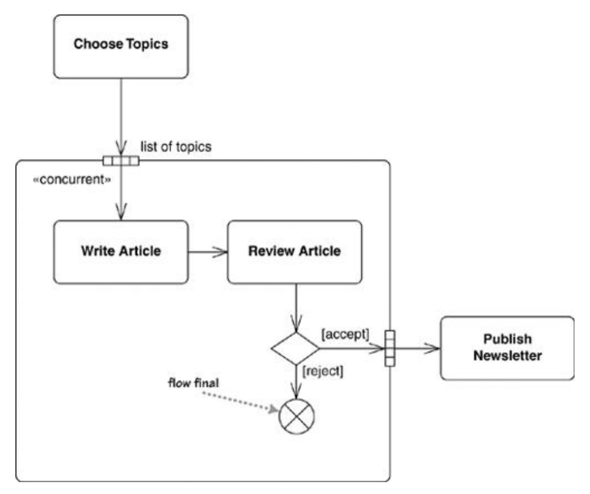

## 汇合指明 Join Specifications

在默认情况下，当join的所有入流都已经抵达，就会执行输出流。更为形式化的说法是，当每一个输入流都有一个token抵达时，在输出流上发出一个token。

汇合指明（join specification）是一个在join附近的布尔表达式。每当一个token抵达时进行计算，当它为真时，在输出上发出一个token。

下图是一个售货机的例子，先选择一个饮料，然后投入硬币，只有投入足够的钱时才会吐出饮料。可以在流上加上标号，在汇合指明上使用这些标号。

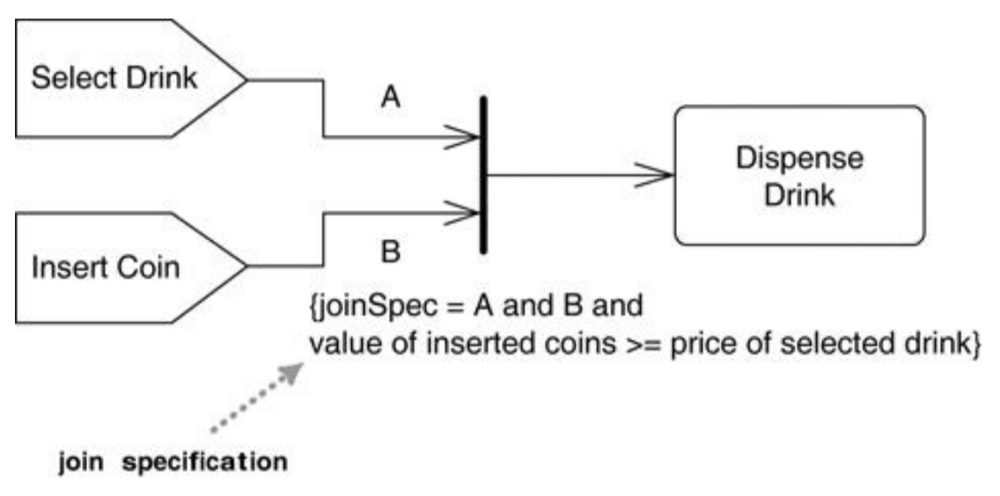

# 第十一章 通信图 Communication Diagrams

在UML1里，通信图被称作协作图（collaboration diagram）。通信图主要是为了说明交互中各个参与者之间的数据交互。

顺序图中是依垂直方向给每一个参与者画一条生命线，并以此指明消息顺序，而通信图允许自由放置参与者的位置，画一些连线来示明各个参与者如何相连，并利用编号来示明消息顺序。

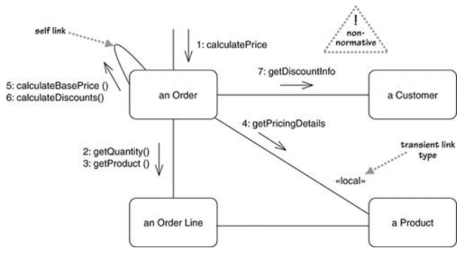

上图是第四章集中式控制交互的通信图。除了实例之间的连接外，还可以标注一些瞬时连接（只在交互的时候产生）。如订单到产品的连接上有关键词《local》，表示这个链接只是一个本地变量；其他的瞬时连接关键词还有《parameter》《global》。

上图的编号方法简单易懂且常用，但这并不符合标准；标准上规定的编号方法如下图所示：

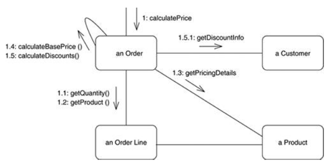

使用嵌套式的编号是为了解决自调用的歧义。在这个图里我们可以清楚地看到getDiscountInfo是在calculateDiscount内调用的，但是在第一幅图里就无法分辨出来这一点。

不过在嵌套层数很多的时候，会导致编号很乱，这个时候混乱的图可能会更加难读，不如容忍一部分的歧义存在。

除了数字以外，编号上也可能会出现字母。字母表示不同的线程。因此，消息A5和B2就是在不同的线程中的两个消息，1a1和1b1就是在消息1内并发嵌套的不同线程。

通信图对于控制机理没有任何图示法。可以用一些迭代标记或者监护，创建和删除对象也没有特殊的图示法，可以使用诸如《create》《delete》之类的关键词。

# 第十二章 复合结构 Composite Structures

我们可以把一个复杂的对象分成若干部分。

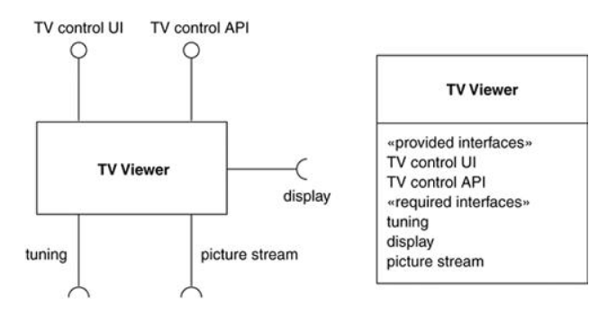

对于一个TV Viewer，有一些实现的接口，还有一些依赖的接口。`1qa

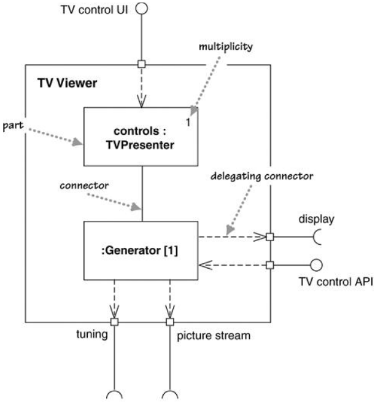

上图表明了一个类如何在内部分解成两部分，并且两部分哪些实现哪些接口，哪些依赖哪些接口；每一部分按照`名称:类`的格式命名。

为了表明与接口的详细关系，可以画一些delegating connector。

还可以画成下面这个样子。

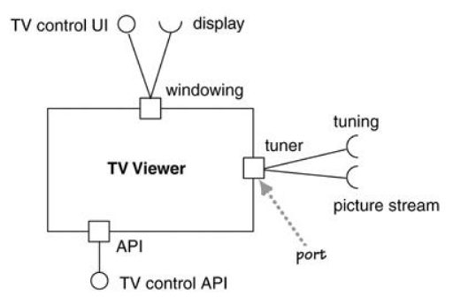

# 第十三章 构件图 Component Diagrams

关于构件和正常类之间的区别这里不作讨论。UML里对于构件的画法如下，或者可以使用关键词《component》。

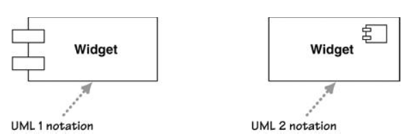

构件图的其他部分和类图没什么区别。下图是一个简单的例子：

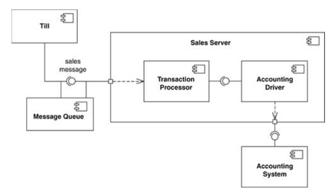

收银机Till利用一个接口sales message与销售服务器Sales Server连接。由于网络不可靠，所以设计了一个消息队列Message Queue，当网络正常的时候直接通过接口通信，网络不好的时候通过消息队列通信。服务器则分成了两个主要构件。

# 第十四章 协作 Collaborations

在UML标准里，协作是复合结构的一部分，但是这两者其实是有区别的。

考察一个拍卖场景Auction。在任何一场拍卖里，有一个卖家seller、一些买家buyer、很多物品lot和一些报价offer。

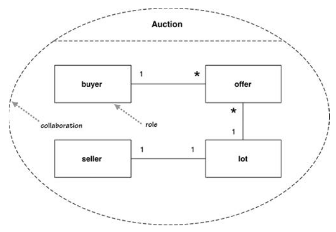

这个图周围是一个虚线椭圆，表示拍卖协作。里面的也不是类，而是一些角色（role），因此名字通常也不是大写的。

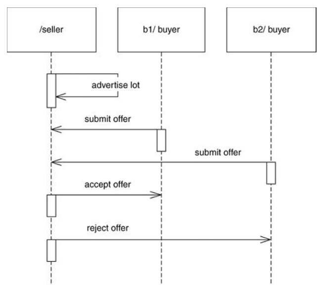

上图里的参与者命名规则是：`参与者的名称/角色名:类名`。

协作是可以出现在类图上的，指明这些类以什么角色进行协作的。

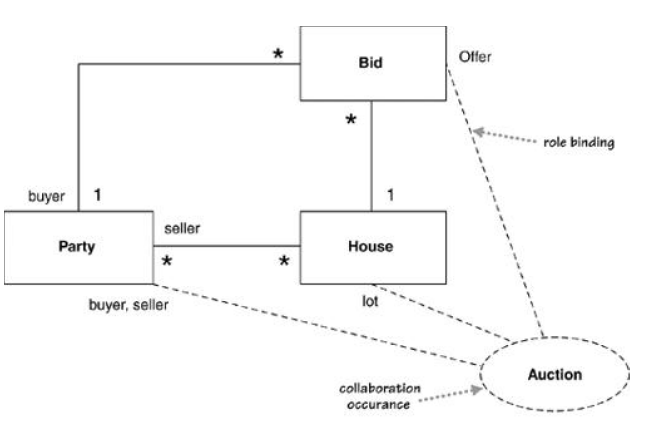

UML建议用协作图来表示模式的使用，但是一般大家都不用，而是用这种方式。

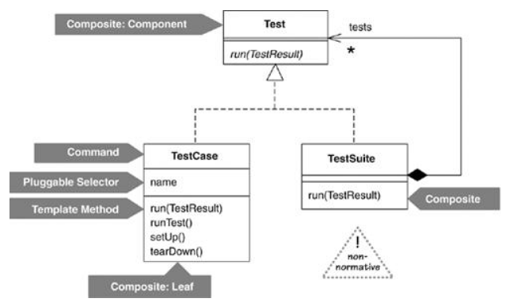

# 第十五章 交互概观图 Interaction Overview Diagrams

交互概观图是把活动图和顺序图拼在一起的一种图，可以理解成把活动图的一部分用顺序图展开，也可以是把顺序图的一部分用活动图展开。下面是个简单的例子。

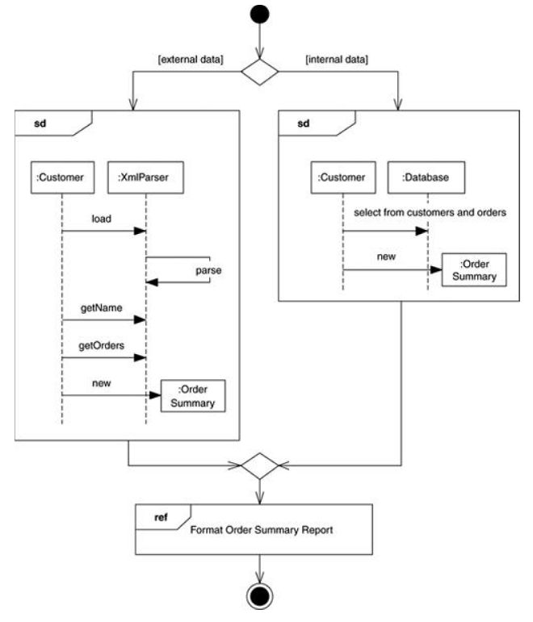

# 第十六章 定时图 Timing Diagrams

定时图是为了说明一些对象的定时约束。下面是两种可选方式。说的是，一个咖啡壶的抽吸装置Pump和加热装置Hotplate的关系。打开抽吸装置和打开加热装置必须要间隔10秒钟；水空的话要关闭抽吸装置，而加热装置保持加热不能超过15分钟。

两个图的主要区别是，第一个是由一条线更换水平高度来说明状态改变；第二个是用一个十字表示状态改变。当状态比较少的时候，如本例只有开关两个状态，第一个图效果比较好。当状态很多的时候，第二个图更好用。

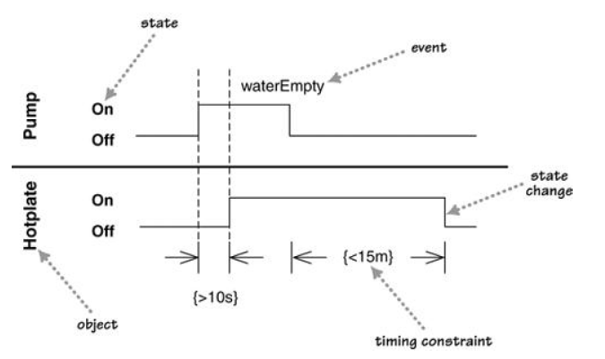

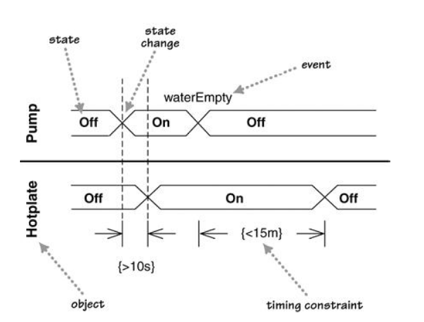
