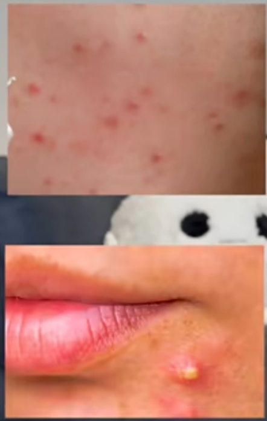

# 皮肤的一些问题

## 1. 痘痘的类型

## 2. 用药

[乱买费钱！乱用烂脸！网红祛痘药膏，你真的用对了吗？](https://www.bilibili.com/video/BV16w411i7iv/)

[酸中的六边形战士！ 用对了就是 yyds！](https://www.bilibili.com/video/BV1184y1s777)

### 2.1. 维 A 酸

孕妇、哺乳期禁用

可能有刺激性

晚上用，早上洗干净，注意保湿和防晒

#### 2.1.1. 维 A 酸乳膏

效果明显

-   粉刺
-   黑头
-   炎症性痘痘
-   痘印

一般是 2 种浓度：0.025% 和 0.1%

注意事项：

-   只能夜间使用
-   不能见光
-   点涂使用，轻轻点在那里就好，不用揉特别开
-   早上洗掉，做好防晒，不然会黑。并且加重刺痛过敏
-   用完洗手
-   先护肤再涂
-   长期使用，几个月以上
-   酸只用一种就行

#### 2.1.2. 阿达帕林凝胶

第三代维 A 酸

-   温和度高
-   刺痛&过敏风险低
-   较弱的光敏性，晒后色沉不那么明显

局部点涂，有一些黑头的地方，薄薄地用棉签涂上就行

### 2.2. 过氧苯甲酰

氧化剂，刺激性很大，功效强

### 2.3. 抗生素

长时间大面积在脸上用，容易影响正常菌群

不可以断断续续，也不可以随便停药。

不适用于粉刺

治疗痘痘不要只用抗生素

#### 2.3.1. 夫西地酸乳膏

丘疹型、脓疱型，都有效，加速痘痘干瘪破裂。

预防进一步感染，对 痤疮丙酸杆菌、葡萄球菌 的抑制效果都很好

使用注意：薄薄涂在痘痘和**痘痘边缘**，涂抹范围稍微大一点。痘痘破裂后，创口可能会引起其他细菌侵入，二次感染，所以在边缘也稍微带到一点。

#### 2.3.2. 克林霉素磷酸酯凝胶

对痤疮丙酸杆菌抑制效果最好的外用抗生素。如果夫西地酸效果不好可以用这个试试，使用方式一样。

#### 2.3.3. 甲硝锉凝胶

人工合成的抗抗菌药，对于常见细菌、阿米巴、毛滴虫、厌氧菌的感染都有效，抑制毛囊蠕形螨。

玫瑰痤疮和螨性皮炎首选。

使用时，对于炎症期的痘痘局部涂抹即可。

#### 2.3.4. 莫匹罗星软膏

可以在痘痘破裂后，预防葡萄球菌的二次感染。不太常用于炎症脓疱型痤疮。

更多还是用于外伤、手术伤口等。

#### 2.3.5. 复方多粘菌素 B 软膏

不建议用来治疗痘痘。

复方，成分复杂，容易致敏。不建议涂到脸上。

含有利多卡因，疖子、外伤伤口，可以明显降低疼痛感。

#### 2.3.6. 红霉素软膏

和 红霉素眼膏 的区别：

-   眼膏 浓度低，不建议用来治疗皮肤感染
-   两者成分有区别，软膏也不要用来治疗眼睛

不建议使用 红霉素软膏 祛痘：

-   痤疮丙酸杆菌 天然对红霉素的耐药率比较高，效果差
-   里面有大量的凡士林和液体石蜡，容易焖出粉刺
-

### 2.4. 其他

#### 2.4.1. 壬二酸

有一期单独的视频 [酸中的六边形战士！ 用对了就是 yyds！](https://www.bilibili.com/video/BV1184y1s777)

相对温和，刺激性低，控油性和，可以解决

-   粉刺
-   黑头
-   炎症期痘痘
-   黑痘印
-   玫瑰痤疮
-   黄褐斑

可以当作痘肌肤质的缓慢改善。

杜鹃花酸，是天然的抗菌剂，不像抗生素有耐药性

使用方式：痘痘点涂，鼻头薄涂

白天用也可以

1. 起效起码要 15%
2. 也要注意建立耐受，有人也会有局部刺痛
3. 下面不要用护肤品打底。直接用
4. 溶解性差，制作出来的药品就会加很多油，所以不建议全脸使用，局部使用

推荐：质润，大概 45 块/支

买的时候注意看配料表

#### 2.4.2. 鱼石脂软膏

结节囊肿型的，厚敷上。

挤一坨，用创可贴，或者大纱布包上。

#### 2.4.3. 积雪苷霜软膏 / 复方肝素钠尿囊素凝胶

-   抑制疤痕
-   促进伤口愈合

容易留痘坑痘疤的人，可以在痘痘破了后，表面已经结痂，没有明显渗出了，可以用来预防形成增生或者凹陷型瘢痕

要在预防阶段使用，对于已经形成的瘢痕疙瘩，效果微乎其微。

#### 2.4.4. 炉甘石洗剂

不适合用于治疗痘痘。

虫咬、皮炎、湿疹、荨麻疹。

#### 2.4.5. 多磺酸粘多糖乳膏

本身是治疗 钝器挫伤、浅表性静脉炎 的，促进局部微循环、抗炎、消肿。

所以对红痘印的效果很好，减轻炎症反应。

注意不能用于开放性伤口、破裂皮肤。不要乱用。

平替有：Hiruscar 喜疗复修护凝胶（一家出的）

#### 2.4.6. 重组人表皮生长因子凝胶（酵母）

乱用重灾区。

促进表皮愈合，加速伤口愈合。做完手术，点阵激光，点完痣，有明显破损的。

痘痘很小，不太需要。
