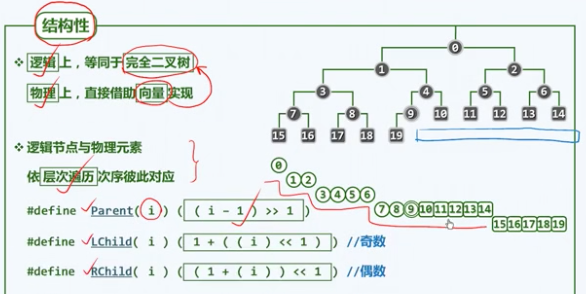
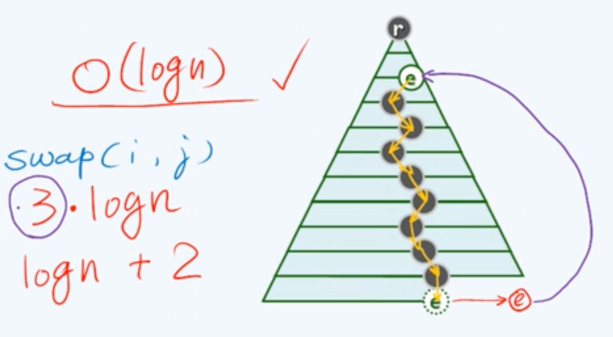

# 10 优先级队列

循优先级访问

## 实现思路

### 向量

插入O(1)

删除Max$$\Theta (n)$$

获得Max$$\Theta (n)$$

难以接受

#### 有序序列

get和delete O(1)

插入O(n)

### 列表

列表同理，也不行

### BBST

O(logn)

但是BBST功能其实过于强大了

## 完全二叉堆

+ 我们只需要偏序关系

+ 向量为形，树为神。

完全二叉树：平衡因子处处非负的AVL【一棵满树，除了最底层的右侧缺失一段】

+ 逻辑上等同于完全二叉树，物理上用向量实现。

若有父节点：$$ (i-1)/2 $$

左孩子：$$ 1+ 2 * i$$

右孩子：$$ (1+i)*2 $$

## 实现

### 堆序性

`Heap[i] <= Heap[parent(i)]`

每个节点的优先级不大于父节点

全局最大元素就应该是`Heap(0)`

### 插入和上滤

思路：直接插到向量的末尾。结构性是自然保持的。

如果堆序性也保持，则完成。

否则为了恢复堆序性（和父元素的大小关系），只需要交换它和父元素的位置即可。

#### 复杂度

`O(logn)`

每次交换要3次赋值，`3 * logn`

可以做一些改进：

不要每次都做交换。先将父元素移动到位，然后再将插入元素放入。

`logn + 2`

并且这里的找父节点也可以优化。

+ 在通常随机分布下，每个节点上升高度是常数。

### 删除和下滤

删除，然后把末元素放到首元素的位置，先恢复结构性

然后恢复堆序性（和孩子的大小关系）

元素与孩子中较大的交换

#### 复杂度

`O(logn)`

### 批量建堆 Floyd算法

Heapification

思路1：

直接对给定的向量中的每一个点，自上而下考察是否满足堆序性，通过上滤恢复。

`O(nlogn)`，不可取

#### Floyd：自下而上的下滤

在删除操作中，将末尾元素放在了首元素，然后恢复了堆序性。

相当于 2个堆 + 1个元素 进行了合并。

对向量中的每一个点，倒着，自下而上，自右而左考察。通过下滤恢复。

相当于，堆从底层不断进行合并。

不需要考虑叶子节点，只需要考虑内部节点（`n/2-1`）即可。

##### 复杂度

每个节点调整需要的时间正比于**高度**

`O(n)`

## 堆排序

### 选择排序

初始化：建堆：O(n)

迭代取出最大元素排序；O(logn)

算法复杂度：O(nlogn)

#### 就地

每次对换堆秩0与秩-1

然后堆减1，下滤

## 左式堆

为了有效完成堆合并

保持堆序性，加入新条件：

单侧倾斜：节点分布偏向于**左侧**，合并操作只涉及到右侧

复杂度可以到O(logn)

结构性破坏了，但是堆序性才是本质

### 空节点路径长度

Null Path Length：NPL

引入所有的外部节点，转换为一棵真二叉树。

npl(NULL)=0

$$npl(x) = 1+ min(\  npl( lc(x) ), npl(rc(x))\  )$$

npl(x) = x到外部节点的最近距离，也是以x为根的最大**满子树**的高度

### 左倾性&左式堆

npl( lc(x) ) >= npl( rc(x) )

左倾：左孩子的npl不小于右孩子的npl

左式堆：每个节点都是左倾的

推论：左式堆的npl(x) = 1+右子堆的npl

左倾性与堆序性，相容而不矛盾

左式堆倾向于分布在左侧分支，但是不意味着左子堆的规模和高度一定大于右子堆

### 右侧链

从x出发，一路按右分支前进

根的右侧链的终点，一定是全堆最浅的外部节点

这意味着，右侧链长d的左式堆，一定有一个高度为d的满子树，至少有$$2^{d+1}-1$$个节点，如果总节点是n个，d最多O(logn)

### 左式堆实现

左式堆不满足结构性，所以用二叉树来派生

### 递归合并

a、b两个子树，先把a的右子树和b合并，合并完作为a的右子树。最后比较NPL，如果有必要交换一下。

#### 实现

递归基：如果一个为空，返回另一个

比较a、b的大小，保证数值上a>=b

递归地将a的右子堆与b合并

合并后的子堆作为a的右子堆，判断一下npl大小，有必要的话互换，更新npl

#### 复杂度

合并过程只涉及到了右侧链，故O(logn)

### 插入与删除

借用合并。

#### 插入

就认为是一个只有一个节点的左式堆，进行合并

#### 删除

delMax

直接删除根节点，然后把子堆合并
