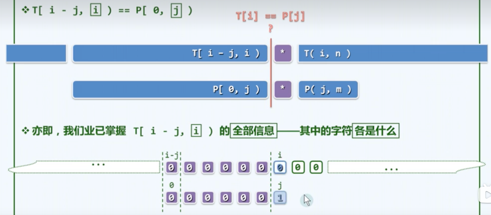
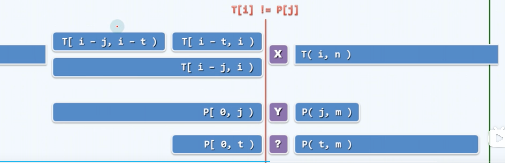
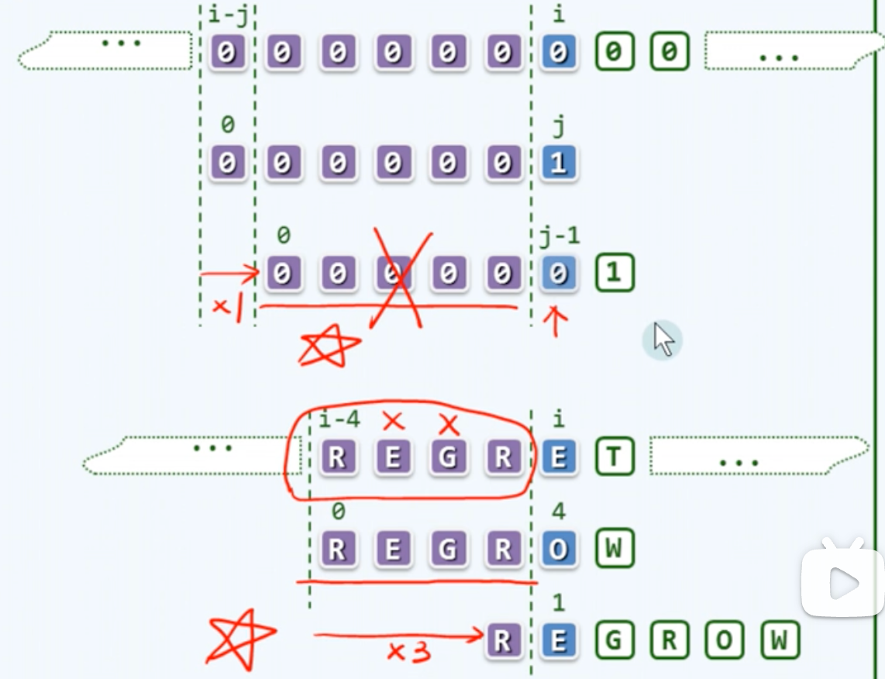
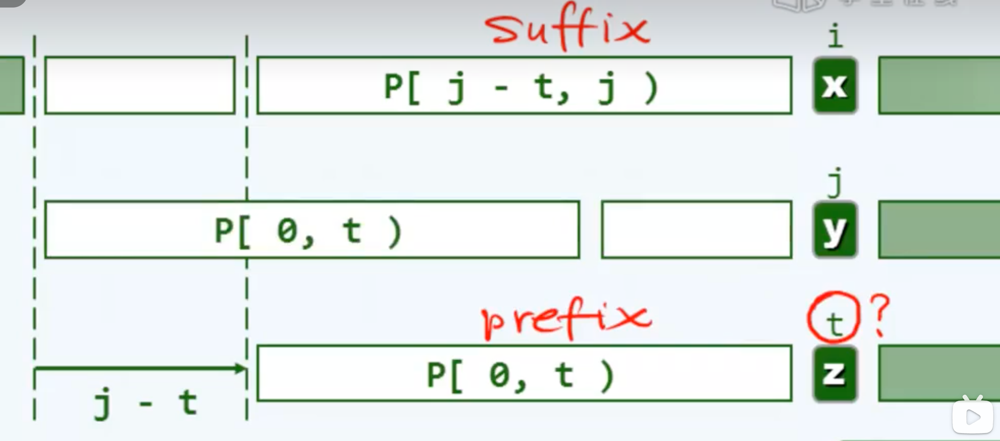

# 11 串
字符串：一系列字符构成的长度有限的序列。不要求字符互异，线性序列。

字符串相等：长度相等，且对应的字符均相等

空串：长度为0的串。是任何串的子串、前缀、后缀。

indexOf(P)接口：判断一个串是否是当前字符串的子串

## 串匹配问题
文本串T，$$|T|=n$$

模式串P，$$|P|=m$$

通常有$$n>>m>>2$$

问题层次：

1. detection：P**是否**出现？
2. location：首次**在哪里**出现？（核心问题）
3. counting：共有**几次**出现？
4. enumeration：各出现**在哪里**？

### 算法评测
**测量与评估**串匹配算法的性能的方法：

随机T + 随机P ？ 不行。

以二进制串为例，长度为m的P有$$2^m$$个，而T中匹配的子串最多n个。匹配成功的概率非常小$$<10^{-25}$$。

合理的做法：

随机T，对成功、失败的匹配情况分别考虑。

成功：在T中，随机取出长度为m的子串作为P，分析平均复杂度

失败：采用随机的P，统计平均复杂度

### 蛮力匹配
自左向右，以字符为单位，依次移动模式串。

#### 实现：版本1
约定尾部有个哨兵```\0```，不计入串长。

用```i```和```j```分别指示当前在文本串和模式串中字符

那么两者的对齐位置是```i-j```，匹配失败时，```j=0，相当于j-j，那么i=i - (j-1)```，成功时i和j自增1，当j和i越过上界时，结束循环

返回```i-j```，失败的时候返回的值大于最大的合法位置```n-m```

#### 实现：版本2
区别：j依旧是模式串中的当前字符，而i是对齐的位置。文本串中当前字符是```i+j```

#### 复杂度
成功：

最好情况：一轮比对就确定匹配O(m)

最坏情况：O(m×n)


字母表$$|Σ|$$越小，最坏情况的**概率**越高

m越大，最坏情况的**后果**更严重


当字母表增大，最坏情况概率会急剧下降，期望复杂度可以达到线性O(n)

## KMP
保证在最坏情况下复杂度也可以达到O(n)

### 蛮力算法为何低效

模式串的前缀中会可能存在大量重复。模式串前缀会匹配很多次。

例如：文本串：000..... 模式串：00001

### 改进思路



匹配失败的时候，刚刚匹配过的部分和模式串的前缀是完全一致的。

所以匹配过的部分信息是已知的，不需要重复一遍。





所以期望：

1. 如000..例子，希望直接匹配下一个需要匹配的字符，不要重复匹配模式串前的一串0，避免前缀中的重复比对
2. 可以大幅度向后滑动模式串

### 查询表

确定新匹配定位置，只与模式串有关，与主串无关。

那么如果在j处匹配失败，可以通过模式串的信息得知下一个匹配位置在哪里。

以此构造查询表next，在j处失败后，用next[j]替代j。

#### 主算法

1. 构造next表，只与P有关
2. 两个指针，i，j，分别指向文本串和模式串中参与比对的字符
3. i，j不越界的情况下循环，`T[i]`和`P[j]`相等【`|| j < 0`，理由见后】则共同+1
4. 失败的情况下，```j=next[j]```，i不变，即模式串右移
5. ```return i-j```

#### 理解：自匹配
假定，next[j]=t，即在j的位置出现失配时，应该从t的位置开始匹配。

已经匹配过的前缀部分记为X。则移动的必要条件是，X中有一个长度为t的前缀，与长度为t的后缀，相等。



可以表示为$$P[0,t) == P[j-t,j),\  0\le t<j$$

我们希望位移量j-t最小，所以t取最大的

当j=0时，没有可选的t值。所以令`next[0] = -1`【对应if语句中加的j<0】

j=0时，匹配失败，即第一个字符就不匹配，那么应该将i和j都+1。可以理解成-1的位置有一个通配符（和所有字符都匹配的字符），和字符匹配的情况一样，i和j都+1


#### 构造next表
递推：

考虑问题：如果已知`next[0,j]`，如何求`next[j+1]`

`next(j)`，就是`P[0,j)`中，最大自匹配的真前缀和真后缀的长度

所以$$next[j+1] \le next[j] + 1$$（反证法易证）

即t最多增长一个单位，取等号的**充要条件是$$P[j] == P[ next[j] ]$$**，模式串中j处的字符，与next表中的继任者相等。

如果不相等：

由于前缀需要满足自相似性，即next表中每一个值都是一个满足自相似性的子串，当`P[j]`不等于`P[ next[j] ]`时，我们就继续考察其他的满足自相似性的子串，即考虑`next[ next[j] ]`的情况。以此类推。一旦相等，就加一。

那么next[j+1]的可能值有：

1 + `next[j]`

1 + `next[ next[j] ]`

...

因为子串是个真前缀真后缀，所以`next[j] < j`，所以一定会收敛终止。

##### 详细理解

`next[j]`其实代表的就是在`[0, j)`范围内最长的相等真前缀和真后缀长度。

那么用`i - 1`指向真前缀的末尾，`j - 1`指向真后缀的末尾

当计算`next[j + 1]`时，如果`i`的字符和`j`的字符相等，那么子串长度+1，`next[j + 1]`应该等于`next[j] + 1`

如果不相等，要求的就是`[0, j]`内的最大子串长度。假定新的最大子串是X，如果X去掉j处的字符，记为Y，那么Y一定是`[0, j - 1]`范围，即`[0, j)`内的某个真前后缀相等子串。

已知`[0, j)`范围内最长的子串长度是`next[j] = t `，记为M。那么Y一定是M的真子串，且Y在`[0, t)`范围内是M的真前缀，在`[j - t, j - 1]`范围内是M的真后缀，即Y就是M的真前后缀相等的串。那么最长的Y的可能值就是`next[ next[j] ]`

```java
int[] next = new int[pattern.length()];
int j = next[0] = -1;
int i = 1;
while (i < pattern.length()) {
  if (j < 0 || pattern.charAt(i - 1) == pattern.charAt(j)) {
    next[i++] = ++j;
  } else {
    j = next[j];
  }
}
return next;
```


#### 实现
相当于是自己匹配自己，框架与KMP主算法差不多

```java
int j = 0, m = P.length();
int[] next = new int[m];
int t = next[0] = -1;
while (j < m - 1) {
  if (0 > t || P[j] == P[t]) {
    next[++j] = ++t;
  } else {
    t = N[t];
  }
}
```


1. 初始化N[0] = -1
2. 循环：匹配的情况下，N[j+1] = t+1;
3. 失配t = N[t]

### 复杂度分析
精准估计：

令$$k = 2 * i - j$$

在算法中：

如果匹配成功，i++,j++，k会+1

如果匹配失败，j =  next[j]，则k至少+1

所以k必然随迭代单调递增，所以迭代步数必然小于等于k

k初始是0，算法结束时，i最多n-1，j最小-1，所以复杂度O(n)

### 瑕疵
经验和教训

经验：已经匹配过的子串，通过自相似已经获得了

教训：当前要匹配的这个字符其实已经知道了**一定不是什么**，但是目前的KMP算法会不断的重复匹配这个字符

例如：00100... 匹配 0001，在index=2的时，文本串的1会多次和模式串中的0匹配，


### 改进的Next表
匹配成功的情况需要改进：

原来 `N[j + 1] = t + 1`，`j + 1`是现在要求的下一项，`t`是选取出的子串，加一后赋值给下一项。

现在：

先比较`t + 1`对应的字符（即如果发生不匹配，要移动到的字符），和不匹配位置`j + 1`的字符是否相同，如果相同就没必要比这个位置了，递归用`next[t]`，相当于一下子移动了2次模式串。

```java
while (j < m - 1) {
  if (0 > t || P[j] == P[t]) {
    j++;
    t++;
    next[j] = P[j] != P[t] ? t : next[t];
    // 相等的时候，直接用n(t)赋值给n(j)，相当于跳过了这一个位置
  } else {
    t = N[t];
  }
}
```

## BM算法

串匹配的时候，相等和不等的成本不一样，相等要都相等，但是一旦发现一个不等，立刻就可以知道不等

### 坏字符Bad-Character

匹配过程中：

局部：多次成功，一次失败（多个字符匹配，但是一个字符失配就失败）
整体：一次成功，多次失败（经过多次失败的串匹配，一次成功）

思路：想尽可能快的排除掉无效位置，加速失败

KMP也是这样

#### 思路

在字母表规模不是很小的情况下（可能字符数>2），单次比对成功的概率要远远小于失败的概率。

对于串匹配问题，模式串中越靠后的失败，越可能帮助排除掉更多的对齐位置。所以每次比对从末字符开始，从右向左比对。

#### 详细分析

用蛮力版本二改进：

T是文本串，i是文本串的指针，P是模式串，j是模式串中的指针。

从右向左比对，一旦发现$$T[i+j] = X \ne Y = P[j]$$，即在相应位置处的字符X和Y不相同，那么X和Y后面的后缀是相同的。

Y称为坏字符：从后向前匹配到这里失败了。

那么下一次对齐的时候，模式串里的这个字符也应该是X才行。

为了避免回溯，希望移动距离最小，所以选模式串里最靠后的X【X后的后缀中没有X】。移动距离：j-bc[X]

X前的长度：bc[X]。极端情况：模式串没有X，bc[X]=-1

若X太靠后，j-bc[X] < 0了，就直接移动一个字符

### bc表

1. bc表与字母表等长
2. 初始化为-1
3. 自左向右扫描模式串，每个字母用所在的秩更新表中的内容。【画家算法，最后留下的是最靠后的】

空间复杂度：O(s)
时间复杂度：O(s+m)【第一趟初始化循环可以省略，可以改进至O(m)，但没讲】

### 复杂度
失败
最好情况：O(n/m)

字母表越大，这个算法效果越好

最差情况：O(n×m)

#### 好后缀Good-Suffix

已经匹配过的后缀下一次也应该是一样的

MS子串和ss表：
MS[j]：以P[j]为末字符的子串，同时与后缀最长匹配。
ss[j]=|MS[j]|，即ss表的第j项就是MS子串的长度

##### ss构造gs
1. ss[j] = j + 1

MS子串足够长，已经成为了一个前缀。
m-j-1必然是gs[i]的一个候选

2. SS[J] <= J

这时候考虑的长度也是m-j-1

##### 构造ss表

蛮力策略：O(m^2)

自后向前逆向扫描，O(m)


#### BM_GS算法复杂度分析
BM：
空间：字母表+m
预处理：O(字母表+m)
最好：n/m
最差：n+m

### 几种算法的复杂度
蛮力算法：n+m   ~  n*m
KMP： n+m
BC：n/m  ~  n*m
BC+GS：n/m  ~  n+m

## Karp-Rabin算法：串即是数
将一个串，视作一个整数

每个有限维的自然数向量，唯一对应于一个自然数：
$$<a_1, a_2,...,a_n> ~ p(1)^{1+a_1} × p(2)^{1+a_2}×...p(n)^{1+a_n}$$

p(n)是第n个素数【2,3,5,7,11,13,17,19，....】

而且质因数分解还可以还原。

### 算法：散列
一个英文字符串可以看作是26进制的一个数。

但是如果字符集很大，对应的指纹会非常庞大。

那么对指纹进行散列。
若取M=97
则每次比对指纹
P = 8 2 8 1 8
hash(P) = 77

因为散列可能会冲突，所以最后要严格匹配，最终来确定。

### 快速指纹计算
hash()的计算复杂度成为O(1)，那么最终算法就是线性的
