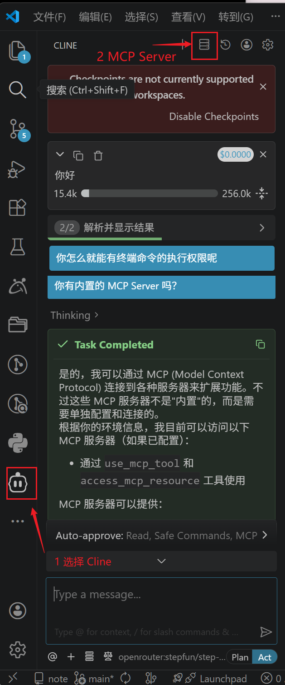
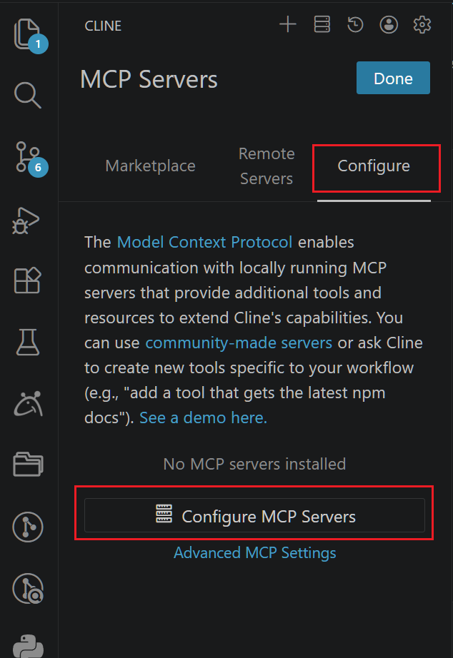
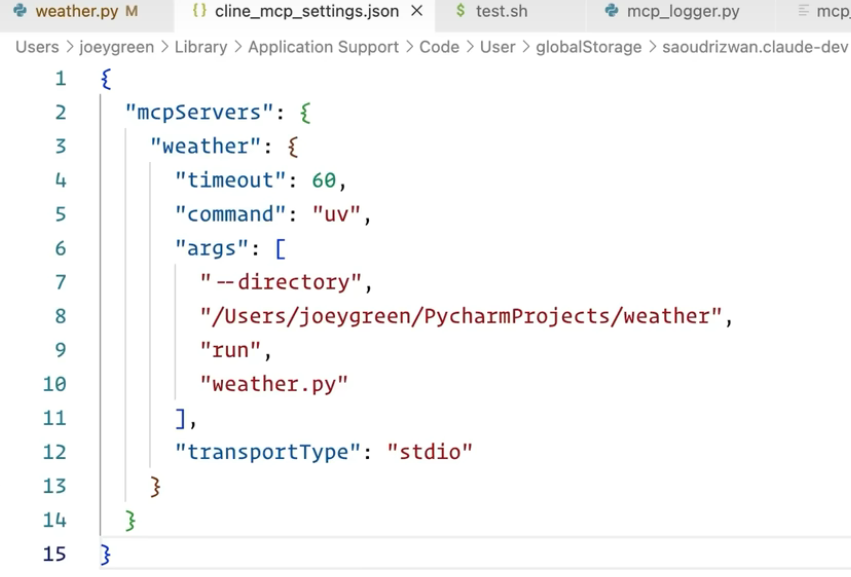
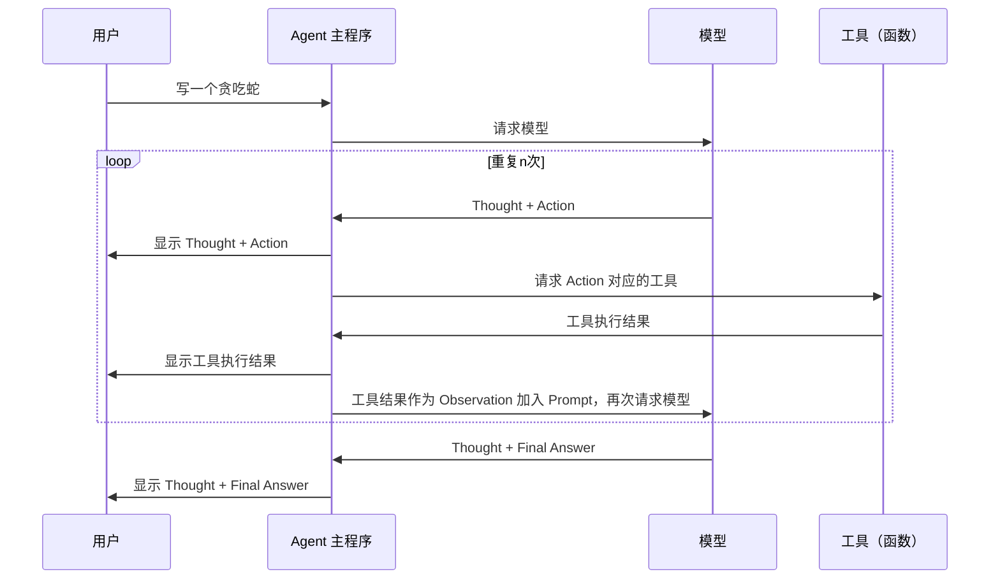
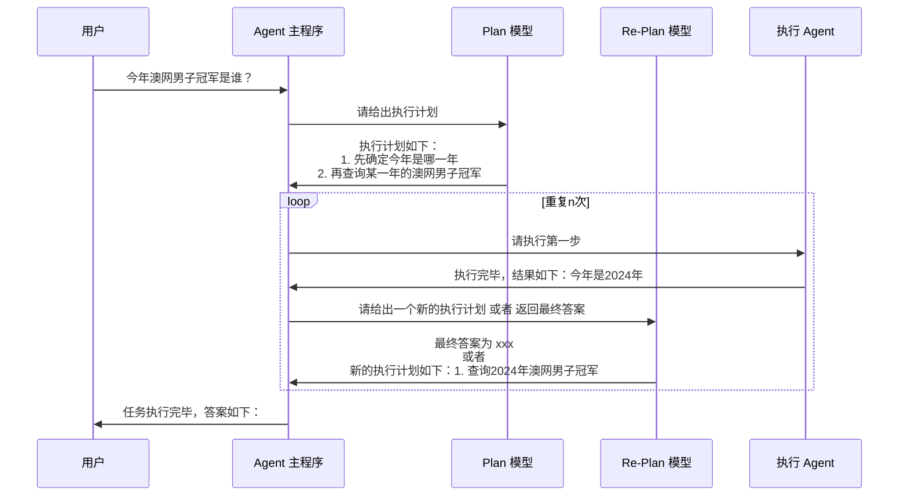
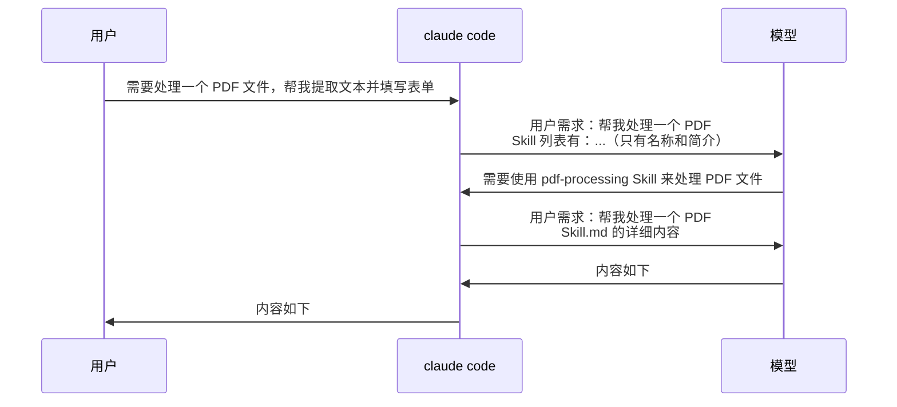

# Claude Code

> 《Claude Code 从 0 到 1 全攻略 —— MCP / SubAgent / Agent Skill / Hook / 图片 / 上下文处理/ 后台任务 / 权限 ......》<https://www.youtube.com/watch?v=AT4b9kLtQCQ> | <https://www.bilibili.com/video/BV14rzQB9EJj/>
>
> [锐评Claude所有指令](https://www.bilibili.com/video/BV1JDwxzwE2t/)
>
> [MCP终极指南 - 从原理到实战，带你深入掌握MCP（基础篇）](https://www.bilibili.com/video/BV1uronYREWR/)
>
> [MCP终极指南 - 带你深入掌握MCP（进阶篇）](https://www.bilibili.com/video/BV1Y854zmEg9)
>
> [MCP终极指南 - 番外篇：抓包分析 Cline 与模型的交互协议（内含 Agent 的实现原理）](https://www.bilibili.com/video/BV1v9V5zSEHA)
>
> [Agent 的概念、原理与构建模式 —— 从零打造一个简化版的 Claude Code](https://www.bilibili.com/video/BV1TSg7zuEqR/)
>
> [Agent Skill 从使用到原理，一次讲清](https://www.bilibili.com/video/BV1uronYREWR)
>
> [20251112 Claude Code 使用手册](https://km.sankuai.com/collabpage/2732883672)

## 1. 安装

官网打开，就有安装方式：<https://claude.com/product/claude-code>

### 1.1. 常用Skill

```shell
# superpowers
/plugin install superpowers@claude-plugins-official
# karpathy-skills
/plugin marketplace add forrestchang/andrej-karpathy-skills
/plugin install andrej-karpathy-skills@karpathy-skills
```

## 2. 基础交互

### 2.1. 启动

```shell
claude

# c: continue 打开自动恢复上一次的对话
claude -c

# yolo 模式
claude --dangerously-skip-permissions
```

yolo模式：`bypass permission on`：在启动时添加 `--dangerously-skip-permissions` 参数。进入该模式后，状态变为 `bypass permission on`，Claude 将不再询问任何权限（包括安装依赖、删改文件），从而实现全自动开发，但是这样 Claude Code 也拥有了所有权限，比较危险

### 2.2. 登录和模型设置

`/login`

使用国内模型的话，设置几个环境变量即可。`~/.claude/settings.json`

```powershell
# 设置 OpenRouter 相关环境变量
$env:OPENROUTER_API_KEY = "key"
$env:ANTHROPIC_BASE_URL = "https://openrouter.ai/api"
$env:ANTHROPIC_AUTH_TOKEN = $env:OPENROUTER_API_KEY
$env:ANTHROPIC_API_KEY = "" # 显式设置为空字符串
$env:ANTHROPIC_DEFAULT_OPUS_MODEL = "qwen/qwen3.6-plus:free"
$env:ANTHROPIC_DEFAULT_SONNET_MODEL = "qwen/qwen3.6-plus:free"
$env:ANTHROPIC_DEFAULT_HAIKU_MODEL = "qwen/qwen3.6-plus:free"
$env:CLAUDE_CODE_SUBAGENT_MODEL = "qwen/qwen3.6-plus:free"
```

### 2.3. 模式

- 默认模式 (显示：`? for shortcuts`)：最谨慎，每次增删改文件都会询问
- 自动模式 (显示：`accept edits on`)：效率最高，自动执行文件操作
- 规划模式 (显示：`plan mod on`)：只聊天、出方案，不实际执行代码修改，适合构思

切换模式：`Shift + Tab`

即使在自动模式下，Claude 执行 mkdir 等终端命令（被视为危险操作）时仍会询问

### 2.4. 常用命令

| 命令                                            | 简短说明         | 功能说明                                                                                                                                                                                                                                  |
| ----------------------------------------------- | ---------------- | ----------------------------------------------------------------------------------------------------------------------------------------------------------------------------------------------------------------------------------------- |
| `/init`                                         | 初始化项目       | 生成项目级的 `CLAUDE.md`，可以让它用中文写。Claude 每次启动都会自动读取该文件，实现跨会话的项目规范记忆                                                                                                                                   |
| `/memory`                                       | 编辑 `CLAUDE.md` | 快速打开并编辑该 `CLAUDE.md`                                                                                                                                                                                                              |
| `/compact`                                      | 上下文压缩       | 对冗长的对话历史（包括代码和 MCP 返回结果）进行压缩，仅保留核心内容，以节省 Token 并提升性能。这个命令可以加一些压缩策略（自然语言）                                                                                                      |
| `!`                                             | 运行终端命令     | 进入 Bash 模式，直接运行终端命令（如 `!open index.html`）来预览效果                                                                                                                                                                       |
| `Shift + Enter`                                 | 换行             | 在输入框内换行，避免直接敲回车导致未写完就提交                                                                                                                                                                                            |
| `Ctrl + G`                                      | 外部编辑         | 调起外部编辑器：打开 VS Code 标签页来编辑复杂的 Prompt。在 VS Code 中编写并保存关闭后，内容会自动同步回 Claude Code 的输入框                                                                                                              |
| `Ctrl + B`                                      | 后台运行         | 可将当前运行的服务置于后台，恢复主对话框的交互，例如运行开发服务器（如 `npm run dev`）会阻塞 Claude 的输入框                                                                                                                              |
| `/tasks`                                        | 后台任务管理     | 可列出所有后台任务，并支持按 `K` 键强制结束特定任务                                                                                                                                                                                       |
| `/rewind` 或 双击 ESC                           | 版本回退         | 进入回退页面，Claude 为每次请求都自动创建了回滚点。可选择仅回滚会话、仅回滚代码，或两者同时回滚。Claude 只能回滚它自己写入的文件内容，对于通过终端命令生成的产物（如 `node_modules` 文件夹）无法自动删除，建议配合 Git 使用以实现精准回退 |
| `/resume`                                       | 恢复之前的对话   | 恢复之前的对话                                                                                                                                                                                                                            |
| `/clear`                                        | 清空会话         | 彻底清空当前会话的记忆                                                                                                                                                                                                                    |
| `Ctrl + V`（注意 mac 也**不**是 `Command + V`） | 粘贴图片         | 图片交互，也可以将图片通过直接拖拽                                                                                                                                                                                                        |
| `/hooks`                                        | `hook`配置       | 可以配置一些钩子，例如通过结合 jq 解析文件路径并调用 Prettier，实现在 Claude 每次写完代码后自动进行格式化                                                                                                                                 |
| `/mcp`                                          | MCP管理          | 查看所有安装的 MCP 工具                                                                                                                                                                                                                   |
| `/skills`                                       | Skill管理        | 查看所有安装的 Skill                                                                                                                                                                                                                      |
| `/skill_name`                                   |                  | 主动发起 Skill 使用                                                                                                                                                                                                                       |
| `/agents`                                       |                  | 管理用于专业任务的自定义 AI 子代理                                                                                                                                                                                                        |
| `/plan`                                         |                  |                                                                                                                                                                                                                                           |
| `/btw`                                          |                  |                                                                                                                                                                                                                                           |
| `/diff`                                         |                  |                                                                                                                                                                                                                                           |
| `/context`                                      |                  |                                                                                                                                                                                                                                           |
| `/insights`                                     |                  |                                                                                                                                                                                                                                           |
| `/help`                                         |                  | 获取使用帮助                                                                                                                                                                                                                              |
| `/copy`                                         |                  |                                                                                                                                                                                                                                           |
| `/doctor`                                       |                  | 自检 Claude Code 的问题                                                                                                                                                                                                                   |
| `/cost`                                         |                  | 显示 token 使用统计                                                                                                                                                                                                                       |
| 支持自定义                                      |                  |                                                                                                                                                                                                                                           |
| `/plugin`                                       |                  | 进入插件管理器                                                                                                                                                                                                                            |

## 3. MCP

### 3.1. MCP 推荐

推荐几个常用的 MCP：

- `sequentialthinking`：提升模型思考能力，能够将复杂的问题拆分成一个个可管理的小步骤，让 AI 可以逐步（按顺序）进行分析和处理。
- `context7`：开源项目的API文档说明，注意这里尽量不要使用 SSE 方式，会经常链接不上，建议 npx 的方式。这里需要一个 API_KEY，注册地址：<https://context7.com/sign-in?redirect_url=%2Fdashboard>
- `mdp-agent`：美团内部版 Context7（也内置了读学城的 MCP，推荐安装），参考文档：美团Context7服务 PR-FAQ、MDP小确幸32 - MDP Agent来了！让AI真正“懂”美团后端开发
- `google-search`：谷歌搜索，底层使用playwright。github 地址：<https://github.com/jae-jae/g-search-mcp>
- `fetcher`：拉取网页，底层使用playwright，可以无视 robots.txt 协议。github 地址：<https://github.com/jae-jae/fetcher-mcp>
- `chrome-devtools-mcp`：让您的 Code Agent 控制和检查实时的 Chrome 浏览器。它充当 Model-Context-Protocol (MCP) 服务器，为 Code Agent 提供 Chrome DevTools 的全部功能，用于可靠的自动化、深入调试和性能分析。github 地址：<https://github.com/ChromeDevTools/chrome-devtools-mcp>

### 3.2. MCP 基础

#### 3.2.1. 一些概念

| 词语       | 含义                                                                                               |
| ---------- | -------------------------------------------------------------------------------------------------- |
| MCP        | Anthropic 公司提出的一个协议，Model Context Protocol，模型上下文协议。让大模型使用外部工具的能力。 |
| MCP Host   | 一个支持 MCP 协议的软件，常见的有 Claude Desktop, Cursor, Cline, Cherry Studio 等。                |
| OpenRouter | 提供API聚合能力的一个网站，可以路由到不同的很多模型，里面还有免费的。                              |
| Cline      | 一个 MCP Host，是一个 VS Code 的插件。安装后在左侧会多出一个图标，安装好后先配置API。              |
| MCP Server | 符合 MCP 协议的程序，可能联网或不联网，里面包含若干的 Tool。其实就是一个包含了若干函数的包。       |

自定义的 MCP 就是约定好：

1. MCP Server 有哪些函数（函数注册）
2. 函数如何调用（函数使用）

但是不规定 **如何与模型进行交互**。

Model Context Protocol，定义的只是无关模型的，服务于模型，获取其他信息的协议。

#### 3.2.2. 示例：Cline 安装 MCP Server

可以自动安装，但是自己安装更好控制一些东西，比如说安装路径等。

<div style="display: flex; gap: 12px; align-items: flex-start;">
  
  
  
</div>

如果远程的新 MCP Server 安装超时了，可以自己去终端执行一下命令。

### 3.3. MCP Server 原理

每次交互的时候，会给模型目前安装的 MCP Server 的列表

### 3.4. MCP 市场

<https://smithery.ai/>

<https://mcp.so/>

<https://mcpmarket.com/zh>

### 3.5. uvx 和 npx 的安装

MCP 一般是用 Python 或者 NodeJs 编写，对应的启动程序一般是 uvx 或者 npx

`uvx` 是 `uv tool run` 的缩写。

uv 的安装，可以去 <https://github.com/astral-sh/uv>

node 的安装，可以去 <https://nodejs.org/zh-cn>

## 4. Agent

模型本身无法感知、改变外部环境，只能回答问题。所以我们提供一个工具列表，使得可以借助大模型的能力读写文件、运行命令，形成了一个 Agent。例如有 Cursor、Manus、Claude Code。

以 Cline 使用 MCP 时为例：Cline 在跟模型交互的时候，定义了很长的 System Prompt，要求模型先 Thinking，调用 MCP 的格式，在觉得完成任务的时候，返回 attempt_completion，Cline 就会将结果返回给用户。

### 4.1. ReAct 模式

目前最常见，使用最广泛的 Agent 构建模式。

Reasoning And Acting => ReAct

是2022年一篇论文提出的理念，可以在不需要人工干预的情况下，让模型自主思考，自己调用工具，完成任务。

这就是一个 Agent，一个可以持续思考，持续调用外部工具，解决用户问题的工具。

Cline 就是按照这个思想来构建工作过程的：Thought Action Observation

让模型 思考内容 Thought，让模型给出 Action，等待 Observation。然后把结果以 Observation 给模型，重复上面的流程。

最终在 Thought 时发现任务已经完成了，给出 Final Answer



### 4.2. Plan-And-Execute

有很多先规划，再执行的模式，例如 LangChain 提出的 Plan-And-Execute。



## 5. Skill

简单理解：一个给大模型的说明文档。按需加载。

### 5.1. 基本用法

SKILL 在文件上是一个包含 `SKILL.md` 的文件夹。

可以保存在2个路径下：

- 用户全局可用：`~/.claude/skills/`，放在这里的 Skill 可以在任何项目中被调用。
- 项目特定：`.claude/skills/`，放在这里的 Skill 仅在当前项目中可用，适合与项目紧密相关的功能。

#### 5.1.1. SKILL.md 的内容结构

```yaml
---
name: your-skill-name
description: Brief description of what this Skill does and when to use it
---

# Your Skill Name

## Instructions
[Clear, step-by-step guidance for Claude to follow]

## Examples
[Concrete examples of using this Skill]
```

SKILL 的内容分为三部分，分级加载，**渐进式披露（Progressive Disclosure）**：

##### 5.1.1.1. Level 1: 元数据（Metadata）（始终加载） (always loaded)

```yaml
---
name: pdf-processing
description: Extract text and tables from PDF files, fill forms, merge documents. Use when working with PDF files or when the user mentions PDFs, forms, or document extraction.
---
```

元数据部分是必须的，且 `name` 和 `description` 是必须的。

###### 5.1.1.1.1. `name`（必须）

必须和文件夹的名称相同。

作为 skill 的唯一标识符，用于命令调用和系统索引。

- 最多 64 个字符
- 只能包含小写字母(a-z)、数字(0-9)和连字符(-)
- 不能包含 XML 标签
- 不能使用保留字：anthropic、claude

最佳实践：

- 动名词形式(推荐)：`processing-pdfs`、`analyzing-spreadsheets`、`managing-databases`
- 名词短语：`pdf-processing`、`spreadsheet-analysis`
- 避免：模糊名称(`helper`、`utils`)、过于通用(`documents`、`data`)

- ✓ 推荐:清晰描述功能 `pdf-form-filling`
- ✗ 避免:包含大写字母 `pdfHelper`
- ✗ 禁止:使用保留字 `anthropic-pdf`

###### 5.1.1.1.2. description（必须）

对这个 Skill 的简要描述，告诉 Claude 这个 Skill 是干什么的，什么时候用的。

- 非空，最多 1024 个字符
- 不能包含 XML 标签
- 必须使用第三人称(描述被注入到系统提示词中)

编写原则：

1. 列举触发词：包含用户可能使用的关键术语
2. 明确场景：说明何时应该使用此 skill

- ✓ 优秀：`从 PDF 文件中提取文本和表格、填充表单、合并文档。在处理 PDF 文件或用户提及 PDF、表单或文档提取时使用。`
- ✗ 模糊：`帮助处理文档`

- ✓ 具体：`分析 Excel 电子表格、创建数据透视表、生成图表。在分析 Excel 文件、电子表格、表格数据或 .xlsx 文件时使用。`
- ✗ 不够具体：`处理数据`

###### 5.1.1.1.3. allowed-tools（可选）

预授权工具白名单，避免重复的用户确认提示，提升执行效率。

- 可选值：任何 Agent 支持的工具名称(bash、read、write、grep、glob 等)

使用场景：

1. skill 需要频繁使用特定工具
2. 工具操作是安全且可预测的
3. 希望提供流畅的用户体验

示例：

```yaml
allowed-tools:
    - bash # 允许执行脚本
    - read # 允许读取文件
    - write # 允许写入结果
```

安全提示：仅授权 skill 必需的工具，遵循最小权限原则。

###### 5.1.1.1.4. compatibility（可选）

声明与特定模型或环境的兼容性，帮助 Claude 选择合适的技能版本。

##### 5.1.1.2. Level 2: 指令（Instructions）（触发时加载）(loaded when triggered)

篇幅建议：SKILL.md 主体保持在 500 行左右，超出部分拆分到独立的参考文件中。

````yaml
# PDF Processing

## Quick start

Use pdfplumber to extract text from PDFs:

```python
import pdfplumber

with pdfplumber.open("document.pdf") as pdf:
    text = pdf.pages[0].extract_text()
```

For advanced form filling, see [FORMS.md](FORMS.md).

````

##### 5.1.1.3. Level 3: 资源和代码（Resources and code）（按需加载）(loaded as needed)

```text
pdf-skill/
├── SKILL.md (main instructions)            # 核心指令文件(必需)，触发条件 + 核心使用指引
├── FORMS.md (form-filling guide)
├── REFERENCE.md (detailed API reference)   # 参考文档(可选)，可以是一个文件夹，详细 API 文档、函数签名
└── scripts/                                # 可执行脚本(可选)
    └── fill_form.py (utility script)
└── assets/                                 # 资源文件(可选)，输出模板、静态资源
└── config.json                             # 初始化配置（用户或 Agent 填写）
```

#### 5.1.2. claude code 使用 Skill 的流程



### 5.2. 高级用法

一些更多层级的按需加载，渐进式披露

#### 5.2.1. Reference

可以在 SKILL.md 中提供一些参考资料的链接，或者一些相关的代码文件，供模型按需加载使用。

在 skill 里指示模型，在遇到什么什么条件的情况下，去读取什么文件。

#### 5.2.2. Script

在 skill 里指示模型，在遇到什么什么条件的情况下，去执行什么命令，运行什么脚本。

**这个代码只会被执行，不会被读取！**

告诉它脚本执行的代码示例即可，例如：

在遇到什么什么的情况下，你必须运行 `script.py`，运行的命令如下：

```python
python scripts/script.py "一些信息"
```

### 5.3. 与 MCP 比较

| 类型     | MCP                      | Skill                |
| -------- | ------------------------ | -------------------- |
| 功能     | 给大模型提供数据         | 教大模型如何处理数据 |
| 本质     | 程序                     | 文档                 |
| 适用场景 | 代码执行场景更安全和稳定 | 轻量脚本，简单逻辑   |

### 5.4. 编写注意事项

#### 5.4.1. 原则零、SKILL.md 只做入口和导航

详细内容放子文件。Agent 会在需要时主动读取，而不是一次性把所有内容塞进上下文。

#### 5.4.2. 原则一、description 是触发器，不是简介

Session 启动时，Agent 扫描所有 Skill 的 description 字段来决定"这个请求该用哪个 Skill"。description 写的是激活条件，不是功能描述。

description 是 Agent 决策树的第一个节点。写不准，Skill 就会错误触发或从不触发。

```yaml
<!-- 糟糕的 description -->

description: 这个 Skill 帮助你分析数据和查询指标

<!-- 正确的 description -->

description: 当用户要查指标、查 BI 看板、执行 Hive SQL、用魔数查数据时激活。
触发词：查指标、魔数、探数、执行 SQL、BI 看板、数据分析、指标查询。
不适用：纯 RDS 查询（用 mtdev rds）、数仓设计（用 dw-designer）。
```

#### 5.4.3. 原则二：不要陈述废话

Agent 对代码、常见库、标准工具已有充分了解。Skill 的价值在于把 Agent 从默认思路推向正确路径，而不是重复 Agent 已经知道的内容。

```yaml
<!-- 糟糕的内容（模型已知，无需写）-->

## 如何用 Python 连接 MySQL

import pymysql
conn = pymysql.connect(host='...', user='...', password='...')

<!-- 正确的内容（模型不知道的内部信息）-->

## 连接美团内部 RDS

使用 mtdev rds query <db_id> "SQL"，db_id 从 mtdev rds ls --keyword <name> 获取。
不要直接用 pymysql，无法通过公司鉴权。
```

只写 Agent 不知道的、容易踩坑的内容。Context Window 是公共资源，每个不必要的 Token 都是浪费。

#### 5.4.4. 原则三：必须有 Gotchas （闭坑）章节

Skill 里信噪比最高的内容。从 Agent 的真实失败案例中提炼，随使用持续迭代。一个好的 Gotchas 比三倍的正向说明更有价值：

```yaml
## ⚠️ 常见踩坑

- **不要直接 `km get` 超长文档**：先重定向到文件 `km get <id> > /tmp/doc.md`，再用 `grep` 按需提取，否则超长内容会撑爆上下文
- **`mtdev rds query` 必须加 LIMIT**：先 `LIMIT 100` 探索结构，确认结果集大小后再决定是否全量查询
- **ops JSON 不能拼命令行**：`km edit --ops-file` 要先把 JSON 写入文件再传路径，直接拼接会触发 Shell 转义地狱
```

#### 5.4.5. 原则五：给 Agent 脚本，而不是让 Agent 写脚本

把常用操作封装为脚本放在 scripts/ 目录，让 Agent 专注在组合决策，而不是每次从头重写样板代码：

```yaml
# scripts/fetch_order_metrics.py

def fetch_brand_orders(brand_id: int, start: str, end: str) -> pd.DataFrame:
"""从魔数拉取指定品牌的订单指标，start/end 格式: YYYY-MM-DDTHH:MM"""
...
```

Agent 拿到这个脚本后，可以直接组合调用，而不需要自己构造 HTTP 请求、处理鉴权、解析响应格式。提供工具 > 提供说明。

#### 5.4.6. 原则六：善用文件系统做渐进式信息披露

不要把所有内容堆在 SKILL.md 里。把详细内容分层存放，在主文件中用路径引用，让 Agent 按需加载：

```yaml
## 参考资料

- 详细函数签名和返回格式 → `references/api.md`（首次调用前必读）
- 常用查询模板 → `references/query-patterns.md`
- 报告输出模板 → `assets/report-template.md`（生成报告时使用）
```

这与 CLI 的三级 --help 是同一设计哲学：概览在主文件，细节在子文件，按需发现，而不是一次性全部加载。

#### 5.4.7. 原则七：为需要初始化的 Skill 设计 config.json

如果 Skill 需要用户提供上下文信息（目标群组 ID、数据库名、默认时间范围等），通过 config.json 管理，而不是让 Agent 每次都询问：

```yaml
// config.json（不存在时 Agent 引导用户填写）
{
"dx_group_id": "",
"default_brand_id": 437,
"default_time_range": "7d"
}
```

Agent 检测到字段为空时应提示用户完成初始化，而不是静默失败或使用错误的默认值。

#### 5.4.8. 原则八：过度约束Agent

Skill 提供信息和约束，但要保留 Agent 的判断空间。步骤太死板，Agent 遇到边界情况时会卡住或产生错误。

```yaml
<!-- 糟糕：写死流程 -->

第 1 步：执行 mtdev rds ls --keyword waimaieopen
第 2 步：取第一个结果的 ID
第 3 步：执行 mtdev rds query <ID> "SELECT COUNT(\*) FROM order_info LIMIT 10"
第 4 步：把结果格式化为表格输出

<!-- 优秀：给方向，给Agent空间 -->

查询订单数据时，先用rds ls 找到 db_id，再用 rds db_id获取表结构。
注意必须加 LIMIT，查询结果按需格式化（表格或 JSON 均可）。
```

#### 5.4.9. 原则九：数据持久化存稳定目录，不要存 Skill 目录

Skill 目录在升级时可能被覆盖，执行日志、历史记录、缓存等持久化数据应存到约定的工作区路径：

```yaml
## 数据存储规范

- 执行日志：`~/.meituan_local/logs/meituan_personal_mcp.log`
- 用户配置：`~/.meituan_local_config.json`（存在 Skill 目录，升级时注意备份）
- 临时文件：`/tmp/<skill-name>-<timestamp>.json`（进程退出后自动清理）

⚠️ 不要直接把业务数据写入 Skill 目录，升级时会丢失。
```

## 6. SubAgent

使用 `/agents` -> `create new agents` 创建 SubAgent

### 6.1. Skill 与 SubAgent 的区别

Agent Skill: 共享主对话上下文，适合：与上下文关联大，对上下文影响小的。例如生成日报。

SubAgent: 拥有独立上下文，适合：与上下文关联小，对上下文影响大。主对话关联小，但需要处理大量信息的。例如项目审核、代码重构等。

## 7. Plugin

把一系列的 Skill SubAgent Hook 等打包成一个 Plugin，方便在不同项目间迁移和复用。

| 主要功能            | 说明                                                                                     |
| ------------------- | ---------------------------------------------------------------------------------------- |
| `agent-sdk-dev`     | 用于使用 Claude Agent SDK 的工作开发包                                                   |
| `pr-review-toolkit` | 专注于评论、测试、错误处理、类型设计、代码质量和代码简化的综合PR审查代理                 |
| `commit-commands`   | Git commit 工作流的命令，包括提交、推送和 PR 创建                                        |
| `feature-dev`       | 全面的功能开发工作流程，包含用于代码库探索、架构设计和质量审查的专门智能体               |
| `security-guidance` | 安全提醒钩子，在编辑文件时会警告潜在的安全问题，包括命令注入、XSS和unsafe代码模式        |
| `code-review`       | 使用多个专业代理对拉取请求进行自动化代码审查，并通过基于置信度的评分过滤误报             |
| `frontend-design`   | 打造具有高设计水准的独特色前端界面。生成创意精湛、精心打磨的代码，避免通用的AI审美风格。 |

插件安装

```shell
## 打开 claude code
mc --code --model glm-4.6

## 添加插件市场（使用其他的插件市场替换 anthropics/claude-code 即可）
/plugin marketplace add anthropics/claude-code

## 安装 feature-dev
/plugin install feature-dev@anthropics/claude-code

## 安装 pr-review & code-review
/plugin install pr-review-toolkit@anthropics/claude-code
/plugin install code-review@anthropics/claude-code
```

## 8. CLI 实践避坑指南

### 8.1. 4.1 核心设计原则

#### 8.1.1. 原则一：Unix 风格的按需发现

不要把所有文档塞进 Agent 的上下文。提供标准的 `--help` 机制，让 Agent 在需要时主动探索，类似Skill的渐进式披露，命令层级保持克制，建议不超过3层：顶层命令表达领域，第二层表达资源或动作，第三层处理具体操作；超过 3 层时，应优先考虑合并中间层、改用 flag，或提供高频别名。

```shell
mtdev --help # 列出所有顶层命令
mtdev rds --help # 显示 rds 子命令的参数和用法
mtdev rds query --help # 显示 query 子命令的详细参数
```

#### 8.1.2. 原则二：Help 文案要分层、稳定、对 Agent 友好

Help 文案是 Agent 的使用说明。每一级 help 只解释当前层，不混入父子层参数；参数说明不仅要写“这是什么”，还要写“什么时候用”；对于结构化输入、默认值、枚举值、互斥关系和常见限制，要明确写出，不要让 Agent 猜。建议模块：Usage / Commands /Options 可选：Examples / Global Options/ Notes / See Also其中 Global Options 应单独标识，不要与当前子命令的 Options 混写。

```shell
cmd [global options] <command> <args>

cmd CLI : send, search, history, group, sessions, watch

Global Options:
--json Output JSON
--format <format> Output format: text|json|markdown
--verbose Show verbose details
-V, --version Show version
-h, --help display help for command

Commands:
send [options] [message] Send text/markdown/rich/link/reply/recall
history [options] Fetch recent history or search keyword in one target session
search [options] <keyword> Search contacts/groups/public accounts
group Group management: create/rename/notice/members
sessions [options] Session management and unread triage views
help [command] display help for command

Notes: - Use --params for short JSON only. - Use --params-file or --params @FILE for large payloads. - Use --params @- to read from stdin.

Examples:
dx group create "xm-test-group" --mis zhangsan --mis lisi --notice "本群公告"
dx sessions groups --full --json

See Also:
xx
```

增加示例：对复杂或多次调用错误的命令增加示例，看到示例后的成功率远高于只有参数说明的情况。

#### 8.1.3. 原则三：操作主体优先使用位置参数，行为控制使用 Options

命令的核心操作对象，如资源名、方法名、文件路径、查询关键字等，优先使用位置参数（args）表达；环境、格式、 超时、详细级别等行为控制项使用 options。这样可以让命令语义更清晰，也更符合 Agent 对 CLI 的默认推断方式。位置参数对顺序敏感，多了对Agent不友好，建议控制在1-2个。

```shell
# 推荐

mtdev octo invoke com.foo.BarService.echo --params @payload.json
km get 2751867810 --json

# 不推荐

mtdev octo invoke --method com.foo.BarService.echo --params @payload.json
km get --doc-id 2751867810 --json
```

#### 8.1.4. 原则四：默认输出要易读，结构化输出要稳定可解析

应避免只输出难以理解的内部字段或纯时间戳；时间字段优先给出 ISO 8601 或格式化文本，必要时再附带 epoch。枚举不要只输出数字，实体不要只输出ID，要有含义说明；la--json 的字段名和语义要尽量稳定，新字段只增不删，避免每次升级都让 Agent/Skill 重学输出格式。

```shell
# 糟糕的输出：只有 epoch，语义不清晰

{"create_time":1742601600,"update_time":1742688000}

# 结构化输出

{
"create_time": "2026-03-22T00:00:00+08:00",
"update_time": "2026-03-23T00:00:00+08:00"
}
```

#### 8.1.5. 原则五：stdout、stderr 和 exit code 的职责必须明确

对 Agent 来说，可靠的命令调用不仅取决于输出内容，还取决于输出通道和退出码。建议约定：stdout 只放结果，stderr 放告警、诊断、补救建议；成功返回 0，参数错误、权限错误、资源不存在等场景使用可区分的非零退出码。不要把错误提示和正常结果混在 stdout 中，也不要在失败时返回模糊的成功码。

```shell
stdout:
Found 3 databases

stderr:
Tip: use --json for full metadata

[exit:0]
```

#### 8.1.6. 原则六：只输出必要信息，列表命令默认分页或限制结果集

结果应避免默认输出过长，只输出对 Agent 推理有用的必要信息。更多额外信息可通过 --verbose、--debug、--json 引导 Agent 在需要时再取。对于列表或查询类命令，建议默认 limit 或分页，并在输出中明确告诉调用方“还有更多结果如何继续取”。

```shell
# 默认输出：简洁摘要

$ mtdev rds ls --keyword waimaieopen
Found 3 databases:

1. waimaieopen_db (ID: 123456, Cluster: prod-mysql-01)
2. waimaieopen_read_db (ID: 123457, Cluster: prod-mysql-01)
3. waimaieopen_test_db (ID: 123458, Cluster: test-mysql-01)

Tip: use --json for full metadata

# 详细输出：加 --json 获取完整信息

$ mtdev rds ls --keyword waimaieopen --json
```

#### 8.1.7. 原则七：支持非TTY格式输出或自适应命令输出

所有命令都必须能在非交互环境下完整执行，建议统一处理，在管道/非tty输出中识别并输出JSON格式的完整稳定数据。只支持交互式输出的命令（包含ANSI控制指令，比如表格、进度条等）在Agent、CI/CD、管道场景都会出现信息丢失。建议在框架层统一处理，可以参考waimai-ai-tools中的OutputManager。

#### 8.1.8. 原则八：Tips驱动的错误处理

当命令失败时，不要只返回错误信息，必须提供下一步建议：每一次无效探索都会在上下文中留下痕迹，消耗后续每一轮推理的注意力资源。一个有用的提示可以节省数千个 Token。例如命令应主动告诉 Agent 下一步该补哪个参数、换哪个命令、还是把内容保存到文件。mtcurl 在检测到图片/音频/PDF 时，自动保存到文件并提示路径，而不是把二进制字节流吐给 Agent。

```shell
# 糟糕的错误处理

km read-file https://km.sankuai.com/api/file/123/diagram.png
Error: binary content

# 正确的错误处理

mtcurl https://km.sankuai.com/api/file/123/diagram.png
Binary image file detected (image/png, 182KB).
Saved to: /tmp/km_file_123.png
```

#### 8.1.9. 原则九：大输出截断与文件重定向

当输出超过 200 行或 50KB 时，CLI 可以在终端中自动截断，并提示把完整内容保存到文件，引导 Agent 使用 grep、head、tail 等工具按需探索。但截断只应发生在 TTY 展示场景，不应污染重定向、管道和 --json 输出，否则会破坏后续工具链。

```shell
km get 2751867810

# 当文档超长时

⚠ Output truncated (312 lines, 62KB). Full content saved to: /tmp/km_2751867810.md
Explore: cat /tmp/km_2751867810.md | grep "keyword"
cat /tmp/km_2751867810.md | head 50

# 主动重定向（推荐）

$ km get 2751867810 > /tmp/km_doc.md
```

#### 8.1.10. 原则十：参数较大时支持文件读取

当输入内容较大时，CLI 应支持通过文件读取，而不是要求 Agent 将整段内容内联到命令参数中。这样既能避免大段文本或 JSON 挤占上下文窗口，也能减少 shell 转义错误；同时文件输入更容易复用、编辑、保存和重复执行，适合多轮调试与批量调用。

```shell
km create --title 'title' --file xxx.md
```

#### 8.1.11. 原则十一：使用stdin和文件避免转义地狱

这是工程实践中最常见的坑。当 Agent 需要传递包含引号、换行符或大段 JSON 的内容时，JSON 转义与 Shell 转义叠加会导致大量错误。通用做法不是“教 Agent 怎么正确转义”，而是从 CLI 设计上支持 --xxx-file、@file、@- 或 stdin，让复杂输入脱离命令行字符串。

```shell
# 错误做法：在命令字符串中拼接复杂内容

mtdev octo invoke --params '[{"orderId":"12345","note":"it\"s urgent"}]'

# 正确做法：通过文件传参

echo '[{"orderId":"12345","note":"it\"s urgent"}]' > /tmp/params.json
mtdev octo invoke --params-file /tmp/params.json

# 从params.json读取

cmd --params @params.json

# 从stdin读取

cat params.json | cmd --params -

# herestring

cmd --params - <<< '[{"name":"张三","desc":"line1\nline2","meta":{"tags":["a","b"]}}]'

# heredoc

cmd --params - <<'EOF'
[
{
"name": "张三",
"desc": "line1\nline2",
"meta": {
"tags": ["a", "b"]
}
}
]
EOF
```

#### 8.1.12. 原则十二：参数要有明确的说明和格式校验

对于 Agent 的输入要严格校验。Agent 越来越智能，也会以意想不到的方式调用命令；如果参数语义不清晰、格式约束不明确，调用方就会用“看起来可能成立”的方式试探，轻则报错，重则把后端打崩。例如某个参数 --image 本意是接收图片链接，如果没有明确说明格式，Agent 可能直接传入 base64 数据。好的 CLI 应同时做到：帮助文案中写清格式约束，运行时做强校验，报错时给出纠正建议。

```python
def validate_km_url(url: str) -> str:
if url.startswith("data:"):
raise typer.BadParameter(
f"Expected a KM file URL (https://km.sankuai.com/api/file/...), "
f"got a data: URI. If you have a local file, save it first and use --file instead."
)
if not url.startswith("https://km.sankuai.com/"):
raise typer.BadParameter(
f"Expected a km.sankuai.com URL, got: {url[:50]}..."
)
return url
```

### 8.2. 4.2 安全设计模式

#### 8.2.1. 模式一：Dry-Run 预览（防止误操作）

对于可逆性差的操作，提供 --dry-run 模式，让 Agent 在执行前确认影响范围：

```shell
> dns update --zone example.com --record A --value 1.2.3.4
> ⚠ DRY RUN:
> A record for example.com: 5.6.7.8 → 1.2.3.4
> Propagation: ~300s. Not instantly reversible.
> To execute: add --confirm
```

#### 8.2.2. 模式二：人类授权阻塞（高危操作）

对于超出 Agent 自主权限的操作（如支付、转账），CLI 应阻塞并向人类设备发送推送通知：

```shell
> pay --amount 500 --to vendor --reason "office supplies for Q2"
> ⏳ Approval required. Notification sent to your device.
> Waiting for response...
> ✓ Approved. Payment of $500 completed.
> [exit:0 | 7.2s]
```

Agent 可以看到等待时间（7.2s），知道自己在等待人类授权，而不会误以为命令失败。
