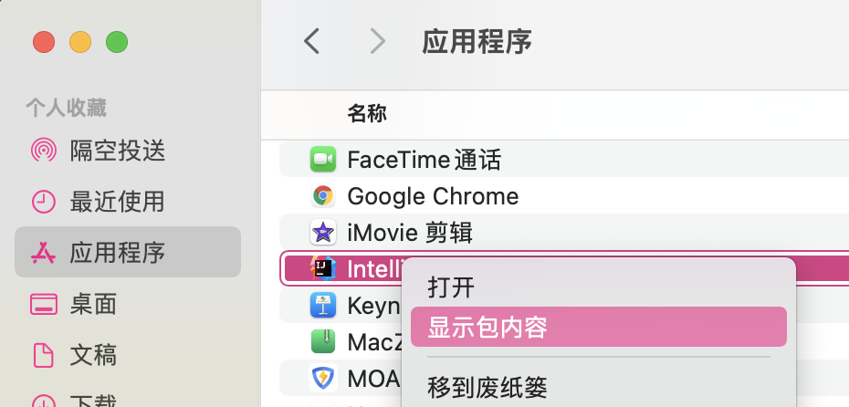

# 在一个之前没有用 lombok 的类里快速使用，并删除无用方法

# 堆内存不足

IDEA Help >> Change Memory Settings 增大IDEA的运行内存，Settings >> Build, Execution, Deployment >> Compiler >> Build Process >> Shared heap size 增大程序堆内存

# Maven报错Blocked mirror for repositories

可以通过以下方式解决：应用程序 >> IDEA 显示包内容 >> `../Contents/plugins/maven/lib/maven3/conf/settings.xml` 文件中注释掉 `maven-default-http-blocker` 相关内容

# Code Style

勾选了所有的 align when multiline

# 代码优化小技巧

选中整个项目，reformat