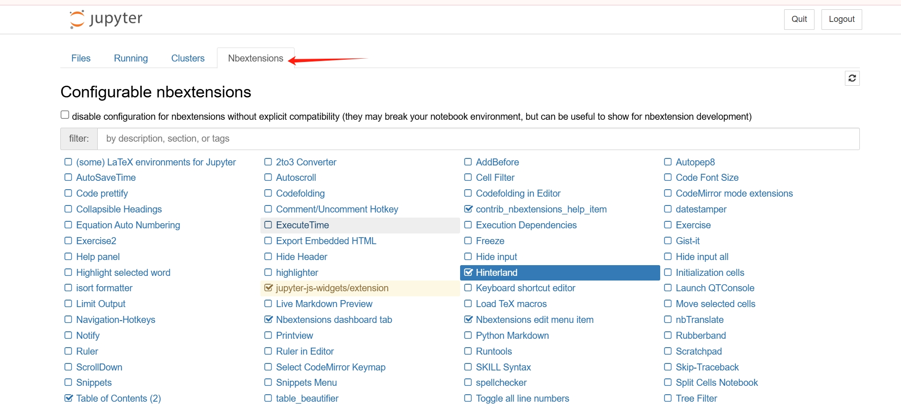

# mac 上启动

```shell
python3 -m notebook --notebook-dir='/Users/chen/Documents/jupyter_notes'
```

或者将 `python/bin` 加入到 path 里
```shell
export PATH="/Users/chen/Library/Python/3.9/bin:$PATH"
```

# 扩展

> https://github.com/ipython-contrib/jupyter_contrib_nbextensions

```shell
pip install jupyter_contrib_nbextensions
jupyter contrib nbextension install --user
```

## 扩展管理器

> https://github.com/Jupyter-contrib/jupyter_nbextensions_configurator


```shell
pip install jupyter_nbextensions_configurator
jupyter nbextensions_configurator enable --user  # can be skipped for notebook >=5.3
```



## 自动补全

[Hinterland](https://jupyter-contrib-nbextensions.readthedocs.io/en/latest/nbextensions/hinterland/README.html)

Tree Filter 神器，jupyter Tree目录下直接检索文件名，原生不支持flter挺奇怪的Collapsible headings 折叠标题 神器，直接让你的代码块能结合markdown标题分段折叠
Notify 通知机制，跑一些耗时较久的任务，完成后通知
Codefolding 折叠代码
Zen mode extension 隐藏活动状态栏，经典禅模式
Execute time extension 显示运行时间
Hinterland 代码提示
AutoSaveTime 设置自动保存时间
Code prettify 代码格式美化
其他有需要就勾选，直接点击词条就会有详细描述的


