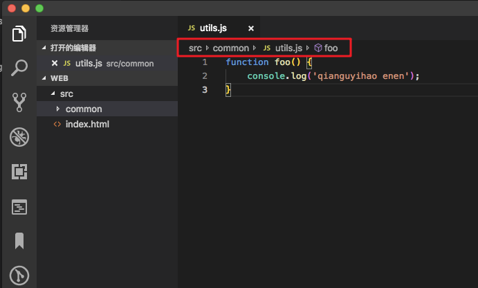

# VSCode

## 1. 我的配置备份

### 1.1. mac

#### 1.1.1. 设置

```json
{
    "[markdown]": {
        "editor.quickSuggestions": {
            "comments": "on",
            "other": "on",
            "strings": "on"
        },
        "files.trimTrailingWhitespace": false
    },
    "[mermaid]": {
        "files.trimTrailingWhitespace": false
    },
    "[python]": {
        "editor.defaultFormatter": "ms-python.black-formatter"
    },
    "cSpell.blockCheckingWhenLineLengthGreaterThan": 100000,
    "editor.defaultFormatter": "esbenp.prettier-vscode",
    "editor.fontFamily": "Menlo, 'Courier New', monospace",
    "editor.maxTokenizationLineLength": 10000000,
    "editor.minimap.showSlider": "always",
    "editor.renderWhitespace": "all",
    "editor.wordSeparators": "`~!@#$%^&*()-=+[{]}\\|;:'\",.<>/?，。、（）：？”“！",
    "editor.wordWrap": "on",
    "files.trimTrailingWhitespace": true,
    "folderTemplates.globalTemplateDirectoryPath": "/Users/chen/Documents/chen/secret_note/fttemplates",
    "git.autofetch": true,
    "git.confirmSync": false,
    "git.enableSmartCommit": true,
    "json.format.enable": false,
    "json.maxItemsComputed": 10000000,
    "markdown-preview-github-styles.colorTheme": "light",
    "markdown.copyFiles.destination": {
        "/**/*": "images/"
    },
    "markdown.extension.completion.enabled": true,
    "markdown.extension.list.indentationSize": "inherit",
    "markdown.extension.print.absoluteImgPath": false,
    "markdown.extension.toc.levels": "2..6",
    "markdown.updateLinksOnFileMove.enabled": "always",
    "markdown.validate.enabled": true,
    "markdownlint.config": {
        "MD033": false,
        "MD036": false
    },
    "marquee.configuration.name": "chen",
    "marquee.configuration.workspaceLaunch": false,
    "marquee.widgets.github.since": "Weekly",
    "marquee.widgets.todo.showArchived": false,
    "marquee.widgets.weather.city": "Beijing",
    "marquee.widgets.weather.scale": "Celsius",
    "prettier.tabWidth": 4,
    "security.workspace.trust.untrustedFiles": "open",
    "window.openFilesInNewWindow": "on",
    "window.openFoldersInNewWindow": "on",
    "window.zoomLevel": 1,
    "workbench.colorCustomizations": {
        "editor.lineHighlightBackground": "#00000090",
        "editor.lineHighlightBorder": "#ffffff30",
        "tree.indentGuidesStroke": "#008700"
    },
    "workbench.startupEditor": "none",
    "workbench.tree.indent": 16
}
```

#### 1.1.2. 自定义的一些快捷键设置

```json
// 将键绑定放在此文件中以覆盖默认值
[
    {
        "key": "cmd+1",
        "command": "md-shortcut.toggleTitleH1"
    },
    {
        "key": "cmd+2",
        "command": "md-shortcut.toggleTitleH2"
    },
    {
        "key": "cmd+3",
        "command": "md-shortcut.toggleTitleH3"
    },
    {
        "key": "cmd+4",
        "command": "md-shortcut.toggleTitleH4"
    },
    {
        "key": "cmd+5",
        "command": "md-shortcut.toggleTitleH5"
    },
    {
        "key": "cmd+6",
        "command": "md-shortcut.toggleTitleH6"
    },
    {
        "key": "alt+`",
        "command": "markdown.extension.editing.toggleCodeBlock"
    },
    {
        "key": "cmd+e",
        "command": "workbench.view.explorer",
        "when": "viewContainer.workbench.view.explorer.enabled"
    },
    {
        "key": "cmd+e",
        "command": "workbench.action.closeSidebar",
        "when": "sideBarVisible"
    },
    {
        "key": "shift+tab",
        "command": "editor.action.outdentLines",
        "when": "editorTextFocus && !editorReadonly"
    },
    {
        "key": "cmd+b",
        "command": "-workbench.action.toggleSidebarVisibility"
    },
    {
        "key": "alt+cmd+n",
        "command": "FT.createFolderStructure"
    }
]
```

#### 1.1.3. 插件

| 插件名                                                               | 插件 id                                | 简述              |
| -------------------------------------------------------------------- | -------------------------------------- | ----------------- |
| Better Comments                                                      | aaron-bond.better-comments             | 注释优化          |
| Chinese (Simplified) (简体中文) Language Pack for Visual Studio Code | ms-ceintl.vscode-language-pack-zh-hans | 中文支持          |
| Code Spell Checker                                                   | streetsidesoftware.code-spell-checker  | 拼写检查          |
| Folder Templates                                                     | huuums.vscode-fast-folder-structure    | 快速创建目录      |
| Local History                                                        | xyz.local-history                      | 本地历史插件      |
| Marquee                                                              | stateful.marquee                       | 项目管理          |
| Prettier - Code formatter                                            | esbenp.prettier-vscode                 | 代码格式化        |
| Prettier SQL VSCode                                                  | inferrinizzard.prettier-sql-vscode     | sql 代码格式化    |
| XML                                                                  | redhat.vscode-xml                      | xml 支持          |
| GitHub Copilot                                                       | github.copilot                         | Copilot           |
| GitHub Copilot Chat                                                  | github.copilot-chat                    | Copilot           |
| Jupyter                                                              | ms-toolsai.jupyter                     | jupyter           |
| Jupyter Cell Tags                                                    | ms-toolsai.vscode-jupyter-cell-tags    | jupyter           |
| Jupyter Keymap                                                       | ms-toolsai.jupyter-keymap              | jupyter           |
| Jupyter Notebook Renderers                                           | ms-toolsai.jupyter-renderers           | jupyter           |
| Jupyter Slide Show                                                   | ms-toolsai.vscode-jupyter-slideshow    | jupyter           |
| Black Formatter                                                      | ms-python.black-formatter              | python 代码格式化 |
| Pylance                                                              | ms-python.vscode-pylance               | python            |
| Python                                                               | ms-python.python                       | python            |
| Python Debugger                                                      | ms-python.debugpy                      | python            |
| GitHub Markdown Preview                                              | bierner.github-markdown-preview        | markdown          |
| Markdown All in One                                                  | yzhang.markdown-all-in-one             | markdown          |
| Markdown Checkboxes                                                  | bierner.markdown-checkbox              | markdown          |
| Markdown Emoji                                                       | bierner.markdown-emoji                 | markdown          |
| Markdown Footnotes                                                   | bierner.markdown-footnotes             | markdown          |
| Markdown Preview Enhanced                                            | shd101wyy.markdown-preview-enhanced    | markdown          |
| Markdown Preview Github Styling                                      | bierner.markdown-preview-github-styles | markdown          |
| Markdown Preview Mermaid Support                                     | bierner.markdown-mermaid               | markdown          |
| Markdown Preview with Bitbucket Styles                               | hbrok.markdown-preview-bitbucket       | markdown          |
| Markdown Shortcuts                                                   | mdickin.markdown-shortcuts             | markdown          |
| Markdown Theme Kit                                                   | ms-vscode.theme-markdownkit            | markdown          |
| Markdown yaml Preamble                                               | bierner.markdown-yaml-preamble         | markdown          |
| Markdown+Math                                                        | goessner.mdmath                        | markdown          |
| Mermaid Editor                                                       | tomoyukim.vscode-mermaid-editor        | markdown          |
| Print                                                                | pdconsec.vscode-print                  | markdown          |
| Read Time                                                            | johnpapa.read-time                     | markdown          |
| Word Count                                                           | ms-vscode.wordcount                    | markdown          |
| markdownlint                                                         | davidanson.vscode-markdownlint         | markdown          |

### 1.2. win

#### 1.2.1. 设置

```json
{
    "[markdown]": {
        "editor.quickSuggestions": {
            "comments": "on",
            "other": "on",
            "strings": "on"
        },
        "files.trimTrailingWhitespace": false
    },
    "[python]": {
        "editor.defaultFormatter": "ms-python.black-formatter"
    },
    "code-runner.clearPreviousOutput": true,
    "code-runner.runInTerminal": true,
    "editor.defaultFormatter": "esbenp.prettier-vscode",
    "editor.formatOnPaste": true,
    "editor.minimap.showSlider": "always",
    "editor.renderWhitespace": "all",
    "editor.wordSeparators": "`~!@#$%^&*()-=+[{]}\\|;:'\",.<>/?，。、（）：？”“！",
    "editor.wordWrap": "on",
    "files.trimTrailingWhitespace": true,
    "git.autofetch": true,
    "git.confirmSync": false,
    "git.enableSmartCommit": true,
    "github.copilot.enable": {
        "*": true,
        "markdown": false,
        "plaintext": false,
        "python": true,
        "scminput": false
    },
    "json.maxItemsComputed": 10000000,
    "jupyter.askForKernelRestart": false,
    "markdown-preview-github-styles.colorTheme": "light",
    "markdown.copyFiles.destination": {
        "/**/*": "images/"
    },
    "markdown.extension.list.indentationSize": "inherit",
    "markdown.extension.print.absoluteImgPath": false,
    "markdown.extension.toc.levels": "2..6",
    "markdown.updateLinksOnFileMove.enabled": "always",
    "markdown.validate.enabled": true,
    "markdownlint.config": {
        "MD033": false,
        "MD036": false
    },
    "marquee.configuration.name": "chen",
    "marquee.configuration.workspaceLaunch": false,
    "marquee.widgets.github.since": "Weekly",
    "marquee.widgets.todo.showArchived": false,
    "marquee.widgets.weather.city": "Beijing",
    "marquee.widgets.weather.scale": "Celsius",
    "notebook.defaultFormatter": "esbenp.prettier-vscode",
    "prettier.tabWidth": 4,
    "window.openFilesInNewWindow": "on",
    "window.openFoldersInNewWindow": "on",
    "window.zoomLevel": 1,
    "workbench.colorCustomizations": {
        "editor.lineHighlightBackground": "#00000090",
        "editor.lineHighlightBorder": "#ffffff30",
        "tree.indentGuidesStroke": "#008700"
    },
    "workbench.startupEditor": "none",
    "workbench.tree.indent": 16
}
```

#### 1.2.2. 自定义的一些快捷键设置

```json
// 将键绑定放在此文件中以覆盖默认值
[
    {
        "key": "ctrl+1",
        "command": "md-shortcut.toggleTitleH1"
    },
    {
        "key": "ctrl+2",
        "command": "md-shortcut.toggleTitleH2"
    },
    {
        "key": "ctrl+3",
        "command": "md-shortcut.toggleTitleH3"
    },
    {
        "key": "ctrl+4",
        "command": "md-shortcut.toggleTitleH4"
    },
    {
        "key": "ctrl+5",
        "command": "md-shortcut.toggleTitleH5"
    },
    {
        "key": "ctrl+6",
        "command": "md-shortcut.toggleTitleH6"
    },
    {
        "key": "ctrl+e",
        "command": "workbench.view.explorer",
        "when": "viewContainer.workbench.view.explorer.enabled"
    },
    {
        "key": "ctrl+e",
        "command": "workbench.action.closeSidebar",
        "when": "sideBarVisible"
    },
    {
        "key": "ctrl+b",
        "command": "-workbench.action.toggleSidebarVisibility"
    }
]
```

#### 1.2.3. 插件

| 插件名                                                               | 插件 id                                              | 简述                                           |
| -------------------------------------------------------------------- | ---------------------------------------------------- | ---------------------------------------------- |
| Better Comments                                                      | aaron-bond.better-comments                           | 注释色彩，醒目、带分类                         |
| TODO Highlight                                                       | wayou.vscode-todo-highlight                          | 高亮所有 TODO                                  |
| Chinese (Simplified) (简体中文) Language Pack for Visual Studio Code | ms-ceintl.vscode-language-pack-zh-hans               |
| Code Spell Checker                                                   | streetsidesoftware.code-spell-checker                | 单词拼写检查                                   |
| Local History                                                        | xyz.local-history                                    | 本地历史                                       |
| Marquee                                                              | stateful.marquee                                     | 项目管理                                       |
| GitHub Copilot                                                       | github.copilot                                       | Copilot                                        |
| GitHub Copilot Chat                                                  | github.copilot-chat                                  | Copilot                                        |
| Jupyter                                                              | ms-toolsai.jupyter                                   | jupyter 包                                     |
| autoDocstring - Python Docstring Generator                           | njpwerner.autodocstring                              |
| Black Formatter                                                      | ms-python.black-formatter                            | python 代码格式化                              |
| Pylance                                                              | ms-python.vscode-pylance                             | python                                         |
| Python                                                               | ms-python.python                                     | python                                         |
| Python Debugger                                                      | ms-python.debugpy                                    | python                                         |
| Python Indent                                                        | kevinrose.vsc-python-indent                          | python 写的时候，正确自动缩进                  |
| isort                                                                | ms-python.isort                                      | 对 import 进行分类和排序                       |
| GitHub Markdown Preview                                              | bierner.github-markdown-preview                      | markdown 包                                    |
| Markdown All in One                                                  | yzhang.markdown-all-in-one                           | markdown                                       |
| Markdown Preview Enhanced                                            | shd101wyy.markdown-preview-enhanced                  | markdown                                       |
| Markdown Preview with Bitbucket Styles                               | hbrok.markdown-preview-bitbucket                     | markdown                                       |
| Markdown Shortcuts                                                   | mdickin.markdown-shortcuts                           | markdown                                       |
| Markdown Theme Kit                                                   | ms-vscode.theme-markdownkit                          | markdown                                       |
| Markdown+Math                                                        | goessner.mdmath                                      | markdown                                       |
| markdownlint                                                         | davidanson.vscode-markdownlint                       | markdown                                       |
| Markmap                                                              | gera2ld.markmap-vscode                               | markdown 用 markdown 画脑图                    |
| Mermaid Editor                                                       | tomoyukim.vscode-mermaid-editor                      | markdown                                       |
| Print                                                                | pdconsec.vscode-print                                | markdown                                       |
| Read Time                                                            | johnpapa.read-time                                   | markdown                                       |
| Word Count                                                           | ms-vscode.wordcount                                  | markdown                                       |
| Mermaid Markdown Syntax Highlighting                                 | bpruitt-goddard.mermaid-markdown-syntax-highlighting | markdown mermaid 语法高亮                      |
| Mermaid Preview                                                      | vstirbu.vscode-mermaid-preview                       | mermaid 预览                                   |
| Auto Complete Tag                                                    | formulahendry.auto-complete-tag                      | 前端，自动闭合配对标签                         |
| CSS Peek                                                             | pranaygp.vscode-css-peek                             | 前端                                           |
| Color Info                                                           | bierner.color-info                                   | 前端，CSS 快速查看颜色                         |
| HTML CSS Support                                                     |                                                      | 前端，快速补全 HTML 和 CSS                     |
| Image preview                                                        | kisstkondoros.vscode-gutter-preview                  | 前端，图片预览                                 |
| Live Server                                                          | ritwickdey.liveserver                                | 前端，浏览器中实时预览                         |
| javascript console utils                                             | whtouche.vscode-js-console-utils                     | 前端，Cmd + Shift + L 快速出现 `console.log()` |
| JS-CSS-HTML Formatter                                                | lonefy.vscode-js-css-html-formatter                  | 前端                                           |
| open in browser                                                      | techer.open-in-browser                               |                                                |
| C/C++                                                                | ms-vscode.cpptools                                   | C/C++                                          |
| Extension Pack for Java                                              | vscjava.vscode-java-pack                             | Java                                           |
| Test Runner for Java                                                 | vscjava.vscode-java-test                             |                                                |
| CodeSnap                                                             | adpyke.codesnap                                      | 做 PPT 用                                      |
| Polacode-                                                            | √                                                    | 生成代码截图，做 PPT 时用                      |
| Prettier - Code formatter                                            | esbenp.prettier-vscode                               | 代码格式化，额外说明[见](#1231-prettier-说明)  |
| GitLens — Git supercharged                                           | eamodio.gitlens                                      | git 增强                                       |
| LeetCode                                                             | leetcode.vscode-leetcode                             |                                                |
| Rainbow CSV                                                          | mechatroner.rainbow-csv                              | csv 彩虹                                       |
| WakaTime                                                             | wakatime.vscode-wakatime                             |                                                |
| XML Tools                                                            | dotjoshjohnson.xml                                   |                                                |
| indent-rainbow                                                       | oderwat.indent-rainbow                               | 彩虹缩进                                       |
| vscode-icons                                                         | vscode-icons-team.vscode-icons                       |                                                |
| vscode-pdf                                                           | tomoki1207.pdf                                       |                                                |

## 2. Profile

> <https://code.visualstudio.com/docs/configure/profiles#_access-the-profiles-editor>

可以创建一个 Profile，代表一套 的设置、插件、UI 布局、快捷键，可以在不同的工作区，启用不同的 Profile。

例如写 Java 时，用相关的插件、快捷键；写 Python 的时候，切换为另一套。

## 3. 工作区 Workspace

可以将一些目录按需组织在一起，形成一个工作区

### 3.1. 工作区的 Explorer 文件夹顺序

打开保存的 code-workspace 文件，调整里面的 folders 里的顺序即可

打开该文件：F1 >> Open Workspace Configuration File

## 4. 设置

### 4.1. 设置

左下角打开设置，比较方便。


-   用户设置：全局生效
-   工作区设置：只对当前项目生效，优先级更高。保存在`.vscode/settings.json`中，可以提交到 git，共享给团队其他成员。
-   右上角 icon 可以打开 json 文件形式的设置


### 4.2. 常用设置

| 大概含义                                 | 设置名称 | 设置路径                                                                  | 推荐值                    | 图示/说明                                                                                  |
| ---------------------------------------- | -------- | ------------------------------------------------------------------------- | ------------------------- | ------------------------------------------------------------------------------------------ |
| 面包屑导航                               | 1        | 用户设置 -> 工作台 -> 导航路径 -> `Breadcrumbs`                           | `on`                      |                                                        |
| 显示代码行号                             | 1        | `Editor: Line Numbers`                                                    | `on`                      |                                                                                            |
| 右侧显示代码缩略图                       | 1        | `Editor: Minimap`                                                         | `on`                      |                                                                                            |
| 高亮光标当前所在行                       | 1        | `Editor.renderLineHighlight`                                              | `all / line`              | 这里还需要一些其他设置内容，见下方                                                         |
| 文件自动保存                             | 1        | `Files : Auto Save`                                                       | `off`                     | 在配置了保存自动格式化的情况下，会导致写代码的时候一直被自动格式化，很难受。               |
| 保存代码后是否立刻格式化                 | 1        | `Editor.formatOnSave`                                                     | `off`                     |                                                                                            |
| 热退出，关闭时记住未保存的文件           | 1        | `Files: Hot Exit`                                                         | `onExit`                  |                                                                                            |
| 粘贴内容是否自动格式化                   | 1        | `Editor: Format On Paste`                                                 | `off`                     |                                                                                            |
| 字体大小                                 |          | `Editor: Font Size`                                                       |                           |
| 是否根据文件内容自动检测用空格还是制表符 |          | `Editor: Detect Indentation`                                              | `on`                      |                                                                                            |
| 按下键盘上的 Tab 时插入空格              |          | `Editor: Insert Spaces`                                                   | `on`                      |                                                                                            |
| 制表符等于多少空格                       |          | `Editor: Tab Size`                                                        | `4`                       | 这个设置在 Prettier 插件里也可以设置                                                       |
| 保存时自动去掉行末空格                   |          | `Files: Trim Trailing Whitespace`                                         | `on`                      |                                                                                            |
| 直观显示空格和制表符                     |          | `Editor: Render Whitespace`                                               | `all`                     |                                                                                            |
| 删除文件是否弹出确认框                   |          | `Explorer: Confirm Delete`                                                | `on`                      |                                                                                            |
| 在新窗口打开文件/文件夹                  |          | `Window: Open Files In New Window` / `Window: Open Folders In New Window` | `on`                      |                                                                                            |
| 重新打开 VSCode 时， 是否展示之前的窗口  |          | `Window: Restore Windows`                                                 | `all`                     |                                                                                            |
| 文件展示在文件夹之前                     |          | `Explorer >> Sort Order : filesFirst`                                     |                           |
| 中文标点也作为单词分隔符                 |          | `Editor >> Word Separators`                                               | 增加 `，。、（）：？”“！` | 默认情况下，中文标点不会被视为单词分隔符，在使用 alt/option + ←/→ 跳转时会视为一个大单词。 |

**高亮光标当前所在行 其他设置**

设置里还要增加以下内容，意思是 1. 修改光标所在行的背景色 2. 修改光标所在行的边框色

```json
"workbench.colorCustomizations": {
    "editor.lineHighlightBackground": "#00000090",
    "editor.lineHighlightBorder": "#ffffff30"
}
```

## 5. 插件

### 5.1. 插件市场

<https://marketplace.visualstudio.com/vscode>

-   Featured：由 VS Code 团队精心推荐的插件。
-   Trending：近期热门插件。
-   Most Popular：按总安装量排序的插件。
-   Recently Added：最新发布的插件。

### 5.2. 常用插件

#### 5.2.1. Copilot

| 插件名              | 插件 id             | 作用    |
| ------------------- | ------------------- | ------- |
| GitHub Copilot      | github.copilot      | Copilot |
| GitHub Copilot Chat | github.copilot-chat | Copilot |

#### 5.2.2. python

| 插件名                                     | 插件 id                     | 作用                                                            |
| ------------------------------------------ | --------------------------- | --------------------------------------------------------------- |
| autoDocstring - Python Docstring Generator | njpwerner.autodocstring     |                                                                 |
| Black Formatter                            | ms-python.black-formatter   | python 代码格式化                                               |
| Python                                     | ms-python.python            | python 包，包括 `Pylance, Python Debugger, Python Environments` |
| Python Indent                              | kevinrose.vsc-python-indent | python 写的时候，正确自动缩进                                   |
| isort                                      | ms-python.isort             | 对 import 进行分类和排序                                        |

#### 5.2.3. jupyter

| 插件名  | 插件 id            | 作用                                                                                            |
| ------- | ------------------ | ----------------------------------------------------------------------------------------------- |
| Jupyter | ms-toolsai.jupyter | jupyter 包，`Jupyter Cell Tags, Jupyter Keymap, Jupyter Notebook Renderers, Jupyter Slide Show` |

#### 5.2.4. markdown

详见 [](#82-插件汇总)

#### 5.2.5. 前端

| 插件名                                        | 插件 id                             | 作用                                              |
| --------------------------------------------- | ----------------------------------- | ------------------------------------------------- |
| Live Server                                   | √                                   | 浏览器中实时预览                                  |
| open in browser                               |                                     | HTML 文件中，右键菜单增加 Open In Default Browser |
| Auto Close Tag                                | √                                   | 自动闭合配对标签                                  |
| Auto Rename Tag                               | √                                   | 同时修改匹配的标签                                |
| HTML CSS Support                              | √                                   | 快速补全 HTML 和 CSS                              |
| Vetur                                         |                                     | Vue 集成插件                                      |
| ES7 React/Redux/GraphQL/React-Native snippets |                                     | React/Redux/react-router 的语法智能提示           |
| JavaScript(ES6) code snippets                 |                                     | ES6 语法智能提示，支持快速输入                    |
| javascript console utils                      | √                                   | Cmd + Shift + L 可以快速出现 `console.log()`      |
| JS-CSS-HTML Formatter                         |                                     | 保存文件自动格式化 HTML CSS JS 代码               |
| Image Preview                                 |                                     | 鼠标移动到 url 时，预览图片，并显示尺寸           |
| CSS Peek                                      |                                     | 快速查看某个元素上的 CSS 样式                     |
| Vue CSS Peek                                  |                                     | 增加了对 Vue 文件的支持                           |
| Color Info                                    |                                     | 预览 CSS 中颜色的信息                             |
| Auto Complete Tag                             | formulahendry.auto-complete-tag     | 前端，自动闭合配对标签                            |
| CSS Peek                                      | pranaygp.vscode-css-peek            | 前端                                              |
| Color Info                                    | bierner.color-info                  | 前端，CSS 快速查看颜色                            |
| HTML CSS Support                              |                                     | 前端，快速补全 HTML 和 CSS                        |
| Image preview                                 | kisstkondoros.vscode-gutter-preview | 前端，图片预览                                    |
| Live Server                                   | ritwickdey.liveserver               | 前端，浏览器中实时预览                            |
| javascript console utils                      | whtouche.vscode-js-console-utils    | 前端，Cmd + Shift + L 快速出现 `console.log()`    |
| JS-CSS-HTML Formatter                         | lonefy.vscode-js-css-html-formatter | 前端                                              |
| open in browser                               | techer.open-in-browser              |                                                   |
| ESLint                                        |                                     | 代码格式校验                                      |

#### 5.2.6. 其他

| 插件名                                                               | 插件 id                                | 简述                                                           |
| -------------------------------------------------------------------- | -------------------------------------- | -------------------------------------------------------------- |
| Better Comments                                                      | aaron-bond.better-comments             | 注释色彩，醒目、带分类                                         |
| TODO Highlight                                                       | wayou.vscode-todo-highlight            | 在命令面板中，Todohighlist 可以显示所有的 TODO（必须是大写的） |
| Chinese (Simplified) (简体中文) Language Pack for Visual Studio Code | ms-ceintl.vscode-language-pack-zh-hans | 中文支持                                                       |
| Local History                                                        | xyz.local-history                      | 本地历史插件                                                   |
| Prettier SQL VSCode                                                  | inferrinizzard.prettier-sql-vscode     | sql 代码格式化                                                 |
| XML                                                                  | redhat.vscode-xml                      | xml 支持                                                       |
| XML Tools                                                            | dotjoshjohnson.xml                     |                                                                |
| C/C++                                                                | ms-vscode.cpptools                     | C/C++                                                          |
| Extension Pack for Java                                              | vscjava.vscode-java-pack               | Java                                                           |
| Test Runner for Java                                                 | vscjava.vscode-java-test               |                                                                |
| CodeSnap                                                             | adpyke.codesnap                        | 做 PPT 用                                                      |
| Polacode-                                                            | √                                      | 生成代码截图，做 PPT 时用                                      |
| GitLens — Git supercharged                                           | eamodio.gitlens                        | git 增强                                                       |
| LeetCode                                                             | leetcode.vscode-leetcode               |                                                                |
| Rainbow CSV                                                          | mechatroner.rainbow-csv                | csv 彩虹                                                       |
| WakaTime                                                             | wakatime.vscode-wakatime               | 突出显示代码缩进                                               |
| indent-rainbow                                                       | oderwat.indent-rainbow                 | 彩虹缩进                                                       |
| vscode-icons                                                         | vscode-icons-team.vscode-icons         | 根据文件后缀显示不同图标                                       |
| vscode-pdf                                                           | tomoki1207.pdf                         |                                                                |

##### 5.2.6.1. Marquee

id: stateful.marquee

事项管理，如 TODO、工作区。可以当作一个临时的记事板

##### 5.2.6.2. Prettier

id: esbenp.prettier-vscode

一个好用的代码格式化工具

Prettier 本身是一个独立的程序，安装的 VsCode 插件目前使用的内核版本还不够高，在 markdown 时会触发一些 bug

可以在 VsCode 设置文件里设置一些东西，其本身也提供了一套完善复杂的设置文件的机制。如：

在项目根目录下新建 `.prettierrc`

默认使用 2 个空格，可以在通用设置里改为 4 个

```json
{
    "printWidth": 150,
    "tabWidth": 4,
    "semi": true,
    "singleQuote": true,
    "trailingComma": "es5",
    "tslintIntegration": true,
    "insertSpaceBeforeFunctionParenthesis": false
}
```

详见 [计算机-Prettier](../计算机-Prettier.md)

##### 5.2.6.3. Folder Templates

id: huuums.vscode-fast-folder-structure

文件夹模板，快速创建一个目录结构

###### 5.2.6.3.1. 模板创建方式

1. 创建一个文件夹目录结构
2. 通过设置文件指定

###### 5.2.6.3.2. 快捷键

```json
{
    "key": "alt+cmd+n",
    "command": "FT.createFolderStructure"
}
```

## 6. 快捷键

### 6.1. 工作区快捷键

| Mac 快捷键           | Win 快捷键               | 作用                                          | 备注                 |
| :------------------- | :----------------------- | :-------------------------------------------- | :------------------- |
| **Cmd + Shift + P**  | **Ctrl + Shift + P**，F1 | 显示命令面板                                  |                      |
| **Cmd + B**          | **Ctrl + B**             | 显示/隐藏侧边栏                               | 很实用               |
| `Cmd + \`            | `Ctrl + \`               | **拆分为多个编辑器**                          | 【重要】抄代码利器   |
| **Cmd + 1、2**       | **Ctrl + 1、2**          | 聚焦到第 1、第 2 个编辑器                     | 同上重要             |
| **Cmd + +、Cmd + -** | **ctrl + +、ctrl + -**   | 将工作区放大/缩小（包括代码字体、左侧导航栏） | 在投影仪场景经常用到 |
| Cmd + J              | Ctrl + J                 | 显示/隐藏控制台                               |                      |
| **Cmd + Shift + N**  | **Ctrl + Shift + N**     | 重新开一个软件的窗口                          | 很常用               |
| Cmd + Shift + W      | Ctrl + Shift + W         | 关闭软件的当前窗口                            |                      |
| Cmd + N              | Ctrl + N                 | 新建文件                                      |                      |
| Cmd + W              | Ctrl + W                 | 关闭当前文件                                  |                      |

### 6.2. 前端相关

快捷输入后，按`Tab`或者`Enter`。

| 快捷输入           | 功能                                                   |
| ------------------ | ------------------------------------------------------ |
| `!`                | 生成 html 骨架                                         |
| `h1 / h2... / p …` | h1 等标签                                              |
| `.class_name`      | 创建一个带有 class 属性，且值为`class_name`的 div 标签 |
| `div.class_name`   | 同上                                                   |
| `#id_value`        | 创建一个带有 id 属性，且值为`id_value`的 div 标签      |
| `div#id_value`     | 同上                                                   |

## 7. 用户片段 / 文件模板 / 文件夹模板

Code >> 首选项 >> 配置代码片段

或者直接在 F1 里输入 snippets，选择 Snippets: Configure Snippets

可以选择针对 某一种语言 / 文件夹 / 全局 配置代码片段

| 内容        | 说明                                                                                                                            |
| ----------- | ------------------------------------------------------------------------------------------------------------------------------- |
| scope       | 设置模板适用文件类型，为空时适用所有文件。如果需要对 markdown 文件生效，需要单独配置                                            |
| prefix      | 用来触发代码片段的词语                                                                                                          |
| body        | 模板内容。每行都要用双引号包围，结束后加逗号，注意字符的转义，可以识别空格。里面可以有`$1`, `$2`, `$final`这样的，用于 tab 定位 |
| description | 对该模板代码的描述                                                                                                              |

如果需要对 markdown 文件生效，需要配置

```json
"[markdown]":  {
    "editor.quickSuggestions": true
}
```

## 8. Markdown 支持

> [官方文档](https://code.visualstudio.com/docs/languages/markdown)

VS Code 现在已经原生支持 Markdown Preview，并且提供了一些便利的设置和快捷键。安装一些插件效果更好。

### 8.1. 官方原生支持

#### 8.1.1. 目录功能

-   左侧 `文件--大纲` 可以当做目录

#### 8.1.2. 快速跳转

-   `Command + Shift + O` 快速跳到当前文件的各级标题

-   `Command + T` 搜索当前工作区所有 Markdown 文件的各级标题

#### 8.1.3. 智能选择

Smart Select / Copy / 复制

可以用这 2 个快捷键进行智能选择

Expand: `⌃⇧⌘→` `control + shift + command + RightArrow`
Shrink: `⌃⇧⌘←` `control + shift + command + LeftArrow`

#### 8.1.4. 引用链接

##### 8.1.4.1. 路径补全

-   路径补全：会自动对图片或文件链接的路径进行补全提示，`/`开头的会相对于当前工作区的根目录，`./`或者没有前缀的会相对于当前文件。
-   可以通过`^Space`来手动触发提示。
-   路径补全也可以链接到当前文件的标题，或者其他 Markdown 文件的标题。默认情况下，`#` 开头的路径，会认为是当前文件的标题。
-   `##` 会查询当前工作区内其他文件的标题。

##### 8.1.4.2. 文件复制进工作区

-   可以在按住 shift 的时候，直接将资源管理器里的图片或文件拖进 markdown 文件，会快捷插入链接
-   也可以直接复制粘贴进来。
-   拖进来 或者 粘贴进来的时候，如果这个图片不在工作区内，会复制一份到当前工作区。

###### 8.1.4.2.1. 复制路径设置

`markdown.copyFiles.destination` 设置控制什么时候创建新的文件。这个设置是匹配 图片源目录 到 当前 markdown 文档的文件通配符。这个路径里还可以用一些变量，详见该设置处的说明

例如，你希望将工作区的 `/docs` 下的每个 Markdown 文件，都将新的媒体文件放到当前文件特定的 `images` 目录下，你可以写

```json
"markdown.copyFiles.destination": {
  "/docs/**/*": "images/${documentBaseName}/"
}
```

现在，当一个新文件被粘贴进 `/docs/api/readme.md`，图片文件就会创建在 `/docs/api/images/readme/image.png`

你甚至可以使用简单的正则表达式，以类似于片段的方式转换变量。

```json
"markdown.copyFiles.destination": {
  "/docs/**/*": "images/${documentBaseName/(.).*/$1/}/"
}
```

现在，当一个新文件被粘贴进 `/docs/api/readme.md`，图片文件就会创建在 `/docs/api/images/r/image.png`

##### 8.1.4.3. 链接校验

会校验链接是否有效

默认关闭，为了开启，设置 `"markdown.validate.enabled": true`

还有一些设置可以用来自定义链接校验：

-   `markdown.validate.fileLinks.enabled` - 开启/关闭 本地文件链接 的校验 `[link](/path/to/file.md)`
-   `markdown.validate.fragmentLinks.enabled` - 开启/关闭 当前文件标题链接 的校验 `[link](#_some-header)`
-   `markdown.validate.fileLinks.markdownFragmentLinks` - 开启/关闭 其他文件标题链接 的校验 `[link](other-file.md#some-header)`
-   `markdown.validate.referenceLinks.enabled` - 开启/关闭 链接 的校验 `[link][ref]`
-   `markdown.validate.ignoredLinks -` 跳过校验的 链接 globs 的列表，当链接到一些本地没有，但是远程有的文件时，非常有用

##### 8.1.4.4. 找到标题/链接的所有引用

-   找到所有引用 - `⇧⌥F12` `shift + option + F12`

该功能支持：

-   标题：`# My Header` 展示所有引用到 `#my-header` 的链接
-   外部链接：`[text](http://example.com)`。展示所有链接到 `http://example.com` 的链接
-   内部链接：`[text](./path/to/file.md)`。展示所有链接到 `./path/to/file.md` 的链接
-   链接中的片段：`[text](./path/to/file.md#my-header)`。展示所有链接到 `./path/to/file.md` 里 `#my-header` 的链接

##### 8.1.4.5. 修改标题和链接

-   `F2` 修改的时候可以修改掉所有引用，可用范围同上的 4 个

##### 8.1.4.6. 文件移动或者重命名的时候，自动更新链接

设置 `markdown.updateLinksOnFileMove.enabled`：

可以设置为：

-   never (the default) — 不要试着自动更新连接
-   prompt — 在更新连接前让用户确认
-   always — 不需要确认，自动更新连接

自动连接更新会监测 Markdown 文件、图片、或目录 的改名。可以在 `markdown.updateLinksOnFileMove.include` 中为其他文件开启这个。

#### 8.1.5. 预览

-   `shift + command  + V` 可以直接在编辑器预览
-   `command + K + V` 则可以在侧边预览

##### 8.1.5.1. 动态预览 和 预览锁定

默认开启

##### 8.1.5.2. Markdown: Toggle Preview Locking

编辑和预览同步滚动

默认开启

可以通过这两个设置禁用同步滚动：`markdown.preview.scrollPreviewWithEditor` 和 `markdown.preview.scrollEditorWithPreview`

##### 8.1.5.3. 预览和编辑的交互

编辑器里选择到的部分，会在预览里有一个灰色的高亮

双击预览，也会自动打开编辑器，并且滚动到点击处最近的行

##### 8.1.5.4. 数学公式预览，默认开启

`"markdown.math.enabled"`

##### 8.1.5.5. 预览安全

为了安全，内容展示在 Markdown Preview 里，会禁用脚本执行，并且只允许 https 的资源被加载

可以通过命令（`F1`）：`Markdown: Change preview security settings` 修改

-   `Strict`: 默认设置，仅加载受信的内容，并且禁用脚本执行，禁止 http 的图片
    推荐保持在这个设置。除非你有一个充分的理由修改它，并且你信任你工作区里所有的 Markdown 文件
-   `Allow insecure content`: 禁用脚本，但是允许内容里加载 http
-   `Disable`: 在预览窗口里，禁用附加的安全措施。允许脚本执行，且允许 http 的内容加载

#### 8.1.6. 保留尾部空格

要创建硬换行符，Markdown 要求在行尾有两个或更多空格。根据用户或工作区设置的不同，VS Code 可能会被配置为删除尾部空白。为了只在 Markdown 文件中保留拖尾空白，可以在 settings.json 中添加这些行：

```json
{
    "[markdown]": {
        "files.trimTrailingWhitespace": false
    }
}
```

#### 8.1.7. 拓展推荐

| 插件                                   | 功能                                                   |
| -------------------------------------- | ------------------------------------------------------ |
| bierner.markdown-preview-github-styles | 改变 VS Code 内建 markdown 预览，匹配 Github 的风格    |
| bierner.markdown-emoji                 | 添加 emoji 语法                                        |
| goessner.mdmath                        | 数学公式的支持                                         |
| hbrok.markdown-preview-bitbucket       | 支持 bitbucket 风格，支持 `[TOC]` 目录                 |
| DavidAnson.vscode-markdownlint         | 检查 Markdown 语法，让 md 内容更通用（在不同解析器中） |
| ms-vscode.Theme-MarkdownKit            | 主题                                                   |
| pdconsec.vscode-print                  | 打印渲染                                               |
| mdickin.markdown-shortcuts             | markdown 快捷键                                        |

#### 8.1.8. Doc Writer Profile template

> <https://code.visualstudio.com/docs/configure/profiles#_profile-templates>

官方提供了 文档协作 的 Profile 模板，包含下面的插件：

-   streetsidesoftware.code-spell-checker: 源码的拼写检查
-   bierner.markdown-checkbox: 为 VS Code 内建的 Markdown 预览提供 checkbox 支持
-   bierner.markdown-emoji: 为 Markdown 预览和 notebook 的 Markdown 单元格添加 emoji 语法的支持
-   bierner.markdown-footnotes: 为 Markdown 预览添加 `^footnote` 的语法支持
-   bierner.markdown-preview-github-styles: 在 Markdown 预览使用 Github 风格
-   bierner.markdown-mermaid: Mermaid 图表
-   bierner.markdown-yaml-preamble: 将 YAML 前端内容渲染为表格
-   DavidAnson.vscode-markdownlint: VS Code 的 Markdown 提示和格式检查
-   itemName=ms-vscode.wordcount: 在状态栏查看 Markdown 文档的单词字数
-   johnpapa.read-time: 计算阅读你的 Markdown 需要多久

这个 profile 还提供了如下的设置

```json
    "workbench.colorTheme": "Default Light Modern",
    "editor.minimap.enabled": false,
    "breadcrumbs.enabled": false,
    "editor.glyphMargin": false,
    "explorer.decorations.badges": false,
    "explorer.decorations.colors": false,
    "editor.fontLigatures": true,
    "files.autoSave": "afterDelay",
    "git.enableSmartCommit": true,
    "window.commandCenter": true,
    "editor.renderWhitespace": "none",
    "workbench.editor.untitled.hint": "hidden",
    "markdown.validate.enabled": true,
    "markdown.updateLinksOnFileMove.enabled": "prompt",
    "workbench.startupEditor": "none"
```

### 8.2. 插件汇总

| 插件名                                              | 插件 id                                              | 功能                                                                           | 在插件包中     |
| --------------------------------------------------- | ---------------------------------------------------- | ------------------------------------------------------------------------------ | -------------- |
| GitHub Markdown Preview                             | bierner.github-markdown-preview                      | 一个插件包                                                                     | 包含下面的插件 |
| Markdown Checkboxes                                 | bierner.markdown-checkbox                            | 为 VS Code 内建的 Markdown 预览提供 checkbox 支持 `[ ]`                        | ✅             |
| Markdown Emoji                                      | bierner.markdown-emoji                               | 为 Markdown 预览和 notebook 的 Markdown 单元格添加 emoji 语法的支持 `:emoji:`  | ✅             |
| Markdown Footnotes                                  | bierner.markdown-footnotes                           | 为 Markdown 预览添加 `^footnote` 的语法支持 `[^1]`                             | ✅             |
| Markdown Preview Github Styling                     | bierner.markdown-preview-github-styles               | 改变 VS Code 内建 markdown 预览，匹配 Github 的风格                            | ✅             |
| Markdown Mermaid / Markdown Preview Mermaid Support | bierner.markdown-mermaid                             | Mermaid 图表支持                                                               | ✅             |
| Markdown yaml Preamble                              | bierner.markdown-yaml-preamble                       | 将 YAML 前端内容渲染为表格。确保设置了 `"markdown.previewFrontMatter": "show"` | ✅             |
| markdownlint                                        | DavidAnson.vscode-markdownlint                       | 检查 Markdown 语法，让 md 内容更通用（在不同解析器中）                         |                |
| Markdown+Math                                       | goessner.mdmath                                      | 数学公式的支持                                                                 |                |
| Markdown Preview with Bitbucket Styles              | hbrok.markdown-preview-bitbucket                     | 支持 bitbucket 风格，支持 `[TOC]` 目录                                         |                |
| Word Count                                          | itemName=ms-vscode.wordcount                         | 在状态栏查看 Markdown 文档的单词字数                                           |                |
| Read Time                                           | johnpapa.read-time                                   | 计算阅读你的 Markdown 需要多久                                                 |                |
| Markdown Shortcuts                                  | mdickin.markdown-shortcuts                           | markdown 快捷键，标题等                                                        |                |
| Markdown All in One                                 | Yu Zhang.Markdown All in One                         | 快捷键、表格、预览等，markdown 常用快捷键，快捷功能                            |                |
| Code Spell Checker                                  | streetsidesoftware.code-spell-checker                | 拼写检查                                                                       |                |
| Print                                               | pdconsec.vscode-print                                | markdown 打印渲染                                                              |                |
| Markmap                                             | gera2ld.markmap-vscode                               | 用 markdown 画脑图                                                             |                |
| Mermaid Editor                                      | tomoyukim.vscode-mermaid-editor                      | mermaid 预览、导出 svg 文件                                                    |                |
| Mermaid Markdown Syntax Highlighting                | bpruitt-goddard.mermaid-markdown-syntax-highlighting | markdown mermaid 语法高亮                                                      |                |
| Mermaid Preview                                     | vstirbu.vscode-mermaid-preview                       | 现在官方在维护的 mermaid 预览                                                  |                |
| Mermaid Chart                                       |                                                      | 官方的                                                                         |                |

## 9. 问题记录

### 9.1. Windows 上重启后 VSCode 消失/快捷方式失效

在 Windows 更新、VSCode 更新的时候有可能出现这个问题。可以通过快捷方式查看原本 exe 文件所在的目录，原来很多内容都被移动到该目录下的一个新目录`_`中，剪切出来即可。

通常是：`C:\Users\<user>\AppData\Local\Programs\Microsoft VS Code\_`

### 9.2. 回车 Enter 或者 Backspace 失效

看一下后台是不是有疯狂在执行的脚本，ctrl + c 中止后就好了

之前遇到疯狂在执行的 git status 等一大堆不知道什么插件的命令
