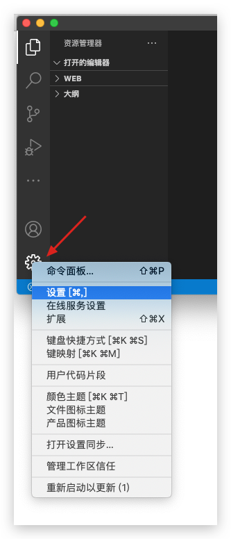

> https://web.qianguyihao.com/#%E5%89%8D%E8%A8%80
>
> https://www.bilibili.com/video/BV1BT4y1W7Aw/

# 1. 配置

## 1.1. 设置

左下角打开设置，比较方便。



-   用户设置：全局生效
-   工作区设置：只对当前项目生效，优先级更高。保存在`.vscode/settings.json`中，可以提交到 git，共享给团队其他成员。
-   右上角 icon 可以打开 json 文件形式的设置


## 1.2. 配置

### 1.2.1. 面包屑导航

用户设置 -> 工作台 -> 导航路径 => 打开


### 1.2.2. 显示代码行号

`Editor: Line Numbers` => on

### 1.2.3. 右侧显示代码缩略图

`Editor: Minimap` => on

### 1.2.4. 高亮光标当前所在行

1. `Editor.renderLineHighlight` => `all / line`
2. 设置里增加以下内容，意思是
    1. 修改光标所在行的背景色
    2. 修改光标所在行的边框色

```json
"workbench.colorCustomizations": {
    "editor.lineHighlightBackground": "#00000090",
    "editor.lineHighlightBorder": "#ffffff30"
}
```

### 1.2.5. 文件自动保存

`Files : Auto Save` => off

在配置了保存自动格式化的情况下，会导致写代码的时候一直被自动格式化，很难受。

### 1.2.6. 保存代码后是否立刻格式化

`Editor.formatOnSave` => off

### 1.2.7. 热退出，关闭时记住未保存的文件

`Files: Hot Exit` => `onExit`

### 1.2.8. 粘贴内容是否自动格式化

`Editor: Format On Paste` => `on`

### 1.2.9. 字体大小

`Editor: Font Size`

### 1.2.10. 空格和制表符

#### 1.2.10.1. 是否根据文件内容自动检测用空格还是制表符

`Editor: Detect Indentation` => `off`

#### 1.2.10.2. 使用 Tab 时插入空格

`Editor: Insert Spaces` => `on`

#### 1.2.10.3. 制表符等于多少空格

`Editor: Tab Size` => 4

这个设置在 Prettier 插件里也可以设置

#### 1.2.10.4. 保存时自动去掉行末空格

`Files: Trim Trailing Whitespace` => `on`

#### 1.2.10.5. 直观显示空格和制表符

`Editor: Render Whitespace` => all

### 1.2.11. 删除文件是否弹出确认框

`Explorer: Confirm Delete` => `on`

### 1.2.12. 在新窗口打开文件/文件夹

`Window: Open Files In New Window` => `on`

`Window: Open Folders In New Window` => `on`

### 1.2.13. 重新打开 VSCode 时， 是否展示之前的窗口

`Window: Restore Windows` => `all`

### 1.2.14. 文件展示在文件夹之前

Explorer >> Sort Order : filesFirst

### 1.2.15. 工作区的 Explorer 文件夹顺序

打开保存的 code-workspace 文件，调整里面的 folders 里的顺序即可

打开该文件：F1 >> Open Workspace Configuration File

### 1.2.16. 单词分隔符

默认情况下，中文标点不会被视为单词分隔符，在使用 alt/option + ←/→ 跳转时会视为一个大单词。

Editor >> Word Separators

增加 `，。、（）：？”“！`

# 2. 插件

## 2.1. 插件市场

https://marketplace.visualstudio.com/vscode

-   Featured：由 VS Code 团队精心推荐的插件。
-   Trending：近期热门插件。
-   Most Popular：按总安装量排序的插件。
-   Recently Added：最新发布的插件。

## 2.2. 推荐插件

### 2.2.1. 页面展示

| 插件名                   | 推荐 | 作用                                                                         |
| ------------------------ | ---- | ---------------------------------------------------------------------------- |
| Bracket Pair Colorizer 2 | √    | 彩虹括号                                                                     |
| highlight-icemode        | √    | 相同代码高亮，和 `Editor: selection highlight`一样，用插件时可以关闭默认设置 |
| vscode-icons             |      | 根据文件后缀显示不同图标                                                     |
| indent-rainbow           |      | 突出显示代码缩进                                                             |
| Better Comments          |      | 注释色彩，醒目、带分类                                                       |

### 2.2.2. 代码管理

| 插件名          | 推荐 | 作用             |
| --------------- | ---- | ---------------- |
| GitLens         | √    | git 相关         |
| Local History   | √    | 维护本地历史记录 |
| Project Manager |      | 管理常用项目     |
| Waka Time       |      | 统计写代码的时间 |

### 2.2.3. 代码格式化

| 插件名             | 推荐 | 作用                                                                                               |
| ------------------ | ---- | -------------------------------------------------------------------------------------------------- |
| Code Spell Checker |      | 单词拼写检查                                                                                       |
| TODO Highlight     |      | 在命令面板中，Todohighlist 可以显示所有的 TODO（必须是大写的）                                     |
| Prettier           |      | 代码格式化<br />在项目跟目录下新建 `.prettierrc`<br />默认使用 2 个空格，可以在通用设置里改为 4 个 |
| ESLint             |      | 代码格式校验                                                                                       |

Prettier 设置文件参考

```json
{
    "printWidth": 150,
    "tabWidth": 4,
    "semi": true,
    "singleQuote": true,
    "trailingComma": "es5",
    "tslintIntegration": true,
    "insertSpaceBeforeFunctionParenthesis": false
}
```

### 2.2.4. 前端相关

| 插件名                                        | 推荐 | 作用                                              |
| --------------------------------------------- | ---- | ------------------------------------------------- |
| Live Server                                   | √    | 浏览器中实时预览                                  |
| open in browser                               |      | HTML 文件中，右键菜单增加 Open In Default Browser |
| Auto Close Tag                                | √    | 自动闭合配对标签                                  |
| Auto Rename Tag                               | √    | 同时修改匹配的标签                                |
| HTML CSS Support                              | √    | 快速补全 HTML 和 CSS                              |
| Vetur                                         |      | Vue 集成插件                                      |
| ES7 React/Redux/GraphQL/React-Native snippets |      | React/Redux/react-router 的语法智能提示           |
| JavaScript(ES6) code snippets                 |      | ES6 语法智能提示，支持快速输入                    |
| javascript console utils                      | √    | Cmd + Shift + L 可以快速出现 `console.log()`      |
| JS-CSS-HTML Formatter                         |      | 保存文件自动格式化 HTML CSS JS 代码               |
| Image Preview                                 |      | 鼠标移动到 url 时，预览图片，并显示尺寸           |
| CSS Peek                                      |      | 快速查看某个元素上的 CSS 样式                     |
| Vue CSS Peek                                  |      | 增加了对 Vue 文件的支持                           |
| Color Info                                    |      | 预览 CSS 中颜色的信息                             |

### 2.2.5. Markdown

| 插件名                          | 推荐 | 作用                        |
| ------------------------------- | ---- | --------------------------- |
| Markdown Preview Github Styling |      | 以 GitHub 风格预览 Markdown |
| Markdown All in One             |      | 一些便利的快捷键            |
| Markdown Shortcuts              |      | 一些便利的快捷键            |

### 2.2.6. 其他

| 插件名        | 推荐 | 作用                      |
| ------------- | ---- | ------------------------- |
| Polacode-2020 |      | 生成代码截图，做 PPT 时用 |

# 3. 快捷键

## 3.1. 工作区快捷键

| Mac 快捷键           | Win 快捷键               | 作用                                          | 备注                 |
| :------------------- | :----------------------- | :-------------------------------------------- | :------------------- |
| **Cmd + Shift + P**  | **Ctrl + Shift + P**，F1 | 显示命令面板                                  |                      |
| **Cmd + B**          | **Ctrl + B**             | 显示/隐藏侧边栏                               | 很实用               |
| `Cmd + \`            | `Ctrl + \`               | **拆分为多个编辑器**                          | 【重要】抄代码利器   |
| **Cmd + 1、2**       | **Ctrl + 1、2**          | 聚焦到第 1、第 2 个编辑器                     | 同上重要             |
| **Cmd + +、Cmd + -** | **ctrl + +、ctrl + -**   | 将工作区放大/缩小（包括代码字体、左侧导航栏） | 在投影仪场景经常用到 |
| Cmd + J              | Ctrl + J                 | 显示/隐藏控制台                               |                      |
| **Cmd + Shift + N**  | **Ctrl + Shift + N**     | 重新开一个软件的窗口                          | 很常用               |
| Cmd + Shift + W      | Ctrl + Shift + W         | 关闭软件的当前窗口                            |                      |
| Cmd + N              | Ctrl + N                 | 新建文件                                      |                      |
| Cmd + W              | Ctrl + W                 | 关闭当前文件                                  |                      |

## 3.2. 前端相关

快捷输入后，按`Tab`或者`Enter`。

| 快捷输入         | 功能                                                   |
| ---------------- | ------------------------------------------------------ |
| !                | 生成 html 骨架                                         |
| h1 / h2... / p … | h1 等标签                                              |
| .class_name      | 创建一个带有 class 属性，且值为`class_name`的 div 标签 |
| `div.class_name` | 同上                                                   |
| #id_value        | 创建一个带有 id 属性，且值为`id_value`的 div 标签      |
| `div#id_value`   | 同上                                                   |

## 3.3. 自定义的一些快捷键设置

### 3.3.1. mac

```json
// 将键绑定放在此文件中以覆盖默认值
[
    {
        "key": "cmd+1",
        "command": "md-shortcut.toggleTitleH1"
    },
    {
        "key": "cmd+2",
        "command": "md-shortcut.toggleTitleH2"
    },
    {
        "key": "cmd+3",
        "command": "md-shortcut.toggleTitleH3"
    },
    {
        "key": "cmd+4",
        "command": "md-shortcut.toggleTitleH4"
    },
    {
        "key": "cmd+5",
        "command": "md-shortcut.toggleTitleH5"
    },
    {
        "key": "cmd+6",
        "command": "md-shortcut.toggleTitleH6"
    },
    {
        "key": "alt+`",
        "command": "markdown.extension.editing.toggleCodeBlock"
    },
    {
        "key": "cmd+e",
        "command": "workbench.view.explorer",
        "when": "viewContainer.workbench.view.explorer.enabled"
    },
    {
        "key": "cmd+e",
        "command": "workbench.action.closeSidebar",
        "when": "sideBarVisible"
    },
    {
        "key": "shift+tab",
        "command": "editor.action.outdentLines",
        "when": "editorTextFocus && !editorReadonly"
    }
]
```

# 4. 用户片段 / 文件模板

Code >> 首选项 >> 配置代码片段

或者直接在 F1 里输入 snippets，选择 Snippets: Configure Snippets

可以选择针对 某一种语言 / 文件夹 / 全局 配置代码片段

| 内容        | 说明                                                                                                                            |
| ----------- | ------------------------------------------------------------------------------------------------------------------------------- |
| scope       | 设置模板适用文件类型，为空时适用所有文件。如果需要对 markdown 文件生效，需要单独配置                                            |
| prefix      | 用来触发代码片段的词语                                                                                                          |
| body        | 模板内容。每行都要用双引号包围，结束后加逗号，注意字符的转义，可以识别空格。里面可以有`$1`, `$2`, `$final`这样的，用于 tab 定位 |
| description | 对该模板代码的描述                                                                                                              |

如果需要对 markdown 文件生效，需要配置

```json
"[markdown]":  {
    "editor.quickSuggestions": true
}
```

# 5. 问题记录

## 5.1. Windows 上重启后 VSCode 消失/快捷方式失效

在 Windows 更新、VSCode 更新的时候有可能出现这个问题。可以通过快捷方式查看原本 exe 文件所在的目录，原来很多内容都被移动到该目录下的一个新目录`_`中，剪切出来即可。

通常是：`C:\Users\<user>\AppData\Local\Programs\Microsoft VS Code\_`

## 5.2. 回车 Enter 或者 Backspace 失效

看一下后台是不是有疯狂在执行的脚本，ctrl + c 中止后就好了

之前遇到疯狂在执行的 git status 等一大堆不知道什么插件的命令

