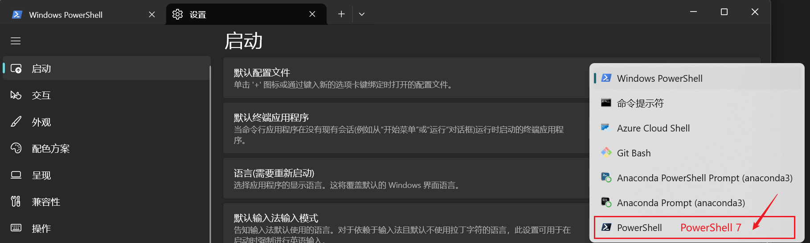

# Windows Terminal

## 1. 设置总结

### 1.1. 安装 PowerShell 7

<https://github.com/PowerShell/PowerShell/releases>

### 1.2. 设置 Windows Terminal 为 PowerShell 7

设置 >> 启动 >> 默认配置文件，修改为`PowerShell`

### 1.3. 安装主题、代码补全，用管理员模式启动 PowerShell 7

```shell
winget install JanDeDobbeleer.OhMyPosh -s winget
Install-Module -Name PowerShellGet -Force
PowerShellGet\Install-Module posh-git -Force
Install-Module PSReadLine -Force
```

### 1.4. 官网下载字体

<https://www.nerdfonts.com/font-downloads> Meslo

### 1.5. 设置窗口半透明前置确认

确认 桌面右键 > 个性化 > 颜色 > 透明效果：开启

### 1.6. 字体和窗口半透明的设置

`ctrl + shift + ,` 打开 json 设置，在里面找到 `profiles.defaults`

```json
"defaults":
    {
        "opacity": 70,
        "useAcrylic": true,
        "font": {
            "face": "MesloLGL Nerd Font"
        }
    },
```

### 1.7. 快捷键设置

设置值 >> 操作 >> 1. 关闭窗格（注意不是窗口）：`ctrl + w` 2. 新建标签页：`ctrl + n`

### 1.8. 确保存在配置文件

```shell
New-Item -Path $PROFILE -Type File -Force
```

### 1.9. 设置主题、快捷命令和代码补全

```shell
code $profile
```

编写

```shell
## 打开直接切换到这个目录下
set-location "D:\chen"

oh-my-posh init pwsh --config ~/iterm2.omp.json | Invoke-Expression
Set-PSReadLineKeyHandler -Key Tab -Function MenuComplete #Tab键会出现自动补全菜单
Set-PSReadlineKeyHandler -Key UpArrow -Function HistorySearchBackward
Set-PSReadlineKeyHandler -Key DownArrow -Function HistorySearchForward
## 上下方向键箭头，搜索历史中进行自动补全
Import-Module posh-git # git的自动补全

function note {
    jupyter notebook --notebook-dir=D:\jupyterNote
}

function cdnote {
    set-location "D:\坚果云\Note"
}
function cdjo {
    set-location "D:\坚果云\Journal"
}
```

### 1.10. git 中文设置

```shell
## 禁用路径转义，默认情况下，Git会将非ASCII字符的路径进行转义
git config --global core.quotepath false
```

## 2. 安装

Microsoft Store 搜索 WindowsTerminal 即可安装。

如果 Microsoft Store 因为网络问题打不开，关闭代理。因为 windows 为了安全，禁止应用链接到本地端口（UWP 应用联网限制）

## 3. Powershell 7

win10 / win11 默认的 `Windows Powershell`版本是`5.1`。

可以在 Github 上下载 PowerShell 7 的版本。

但是微软在设计上，这两个终端是并行存在的关系，并不是将原本 5.1 的`Windows PowerShell`升级。

### 3.1. 查看当前 `Windows Terminal` 版本

```shell
$PSVersionTable
```

### 3.2. 设置 Windows Terminal 为 PowerShell 7

在`Windows Terminal`里，设置 >> 启动 >> 默认配置文件，修改为`PowerShell`



## 4. 自定义设置

### 4.1. 配置文件

```shell
$profile
## 显示的位置就是配置文件所在的位置

code $profile
## 直接用 VS Code 打开配置文件

New-Item -Path $PROFILE -Type File -Force
## 默认没有配置文件，用此命令生成一个

. $PROFILE
## 重新加载配置文件
```

#### 4.1.1. 报错 无法加载文件……，因为此系统上禁止运行脚本

右键左下角的 win 图标（开始菜单） > Windows Powershell（管理员） > 输入`set-ExecutionPolicy RemoteSigned` > 输入`y`

### 4.2. 设置快捷键冲突

Windows 开始菜单 > 设置 > 搜索 高级键盘设置 > 输入语言热键 > 删除掉搜狗的 ctrl + ,

### 4.3. 窗口半透明

设置 > 默认值 > 外观 > 透明度 > 背景不透明度：70%左右

设置 > 默认值 > 外观 > 透明度 > 启用亚克力材料：开启

如果透明不生效，在 桌面右键 > 个性化 > 颜色 > 透明效果：开启

### 4.4. 主题

#### 4.4.1. 安装 Oh My Posh

> <https://ohmyposh.dev/docs/installation/windows>

##### 4.4.1.1. Microsoft Store 即可安装

##### 4.4.1.2. 通过 winget 安装

Powershell（管理员）

```shell
winget install JanDeDobbeleer.OhMyPosh -s winget
```

安装好`oh-my-posh`后，重启 PowerShell ，`oh-my-posh`应该就在环境变量里了，如果没有自己再加一下

```shell
## 找到 oh-my-posh 执行文件，目录形如 C:\Users\user\AppData\Local\Programs\oh-my-posh\bin\oh-my-posh.exe
(Get-Command oh-my-posh).Source

## 添加 Path
$env:Path += ";C:\Users\user\AppData\Local\Programs\oh-my-posh\bin"
```

#### 4.4.2. 安装字体 nerd font

##### 4.4.2.1. 命令行安装

```shell
oh-my-posh font install Meslo
## 官方推荐 Meslo 字体
## 可能会很慢，推荐官网下载
```

##### 4.4.2.2. 官网下载

> <https://www.nerdfonts.com/font-downloads>

下载后解压，将所有 font 文件拖到 `C:\Windows\Fonts`中

#### 4.4.3. 修改 PowerShell 字体

##### 4.4.3.1. json 文件修改

`ctrl + shift + ,`，在里面找到 `profiles.defaults`，紧跟着下面加这段

```json
{
    "profiles": {
        "defaults": {
            "font": {
                "face": "MesloLGL Nerd Font"
            }
        }
    }
}
```

##### 4.4.3.2. 设置里修改

设置 > 默认值 > 外观 > 字体 > MesloLGL Nerd Font

#### 4.4.4. 主题修改

`$profile`文件中添加

```shell
oh-my-posh init pwsh --config ~/iterm2.omp.json | Invoke-Expression
```

## 5. 快捷键

### 5.1. 修改

关闭窗格：`ctrl + w`

新建标签页：`ctrl + n`

### 5.2. 常用

`alt + shift + +/-` 横竖分割窗口

## 6. alias 设置 / function

在 powershell 的 `$profile` 里，可以写 function 。

### 6.1. 打开 jupyter notebook

```shell
function note {
    jupyter notebook --notebook-dir=D:\jupyterNote
}
```

### 6.2. 打开某个目录

```shell
function cdnote {
    set-location "D:\坚果云\Note"
}
function cdjo {
    set-location "D:\坚果云\Journal"
}
```

### 6.3. 打开 PowerShell 后默认切换到指定目录

`$profile` 里第一行添加

```shell
## 打开直接切换到这个目录下
set-location "D:\chen"
```

## 7. 快速打开

可以将 WindowsTerminal 放在下方任务栏的第一个，然后通过 `Win + 1` 快速打开

另外，可以在文件资源管理器的地址栏，输入 `wt` 快速打开。删除掉 `设置 > 默认值 > 启动目录` 里的内容后，可以快速进入当前目录。

## 8. 代码补全

带有管理员权限的情况下执行下面的命令，安装`posh-git`和`readline`

```shell
Install-Module -Name PowerShellGet -Force
PowerShellGet\Install-Module posh-git -Force
Install-Module PSReadLine -Force
```

修改配置文件：

```shell
Set-PSReadLineKeyHandler -Key Tab -Function MenuComplete #Tab键会出现自动补全菜单
Set-PSReadlineKeyHandler -Key UpArrow -Function HistorySearchBackward
Set-PSReadlineKeyHandler -Key DownArrow -Function HistorySearchForward
## 上下方向键箭头，搜索历史中进行自动补全
Import-Module posh-git # git的自动补全
```

## 9. Git 中文相关

最主要的是这个设置

```shell
## 禁用路径转义，默认情况下，Git会将非ASCII字符的路径进行转义
git config --global core.quotepath false
```

其余的看情况设置

```shell
## 设置图形界面的编码为 utf-8
git config --global gui.encoding utf-8

## 提交信息编码为 utf-8
git config --global i18n.commit.encoding utf-8
## 日志输出编码为 utf-8
git config --global i18n.logoutputencoding utf-8
```

## 10. 编码

`$profile`里添加（默认应该不用）

```shell
$OutputEncoding = [Console]::OutputEncoding = [System.Text.Encoding]::UTF8
```
