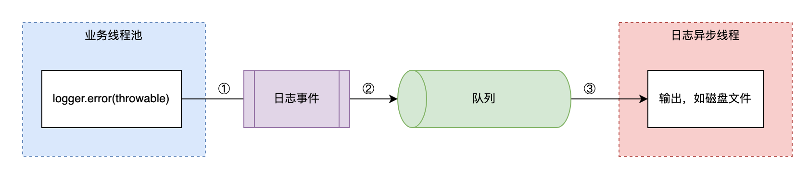

# 日志线程 block 问题

## 1. 最佳实践

1. 所有 Appender 的 PatternLayout 都增加 `%ex` 配置，不打印拓展信息
2. 自定义 Appender 实现
3. 不使用 Console
4. 不使用 `<AsyncLogger>`，如果真希望 Logger 异步，则使用 `Log4jContextSelector=org.apache.logging.log4j.core.async.AsyncLoggerContextSelector`


## 2. 美团-日志导致线程Block的这些坑，你不得不防

> [日志导致线程Block的这些坑，你不得不防](https://tech.meituan.com/2022/07/29/tips-for-avoiding-log-blocking-threads.html)

### 2.1. 问题和分析



1. 业务线程组装日志事件对象，如创建日志快照或者初始化日志字段等。
2. 日志事件对象入队，如BlockingQueue队列或Disruptor RingBuffer队列等。
3. 日志异步线程从队列获取日志事件对象，并输出至目的地，如本地磁盘文件或远程日志中心等。

对应地，Log4j2导致线程Block的主要潜在风险点如下：

1. 如上图①所示，日志事件对象在入队前，组装日志事件时触发了异常堆栈类解析、加载，从而引发线程Block。
    1. 在某版本有 bug，log4j2 的类缓存失效，反射的类会触发大量类加载
    2. JDK 某版本有 bug，为了优化反射会动态生成 GeneratedMethodAccessor 类，而 JDK 8 低版本在处理 Lambda 表达式时也会生成临时类。这些动态类无法被普通的 ClassLoader 加载或缓存
    3. 当程序抛出异常并打印堆栈时，Log4j2 的 ThrowableProxy 会尝试加载堆栈中的类以获取 JAR 包版本信息
2. 如上图②所示，日志事件对象在入队时，由于队列满，无法入队，从而引发线程Block。
    1. 队列满后，新事件无法入队，会由 ErrorHandler 处理，在某版本有 bug 会全部输出到 Console 导致线程 block。
3. 如上图③所示，日志事件对象在出队后，对日志内容进行格式化处理时触发了异常堆栈类解析、加载，从而引发线程 Block。

从上述分析不难看出：

1. ①和②处如果发生线程Block，那么会直接影响业务线程池内的所有线程。
2. ③处如果发生线程Block，那么会影响日志异步线程，该线程通常为单线程。

标号①和②处发生线程Block的影响范围远比标号③更大，因此核心是要避免日志事件在入队操作完成前触发线程Block。其实日志异步线程通常是单线程，因此对于单个Appender来说，不会出现Block现象，至多会导致异步线程处理速度变慢而已，但如果存在多个异步Appender，那么多个日志异步线程仍然会出现彼此Block的现象。

### 2.2. 预防

#### 2.2.1. 入队前

日志事件入队前避免触发异常堆栈类解析、加载操作。直到 log4j2 的 2.17.1 时，AsyncAppender 和 AsyncLoggerConfig 还存在该问题，可以通过自定义 Appender 来实现。日志中使用 `<Logger>` 标签，不使用 `<AsyncLogger>`。

```java
// org.apache.logging.log4j.scribe.appender.AsyncScribeAppender

@Override
public void append(final LogEvent logEvent) {
    // ... 以上部分忽略 ...
    Log4jLogEvent.Builder builder = new Log4jLogEvent.Builder(event);
    builder.setIncludeLocation(includeLocation);
    // 创建日志快照，避免解析、加载异常堆栈类
    final Log4jLogEvent memento = builder.build();
    // ... 以下部分忽略 ...
}
```

#### 2.2.2. 入队时

自定义Appender实现，日志事件入队失败时忽略错误日志。此时：

- 对于AsyncAppender在blocking场景来说，可以通过配置log4j2.AsyncQueueFullPolicy=Discard来使用DISCARD策略忽略日志。
- 对于AsyncAppender在非blocking场景来说，可以通过自定义Appender实现，在日志事件入队失败后直接忽略错误日志，并在配置文件中使用自定义的Appender代替Log4j2提供的AsyncAppender。自定义AsyncScribeAppender相关代码片段如下。

```java
// org.apache.logging.log4j.scribe.appender.AsyncScribeAppender

@Override
public void append(final LogEvent logEvent) {
    // ... 以上部分忽略 ...
    if (!transfer(memento)) {
        if (blocking) {
            // delegate to the event router (which may discard, enqueue and block, or log in current thread)
            final EventRouteAsyncScribe route = asyncScribeQueueFullPolicy.getRoute(processingThread.getId(), memento.getLevel());
            route.logMessage(this, memento);
        } else {
          	// 自定义printDebugInfo参数，控制是否输出error信息，默认为false
            if (printDebugInfo) {
                error("Appender " + getName() + " is unable to write primary appenders. queue is full");
            }
            logToErrorAppenderIfNecessary(false, memento);
        }
    }
    // ... 以下部分忽略 ...
}
```

#### 2.2.3. 出队后

日志框架对异常进行格式化转换时，有如下两个配置项可参考，默认配置是`%xEx`。

1. `%ex`，仅输出异常信息，不获取扩展信息（jar文件名称和版本信息）
  对应的格式转化类是ThrowablePatternConverter，在format方法内部并没有获取ThrowableProxy对象，所以不会触发解析、加载异常堆栈类。
2. `%xEx`，不仅输出异常信息，同时获取扩展信息
  对应的格式转化类是ExtendedThrowablePatternConverter，在format方法内部获取了ThrowableProxy对象，此时一定会触发解析、加载异常堆栈类。

显式配置日志输出样式`%ex`来代替默认的`%xEx`，避免对日志内容格式化时解析、加载异常堆栈类。
