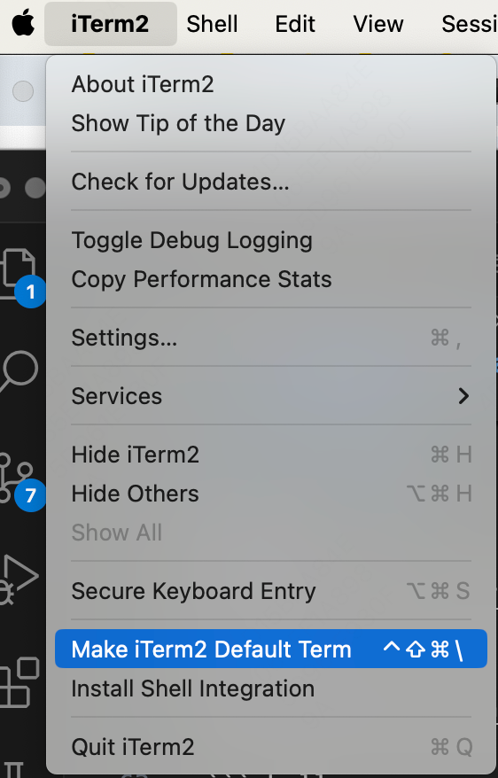
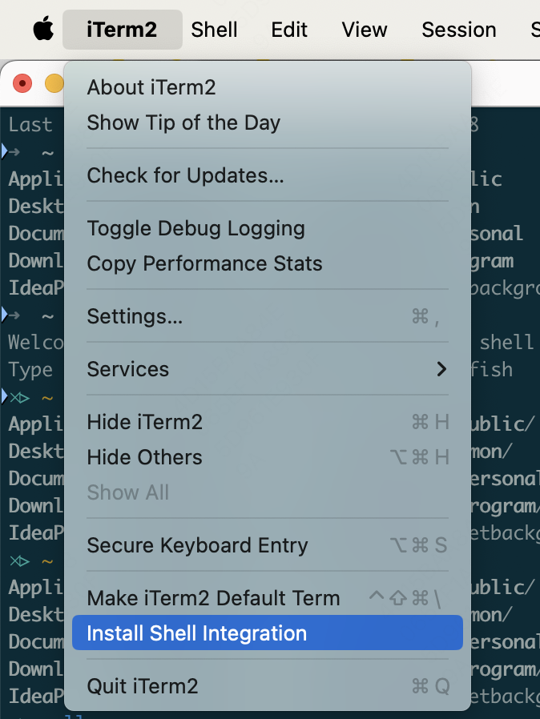
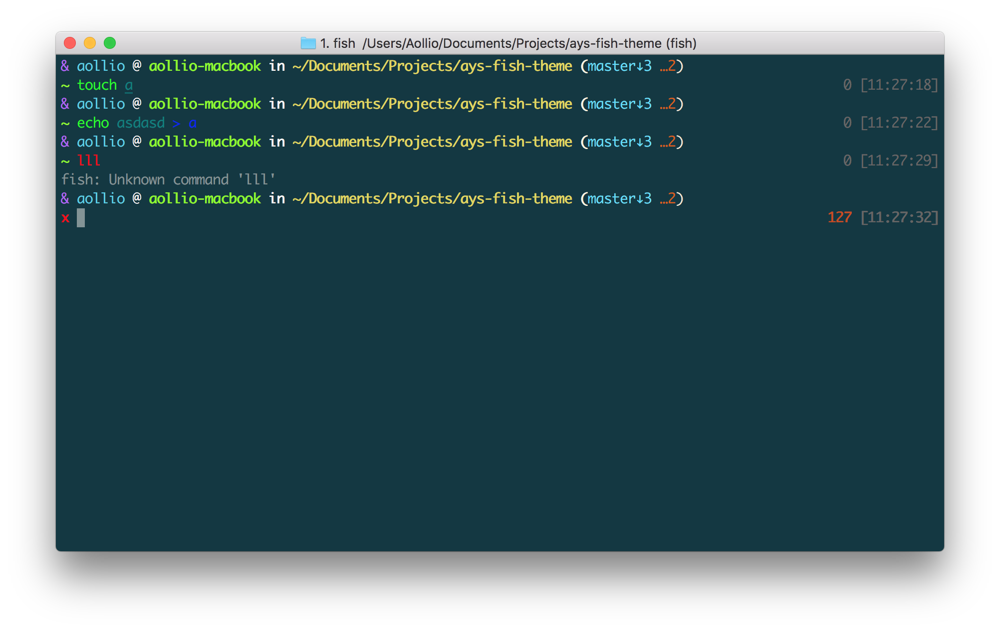
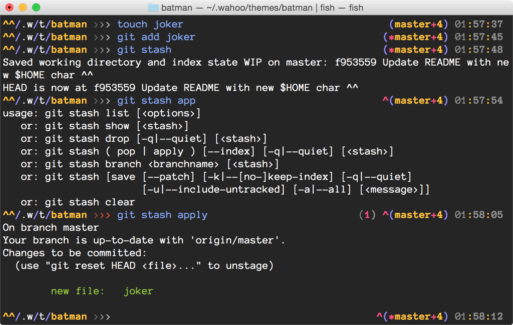
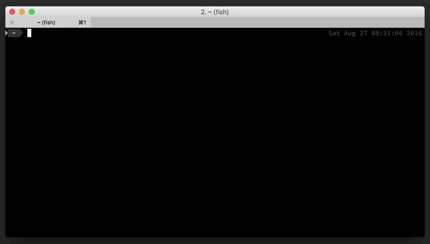

> 参考：
> Linux终端下使用Fish shell并美化  https://www.cnblogs.com/aaroncoding/p/17118251.html
> Oh My Fish! 让你的 Shell 漂亮起来  https://www.linux.cn/article-9515-1.html
> Fish and iTerm2  https://lobster1234.github.io/2017/04/08/setting-up-fish-and-iterm2/
> Iterm 2 上简单安装 Fish 并配置主题  https://segmentfault.com/a/1190000007164195?utm_source=sf-related
> iTerm2+fish安装与配置以及M1使用fish与brew冲突问题  https://www.jianshu.com/p/fa9c09302ffc
> iTerm2 + Fish 打造高效终端  https://cloud.tencent.com/developer/article/2008550
> iTerm2  https://iterm2.com/index.html
> iTerm2文档  https://iterm2.com/documentation.html
> oh-my-fish https://github.com/oh-my-fish/oh-my-fish
> 美化你的iterm2，快乐coding  https://www.bilibili.com/video/BV16c411M78T/?spm_id_from=333.337.search-card.all.click&vd_source=9f68829e78088d41d3127b97b83ed97f
> 强大的终端工具--iterm2食用指南  https://www.bilibili.com/video/BV1zA411v7a2/?spm_id_from=333.337.search-card.all.click&vd_source=9f68829e78088d41d3127b97b83ed97f
> What is the difference between shell, console, and terminal?  https://superuser.com/questions/144666/what-is-the-difference-between-shell-console-and-terminal

# 1. Shell / Terminal / Console 介绍

对于现在的 Linux 用户来看，这三者差不多是一样的，没什么区别，都是一种软件。

> 历史上的区别：
> Shell 指的是实际处理命令并返回输出的程序。
> Terminal 则是对 shell 包装的程序。以前 Terminal 指物理设备，指连接到计算机的键盘和显示器，随着时代发展，现在抽象成为了一个软件。
> Console 是一种特殊的 Terminal，以前指直接与操作系统底层通信的端口。

现在来说，Terminal, iTerm2, Hyper 这些是 Terminal. Zsh, bash, fish 这些是 shell。前者是一个 mac 上的软件，后者则是软件内的运行的程序。

# 2. 更现代的 Terminal: iterm2

Mac Terminal 的替代品。适用于 macOS 10.14 或更高版本的。

官网：https://iterm2.com/index.html

官网提供下载链接

## 2.1. 特性

1. 集成了 tmux，可以方便的在一个软件窗口里打开多个命令窗口
2. 拆分窗格：非活动的窗口微微变暗
3. 热键窗口：可以用快捷键将 iterm2 带到前台
4. 搜索：搜索强大，支持正则，所有匹配内容突出显示
5. 自动提示：cmd + ;
6. 粘贴 的历史
7. 之前操作回放
8. 全局搜索
9. 触发器
10. 注释
11. 徽章
12. 捕获输出

https://iterm2.com/documentation-highlights.html

## 2.2. 设置 iTerm2 为默认 Terminal

打开 iTerm2, 点击



取消设置：
点击时按住 option，就会出现 Make Terminal Default Term

## 2.3. install shell integration



## 2.4. 配置

`Command + ,` 可以打开设置，可能叫 Preferences 或者 Settings

### 2.4.1. 配色

配色全集：
https://iterm2colorschemes.com/

dracula:
https://draculatheme.com/iterm

```shell
git clone https://github.com/dracula/iterm.git
```

iTerm2 >> Preferences >> Profiles >> Colors Tab >> Color Presets >> Import >> Dracula.itermcolors >> 选择 Dracula


### 2.4.2. 其他

fish 有的主题需要使用特定的字体，
安装 powerline 可以安装很多字体 待定

在 Preferences -- Profiles -- Text 里可以修改字体

lsd 命令行增强工具

### 2.4.3. iterm2 设置

perferences >> Profiles >> Color >> 右下角 Color Presets

Profiles:
  Window:
    Transparency: 透明度
    Blur: 背景模糊
    Backgroud Image: 背景图片
  Text:
    Cursor: 光标类型 块 竖线 下划线
    Font: 字体
  Colors: 主题配色 其他主题需要自己下载
    ANSI Color 处可以调整一下亮度啥的
  Keys: 快捷键
    hot key 快捷打开 iterm2

spaceship-prompt


# 3. 更加友好的 Shell: fish

fish (friendly interactive shell) 是一个界面更好，并且无需特别配置的 shell

与zsh相比，zsh 加载比较慢，并且配置繁琐

但是注意，fish 和别的 shell 语法不兼容，如果要写 bash 脚本的话，慎用！

## 3.1. 官网与安装

官网：https://fishshell.com/

```shell
brew install fish
```

## 3.2. 设置为默认 shell

```shell
# 查看当前使用的 shell
echo $SHELL

# 查看当前系统内所有的 shell
cat /etc/shells
```

安装好 fish 后，通过
```shell
whereis fish
```
可以拿到 fish 的路径。

1. 先将 fish 的路径加到 `/etc/shells`里
2. 运行下面的命令
```shell
# chsh -s 跟fish的路径
chsh -s /opt/homebrew/bin/fish

# root 模式下也使用 fish
chsh -s /usr/bin/fish root
```

## 3.3. oh-my-fish

对 fish 的主题进行管理

### 3.3.1. 官网和安装

https://github.com/oh-my-fish/oh-my-fish

```shell
curl https://raw.githubusercontent.com/oh-my-fish/oh-my-fish/master/bin/install | fish
```

### 3.3.2. 主题预览

https://github.com/oh-my-fish/oh-my-fish/blob/master/docs/Themes.md

注意有的主题需要特殊的字体

觉得不错的：
+ default
+ ays
+ batman
+ bobthefish(powerline风格，横条有多种配色选择)

ays:


batman:


bobthefish


#### 3.3.2.1. bobthefish 详细设置

https://github.com/oh-my-fish/theme-bobthefish

```shell
omf install bobthefish
```

安装 powerline 和 对应的字体

https://powerline.readthedocs.io/en/master/installation.html#patched-fonts

```shell
pip install powerline-status

# 安装字体
# clone
git clone https://github.com/powerline/fonts.git --depth=1
# install
cd fonts
./install.sh
# clean-up a bit
cd ..
rm -rf fonts
```

在 iTerm2 里设置字体，选择有 powerline 后缀的

```shell
set -g theme_color_scheme dracula
# 永远展示分支名，默认情况下 master 不展示
set -g theme_display_git_default_branch yes
```


## 3.4. 基于web的可视化配置

```shell
fish_config
```

可以打开一个网页，从而进行配置。

注意：iTerm2 的背景颜色不会根据此处的设置而更改。

```shell
# 打开帮助网站（本地网页）
help
```

## 3.5. oh-my-posh

可以应用于任何一个 shell 的主题管理

## 3.6. 补全 completion

> 文档：https://fishshell.com/docs/current/completions.html

### 3.6.1. 路径

补全相关的配置文件存在 `$fish_complete_path` 里，按照顺序加载，前者优先级更高

### 3.6.2. 基本写法

使用 `complete` 命令来指定一个补全。

将需要补全的命令名称作为 `complete` 的参数。例如，为了给程序 `myprog` 添加补全：
`complete -c myprog`

| 可选项                       | 含义                       | 例子                                                                                                               | 说明                                                                                                                                                                                                      |
| ---------------------------- | -------------------------- | ------------------------------------------------------------------------------------------------------------------ | --------------------------------------------------------------------------------------------------------------------------------------------------------------------------------------------------------- |
| `-a`                         | 添加补全时出现的参数（argument）       | `myprog`有参数`start`和`stop`，可以写为`complete -c myprog -a 'start stop'`                                        | `-a`的参数是一个字符串。在补全时，会根据空格和TAB分割开，并且变量拓展（占位符）、命令拓展也会进行替换                                                                                                     |
| `-s / -l / -o`               | 支持命令的可选项           | `myprog`有一个可选项`-o / --output`，接受参数`yes`或`no`，可以写为 `complete -c myprog -s o -l output -a "yes no"` | `-s`是用来指定短可选项（short switch）（单个字符，如`ls -l`里的`-l`，`-l`是 gnu 风格的长可选项（long switch）（例如这里的 `--output`），`-o`是老风格的长可选项（old-style long switch）（例如`-shuffle`） |
| `-r` / `--require-parameter` | 指定命令的可选项必须有参数 | `complete -c myprog -s o -l output -ra "yes no"`                                                                   |                                                                                                                                                                                                           |

### 3.6.3. 关于`-s / -l / -o / -r` 的说明

```shell
# 1
myprog -o<TAB>
# 2
myprog --output=<TAB>
# 3
myprog -o <TAB>
# 4
myprog --output <TAB>
```

在 `complete -c myprog -s o -l output -a "yes no"` （对 myprog 进行补全，该命令有 o 的短可选项，有 output 的长可选项，有参数 yes 和 no）的情况下，只有 #1 和 #2 可以正常补全。因为默认情况下，可选项的参数是可选的，很可能没有参数，如`ls -l`。
如果加上`-r`，`complete -c myprog -s o -l output -ra "yes no"`，表示可选项肯定有参数，那么 #1 - #4 都可以正常进行补全。

### 3.6.4. 文件补全

```shell
# 3
myprog -o <TAB>
# 4
myprog --output <TAB>
```
在上面的例子中，按下TAB进行补全时，也会提示当前目录下的所有文件名。

因为文件补全默认是开启的。

可以通过 `--no-files` 或 特定的condition 关闭命令在某个情况下的文件补全：

```shell
# --no-files
complete -c myprog -s o -l output --no-files -ra "yes no"

# specific condition
complete -c myprog -f --condition '__fish_seen_subcommand_from somesubcommand'
```

可以通过下面这个命令，全局禁用这个程序（命令）的文件补全：

```shell
complete -c myprog -f
```

在全局禁用的情况下，也可以通过 `--force-files` / `-F` 或者 特定condition 开启在某个情况下文件补全：
```shell
# 默认禁用
complete -c myprog -f

# 但是在 myprog --config-file 的时候打开
complete -c myprog -l config-file --force-files -r
```

### 3.6.5. 完整例子 `timedatectl`

```shell
# All subcommands that timedatectl knows - this is useful for later.
set -l commands status set-time set-timezone list-timezones set-local-rtc set-ntp

# 对整个命令都禁用掉文件匹配。
# 因为这个命令不会需要文件作为参数。
# 注意，可以用 "-F" 来打开
#
# 如果你想对提供的文件做更多的控制，文件补全也需要被禁用
# （例如只提供目录，或者只要 ".mp3" 结尾的文件）
complete -c timedatectl -f

# 如果目前还没有给出子命令的话，这行提供这些子命令
# -"status",
# -"set-timezone",
# -"set-time"
# -"list-timezones"
#
# `-n`/`--condition` 可选项接收一个字符串，作为执行脚本。如果返回 true，则提供补全。
# 这里条件是 `__fish_seen_subcommands_from` 函数，如果返回
# Here the condition is the `__fish_seen_subcommands_from` helper function.
# If returns true if any of the given commands is used on the commandline,
# as determined by a simple heuristic.
# For more complex uses, you can write your own function.
# See e.g. the git completions for an example.
#
complete -c timedatectl -n "not __fish_seen_subcommand_from $commands" \
    -a "status set-time set-timezone list-timezones"

# If the "set-timezone" subcommand is used,
# offer the output of `timedatectl list-timezones` as completions.
# Each line of output is used as a separate candidate,
# and anything after a tab is taken as the description.
# It's often useful to transform command output with `string` into that form.
complete -c timedatectl -n "__fish_seen_subcommand_from set-timezone" \
    -a "(timedatectl list-timezones)"

# Completion candidates can also be described via `-d`,
# which is useful if the description is constant.
# Try to keep these short, because that means the user gets to see more at once.
complete -c timedatectl -n "not __fish_seen_subcommand_from $commands" \
    -a "set-local-rtc" -d "Maintain RTC in local time"

# We can also limit options to certain subcommands by using conditions.
complete -c timedatectl -n "__fish_seen_subcommand_from set-local-rtc" \
    -l adjust-system-clock -d 'Synchronize system clock from the RTC'

# These are simple options that can be used everywhere.
complete -c timedatectl -s h -l help -d 'Print a short help text and exit'
complete -c timedatectl -l version -d 'Print a short version string and exit'
complete -c timedatectl -l no-pager -d 'Do not pipe output into a pager'
```

### 3.6.6. 完整例子 `git`

git 配置文件在 https://github.com/fish-shell/fish-shell/blob/master/share/completions/git.fish

## 3.7. 配置文件

**配置文件路径**：`~/.config/fish/config.fish`

```shell
open -e ~/.config/fish/config.fish
```

```shell
# bobthefish theme
set -g theme_color_scheme dracula
set -g theme_display_git_default_branch yes
# bobthefish END

alias cdw="cd ~/work/"
alias cdxx=""
#或者起名叫to...

# HomeBrew
export HOMEBREW_BOTTLE_DOMAIN=https://mirrors.ustc.edu.cn/homebrew-bottles
export PATH="/usr/local/bin:$PATH"
export PATH="/usr/local/sbin:$PATH"
# HomeBrew END

# mysql
export PATH="/usr/local/mysql/bin:$PATH"

# 多版本JAVA相关
alias jdk7="export JAVA_HOME=/Library/Java/JavaVirtualMachines/jdk1.7.0_80.jdk/Contents/Home"
alias jdk8="export JAVA_HOME=/Library/Java/JavaVirtualMachines/jdk1.8.0_281.jdk/Contents/Home"
alias jdk11="export JAVA_HOME=/Users/chen/Library/Java/JavaVirtualMachines/corretto-11.0.13/Contents/Home"
alias jdk17="export JAVA_HOME=/Users/chen/Library/Java/JavaVirtualMachines/openjdk-17.0.1/Contents/Home"
alias jdk21="export JAVA_HOME=/Library/Java/JavaVirtualMachines/jdk-21.jdk/Contents/Home"
export JAVA_HOME="/Library/Java/JavaVirtualMachines/jdk1.8.0_281.jdk/Contents/Home"
export PATH="$JAVA_HOME/bin:$PATH:."
export CLASSPATH="$JAVA_HOME/lib/tools.jar:$JAVA_HOME/lib/jrt-fs.jar:."

# maven
export MAVEN_HOME="/Users/chen/program/apache-maven-3.6.3"
export PATH="$PATH:$MAVEN_HOME/bin"

# jupyter notebook
alias note="python3 -m notebook --notebook-dir='/Users/chen/Documents/jupyter_notes'"
alias cdnote="cd /Users/chen/Documents/jupyter_notes"
export PATH="/Users/chen/Library/Python/3.9/bin:$PATH"
```
