> https://mermaid.js.org/intro/

# 简介

一个 markdown 支持的，可以直接用“写代码”的方式来画图的 js 项目。

# VSCode 支持

Markdown Preview Enhanced: 预览时可以设置 markdown 的背景颜色

Mermaid Markdown Syntax Highlighting: 支持 mermaid 语法高亮

# Doc-Rot 文档腐化问题

Doc-Rot 文档腐化 是软件领域的 22 条军规（Catch-22）。不可避免。

Mermaid 希望让图表易于修改，来缓解这个问题。

# Sequence diagrams 序列图 / 顺序图

> https://mermaid.js.org/syntax/sequenceDiagram.html#syntax

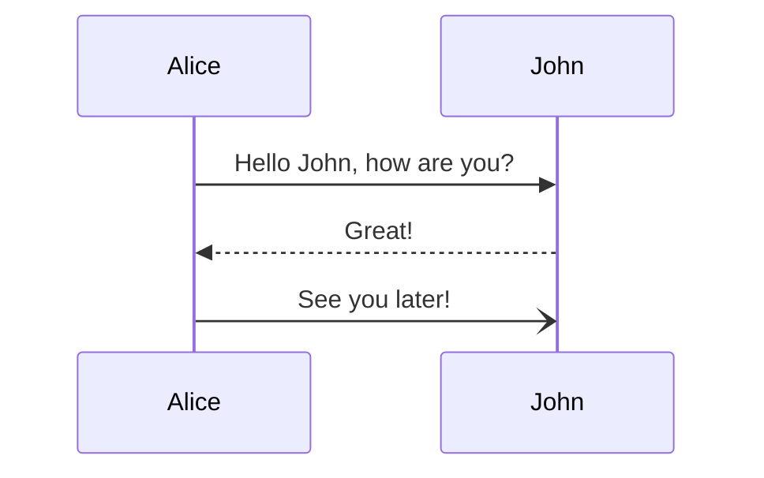

## 语句结束

即可以用换行表示语句结束，也可以用`;`

## 注释 和 转义

### 注释

必须以`%%`开头，单独一行，截止到换行符

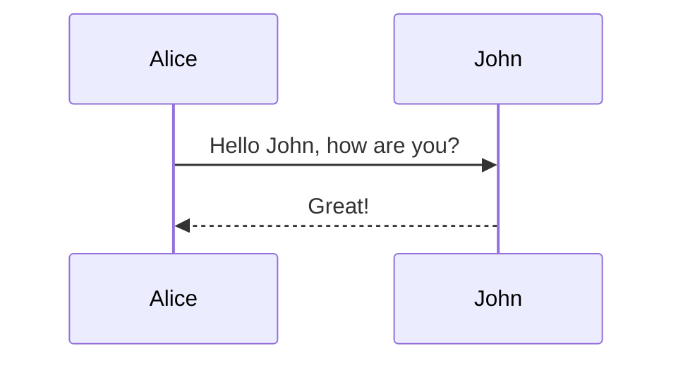

### end

end 这个词在很多语法中在使用，可能会破坏图表，如果必须要用这个单词，则必须用 () "" [] {} 将 end 包起来

### 转义

可以通过`#...;`来转义字符

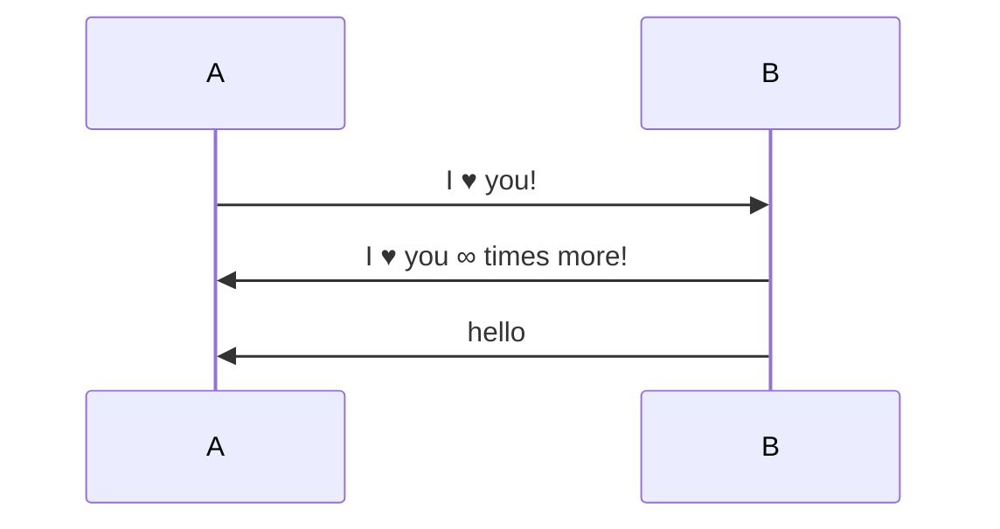

数字是十进制的。

`#`字符本身，可以写作`#35;`。也支持 HTML 字符名

由于`;`也可以表示语句结束，所以`;`要用`#59;`

## 参与者(Participant + Actor)

### 参与者 方框 Participants

参与者可以隐式定义。如上面的例子。参与者出现的顺序就是在源码中出现的顺序。

如果需要特殊指定出现顺序，可以主动声明：

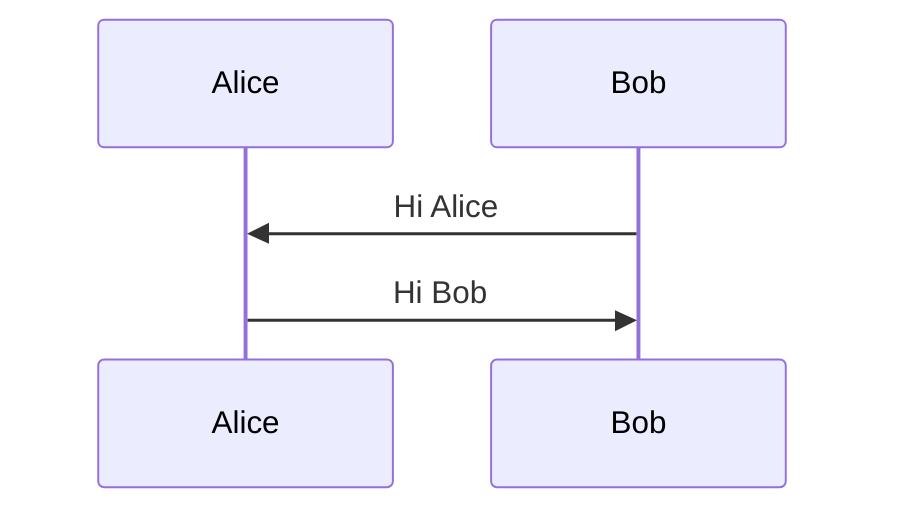

### 行为人 小人 Actors

如果你不想用方框，而是想用小人符号，可以用 `actor`

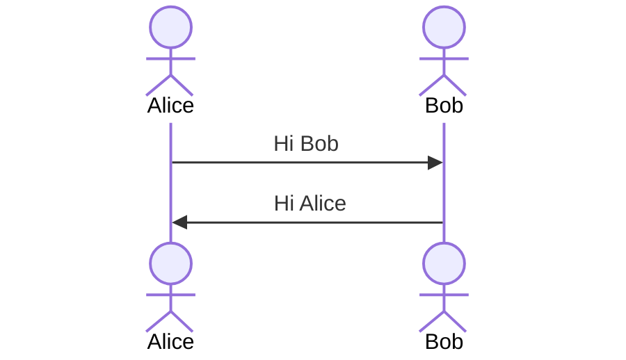

### 别名 Aliases

可以给参与者起一个别名，一个用于方便地写源码，一个用于展示

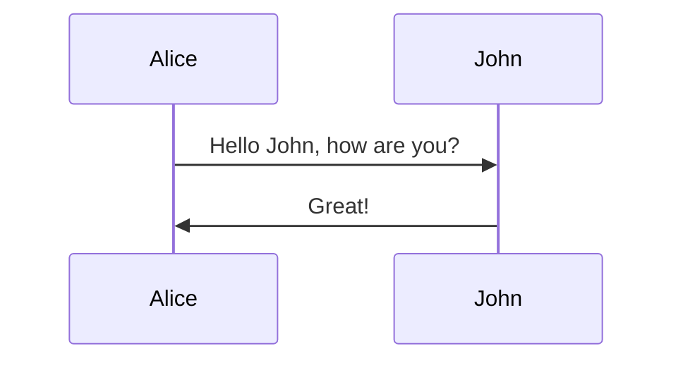

## 消息 Message

消息的格式为：
`[Actor][Arrow][Actor]:Message text`

Arrow 箭头的可选组件有：

-   `-`: 实线
-   `--`: 虚线
-   `>`: 没有箭头
-   `>>`: 实心三角箭头
-   `x`: x 形箭头
-   `)`: 开放箭头，通常表示异步

双向箭头只有 实心三角箭头 有

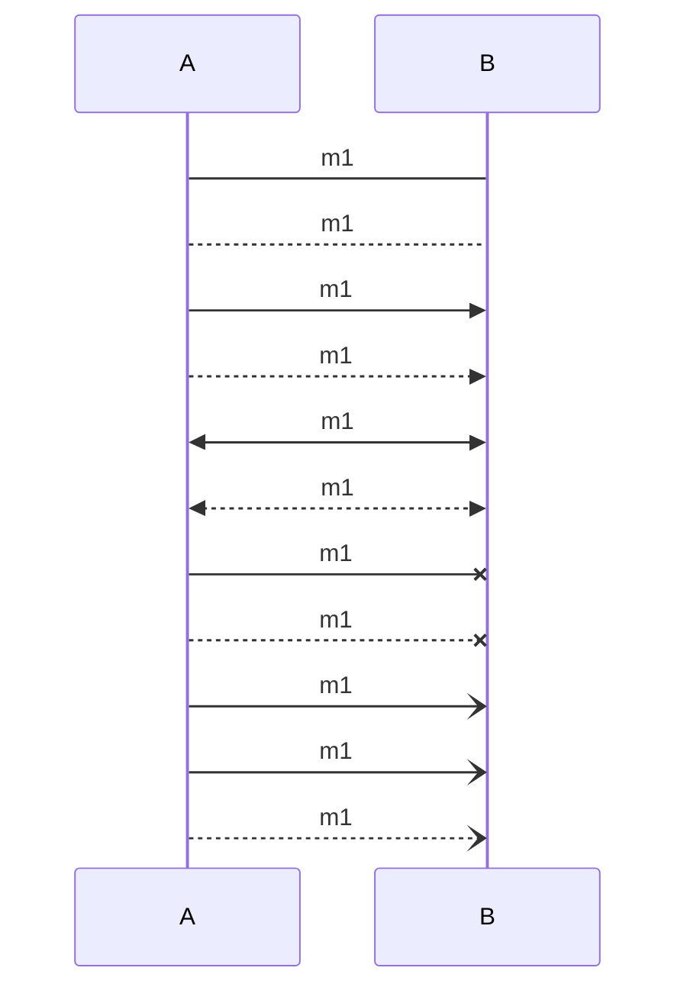

## 箭头序号

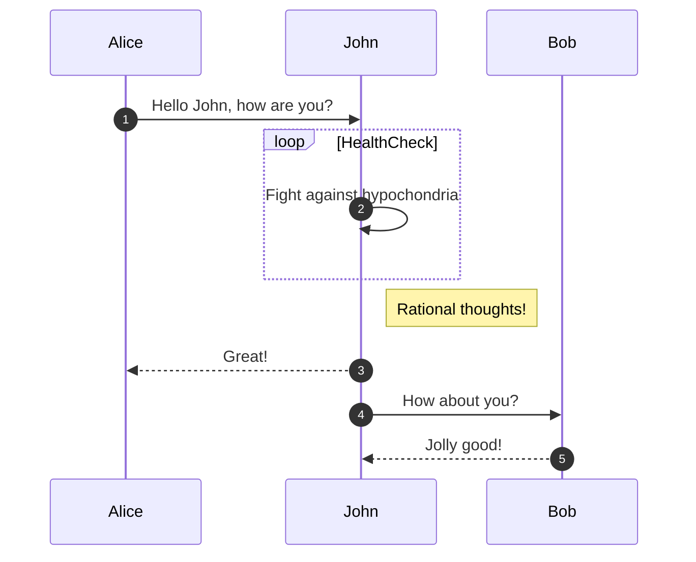

## 笔记 Note

可以添加笔记。语法是：

`Note [ right of | left of | over ] [Actor]: Text in note content`

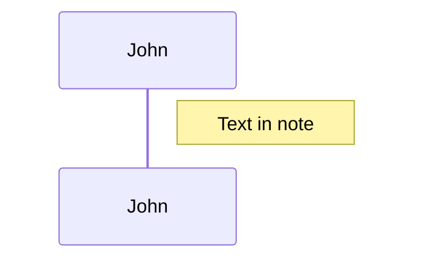

Note 也可以跨多个参与者：

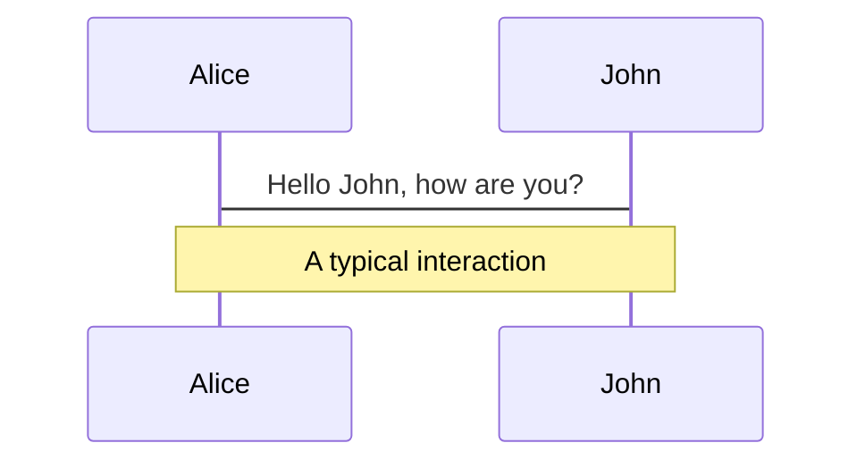

## 换行

Note 和 Message 里可以有换行。`<br/>`

参与者名称里如果想加换行，需要用别名语法：

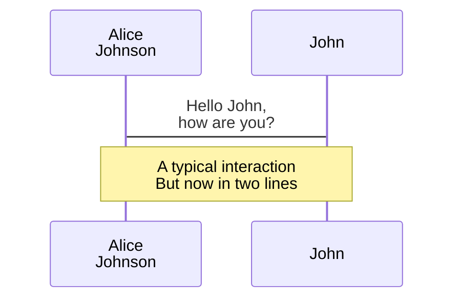

## 参与者的创建和销毁 create / destroy

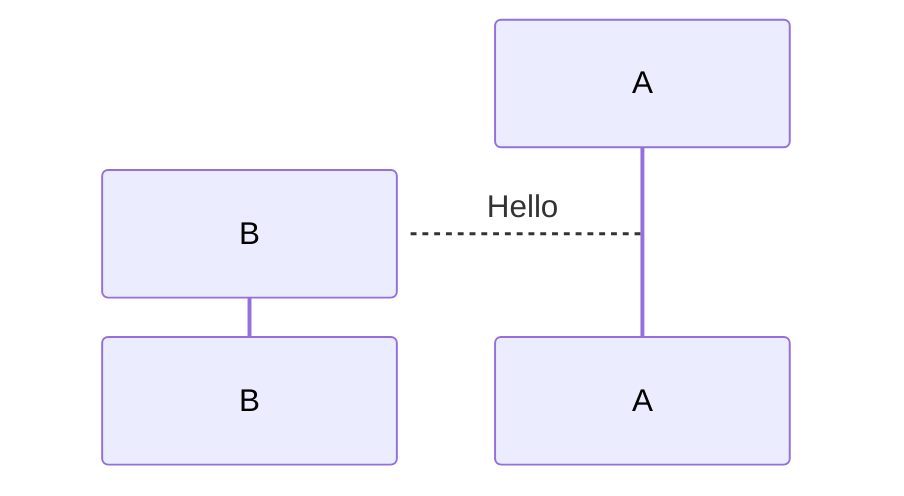

创建和销毁也可以使用别名。只有接收方可以创建，发送方和接收方都可以销毁。

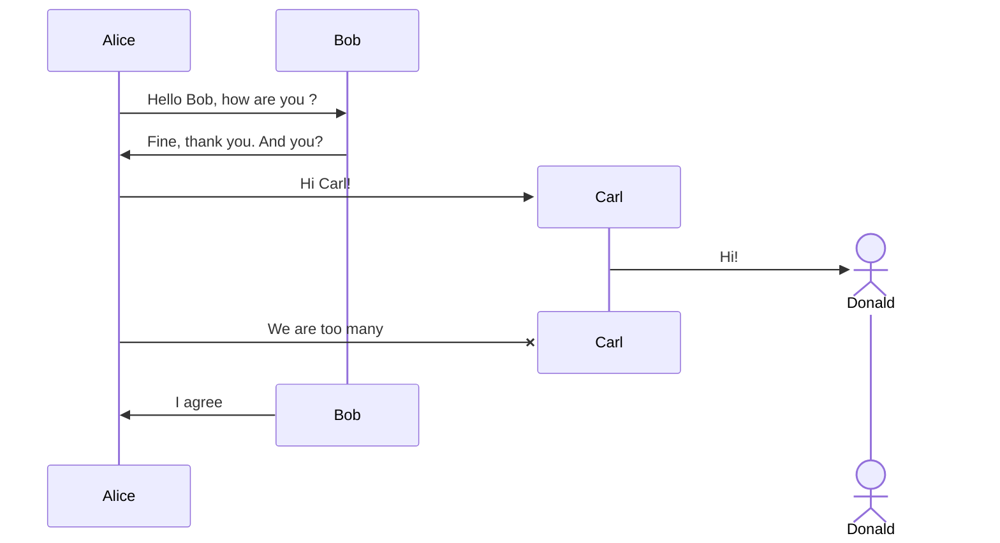

#### Unfixable actor/participant creation/deletion error

如果在创建和销毁参与者时报了这个错：

> The destroyed participant participant-name does not have an associated destroying message after its declaration. Please check the sequence diagram.

然后改了源码后还是有这个问题，并且会导致所有图表报这个错，那说明需要将 mermaid 升级到 10.7.0+

## 激活 activate

可以激活或停用一个参与者。可以显式声明。

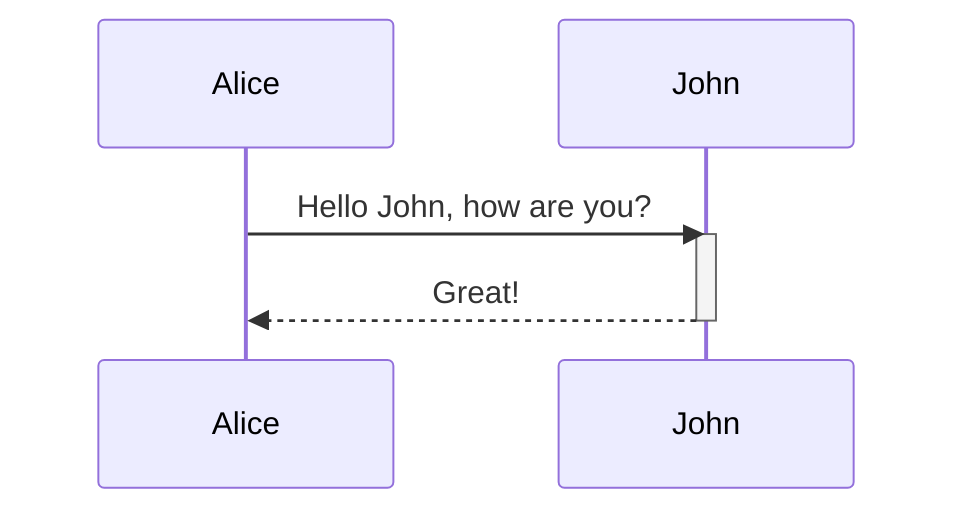

也可以在消息箭头后用`+/-`快捷声明：

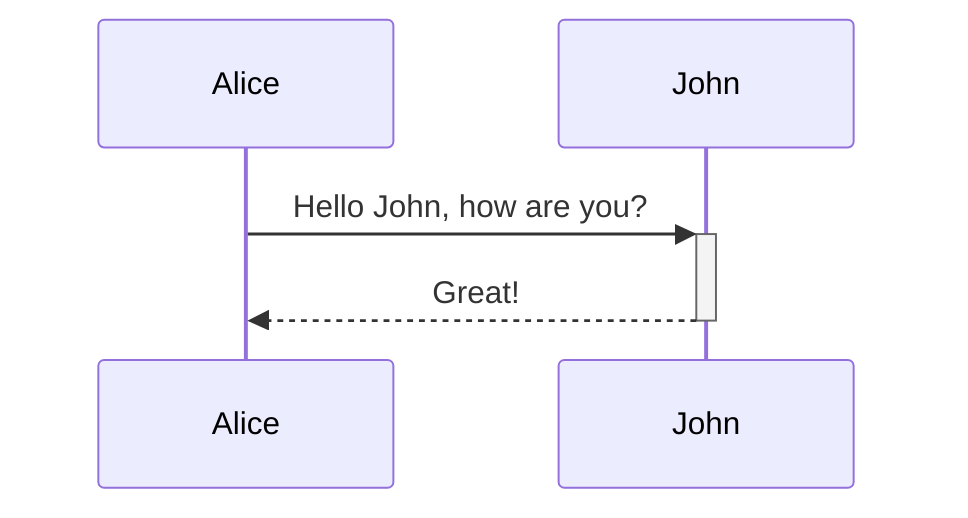

同一个参与者的激活可以嵌套：

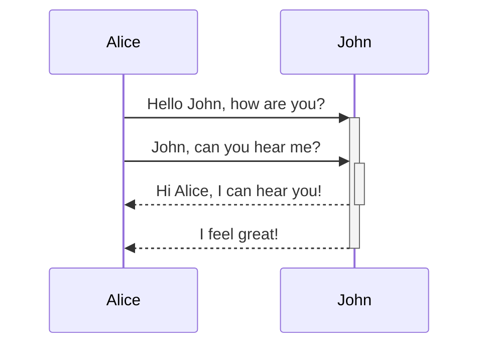


## 参与者详情列表 Acotr Menus

可以给参与者添加一个可以点开的列表，里面可以有一些外部链接

```
link <actor>: <link-label> @ <link-url>
```


### 高级语法

还有一种 json 格式的语法

```
links <actor>: <json-formatted link-name link-url pairs>
```


## 垂直分组 Grouping / Box

可以将参与者进行垂直分组。可以加上背景颜色和分组名：

```
box 颜色(如Aqua) 分组名
... actors ...
end

box
... actors ...
end

box rgb(33,66,99)
... actors ...
end

box rgba(33,66,99,0.5)
... actors ...
end
```

> 如果分组名就是一种颜色的名称，可以强制声明背景是透明的

```
box transparent Aqua
... actors ...
end
```

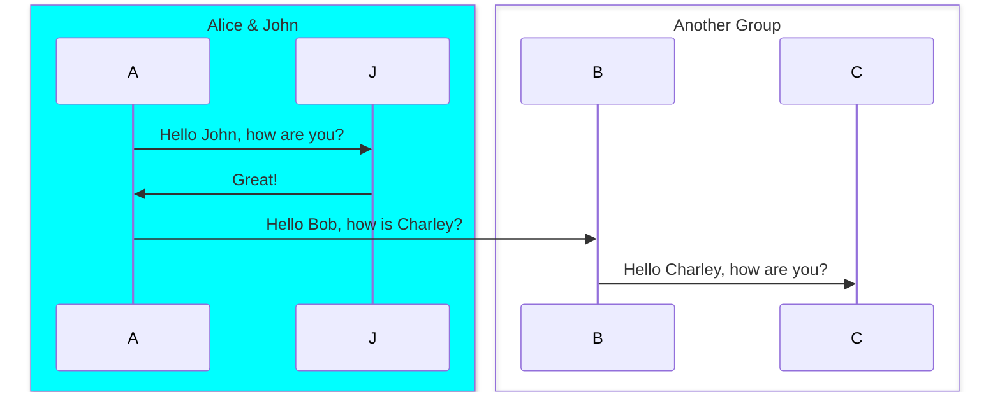

## 水平背景高亮

可以水平修改信息的背景颜色，来凸出流程。语法如下：

```
rect COLOR
... content ...
end
```

COLOR 可以用 `rgb(0, 255, 0)` 和 `rgba(0, 0, 255, .1)` 定义

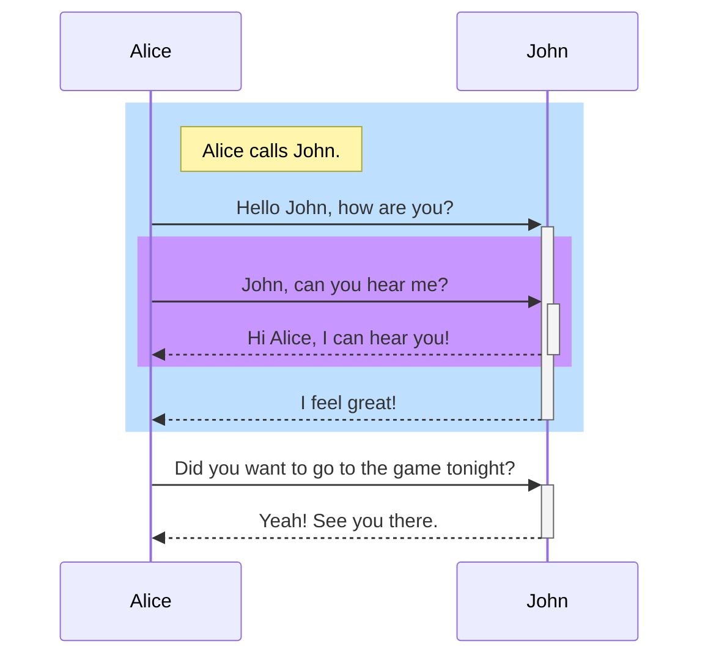

## 特殊逻辑标识

### 循环 Loop

可以通过下面的语法表达循环：

```
loop Loop text
... statements ...
end
```

```mermaid
sequenceDiagram
    Alice->John: Hello John, how are you?
    loop Every minute
        John-->Alice: Great!
    end
```

### 分支 Alt

表达替代路径 alternative path

```
alt Describing text
... statements ...
else
... statements ...
end
```

或者没有 else 的

```
opt Describing text
... statements ...
end
```

```mermaid
sequenceDiagram
    Alice->>Bob: Hello Bob, how are you?
    alt is sick
        Bob->>Alice: Not so good :(
    else is well
        Bob->>Alice: Feeling fresh like a daisy
    end
    opt Extra response
        Bob->>Alice: Thanks for asking
    end
```

### 并行 Parallel

```
par [Action 1]
... statements ...
and [Action 2]
... statements ...
and [Action N]
... statements ...
end
```

```mermaid
sequenceDiagram
    par Alice to Bob
        Alice->>Bob: Hello guys!
    and Alice to John
        Alice->>John: Hello guys!
    end
    Bob-->>Alice: Hi Alice!
    John-->>Alice: Hi Alice!
```

par 可以嵌套

```mermaid
sequenceDiagram
    par Alice to Bob
        Alice->>Bob: Go help John
    and Alice to John
        Alice->>John: I want this done today
        par John to Charlie
            John->>Charlie: Can we do this today?
        and John to Diana
            John->>Diana: Can you help us today?
        end
    end
```

### 关键区/临界区 Critical Region

当条件出现时，必须自动执行的动作

```
critical [Action that must be performed]
... statements ...
option [Circumstance A]
... statements ...
option [Circumstance B]
... statements ...
end
```

```mermaid
sequenceDiagram
    critical Establish a connection to the DB
        Service-->DB: connect
    option Network timeout
        Service-->Service: Log error
    option Credentials rejected
        Service-->Service: Log different error
    end
```

可以没有 `option`

```mermaid
sequenceDiagram
    critical Establish a connection to the DB
        Service-->DB: connect
    end
```

和 `par` 一样，可以嵌套

### 中断 break

可以用来表示流程的中止，通常用于模拟异常

```
break [something happened]
... statements ...
end
```

```mermaid
sequenceDiagram
    Consumer-->API: Book something
    API-->BookingService: Start booking process
    break when the booking process fails
        API-->Consumer: show failure
    end
    API-->BillingService: Start billing process
```

## 样式 Styling

序列图的样式是通过多个 css 类来定义的。在渲染时，在 `src/themes/sequence.scss` 处获取这些 css 文件。

### Classes used

| Class            | Description                                                    |
| ---------------- | -------------------------------------------------------------- |
| actor            | Styles for the actor box.                                      |
| actor-top        | Styles for the actor figure/ box at the top of the diagram.    |
| actor-bottom     | Styles for the actor figure/ box at the bottom of the diagram. |
| text.actor       | Styles for text of all of the actors.                          |
| text.actor-box   | Styles for text of the actor box.                              |
| text.actor-man   | Styles for text of the actor figure.                           |
| actor-line       | The vertical line for an actor.                                |
| messageLine0     | Styles for the solid message line.                             |
| messageLine1     | Styles for the dotted message line.                            |
| messageText      | Defines styles for the text on the message arrows.             |
| labelBox Defines | styles label to left in a loop.                                |
| labelText        | Styles for the text in label for loops.                        |
| loopText         | Styles for the text in the loop box.                           |
| loopLine         | Defines styles for the lines in the loop box.                  |
| note             | Styles for the note box.                                       |
| noteText         | Styles for the text on in the note boxes.                      |

### Sample stylesheet

```css
body {
  background: white;
}

.actor {
  stroke: #ccccff;
  fill: #ececff;
}
text.actor {
  fill: black;
  stroke: none;
  font-family: Helvetica;
}

.actor-line {
  stroke: grey;
}

.messageLine0 {
  stroke-width: 1.5;
  stroke-dasharray: '2 2';
  marker-end: 'url(#arrowhead)';
  stroke: black;
}

.messageLine1 {
  stroke-width: 1.5;
  stroke-dasharray: '2 2';
  stroke: black;
}

#arrowhead {
  fill: black;
}

.messageText {
  fill: black;
  stroke: none;
  font-family: 'trebuchet ms', verdana, arial;
  font-size: 14px;
}

.labelBox {
  stroke: #ccccff;
  fill: #ececff;
}

.labelText {
  fill: black;
  stroke: none;
  font-family: 'trebuchet ms', verdana, arial;
}

.loopText {
  fill: black;
  stroke: none;
  font-family: 'trebuchet ms', verdana, arial;
}

.loopLine {
  stroke-width: 2;
  stroke-dasharray: '2 2';
  marker-end: 'url(#arrowhead)';
  stroke: #ccccff;
}

.note {
  stroke: #decc93;
  fill: #fff5ad;
}

.noteText {
  fill: black;
  stroke: none;
  font-family: 'trebuchet ms', verdana, arial;
  font-size: 14px;
}
```

## 配置

> https://mermaid.js.org/config/configuration.html

可以调整边距。

This is done by defining `mermaid.sequenceConfig` or by the CLI to use a json file with the configuration. How to use the CLI is described in the mermaidCLI page. mermaid.sequenceConfig can be set to a JSON string with config parameters or the corresponding object.

```js
mermaid.sequenceConfig = {
    diagramMarginX: 50,
    diagramMarginY: 10,
    boxTextMargin: 5,
    noteMargin: 10,
    messageMargin: 35,
    mirrorActors: true,
};
```

# Flowchart 流程图

> 警告：
>
> 如果 node 命名中含有全小写的单词 end，会破坏图表。要将整个单词，或者部分字母大写，比如 END 或 End。或者用下面这种写法：
> ```mermaid
> graph TD
>   start --> state
>   state --> endnode["end"]
> ```

> 警告：
>
> 如果连接中后面的 node 的首字母要用 o 或 x 开头，要添加空格或将字母大写。例如：dev--- ops / dev---Ops

## 图表声明

既可以用 `flowchart`，也可以用 `graph`

## 标题

```mermaid
---
title: 写个标题
---
flowchart LR
    id
```

## 方向


