# Flowchart 流程图

> <https://mermaid.js.org/syntax/flowchart.html>

## 1. Flowchart 流程图 示例

```text
flowchart LR
    id --> next
```

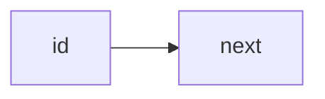

flowchart 由 点（node） 和 边（edge） 组成。node 是各种各样的几何图形，edge 包括不同的箭头和不同的连线。

> 警告：
>
> 如果 node 命名中含有全小写的单词 end，会破坏图表。要将整个单词，或者部分字母大写，比如 END 或 End。或者用下面这种写法：
>
> ```text
> graph TD
>   start --> state
>   state --> endnode["end"]
> ```

> 警告：
>
> 如果连接中后面的 node 的首字母要用 o 或 x 开头，要添加空格或将字母大写。例如：dev--- ops / dev---Ops

## 2. 图表声明

既可以用 `flowchart`，也可以用 `graph`

## 3. 标题

```text
---
title: 写个标题
---
flowchart LR
    id
```

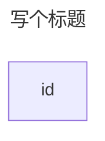

## 4. 方向

紧随在 flowchart / graph 后的 2 个字母可以定义流程图的方向

| 缩写 | 含义                            | 方向     |
| ---- | ------------------------------- | -------- |
| TB   | Top to bottom                   | 从上往下 |
| TD   | Top-down/ same as top to bottom | 从上往下 |
| BT   | Bottom to top                   | 从下往上 |
| RL   | Right to left                   | 从右往左 |
| LR   | Left to right                   | 从左往右 |

## 5. 节点

### 5.1. 节点内的文本和 id

```text
flowchart LR
    id[文本内容]
```


如果一个给同一个 id 指定了多个文本，那么最后一个文本会生效。

```text
flowchart LR
    id[文本内容1]
    id[文本内容2]
```

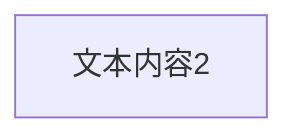

如果之后要给 node 定义 edge，可以省略文本定义【？】

#### 5.1.1. unicode 支持

可以使用 `"` 包裹含有 unicode 的文本

```text
flowchart LR
    id["This ❤ Unicode"]
```

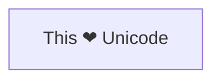

#### 5.1.2. markdown 格式支持

可以使用反点和双引号 `"markdown"` 来包裹住 markdown 文本内容

```text
%%{init: {"flowchart": {"htmlLabels": false}} }%%
flowchart LR
    markdown["`This **is** _Markdown_`"]
    newLines["`Line1
    Line 2
    Line 3`"]
    markdown --> newLines
```

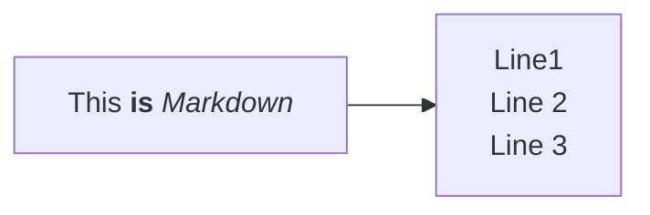

### 5.2. 节点形状

#### 5.2.1. 传统语法

| 语法           | 示例                                                          |
| -------------- | ------------------------------------------------------------- |
| `id(text)`     | [圆角](#5211-圆角-a-node-with-round-edges)                    |
| `id([text])`   | [半圆](#5212-半圆-a-stadium-shaped-node)                      |
| `id[[text]]`   | [双线](#5213-双线-a-node-in-a-subroutine-shape)               |
| `id[(text)]`   | [圆柱数据库](#5214-圆柱数据库-a-node-in-a-cylindrical-shape)  |
| `id((text))`   | [圆](#5215-圆-a-node-in-the-form-of-a-circle)                 |
| `id>text]`     | [旗子](#5216-旗子-a-node-in-an-asymmetric-shape)              |
| `id{text}`     | [菱形](#5217-菱形-a-node-rhombus)                             |
| `id{{text}}`   | [两头尖](#5218-两头尖-a-hexagon-node)                         |
| `id[/text/]`   | [平行四边形](#5219-平行四边形-parallelogram)                  |
| `id[\text\]`   | [反方向平行四边形](#52110-反方向平行四边形-parallelogram-alt) |
| `id[/text\]`   | [梯形](#52111-梯形-trapezoid)                                 |
| `id[\text/]`   | [倒梯形](#52112-倒梯形-trapezoid-alt)                         |
| `id(((text)))` | [双圈圆](#52113-双圈圆-double-circle)                         |

##### 5.2.1.1. 圆角 a node with round edges

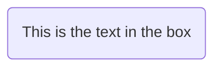

##### 5.2.1.2. 半圆 A stadium-shaped node

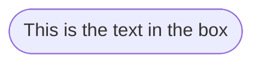

##### 5.2.1.3. 双线 A node in a subroutine shape

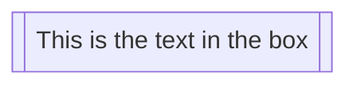

##### 5.2.1.4. 圆柱数据库 A node in a cylindrical shape

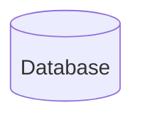

##### 5.2.1.5. 圆 A node in the form of a circle

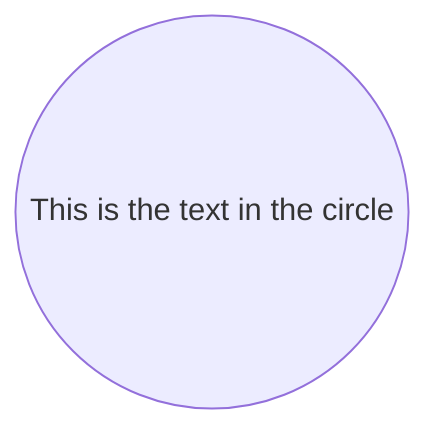

##### 5.2.1.6. 旗子 A node in an asymmetric shape

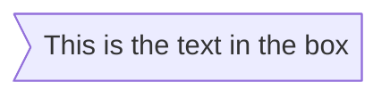

##### 5.2.1.7. 菱形 A node (rhombus)

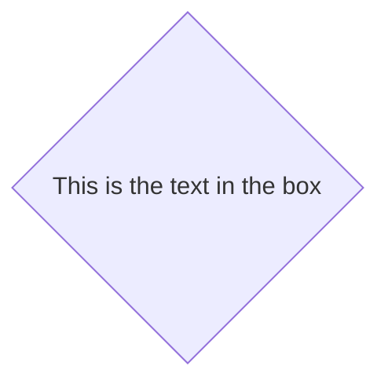

##### 5.2.1.8. 两头尖 A hexagon node


##### 5.2.1.9. 平行四边形 Parallelogram

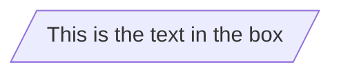

##### 5.2.1.10. 反方向平行四边形 Parallelogram alt

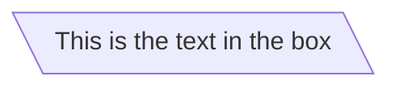

##### 5.2.1.11. 梯形 Trapezoid

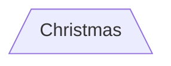

##### 5.2.1.12. 倒梯形 Trapezoid alt

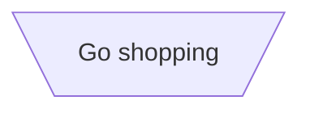

##### 5.2.1.13. 双圈圆 Double circle

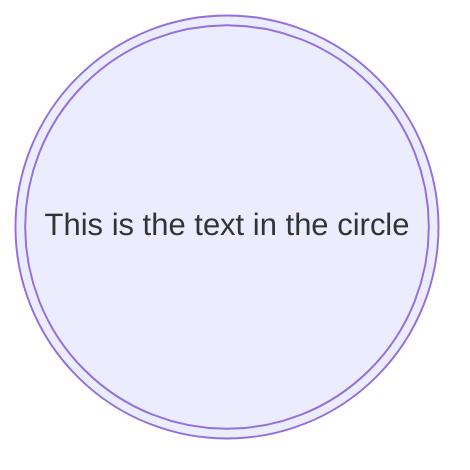

#### 5.2.2. 扩展节点形状（v11.3.0+）

Mermaid 引入了 30 种新形状，以增强流程图创建的灵活性和精确性。这些新形状为在流程图中视觉化表示流程、决策、事件、数据存储等元素提供了更多选项，从而提高了清晰度和语义意义。

Mermaid 现在支持一种通用的语法来定义形状类型，以适应不断增长的形状数量。这种语法允许你使用清晰且灵活的格式将特定的形状分配给节点：

```text
A@{ shape: rect }
```

这种语法创建一个名为 A 的矩形节点。它渲染的方式与 `A["A"]` 或 `A` 相同。

##### 5.2.2.1. 新形状完整列表

以下是新引入的形状及其对应的语义含义、简称和别名：

| Semantic Name 语义名称                               | Shape Name 形状名称               | Short Name 简称 | Description          | Alias Supported 别名支持                                         |
| ---------------------------------------------------- | --------------------------------- | --------------- | -------------------- | ---------------------------------------------------------------- |
| Card 卡片                                            | Notched Rectangle 缺口矩形        | `notch-rect`    | 表示卡片             | `card`, `notched-rectangle`                                      |
| Collate 合并                                         | Hourglass 沙漏                    | `hourglass`     | 表示合并操作         | `collate`, `hourglass`                                           |
| Com Link 链接                                        | Lightning Bolt 闪电               | `bolt`          | 通信链接             | `com-link`, `lightning-bolt`                                     |
| Comment 评论                                         | Curly Brace 花括号                | `brace`         | 添加注释             | `brace-l`, `comment`                                             |
| Comment Right 注释右对齐                             | Curly Brace 花括号                | `brace-r`       | 添加注释             |                                                                  |
| Comment with braces on both sides 两边带大括号的注释 | Curly Braces 大括号               | `braces`        | 添加注释             |                                                                  |
| Data Input/Output 数据输入/输出                      | Lean Right 向右倾斜               | `lean-r`        | 表示输入或输出       | `in-out`, `lean-right`                                           |
| Data Input/Output 数据输入/输出                      | Lean Left 向左倾斜                | `lean-l`        | 表示输入或输出       | `lean-left`, `out-in`                                            |
| Database 数据库                                      | Cylinder 圆柱体                   | `cyl`           | 数据库存储           | `cylinder`, `database`, `db`                                     |
| Decision 决策                                        | Diamond 菱形                      | `diam`          | 决策步骤             | `decision`, `diamond`, `question`                                |
| Delay 延迟                                           | Half-Rounded Rectangle 半圆角矩形 | `delay`         | 表示延迟             | `half-rounded-rectangle`                                         |
| Direct Access Storage 直接访问存储                   | Horizontal Cylinder 水平圆柱      | `h-cyl`         | 直接访问存储         | `das`, `horizontal-cylinder`                                     |
| Disk Storage 磁盘存储                                | Lined Cylinder 线性圆柱体         | `lin-cyl`       | 磁盘存储             | `disk`, `lined-cylinder`                                         |
| Display 显示                                         | Curved Trapezoid 弧形梯形         | `curv-trap`     | 表示显示             | `curved-trapezoid`, `display`                                    |
| Divided Process 分解流程                             | Divided Rectangle 分割矩形        | `div-rect`      | 分割流程形状         | `div-proc`, `divided-process`, `divided-rectangle`               |
| Document 文档                                        | Document 文档                     | `doc`           | 表示一个文档         | `doc`, `document`                                                |
| Event 事件                                           | Rounded Rectangle 圆角矩形        | `rounded`       | 表示一个事件         | `event`                                                          |
| Extract 提取                                         | Triangle 三角形                   | `tri`           | 提取过程             | `extract`, `triangle`                                            |
| Fork/Join 分叉或合并                                 | Filled Rectangle 填充矩形         | `fork`          | 在流程图中分叉或合并 | `join`                                                           |
| Internal Storage 内部存储                            | Window Pane 窗口窗格              | `win-pane`      | 内部存储             | `internal-storage`, `window-pane`                                |
| Junction 连接点                                      | Filled Circle 实心圆              | `f-circ`        | 连接点               | `filled-circle`, `junction`                                      |
| Lined Document 带线文档                              | Lined Document 带线文档           | `lin-doc`       | 带格线的文档         | `lined-document`                                                 |
| Lined/Shaded Process 带线/阴影过程                   | Lined Rectangle 带线的矩形        | `lin-rect`      | 带线的流程形状       | `lin-proc`, `lined-process`, `lined-rectangle`, `shaded-process` |
| Loop Limit 循环限制                                  | Trapezoidal Pentagon 梯形五边形   | `notch-pent`    | 循环限制步骤         | `loop-limit`, `notched-pentagon`                                 |
| Manual File 手动文件                                 | Flipped Triangle 翻转三角形       | `flip-tri`      | 手动文件操作         | `flipped-triangle`, `manual-file`                                |
| Manual Input 手动输入                                | Sloped Rectangle 斜矩形           | `sl-rect`       | 手动输入步骤         | `manual-input`, `sloped-rectangle`                               |
| Manual Operation 手动操作                            | Trapezoid Base Top 梯形上底       | `trap-t`        | 表示手动任务         | `inv-trapezoid`, `manual`, `trapezoid-top`                       |
| Multi-Document 多文档                                | Stacked Document 堆叠文档         | `docs`          | 多个文档             | `documents`, `st-doc`, `stacked-document`                        |
| Multi-Process 多进程                                 | Stacked Rectangle 堆叠矩形        | `st-rect`       | 多个进程             | `processes`, `procs`, `stacked-rectangle`                        |
| Odd 奇数                                             | Odd 奇数                          | `odd`           | 奇形                 |                                                                  |
| Paper Tape 纸带                                      | Flag 标志                         | `flag`          | 纸带                 | `paper-tape`                                                     |
| Prepare Conditional 准备条件                         | Hexagon 六边形                    | `hex`           | 准备或条件步骤       | `hexagon`, `prepare`                                             |
| Priority Action 优先行动                             | Trapezoid Base Bottom 梯形底边    | `trap-b`        | 优先操作             | `priority`, `trapezoid`, `trapezoid-bottom`                      |
| Process 流程                                         | Rectangle 矩形                    | `rect`          | 标准流程形状         | `proc`, `process`, `rectangle`                                   |
| Start 开始                                           | Circle 圆形                       | `circle`        | 起点                 | `circ`                                                           |
| Start 开始                                           | Small Circle 小圆圈               | `sm-circ`       | 小起点               | `small-circle`, `start`                                          |
| Stop 停止                                            | Double Circle 双圆                | `dbl-circ`      | 表示停止点           | `double-circle`                                                  |
| Stop 停止                                            | Framed Circle 带框圆              | `fr-circ`       | 停止点               | `framed-circle`, `stop`                                          |
| Stored Data 存储数据                                 | Bow Tie Rectangle 蝴蝶结矩形      | `bow-rect`      | 存储数据             | `bow-tie-rectangle`, `stored-data`                               |
| Subprocess 子流程                                    | Framed Rectangle 带边框矩形       | `fr-rect`       | 子流程               | `framed-rectangle`, `subproc`, `subprocess`, `subroutine`        |
| Summary 摘要                                         | Crossed Circle 交叉圆圈           | `cross-circ`    | 摘要                 | `crossed-circle`, `summary`                                      |
| Tagged Document 标记文档                             | Tagged Document 标记文档          | `tag-doc`       | 标记文档             | `tag-doc`, `tagged-document`                                     |
| Tagged Process 标记流程                              | Tagged Rectangle 标记矩形         | `tag-rect`      | 标记流程             | `tag-proc`, `tagged-process`, `tagged-rectangle`                 |
| Terminal Point 终端点                                | Stadium 体育场                    | `stadium`       | 终端点               | `pill`, `terminal`                                               |
| Text Block 文本块                                    | Text Block 文本块                 | `text`          | 文本块               |                                                                  |

##### 5.2.2.2. 例子

```text
flowchart TD
    A@{ shape: manual-file, label: "File Handling"}
    B@{ shape: manual-input, label: "User Input"}
    C@{ shape: docs, label: "Multiple Documents"}
    D@{ shape: procs, label: "Process Automation"}
    E@{ shape: paper-tape, label: "Paper Records"}
```

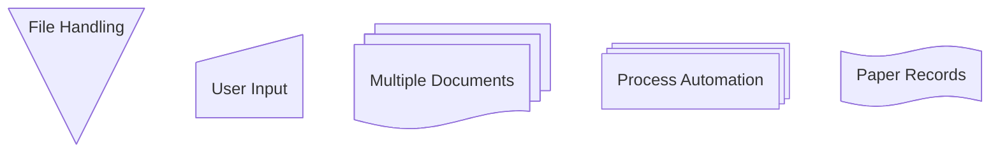

```mermaid
flowchart LR

    %% card notch-rect notched-rectangle
    graph1@{ shape: card, label: "表示卡片"}

    %% hourglass collate
    graph2@{ shape: hourglass, label: "表示合并操作"}

    %% bolt com-link lightning-bolt
    graph3@{ shape: bolt, label: "通信链接"}

    %% brace brace-l comment
    graph4@{ shape: brace-l , label: "添加注释"}

    graph5@{ shape: brace-r, label: "添加注释"}

    graph6@{ shape: braces, label: "添加注释"}

    %% lean-r lean-right in-out
    graph7@{ shape: lean-r, label: "表示输入或输出"}

    %% lean-l lean-left out-in
    graph8@{ shape: lean-l, label: "表示输入或输出"}

    %% cyl cylinder db database
    graph9@{ shape: db, label: "数据库存储"}

    %% diam diamond decision question
    graph10@{ shape: diam, label: "决策步骤"}

    %% delay half-rounded-rectangle
    graph11@{ shape: delay, label: "表示延迟"}

    %% h-cyl horizontal-cylinder das
    graph12@{ shape: das, label: "直接访问存储"}

    %% lin-cyl lined-cylinder disk
    graph13@{ shape: disk, label: "磁盘存储"}

    %% curv-trap curved-trapezoid display
    graph14@{ shape: display, label: "表示显示"}

    %% div-rect divided-rectangle div-proc divided-process
    graph15@{ shape: div-rect, label: "分割流程形状"}

    %% doc document
    graph16@{ shape: doc, label: "表示一个文档"}

    %% event rounded
    graph17@{ shape: event, label: "表示一个事件"}

    %% tri triangle extract
    graph18@{ shape: tri, label: "提取过程"}

    %% fork join
    graph19@{ shape: fork, label: "在流程图中分叉或合并"}

    %% win-pane window-pane internal-storage
    graph20@{ shape: win-pane, label: "内部存储"}

    %% f-circ filled-circle junction
    graph21@{ shape: f-circ, label: "连接点"}

    %% lin-doc lined-document
    graph22@{ shape: lin-doc, label: "带格线的文档"}


    %% lin-rect lined-rectangle lin-proc lined-process shaded-process
    graph23@{ shape: lin-rect, label: "带线的流程形状"}

    %% notch-pent notched-pentagon loop-limit
    graph24@{ shape: notch-pent, label: "循环限制步骤"}

    %% flip-tri flipped-triangle manual-file
    graph25@{ shape: flip-tri, label: "手动文件操作"}

    %% sl-rect sloped-rectangle manual-input
    graph26@{ shape: sl-rect, label: "手动输入步骤"}

    %% trap-t trapezoid-top inv-trapezoid manual
    graph27@{ shape: trap-t, label: "表示手动任务"}

    %% docs documents st-doc stacked-document
    graph28@{ shape: docs, label: "多个文档"}

    %% procs processes st-rect stacked-rectangle
    graph29@{ shape: procs, label: "多个进程"}

    %% odd
    graph30@{ shape: odd, label: "奇形"}

    %% flag paper-tape
    graph31@{ shape: flag, label: "纸带"}
    %% hex hexagon prepare
    graph32@{ shape: hex, label: "准备或条件步骤"}
    %% trap-b trapezoid-bottom trapezoid priority
    graph33@{ shape: trap-b, label: "优先操作"}

    %% rect rectangle proc process
    graph34@{ shape: rect, label: "标准流程形状"}

    %% circ circle
    graph35@{ shape: circ, label: "起点"}

    %% sm-circ small-circle start
    graph36@{ shape: start, label: "小起点"}

    %% dbl-circ double-circle
    graph37@{ shape: dbl-circ, label: "表示停止点"}

    %% fr-circ framed-circle stop
    graph38@{ shape: stop, label: "停止点"}

    %% bow-rect bow-tie-rectangle stored-data
    graph39@{ shape: bow-rect, label: "存储数据"}

    %% fr-rect framed-rectangle subproc subprocess subroutine
    graph40@{ shape: subproc, label: "子流程"}

    %% cross-circ crossed-circle summary
    graph41@{ shape: summary, label: "摘要"}

    %% tag-doc tagged-document
    graph42@{ shape: tag-doc, label: "标记文档"}

    %% tag-rect tagged-rectangle tag-proc tagged-process
    graph43@{ shape: tag-rect, label: "标记流程"}

    %% stadium pill terminal
    graph44@{ shape: terminal, label: "终端点"}

    %% text
    graph45@{ shape: text, label: "文本块"}
```

#### 5.2.3. 特殊形状（v11.3.0+）

Mermaid 还引入了两种特殊形状来增强您的流程图：图标和图片。这些形状允许您直接在流程图中包含图标和图片，提供更多的视觉上下文和清晰度。

这些新形状为您的流程图提供了额外的灵活性和视觉吸引力，使其更具信息量和吸引力。

##### 5.2.3.1. 图标形状 Icon Shape

您可以使用 icon 形状在流程图中包含图标。要使用图标，您需要先注册图标包。按照说明[添加自定义图标](#52312-注册-icon-包)。定义图标形状的语法如下：

```text
flowchart TD
    A@{ icon: "fa:user", form: "square", label: "User Icon", pos: "t", h: 60 }
```

```mermaid
flowchart TD
    A@{ icon: "fa:user", form: "square", label: "User Icon", pos: "t", h: 60 }
```

###### 5.2.3.1.1. 参数 Parameters

-   icon: 来自注册图标包的图标名称。
-   form: 指定图标的背景形状。如果未定义，则图标没有背景。选项包括：
    -   `square`
    -   `circle`
    -   `rounded`
-   label: 与图标关联的文本标签。可以是任意字符串。如果未定义，则不会显示任何标签。
-   pos: 标签的位置。如果未定义，标签将默认位于图标底部。可能的值包括：
    -   `t`
    -   `b`
-   h: 图标的高度。若未定义，则默认为最小值 48。

###### 5.2.3.1.2. 注册 icon 包

可用的图标包可以在 [icones.js.org](https://icones.js.org/) 找到。我们使用注册图标包时定义的名称来覆盖 iconify 包的前缀字段。这允许用户使用更短的图标名称。它还允许我们仅在图表中使用时加载特定的图标包。

直接从 CDN 使用 JSON 文件：

```js
import mermaid from "CDN/mermaid.esm.mjs";
mermaid.registerIconPacks([
    {
        name: "logos",
        loader: () =>
            fetch("https://unpkg.com/@iconify-json/logos@1/icons.json").then(
                (res) => res.json()
            ),
    },
]);
```

使用包和捆绑器：

```bash
npm install @iconify-json/logos@1
```

使用延迟加载

```js
import mermaid from "mermaid";

mermaid.registerIconPacks([
    {
        name: "logos",
        loader: () =>
            import("@iconify-json/logos").then((module) => module.icons),
    },
]);
```

没有延迟加载

```js
import mermaid from "mermaid";
import { icons } from "@iconify-json/logos";
mermaid.registerIconPacks([
    {
        name: icons.prefix, // To use the prefix defined in the icon pack
        icons,
    },
]);
```

#### 5.2.4. 图像形状 Image Shape

您可以使用 `image` 形状在流程图中插入图像。定义图像形状的语法如下：

```text
flowchart TD
    A@{ img: "https://example.com/image.png", label: "Image Label", pos: "t", w: 60, h: 60, constraint: "off" }
```

```mermaid
flowchart TD
    A@{ img: "https://avatars.githubusercontent.com/u/47018690?v=4&size=64", label: "Image Label", pos: "t", w: 60, h: 60, constraint: "off" }
```

##### 5.2.4.1. 参数 Parameters

-   img: 要显示的图像的 URL。
-   label: 与图像关联的文本标签。可以是任意字符串。如果未定义，则不会显示任何标签。
-   pos: 标签的位置。如果未定义，则标签默认位于图片底部。可能的值包括：
    -   `t`
    -   `b`
-   w: 图像的宽度。如果未定义，则默认为图像的自然宽度。
-   h: 图像的高度。若未定义，则默认为图像的自然高度。
-   constraint: 确定图像是否应约束节点大小。此设置还可确保图像保持其原始宽高比，并根据宽度 ( `w` ) 相应地调整高度 ( `h` )。如果未定义，则默认为 `off` 。可能的值包括：
    -   `on`
    -   `off`

## 6. 节点之间的链接 Links between nodes

节点可以通过链接（links）/边（edges）连接。可以使用不同类型的链接，也可以将文本字符串附加到链接上。

### 6.1. 传统语法

| 语法                             | 效果                                 |
| -------------------------------- | ------------------------------------ |
| `-->`                            | 带箭头的链接                         |
| `---`                            | 开放链接                             |
| `-- text ---`                    | 链接上的文字写法 1                   |
| `---\|text\|`                    | 链接上的文字写法 2                   |
| `-->\|text\|`                    | 带有箭头和文字的链接写法 1           |
| `-- text -->`                    | 带有箭头和文字的链接写法 2           |
| `-.->`                           | 虚线链接                             |
| `-. text .->`                    | 带文字的虚线链接                     |
| `==>`                            | 粗链接                               |
| `== text ==>`                    | 带文字的粗链接                       |
| `~~~`                            | 看不见的链接，便于改变节点的默认定位 |
| `A -- text --> B -- text2 --> C` | 链式链接写法                         |
| `a --> b & c --> d`              | 同时声明多个节点的链接               |
| `A & B --> C & D`                | 同时声明多个节点的链接               |

```mermaid
flowchart LR
    A1 --> B1
    A2 --- B2
    A3 -- text ---B3
    A4 ---|text|B4
    A5-->|text|B5
    A6-- text -->B6
    A7-.->B7
    A8-. text .-> B8
    A9 ==> B9
    A10 == text ==> B11
    A11 ~~~ B11
    A12 -- text --> B12 -- text2 --> C12
    a13 --> b13 & c13 --> d13
    A14 & B14 --> C14 & D14
```

### 6.2. 动画

#### 6.2.1. 给边增加 ID

Mermaid 现在支持为边分配 ID，类似于将 ID 和元数据附加到节点的方式。此功能为在边上实现更高级的样式、类和动画功能奠定了基础。

**语法：**

要为边添加 ID，请在边语法中添加 ID，后跟 `@` 字符。例如：

```text
flowchart LR
  A e1@--> B
```

在此示例中， `e1` 是连接 `A` 和 `B` 的边的 ID。您可以在后续的定义或样式语句中使用此 ID，就像节点一样。

#### 6.2.2. 打开动画

为边分配 ID 后，您可以通过定义边的属性来打开该边的动画：

```text
flowchart LR
  A e1@==> B
  e1@{ animate: true }
```

```mermaid
flowchart LR
  A e1@==> B
  e1@{ animate: true }
```

这告诉 Mermaid 边缘 `e1` 应该被动画化。

#### 6.2.3. 选择动画类型

在初始版本中，支持两种动画速度： `fast` 和 `slow` 。选择特定的动画类型是一次性启用动画并设置动画速度的简写。

```text
flowchart LR
  A e1@--> B
  e1@{ animation: fast }
```

```mermaid
flowchart LR
  A e1@--> B
  e1@{ animation: fast }
```

这相当于 `{ animate: true, animation: fast }` 。

#### 6.2.4. 使用 classDef 语句进行动画

您还可以通过为边（edges）分配类（class），然后在 `classDef` 语句中定义动画属性来为其添加动画效果。例如：

```text
flowchart LR
  A e1@--> B
  classDef animate stroke-dasharray: 9,5,stroke-dashoffset: 900,animation: dash 25s linear infinite;
  class e1 animate
```

```mermaid
flowchart LR
  A e1@--> B
  classDef animate stroke-dasharray: 9,5,stroke-dashoffset: 900,animation: dash 25s linear infinite;
  class e1 animate
```

在此代码片段中：

-   `e1@-->` 创建 ID 为 `e1` 的边。
-   `classDef animate` 定义一个名为 `animate` 的类，具有样式和动画属性。
-   `class e1 animate` 将 `animate` 类应用于边 `e1` 。

**关于转义逗号的注意事项:** 设置 `stroke-dasharray` 属性时，请记住将逗号转义为 `\,` 因为逗号在 Mermaid 的样式定义中用作分隔符。

### 6.3. 新的箭头类型

支持新类型的箭头：

| 语法   | 效果     |
| ------ | -------- |
| `--o`  | 圆点边   |
| `--x`  | 叉叉边   |
| `o--o` | 多向箭头 |

```mermaid
flowchart LR
    A1 --o B1
    A2 --x B2
    A o--o B
    B <--> C
    C x--x D
```

### 6.4. 链接的最小长度

流程图里的每一个节点，最终在被渲染的图里，都会被分配一个等级，例如在垂直或者水平级别上（取决于流程图的方向），根据其所链接到的节点，计算等级。

默认情况下，链接可以跨越任意数量的等级，但是可以在链接定义上添加额外的`-`，让它比其它链接都要长。

在以下示例中，从节点 B 到节点 E 的链接中添加了两个额外的`-`，因此它比常规链接多跨越两个等级

```text
flowchart TD
    A[Start] --> B{Is it?}
    B -->|Yes| C[OK]
    C --> D[Rethink]
    D --> B
    B ---->|No| E[End]
```

> A 是 1，B 是 2，C 是 3，D 是 4，E 本来因为直接和 B 相连，应该是 3，但是这里加了 2 个短横线，现在变成了 5

```mermaid
flowchart TD
    A[Start] --> B{Is it?}
    B -->|Yes| C[OK]
    C --> D[Rethink]
    D --> B
    B ---->|No| E[End]
```

> NOTE
>
> 为了适应其他请求，渲染引擎也可能会使链接的长度超过所请求的排名数。

当链接标签写在链接中间时，必须在链接右侧添加额外的破折号。以下示例与上一个示例等效：

```text
flowchart TD
    A[Start] --> B{Is it?}
    B -- Yes --> C[OK]
    C --> D[Rethink]
    D --> B
    B -- No ----> E[End]
```

对于点状或粗体链接，要添加的字符是等号或点，如下表所示：

| 长度         | 1      | 2       | 3        |
| ------------ | ------ | ------- | -------- |
| 普通         | `---`  | `----`  | `-----`  |
| 带箭头的普通 | `-->`  | `--->`  | `---->`  |
| 粗体         | `===`  | `====`  | `=====`  |
| 带箭头的粗体 | `==>`  | `===>`  | `====>`  |
| 虚线         | `-.-`  | `-..-`  | `-...-`  |
| 带箭头的虚线 | `-.->` | `-..->` | `-...->` |

### 6.5. 破坏语法的特殊字符

可以将文本放在引号内，以便渲染更难处理的字符。如下例所示：

```text
flowchart LR
    id1["This is the (text) in the box"]
```

#### 6.5.1. 用于转义字符的实体代码

可以使用此处示例的语法来转义字符。

```text
flowchart LR
    A["A double quote:#quot;"] --> B["A dec char:#9829;"]
```

```mermaid
flowchart LR
    A["A double quote:#quot;"] --> B["A dec char:#9829;"]
```

给出的数字是十进制的，因此 `#` 可以编码为 `#35;`。还支持使用 HTML 字符名称。

## 7. 子图 Subgraphs

```text
subgraph title
    graph definition
end
```

下面的示例：

```text
flowchart TB
    c1-->a2
    subgraph one
    a1-->a2
    end
    subgraph two
    b1-->b2
    end
    subgraph three
    c1-->c2
    end
```

```mermaid
flowchart TB
    c1-->a2
    subgraph one
    a1-->a2
    end
    subgraph two
    b1-->b2
    end
    subgraph three
    c1-->c2
    end
```

您还可以为子图设置明确的 ID。

```text
flowchart TB
    c1-->a2
    subgraph ide1 [one]
    a1-->a2
    end
```

```mermaid
flowchart TB
    c1-->a2
    subgraph ide1 [one]
    a1-->a2
    end
```

### 7.1. flowcharts

使用流程图时，还可以设置子图的边，如下图所示。

```text
flowchart TB
    c1-->a2
    subgraph one
    a1-->a2
    end
    subgraph two
    b1-->b2
    end
    subgraph three
    c1-->c2
    end
    one --> two
    three --> two
    two --> c2
```

```mermaid
flowchart TB
    c1-->a2
    subgraph one
    a1-->a2
    end
    subgraph two
    b1-->b2
    end
    subgraph three
    c1-->c2
    end
    one --> two
    three --> two
    two --> c2
```

### 7.2. 子图的方向

使用流程图时，您可以使用方向语句来设置子图将呈现的方向，如本例所示。

```text
flowchart LR
    subgraph TOP
        direction TB
        subgraph B1
            direction RL
            i1 -->f1
        end
        subgraph B2
            direction BT
            i2 -->f2
        end
    end
    A --> TOP --> B
    B1 --> B2
```

```mermaid
flowchart LR
    subgraph TOP
        direction TB
        subgraph B1
            direction RL
            i1 -->f1
        end
        subgraph B2
            direction BT
            i2 -->f2
        end
    end
    A --> TOP --> B
    B1 --> B2
```

#### 7.2.1. 局限性

如果子图中的任何节点链接到外部，则子图的方向将被忽略。这时，子图将继承父图的方向：

```text
flowchart LR
    subgraph subgraph1
        direction TB
        top1[top] --> bottom1[bottom]
    end
    subgraph subgraph2
        direction TB
        top2[top] --> bottom2[bottom]
    end
    %% ^ These subgraphs are identical, except for the links to them:

    %% Link *to* subgraph1: subgraph1 direction is maintained
    outside --> subgraph1
    %% Link *within* subgraph2:
    %% subgraph2 inherits the direction of the top-level graph (LR)
    outside ---> top2
```

```mermaid
flowchart LR
    subgraph subgraph1
        direction TB
        top1[top] --> bottom1[bottom]
    end
    subgraph subgraph2
        direction TB
        top2[top] --> bottom2[bottom]
    end
    %% ^ These subgraphs are identical, except for the links to them:

    %% Link *to* subgraph1: subgraph1 direction is maintained
    outside --> subgraph1
    %% Link *within* subgraph2:
    %% subgraph2 inherits the direction of the top-level graph (LR)
    outside ---> top2
```

## 8. Markdown 字符串

“Markdown 字符串”功能通过提供更加通用的字符串类型来增强流程图和思维导图，它支持粗体和斜体等文本格式选项，并自动将文本换行到标签内。

```text
---
config:
    flowchart:
        htmlLabels: false
---
flowchart LR
subgraph "One"
    a("`The **cat**
    in the hat`") -- "edge label" --> b{{"`The **dog** in the hog`"}}
end
subgraph "`**Two**`"
    c("`The **cat**
    in the hat`") -- "`Bold **edge label**`" --> d("The dog in the hog")
end
```

```mermaid
---
config:
    flowchart:
        htmlLabels: false
---
flowchart LR
subgraph "One"
    a("`The **cat**
    in the hat`") -- "edge label" --> b{{"`The **dog** in the hog`"}}
end
subgraph "`**Two**`"
    c("`The **cat**
    in the hat`") -- "`Bold **edge label**`" --> d("The dog in the hog")
end
```

格式：

-   对于粗体文本，在文本前后使用双星号（ `**` ）
-   对于斜体，在文本前后使用单个星号 ( `*` )。
-   使用传统字符串时，您需要添加 `<br>` 标签才能在节点中换行。但是，Markdown 字符串会在文本过长时自动换行，您只需使用换行符（而不是 `<br>` 标签）即可开始新行。

此功能适用于节点标签、边标签和子图标签。

可以使用以下方法禁用自动换行

```text
---
config:
    markdownAutoWrap: false
---
graph LR
```

## 9. 交互 Interaction

可以将点击事件绑定到节点，点击可以导致 JavaScript 回调或在新浏览器选项卡中打开的链接。

> INFO
>
> 使用 `securityLevel='strict'` 时此功能被禁用，使用 `securityLevel='loose'` 时此功能被启用。

```text
click nodeId callback
click nodeId call callback()
```

-   nodeId 是节点的 id
-   callback 是在显示图形的页面上定义的 javascript 函数的名称，该函数将使用 nodeId 作为参数进行调用

以下是工具提示 tooltip 使用的示例：

```html
<script>
    window.callback = function () {
        alert("A callback was triggered");
    };
</script>
```

工具提示文本用双引号括起来。工具提示的样式由 `.mermaidTooltip` 类设置。

```text
flowchart LR
    A-->B
    B-->C
    C-->D
    click A callback "Tooltip for a callback"
    click B "https://www.github.com" "This is a tooltip for a link"
    click C call callback() "Tooltip for a callback"
    click D href "https://www.github.com" "This is a tooltip for a link"
```

```mermaid
flowchart LR
    A-->B
    B-->C
    C-->D
    click A callback "Tooltip for a callback"
    click B "https://www.github.com" "This is a tooltip for a link"
    click C call callback() "Tooltip for a callback"
    click D href "https://www.github.com" "This is a tooltip for a link"
```

> 注意
>
> 从 0.5.2 版本开始，工具提示功能和链接到 URL 的功能可用。
>
> 由于 Docsify 处理 JavaScript 回调函数的方式存在限制，因此可以在此 [jsfiddle](https://jsfiddle.net/yk4h7qou/2/) 查看上述代码的另一个工作演示。

链接默认在同一个浏览器标签页/窗口中打开。您可以通过在点击定义中添加链接目标来更改此设置（支持 `_self`, `_blank`, `_parent` 和 `_top` ）：

```text
flowchart LR
    A-->B
    B-->C
    C-->D
    D-->E
    click A "https://www.github.com" _blank
    click B "https://www.github.com" "Open this in a new tab" _blank
    click C href "https://www.github.com" _blank
    click D href "https://www.github.com" "Open this in a new tab" _blank
```

```mermaid
flowchart LR
    A-->B
    B-->C
    C-->D
    D-->E
    click A "https://www.github.com" _blank
    click B "https://www.github.com" "Open this in a new tab" _blank
    click C href "https://www.github.com" _blank
    click D href "https://www.github.com" "Open this in a new tab" _blank
```

初学者提示——在 HTML 上下文中使用交互式链接的完整示例：

```html
<body>
    <pre class="mermaid">
    flowchart LR
        A-->B
        B-->C
        C-->D
        click A callback "Tooltip"
        click B "https://www.github.com" "This is a link"
        click C call callback() "Tooltip"
        click D href "https://www.github.com" "This is a link"
    </pre>

    <script>
        window.callback = function () {
            alert("A callback was triggered");
        };
        const config = {
            startOnLoad: true,
            flowchart: {
                useMaxWidth: true,
                htmlLabels: true,
                curve: "cardinal",
            },
            securityLevel: "loose",
        };
        mermaid.initialize(config);
    </script>
</body>
```

## 10. 注释

可以在流程图中输入注释，但解析器会忽略这些注释。注释必须独占一行，并且必须以 `%%` （双百分号）开头。注释开头到下一个换行符之间的任何文本都将被视为注释，包括任何流程语法。

```text
flowchart LR
%% this is a comment A -- text --> B{node}
   A -- text --> B -- text2 --> C
```

## 11. 样式和类 Styling and classes

### 11.1. 设置链接的样式

可以设置链接的样式。例如，您可能想要设置流中向后移动的链接的样式。由于链接没有 ID，就像节点一样，因此需要其他方式来确定链接应附加的样式。可以使用链接在图中定义时的顺序号而不是 ID，或者使用 default 应用于所有链接。在下面的示例中，linkStyle 语句中定义的样式将属于图中的第四个链接：

```text
linkStyle 3 stroke:#ff3,stroke-width:4px,color:red;
```

还可以通过逗号分隔链接号，在单个语句中为多个链接添加样式：

```text
linkStyle 1,2,7 color:blue;
```

### 11.2. 设置曲线样式

如果默认方法无法满足您的需求，您可以自定义项目间连线的曲线样式。可用的曲线样式包括 `basis`, `bumpX`, `bumpY`, `cardinal`, `catmullRom`, `linear`, `monotoneX`, `monotoneY`, `natural`, `step`, `stepAfter` 和 `stepBefore`。

在此示例中，从左到右的图表使用 `stepBefore` 曲线样式：

```text
%%{ init: { 'flowchart': { 'curve': 'stepBefore' } } }%%
graph LR
```

有关可用曲线的完整列表（包括自定义曲线的说明），请参阅 [d3-shape](https://github.com/d3/d3-shape/) 项目中的[形状](https://d3js.org/d3-shape/curve)文档。

### 11.3. 设置节点样式

可以对节点应用特定样式，例如更粗的边框或不同的背景颜色。

```text
flowchart LR
    id1(Start)-->id2(Stop)
    style id1 fill:#f9f,stroke:#333,stroke-width:4px
    style id2 fill:#bbf,stroke:#f66,stroke-width:2px,color:#fff,stroke-dasharray: 5 5
```

```mermaid
flowchart LR
    id1(Start)-->id2(Stop)
    style id1 fill:#f9f,stroke:#333,stroke-width:4px
    style id2 fill:#bbf,stroke:#f66,stroke-width:2px,color:#fff,stroke-dasharray: 5 5
```

#### 11.3.1. 类

比每次定义样式更方便的是定义一个样式类并将此类附加到应该具有不同外观的节点。

类定义如下例所示：

```text
classDef className fill:#f9f,stroke:#333,stroke-width:4px;
```

另外，也可以在一个语句中为多个类定义样式：

```text
classDef firstClassName,secondClassName font-size:12pt;
```

将类附加到节点按以下步骤进行：

```text
class nodeId1 className;
```

还可以通过一个语句将一个类附加到节点列表：

```text
class nodeId1,nodeId2 className;
```

添加类的更简短形式是使用 `:::` 运算符将类名附加到节点，如下所示：

```text
flowchart LR
    A:::someclass --> B
    classDef someclass fill:#f96
```

```mermaid
flowchart LR
    A:::someclass --> B
    classDef someclass fill:#f96
```

在声明节点之间的多个链接时可以使用此形式：

```text
flowchart LR
    A:::foo & B:::bar --> C:::foobar
    classDef foo stroke:#f00
    classDef bar stroke:#0f0
    classDef foobar stroke:#00f
```

```mermaid
flowchart LR
    A:::foo & B:::bar --> C:::foobar
    classDef foo stroke:#f00
    classDef bar stroke:#0f0
    classDef foobar stroke:#00f
```

### 11.4. CSS 类

还可以预定义 CSS 样式中的类，这些类可以从图形定义中应用，如下例所示：

#### 11.4.1. Example style

```html
<style>
    .cssClass > rect {
        fill: #ff0000;
        stroke: #ffff00;
        stroke-width: 4px;
    }
</style>
```

#### 11.4.2. Example definition

```text
flowchart LR
    A-->B[AAA<span>BBB</span>]
    B-->D
    class A cssClass
```

```mermaid
flowchart LR
    A-->B[AAA<span>BBB</span>]
    B-->D
    class A cssClass
```

### 11.5. Default class

如果某个类名为 default，它将被分配给所有没有特定类定义的类。

```text
classDef default fill:#f9f,stroke:#333,stroke-width:4px;
```

## 12. 对 fontawesome 的基本支持

可以从 fontawesome 添加图标。

可以通过语法 fa:#icon class name# 访问图标。

```text
flowchart TD
    B["fa:fa-twitter for peace"]
    B-->C[fa:fa-ban forbidden]
    B-->D(fa:fa-spinner)
    B-->E(A fa:fa-camera-retro perhaps?)
```

```mermaid
flowchart TD
    B["fa:fa-twitter for peace"]
    B-->C[fa:fa-ban forbidden]
    B-->D(fa:fa-spinner)
    B-->E(A fa:fa-camera-retro perhaps?)
```

有两种方法可以显示这些 FontAwesome 图标：

### 12.1. 注册 FontAwesome 图标包 (v11.7.0+)

您可以按照 [“注册图标包”说明](https://mermaid.js.org/config/icons.html)注册您自己的 FontAwesome 图标包。

支持的前缀：`fa`, `fab`, `fas`, `far`, `fal`, `fad`。

> INFO
>
> 请注意，如果 FontAwesome 包未注册，它将恢复为 FontAwesome CSS。

### 12.2. 注册 FontAwesome CSS

如果网站包含 CSS，Mermaid 便支持 Font Awesome。Mermaid 对 Font Awesome 的版本没有任何限制。

请参阅[官方 Font Awesome 文档](https://fontawesome.com/start)， 了解如何将其包含在您的网站中。

在 `<head>` 中添加此代码片段将添加对 Font Awesome v6.5.1 的支持

```html
<link
    href="https://cdnjs.cloudflare.com/ajax/libs/font-awesome/6.5.1/css/all.min.css"
    rel="stylesheet"
/>
```

### 12.3. 自定义图标

只要网站导入相应的工具包，就可以使用 Font Awesome 提供的自定义图标。

请注意，这目前是 Font Awesome 的付费功能。

对于自定义图标，您需要使用 `fak` 前缀。

例子

```text
flowchart TD
    B[fa:fa-twitter] %% standard icon
    B-->E(fak:fa-custom-icon-name) %% custom icon
```

并尝试渲染它

```mermaid
flowchart TD
    B[fa:fa-twitter] %% standard icon
    B-->E(fak:fa-custom-icon-name) %% custom icon
```

## 13. 图形声明中的顶点和链接之间有空格，且没有分号

-   在图形声明中，语句现在也可以不以分号结尾。在 0.2.16 版本之后，图形语句是否以分号结尾不再是必需的。因此，下面的图形声明与旧的图形声明一样有效。
-   顶点和链接之间允许有一个空格。但是，顶点与其文本以及链接与其文本之间不应有任何空格。旧的图形声明语法仍然有效，因此此新功能是可选的，旨在提高可读性。

下面是图形边的新声明，它与图形边的旧声明一起有效。

```text
flowchart LR
    A[Hard edge] -->|Link text| B(Round edge)
    B --> C{Decision}
    C -->|One| D[Result one]
    C -->|Two| E[Result two]
```

```mermaid
flowchart LR
    A[Hard edge] -->|Link text| B(Round edge)
    B --> C{Decision}
    C -->|One| D[Result one]
    C -->|Two| E[Result two]
```

## 14. Configuration

### 14.1. 渲染器 Renderer

图表的布局由渲染器完成。默认渲染器是 dagre。

从 Mermaid 9.4 版本开始，您可以使用名为 elk（麋鹿） 的替代渲染器。elk 渲染器更适合更大和/或更复杂的图表。

elk 渲染器目前是一个实验性功能。您可以通过添加以下命令将渲染器更改为 elk：

```text
config:
    flowchart:
        defaultRenderer: "elk"
```

> INFO
>
> 请注意，该网站需要使用 Mermaid 版本 9.4+ 才能正常工作，并在延迟加载配置中启用此功能。

### 14.2. 宽度

可以调整渲染流程图的宽度。

这可以通过定义 **mermaid.flowchartConfig** 或通过 CLI 使用包含配置的 JSON 文件来实现。如何使用 CLI 请参阅 mermaidCLI 页面。mermaid.flowchartConfig 可以设置为包含配置参数的 JSON 字符串或相应的对象。

```javascript
mermaid.flowchartConfig = {
    width: 100%
}
```
