# Flowchart 流程图

> <https://mermaid.js.org/syntax/flowchart.html>

## 1. Flowchart 流程图 示例

```text
flowchart LR
    id --> next
```

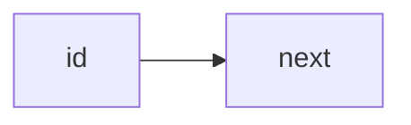

flowchart 由 点（node） 和 边（edge） 组成。node 是各种各样的几何图形，edge 包括不同的箭头和不同的连线。

> 警告：
>
> 如果 node 命名中含有全小写的单词 end，会破坏图表。要将整个单词，或者部分字母大写，比如 END 或 End。或者用下面这种写法：
>
> ```text
> graph TD
>   start --> state
>   state --> endnode["end"]
> ```

> 警告：
>
> 如果连接中后面的 node 的首字母要用 o 或 x 开头，要添加空格或将字母大写。例如：dev--- ops / dev---Ops

## 2. 图表声明

既可以用 `flowchart`，也可以用 `graph`

## 3. 标题

```text
---
title: 写个标题
---
flowchart LR
    id
```

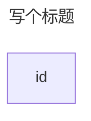

## 4. 方向

紧随在 flowchart / graph 后的 2 个字母可以定义流程图的方向

| 缩写 | 含义                            | 方向     |
| ---- | ------------------------------- | -------- |
| TB   | Top to bottom                   | 从上往下 |
| TD   | Top-down/ same as top to bottom | 从上往下 |
| BT   | Bottom to top                   | 从下往上 |
| RL   | Right to left                   | 从右往左 |
| LR   | Left to right                   | 从左往右 |

## 5. 节点

### 5.1. 节点内的文本和 id

```text
flowchart LR
    id[文本内容]
```


如果一个给同一个 id 指定了多个文本，那么最后一个文本会生效。

```text
flowchart LR
    id[文本内容1]
    id[文本内容2]
```

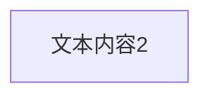

如果之后要给 node 定义 edge，可以省略文本定义【？】

#### 5.1.1. unicode 支持

可以使用 `"` 包裹含有 unicode 的文本

```text
flowchart LR
    id["This ❤ Unicode"]
```


#### 5.1.2. markdown 格式支持

可以使用反点和双引号 `"markdown"` 来包裹住 markdown 文本内容

```text
%%{init: {"flowchart": {"htmlLabels": false}} }%%
flowchart LR
    markdown["`This **is** _Markdown_`"]
    newLines["`Line1
    Line 2
    Line 3`"]
    markdown --> newLines
```

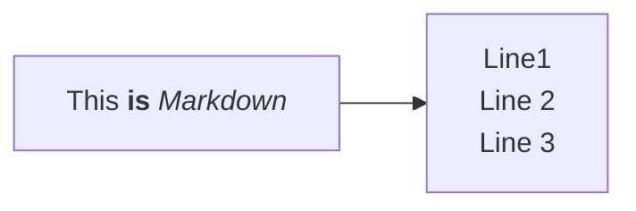

### 5.2. 节点形状

#### 5.2.1. 传统语法

| 语法           | 示例                                                          |
| -------------- | ------------------------------------------------------------- |
| `id(text)`     | [圆角](#5211-圆角-a-node-with-round-edges)                    |
| `id([text])`   | [半圆](#5212-半圆-a-stadium-shaped-node)                      |
| `id[[text]]`   | [双线](#5213-双线-a-node-in-a-subroutine-shape)               |
| `id[(text)]`   | [圆柱数据库](#5214-圆柱数据库-a-node-in-a-cylindrical-shape)  |
| `id((text))`   | [圆](#5215-圆-a-node-in-the-form-of-a-circle)                 |
| `id>text]`     | [旗子](#5216-旗子-a-node-in-an-asymmetric-shape)              |
| `id{text}`     | [菱形](#5217-菱形-a-node-rhombus)                             |
| `id{{text}}`   | [两头尖](#5218-两头尖-a-hexagon-node)                         |
| `id[/text/]`   | [平行四边形](#5219-平行四边形-parallelogram)                  |
| `id[\text\]`   | [反方向平行四边形](#52110-反方向平行四边形-parallelogram-alt) |
| `id[/text\]`   | [梯形](#52111-梯形-trapezoid)                                 |
| `id[\text/]`   | [倒梯形](#52112-倒梯形-trapezoid-alt)                         |
| `id(((text)))` | [双圈圆](#52113-双圈圆-double-circle)                         |

##### 5.2.1.1. 圆角 a node with round edges


##### 5.2.1.2. 半圆 A stadium-shaped node


##### 5.2.1.3. 双线 A node in a subroutine shape


##### 5.2.1.4. 圆柱数据库 A node in a cylindrical shape

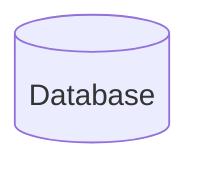

##### 5.2.1.5. 圆 A node in the form of a circle

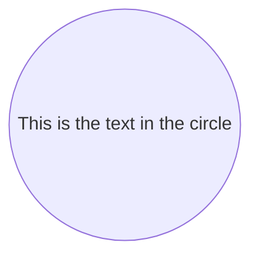

##### 5.2.1.6. 旗子 A node in an asymmetric shape


##### 5.2.1.7. 菱形 A node (rhombus)

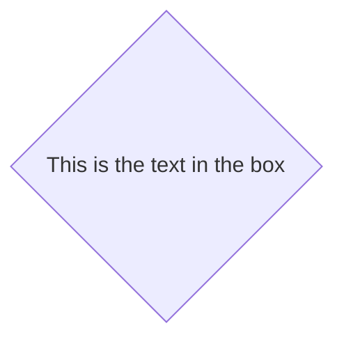

##### 5.2.1.8. 两头尖 A hexagon node


##### 5.2.1.9. 平行四边形 Parallelogram


##### 5.2.1.10. 反方向平行四边形 Parallelogram alt

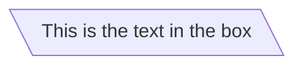

##### 5.2.1.11. 梯形 Trapezoid

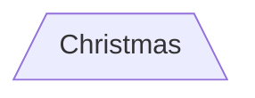

##### 5.2.1.12. 倒梯形 Trapezoid alt

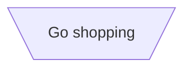

##### 5.2.1.13. 双圈圆 Double circle

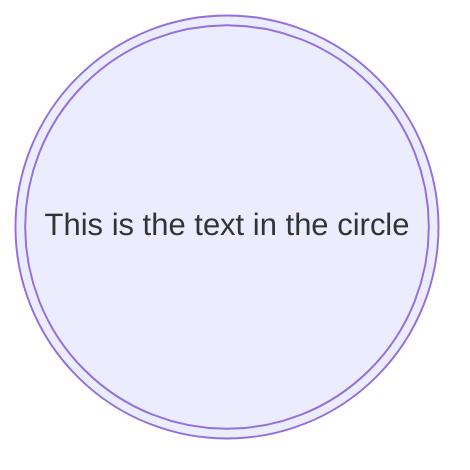

#### 5.2.2. 扩展节点形状（v11.3.0+）

Mermaid 引入了 30 种新形状，以增强流程图创建的灵活性和精确性。这些新形状为在流程图中视觉化表示流程、决策、事件、数据存储等元素提供了更多选项，从而提高了清晰度和语义意义。

Mermaid 现在支持一种通用的语法来定义形状类型，以适应不断增长的形状数量。这种语法允许你使用清晰且灵活的格式将特定的形状分配给节点：

```text
A@{ shape: rect }
```

这种语法创建一个名为 A 的矩形节点。它渲染的方式与 `A["A"]` 或 `A` 相同。

##### 5.2.2.1. 新形状完整列表

以下是新引入的形状及其对应的语义含义、简称和别名：

| Semantic Name 语义名称                               | Shape Name 形状名称               | Short Name 简称 | Description          | Alias Supported 别名支持                                         |
| ---------------------------------------------------- | --------------------------------- | --------------- | -------------------- | ---------------------------------------------------------------- |
| Card 卡片                                            | Notched Rectangle 缺口矩形        | `notch-rect`    | 表示卡片             | `card`, `notched-rectangle`                                      |
| Collate 合并                                         | Hourglass 沙漏                    | `hourglass`     | 表示合并操作         | `collate`, `hourglass`                                           |
| Com Link 链接                                        | Lightning Bolt 闪电               | `bolt`          | 通信链接             | `com-link`, `lightning-bolt`                                     |
| Comment 评论                                         | Curly Brace 花括号                | `brace`         | 添加注释             | `brace-l`, `comment`                                             |
| Comment Right 注释右对齐                             | Curly Brace 花括号                | `brace-r`       | 添加注释             |
| Comment with braces on both sides 两边带大括号的注释 | Curly Braces 大括号               | `braces`        | 添加注释             |
| Data Input/Output 数据输入/输出                      | Lean Right 向右倾斜               | `lean-r`        | 表示输入或输出       | `in-out`, `lean-right`                                           |
| Data Input/Output 数据输入/输出                      | Lean Left 向左倾斜                | `lean-l`        | 表示输入或输出       | `lean-left`, `out-in`                                            |
| Database 数据库                                      | Cylinder 圆柱体                   | `cyl`           | 数据库存储           | `cylinder`, `database`, `db`                                     |
| Decision 决策                                        | Diamond 菱形                      | `diam`          | 决策步骤             | `decision`, `diamond`, `question`                                |
| Delay 延迟                                           | Half-Rounded Rectangle 半圆角矩形 | `delay`         | 表示延迟             | `half-rounded-rectangle`                                         |
| Direct Access Storage 直接访问存储                   | Horizontal Cylinder 水平圆柱      | `h-cyl`         | 直接访问存储         | `das`, `horizontal-cylinder`                                     |
| Disk Storage 磁盘存储                                | Lined Cylinder 线性圆柱体         | `lin-cyl`       | 磁盘存储             | `disk`, `lined-cylinder`                                         |
| Display 显示                                         | Curved Trapezoid 弧形梯形         | `curv-trap`     | 表示显示             | `curved-trapezoid`, `display`                                    |
| Divided Process 分解流程                             | Divided Rectangle 分割矩形        | `div-rect`      | 分割流程形状         | `div-proc`, `divided-process`, `divided-rectangle`               |
| Document 文档                                        | Document 文档                     | `doc`           | 表示一个文档         | `doc`, `document`                                                |
| Event 事件                                           | Rounded Rectangle 圆角矩形        | `rounded`       | 表示一个事件         | `event`                                                          |
| Extract 提取                                         | Triangle 三角形                   | `tri`           | 提取过程             | `extract`, `triangle`                                            |
| Fork/Join 分叉或合并                                 | Filled Rectangle 填充矩形         | `fork`          | 在流程图中分叉或合并 | `join`                                                           |
| Internal Storage 内部存储                            | Window Pane 窗口窗格              | `win-pane`      | 内部存储             | `internal-storage`, `window-pane`                                |
| Junction 连接点                                      | Filled Circle 实心圆              | `f-circ`        | 连接点               | `filled-circle`, `junction`                                      |
| Lined Document 带线文档                              | Lined Document 带线文档           | `lin-doc`       | 带格线的文档         | `lined-document`                                                 |
| Lined/Shaded Process 带线/阴影过程                   | Lined Rectangle 带线的矩形        | `lin-rect`      | 带线的流程形状       | `lin-proc`, `lined-process`, `lined-rectangle`, `shaded-process` |
| Loop Limit 循环限制                                  | Trapezoidal Pentagon 梯形五边形   | `notch-pent`    | 循环限制步骤         | `loop-limit`, `notched-pentagon`                                 |
| Manual File 手动文件                                 | Flipped Triangle 翻转三角形       | `flip-tri`      | 手动文件操作         | `flipped-triangle`, `manual-file`                                |
| Manual Input 手动输入                                | Sloped Rectangle 斜矩形           | `sl-rect`       | 手动输入步骤         | `manual-input`, `sloped-rectangle`                               |
| Manual Operation 手动操作                            | Trapezoid Base Top 梯形上底       | `trap-t`        | 表示手动任务         | `inv-trapezoid`, `manual`, `trapezoid-top`                       |
| Multi-Document 多文档                                | Stacked Document 堆叠文档         | `docs`          | 多个文档             | `documents`, `st-doc`, `stacked-document`                        |
| Multi-Process 多进程                                 | Stacked Rectangle 堆叠矩形        | `st-rect`       | 多个进程             | `processes`, `procs`, `stacked-rectangle`                        |
| Odd 奇数                                             | Odd 奇数                          | `odd`           | 奇形                 |                                                                  |
| Paper Tape 纸带                                      | Flag 标志                         | `flag`          | 纸带                 | `paper-tape`                                                     |
| Prepare Conditional 准备条件                         | Hexagon 六边形                    | `hex`           | 准备或条件步骤       | `hexagon`, `prepare`                                             |
| Priority Action 优先行动                             | Trapezoid Base Bottom 梯形底边    | `trap-b`        | 优先操作             | `priority`, `trapezoid`, `trapezoid-bottom`                      |
| Process 流程                                         | Rectangle 矩形                    | `rect`          | 标准流程形状         | `proc`, `process`, `rectangle`                                   |
| Start 开始                                           | Circle 圆形                       | `circle`        | 起点                 | `circ`                                                           |
| Start 开始                                           | Small Circle 小圆圈               | `sm-circ`       | 小起点               | `small-circle`, `start`                                          |
| Stop 停止                                            | Double Circle 双圆                | `dbl-circ`      | 表示停止点           | `double-circle`                                                  |
| Stop 停止                                            | Framed Circle 带框圆              | `fr-circ`       | 停止点               | `framed-circle`, `stop`                                          |
| Stored Data 存储数据                                 | Bow Tie Rectangle 蝴蝶结矩形      | `bow-rect`      | 存储数据             | `bow-tie-rectangle`, `stored-data`                               |
| Subprocess 子流程                                    | Framed Rectangle 带边框矩形       | `fr-rect`       | 子流程               | `framed-rectangle`, `subproc`, `subprocess`, `subroutine`        |
| Summary 摘要                                         | Crossed Circle 交叉圆圈           | `cross-circ`    | 摘要                 | `crossed-circle`, `summary`                                      |
| Tagged Document 标记文档                             | Tagged Document 标记文档          | `tag-doc`       | 标记文档             | `tag-doc`, `tagged-document`                                     |
| Tagged Process 标记流程                              | Tagged Rectangle 标记矩形         | `tag-rect`      | 标记流程             | `tag-proc`, `tagged-process`, `tagged-rectangle`                 |
| Terminal Point 终端点                                | Stadium 体育场                    | `stadium`       | 终端点               | `pill`, `terminal`                                               |
| Text Block 文本块                                    | Text Block 文本块                 | `text`          | 文本块               |                                                                  |

##### 5.2.2.2. 例子

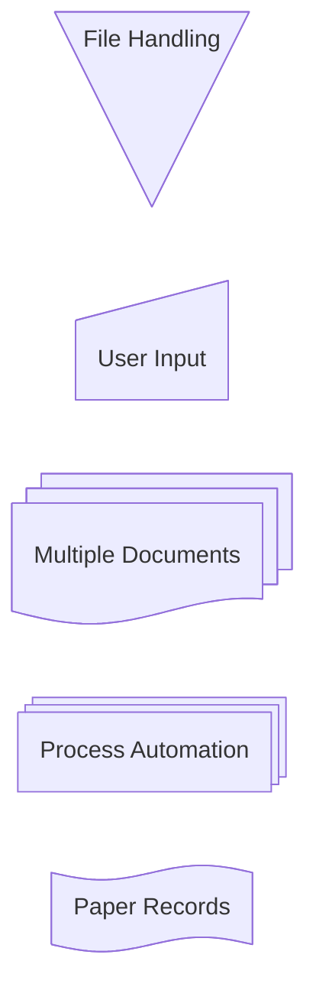

#### 特殊形状（v11.3.0+）

Mermaid 还引入了两种特殊形状来增强您的流程图：图标和图片。这些形状允许您直接在流程图中包含图标和图片，提供更多的视觉上下文和清晰度。

##### 图标形状 Icon Shape

您可以使用 icon 形状在流程图中包含图标。要使用图标，您需要先注册图标包。按照说明添加自定义图标。定义图标形状的语法如下：

```text
flowchart TD
    A@{ icon: "fa:user", form: "square", label: "User Icon", pos: "t", h: 60 }
```

