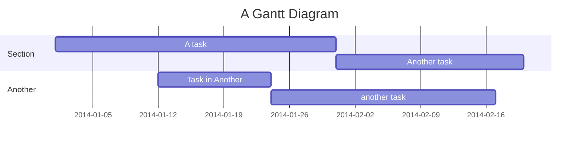
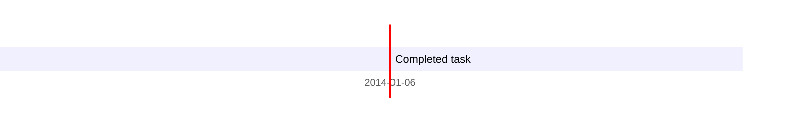
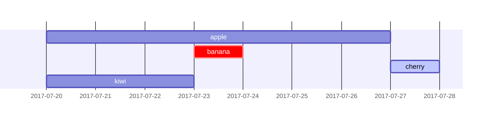
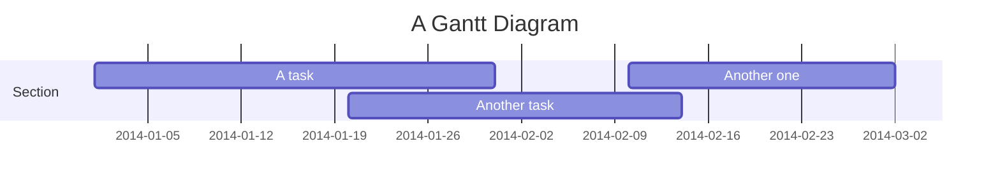
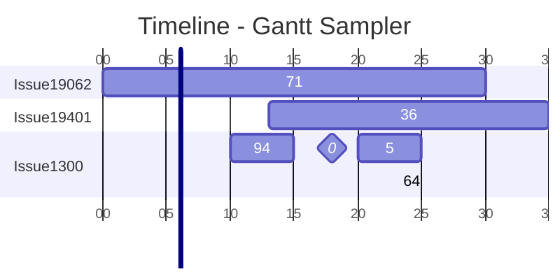

# Gantt 甘特图

<https://mermaid.js.org/syntax/gantt.html>

## 1. 甘特图简介和示例

甘特图会将每个计划任务记录为一条从左到右的长条，x 轴是时间，y 轴是不同的任务和完成时间。



## 2. 任务语法

任务默认会展示顺序进行。任务的开始日期默认为前一个任务的结束日期。

```text
<title> : [tag],<metadata>,...
```

一条任务，先有标题，然后以 `:` 分隔，后续跟若干 metadata，metadata 要以 `,` 分隔。

### 2.1. metadata: 标签 tag

只有 4 种有效 tag: `active`, `done`, `crit`, `milestone`。

tag 是可选的，但是必须放在 metadata 的最开始

### 2.2. 其余 metadata

1. 除了 tag 外，如果只指定了 1 个项。用来指定任务的结束时间。

    可以是 明确的 date 或 time （格式由 `dateFormat` 指定）或者 一个持续时间（duration）。

2. 如果指定了 2 个项，第 1 个项用来指定任务的开始时间，第 2 个用来指定任务的结束时间。

    开始时间可以是明确的 date 或者 time，或者是关联到其他任务的结束之后 `after <otherTaskID>...`，会以关联的任务重的最晚的结束时间来设置当前任务的开始时间。

    关键词 `until` 在 (v10.9.0+) 加入，可以指定任务一直运行，直到某些指定任务或 milestone 开始

3. 如果指定了 3 个项，第 1 个项用来指定任务的 ID，可以用其他语法来引用，如`later <taskID>`。



#### 2.2.1. 详细例子

| Metadata 语法                                        | ID     | 任务的开始日期                    | 任务的结束日期                |
| ---------------------------------------------------- | ------ | --------------------------------- | ----------------------------- |
| `<taskID>, <startDate>, <endDate>`                   | taskID | dateformat 格式的 startdate       | dateformat 格式的 endDate     |
| `<taskID>, <startDate>, <length>`                    | taskID | dateformat 格式的 startdate       | 开始日期 + length             |
| `<taskID>, after <otherTaskId>, <endDate>`           | taskID | 指定的 otherTaskId 任务的结束日期 | dateformat 格式的 endDate     |
| `<taskID>, after <otherTaskId>, <length>`            | taskID | 指定的 otherTaskId 任务的结束日期 | 开始日期 + length             |
| `<taskID>, <startDate>, until <otherTaskId>`         | taskID | dateformat 格式的 startdate       | 指定的 otherTaskID 的开始日期 |
| `<taskID>, after <otherTaskId>, until <otherTaskId>` | taskID | 指定的 otherTaskId 任务的结束日期 | 指定的 otherTaskID 的开始日期 |
| `<startDate>, <endDate>`                             | /      | dateformat 格式的 startdate       | dateformat 格式的 endDate     |
| `<startDate>, <length>`                              | /      | dateformat 格式的 startdate       | Start date + length           |
| `after <otherTaskID>, <endDate>`                     | /      | 指定的 otherTaskId 任务的结束日期 | dateformat 格式的 endDate     |
| `after <otherTaskID>, <length>`                      | /      | 指定的 otherTaskId 任务的结束日期 | Start date + length           |
| `<startDate>, until <otherTaskId>`                   | /      | dateformat 格式的 startdate       | 指定的 otherTaskID 的开始日期 |
| `after <otherTaskId>, until <otherTaskId>`           | /      | 指定的 otherTaskId 任务的结束日期 | 指定的 otherTaskID 的开始日期 |
| `<endDate>`                                          | /      | 前序任务的结束时间                | dateformat 格式的 endDate     |
| `<length>`                                           | /      | 前序任务的结束时间                | Start date + length           |
| `until <otherTaskId>`                                | /      | 前序任务的结束时间                | 指定的 otherTaskID 的开始日期 |

#### 2.2.2. `after` 和 `until` 多个任务 ID 的例子

```text
gantt
    apple :a, 2017-07-20, 1w
    banana :crit, b, 2017-07-23, 1d
    cherry :active, c, after b a, 1d
    kiwi   :d, 2017-07-20, until b c
```



### 2.3. 标题 Title

`title` 是一个可选的字符串，展示在甘特图的顶部。

### 2.4. 排除 Excludes

`excludes` 是一个可选的属性，可以接受 YYYY-MM-DD 格式的特点日期，周几（sunday）或者 周末（weekends），但是不支持 weekdays。

这些日期将在图表上标记，并且不计入任务的持续时间计算中。这意味这如果任务执行过程中遇到了排除日期时，会将跳过的天数加到任务的末尾，保证任务的执行时间和指定的一样。

注意，如果某一段时间被排除了，那么甘特图并不会在那几天断开，产生空白。

不过如果排除的时间是在两个任务之间，第二个任务 after 第一个任务，那么会断开一段空白。

#### 2.4.1. Weekend (v11.0.0+)

当要排除周末的时候，周末可以被设置为 周五和周六，或者周六和周日。默认是周六和周日。

要定义周末的开始日，可以在单独的一行里设置 `weekend (friday|saturday)`

```text
gantt
    title A Gantt Diagram Excluding Fri - Sat weekends
    dateFormat YYYY-MM-DD
    excludes weekends
    weekend friday
    section Section
        A task          :a1, 2024-01-01, 30d
        Another task    :after a1, 20d
```

### 2.5. 段落声明 Section statements

可以将图表分为不同的部分，例如区分一个项目的不同部分，如开发和文档。

```text
section <section_name>
```

此处 `<section_name>` 是必需的。

### 2.6. 里程碑 Milestones

图表里可以添加里程碑，里程碑表示一个特定的时间点。

标识 `milestone` 的 tag，具体的位置由 `开始时间 + 持续时间 / 2` 确定。

```text
gantt
    dateFormat HH:mm
    axisFormat %H:%M
    Initial milestone : milestone, m1, 17:49, 2m
    Task A : 10m
    Task B : 5m
    Final milestone : milestone, m2, 18:08, 4m
```



```mermaid
gantt
    dateFormat HH:mm
    axisFormat %H:%M
    Initial milestone : milestone, m1, 17:49, 2m
    Task A : 10m
    Task B : 5m
    Final milestone : milestone, m2, 18:08, 4m
```

> Initial milestone 只是任务的 title

### 2.7. 垂直标记 Vertical Markers

`vert` 关键字可以在甘特图里添加垂直线，来突出重要日期，例如截止日期、事件、检查点。这些标记会贯穿整个图表，并根据你提供的日期定位。与里程碑不同，垂直标记不占用一行。它们纯粹是视觉参考点，有助于分割时间线，使重要时刻更容易被发现。

```text
gantt
    dateFormat HH:mm
    axisFormat %H:%M
    Initial vert : vert, v1, 17:30, 2m
    Task A : 3m
    Task B : 8m
    Final vert : vert, v2, 17:58, 4m
```



```mermaid
gantt
    dateFormat HH:mm
    axisFormat %H:%M
    Initial vert : vert, v1, 17:30, 2m
    Task A : 3m
    Task B : 8m
    Final vert : vert, v2, 17:58, 4m
```

## 3. 设置日期 Setting dates

`dateFormat` 定义了甘特图元素 date 输入的格式。

日期在渲染的图标中输出的方式由 `axisFormat` 定义

### 3.1. 输入日期格式 Input date format

默认的输入日期格式为 `YYYY-MM-DD`。你可以定义自己的自定义 `dateFormat`

```text
dateFormat YYYY-MM-DD
```

支持以下格式选项：

| Input    | Example        | Description                                  |
| -------- | -------------- | -------------------------------------------- |
| YYYY     | 2014           | 4 位年份                                     |
| YY       | 14             | 2 位年份                                     |
| Q        | 1..4           | 一年中的季度数。将月份设置为季度中的第一个月 |
| M MM     | 1..12          | 月份数字                                     |
| MMM MMMM | January..Dec   | 通过`dayjs.locale()`设置的本地化月名称       |
| D DD     | 1..31          | 月中的某一天                                 |
| Do       | 1st..31st      | 月中的某一天，序数词                         |
| DDD DDDD | 1..365         | 年中的某一天                                 |
| X        | 1410715640.579 | Unix 时间戳                                  |
| x        | 1410715640579  | Unix 毫秒时间戳                              |
| H HH     | 0..23          | 24 小时制小时                                |
| h hh     | 1..12          | 12 小时制小时，使用 `a A` 表示               |
| a A      | am pm          | 午前/午后                                    |
| m mm     | 0..59          | 分钟                                         |
| s ss     | 0..59          | 秒                                           |
| S        | 0..9           | 十分之一秒                                   |
| SS       | 0..99          | 百分之一秒                                   |
| SSS      | 0..999         | 千分之一秒                                   |
| Z ZZ     | +12:00         | 与 UTC 的偏移量，格式为+-HH:mm、+-HHmm 或 Z  |

更多信息详见：<https://day.js.org/docs/en/parse/string-format/>

### 3.2. 轴上的输出日期格式 Output date format on the axis

默认的输出日期格式是 `YYYY-MM-DD`。你可以自定义 `axisFormat`，例如 `2020-Q1` 表示 2020 年的第一季度

```text
axisFormat %Y-%m-%d
```

支持以下格式选项：

| Format 格式 | Definition 定义                                            |
| ----------- | ---------------------------------------------------------- |
| `%a`        | 缩写星期几名称                                             |
| `%A`        | 完整的工作日名称                                           |
| `%b`        | 缩写的月份名称                                             |
| `%B`        | 完整月份名称                                               |
| `%c`        | 日期和时间，格式为 "%a %b %e %H:%M:%S %Y"                  |
| `%d`        | 带前导零的月份日期，十进制数字 `[01,31]`                   |
| `%e`        | 带空格前导的月份日期，十进制数字 `[ 1,31]`；等同于 `%_d`   |
| `%H`        | 小时（24 小时制）十进制数 `[00,23]`                        |
| `%I`        | 小时（12 小时制）十进制数 `[01,12]`                        |
| `%j`        | 年内的天数，十进制数 `[001,366]`                           |
| `%m`        | 月份，十进制数 `[01,12]`                                   |
| `%M`        | 分钟，十进制数 `[00,59]`                                   |
| `%L`        | 毫秒，十进制数 `[000, 999]`                                |
| `%p`        | AM 或 PM                                                   |
| `%S`        | 秒，十进制数 `[00,61]`                                     |
| `%U`        | 年中的周数（周日为一周的第一天）以十进制数表示 `[00,53]`   |
| `%w`        | 星期几作为十进制数 `[0(Sunday),6]`                         |
| `%W`        | 年中的周数（以星期一为一周的第一天）作为十进制数 `[00,53]` |
| `%x`        | 日期，格式为"%m/%d/%Y"                                     |
| `%X`        | 时间，格式为 "%H:%M:%S"                                    |
| `%y`        | 不带世纪的年份，以十进制数字表示 `[00,99]`                 |
| `%Y`        | 带世纪的年份，以十进制数字                                 |
| `%Z`        | 时区偏移量，例如"-0700"                                    |
| `%%`        | 一个字面量的"%"字符                                        |

更多信息详见：<https://github.com/d3/d3-time-format/tree/v4.0.0#locale_format>

### 3.3. 坐标轴刻度 Axis ticks (v10.3.0+)

默认的输出刻度是自动的。你可以自定义 `tickInterval`，例如 `1day` 或者 `1week`

```text
tickInterval 1day
```

模式是

```text
/^([1-9][0-9]*)(millisecond|second|minute|hour|day|week|month)$/;
```

更多信息详见：<https://github.com/d3/d3-time#interval_every>

基于周的 tickInterval 默认从周日开始。如果您希望指定另一个星期几作为 tickInterval 的开始日，请使用 weekday 选项：

```text
gantt
  tickInterval 1week
  weekday monday
```

> WARNING
>
> `millisecond` 和 `second` 的支持是在 v10.3.0 版本中添加的

## 4. 输出为紧凑模式 Output in compact mode

紧凑模式允许您在同一行中显示多个任务。通过在 YAML 设置中指定图形的显示模式，可以为甘特图启用紧凑模式。

```text
---
displayMode: compact
---
gantt
    title A Gantt Diagram
    dateFormat  YYYY-MM-DD

    section Section
    A task           :a1, 2014-01-01, 30d
    Another task     :a2, 2014-01-20, 25d
    Another one      :a3, 2014-02-10, 20d
```



## 5. 注释 Comments

可以在甘特图中输入注释，解析器会忽略这些注释。注释需要单独成行，并且必须以 `%%` （两个百分号）开头。从注释开始到下一行之间的任何文本都将被视为注释，包括任何图表语法。

```text
gantt
    title A Gantt Diagram
    %% This is a comment
    dateFormat YYYY-MM-DD
    section Section
        A task          :a1, 2014-01-01, 30d
        Another task    :after a1, 20d
    section Another
        Task in Another :2014-01-12, 12d
        another task    :24d
```

## 6. 样式 Styling

甘特图的样式通过定义多个 CSS 类来设置。在渲染过程中，这些类从位于 `src/diagrams/gantt/styles.js` 的文件中提取。

### 6.1. Classes used

| Class                   | Description                      |
| ----------------------- | -------------------------------- |
| `grid.tick`             | 网格线（grid lines）的样式       |
| `grid.path`             | 网格边框（grid's borders）的样式 |
| `.taskText`             | 任务文本样式                     |
| `.taskTextOutsideRight` | 任务文本超出活动条向右时的样式   |
| `.taskTextOutsideLeft`  | 任务文本超出活动条向左时的样式   |
| `todayMarker`           | "Today Marker"的切换和样式       |

### 6.2. 示例样式表 Sample stylesheet

```CSS
.grid .tick {
  stroke: lightgrey;
  opacity: 0.3;
  shape-rendering: crispEdges;
}
.grid path {
  stroke-width: 0;
}

#tag {
  color: white;
  background: #fa283d;
  width: 150px;
  position: absolute;
  display: none;
  padding: 3px 6px;
  margin-left: -80px;
  font-size: 11px;
}

#tag:before {
  border: solid transparent;
  content: ' ';
  height: 0;
  left: 50%;
  margin-left: -5px;
  position: absolute;
  width: 0;
  border-width: 10px;
  border-bottom-color: #fa283d;
  top: -20px;
}
.taskText {
  fill: white;
  text-anchor: middle;
}
.taskTextOutsideRight {
  fill: black;
  text-anchor: start;
}
.taskTextOutsideLeft {
  fill: black;
  text-anchor: end;
}
```

## 7. Today marker

你可以设置或隐藏当前日期的标记。要设置样式，为 `todayMarker` 键添加一个值。

```text
todayMarker stroke-width:5px,stroke:#0f0,opacity:0.5
```

要隐藏标记，将 todayMarker 设置为 off 。

```text
todayMarker off
```

## 8. 配置 Configuration

可以调整 Gantt 图的边距进行渲染。

这是通过定义配置对象的 `ganttConfig` 部分来完成的。CLI 的使用方法在 mermaidCLI 页面中有描述。

mermaid.ganttConfig 可以设置为包含配置参数的 JSON 字符串或相应的对象。

```javascript
mermaid.ganttConfig = {
    titleTopMargin: 25, // Margin top for the text over the diagram
    barHeight: 20, // The height of the bars in the graph
    barGap: 4, // The margin between the different activities in the gantt diagram
    topPadding: 75, // Margin between title and gantt diagram and between axis and gantt diagram.
    rightPadding: 75, // The space allocated for the section name to the right of the activities
    leftPadding: 75, // The space allocated for the section name to the left of the activities
    gridLineStartPadding: 10, // Vertical starting position of the grid lines
    fontSize: 12, // Font size
    sectionFontSize: 24, // Font size for sections
    numberSectionStyles: 1, // The number of alternating section styles
    axisFormat: "%d/%m", // Date/time format of the axis
    tickInterval: "1week", // Axis ticks
    topAxis: true, // When this flag is set, date labels will be added to the top of the chart
    displayMode: "compact", // Turns compact mode on
    weekday: "sunday", // On which day a week-based interval should start
};
```

### 8.1. Possible configuration params

| Param           | Description                                                                                 | Default value |
| --------------- | ------------------------------------------------------------------------------------------- | ------------- |
| mirrorActor     | 打开/关闭图表下方以及上方的角色渲染                                                         | false         |
| bottomMarginAdj | 调整图表结束位置。使用 CSS 的宽边框样式可能导致不期望的裁剪，这就是这个配置参数存在的原因。 | 1             |

## 9. 交互 Interaction

可以将点击事件绑定到任务上。点击可以触发 JavaScript 回调或打开一个链接，该链接将在当前浏览器标签页中打开。注意：当使用 securityLevel='strict' 时此功能被禁用，使用 securityLevel='loose' 时此功能被启用。

## 10. 例子

### 10.1. Bar chart (using gantt chart)

```text
gantt
    title Git Issues - days since last update
    dateFormat X
    axisFormat %s
    section Issue19062
    71   : 0, 71
    section Issue19401
    36   : 0, 36
    section Issue193
    34   : 0, 34
    section Issue7441
    9    : 0, 9
    section Issue1300
    5    : 0, 5
```



```mermaid
gantt
    title Git Issues - days since last update
    dateFormat X
    axisFormat %s
    section Issue19062
    71   : 0, 71
    section Issue19401
    36   : 0, 36
    section Issue193
    34   : 0, 34
    section Issue7441
    9    : 0, 9
    section Issue1300
    5    : 0, 5
```

### 10.2. Timeline (with comments, CSS, config in frontmatter)

```text
---
    # Frontmatter config, YAML comments
    title: Ignored if specified in chart
    displayMode: compact     #gantt specific setting but works at this level too
    config:
#        theme: forest
#        themeCSS: " #item36 { fill: CadetBlue } "
        themeCSS: " // YAML supports multiline strings using a newline markers: \n
            #item36 { fill: CadetBlue }       \n

            // Custom marker workaround CSS from forum (below)    \n
            rect[id^=workaround] { height: calc(100% - 50px) ; transform: translate(9px, 25px); y: 0; width: 1.5px; stroke: none; fill: red; }   \n
            text[id^=workaround] { fill: red; y: 100%; font-size: 15px;}
        "
        gantt:
            useWidth: 400
            rightPadding: 0
            topAxis: true  #false
            numberSectionStyles: 2
---
gantt
    title Timeline - Gantt Sampler
    dateFormat YYYY
    axisFormat %y
    %% this next line doesn't recognise 'decade' or 'year', but will silently ignore
    tickInterval 1decade

    section Issue19062
    71   :            item71, 1900, 1930
    section Issue19401
    36   :            item36, 1913, 1935
    section Issue1300
    94   :            item94, 1910, 1915
    5    :            item5,  1920, 1925
    0    : milestone, item0,  1918, 1s
    9    : vert,              1906, 1s   %% not yet official
    64   : workaround,        1923, 1s   %% custom CSS object https://github.com/mermaid-js/mermaid/issues/3250
```


