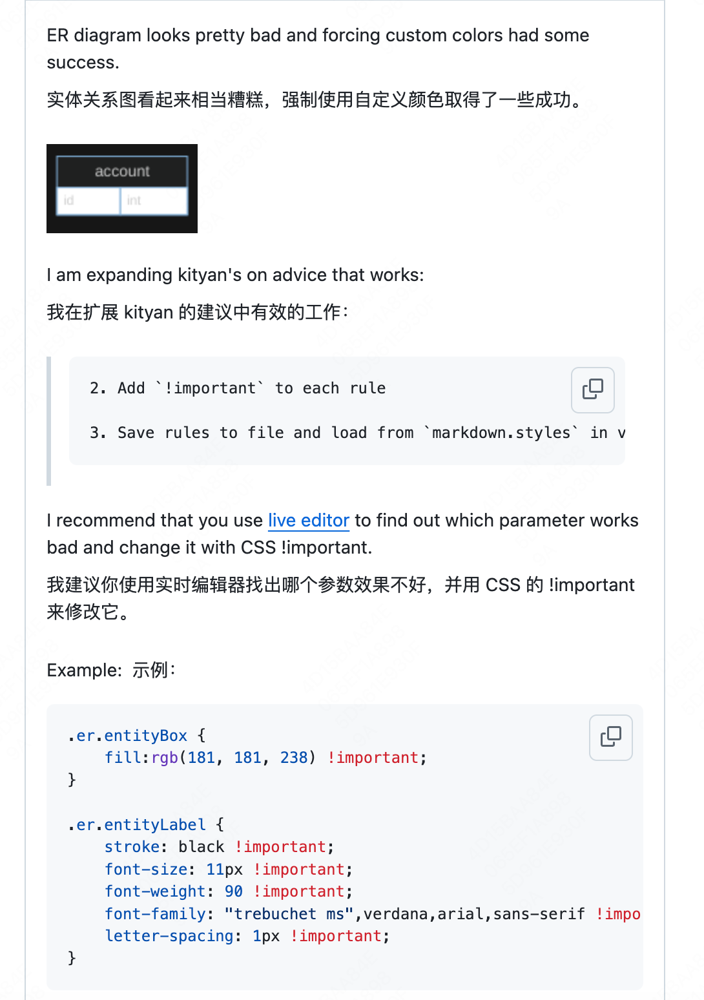

+1

The only solution for this moment is:
目前唯一的解决方案是：

Extract CSS rules for default theme from https://raw.githubusercontent.com/mjbvz/vscode-markdown-mermaid/master/page.bundle.js (look for text ./node_modules/css-loader!./node_modules/sass-loader/lib/loader.js!./src/themes/default/index.scss)
从 https://raw.githubusercontent.com/mjbvz/vscode-markdown-mermaid/master/page.bundle.js 中提取默认主题的 CSS 规则（查找文本 ./node_modules/css-loader!./node_modules/sass-loader/lib/loader.js!./src/themes/default/index.scss ）
Add !important to each rule
在每个规则中添加 !important
Save rules to file and load from markdown.styles in vscode
将规则保存到文件并在 VSCode 中从 markdown.styles 加载

FYI: The latest version of VSCode does blend a bit better. However, graph TD could use a little bit more padding on the | block | elements. None the less, nicely done!! Love the extension
仅供参考：最新版本的 VSCode 混合效果稍好一些。但是 graph TD 在 | block | 元素上可以稍微增加一些内边距。尽管如此，做得很好！！喜欢这个扩展

In the example below, the text for Get money, One, Two, and Three touch the edges of the blocks. Just a few pixels of padding would help.
在下面的示例中， Get money 、 One 、 Two 和 Three 的文本触碰到块的边缘。只需几像素的内边距就能解决问题。

i.e.  即

The issues with padding happens with the built-in markdown preview, too (not just bierner.github-markdown-preview). I lose 3-4 characters off the right of most words.
使用内置的 Markdown 预览时也会出现填充问题（而不仅仅是 bierner.github-markdown-preview）。大多数单词的右侧会丢失 3-4 个字符。

以下组合似乎为暗黑模式下的 ER 产生了最佳效果：

.er.entityBox {
    fill:rgb(2, 2, 59) !important;
}

.er.entityLabel {
    /*stroke: white !important;*/
    font-size: 11px !important;
    font-weight: 90 !important;
    font-family: "trebuchet ms",verdana,arial,sans-serif !important;
    letter-spacing: 1px !important;
}

.er.attributeBoxOdd {
    fill: black !important;
}

.er.attributeBoxEven {
    fill: rgb(43, 41, 41) !important;
}
