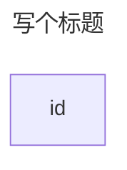

> https://mermaid.js.org/syntax/flowchart.html

# Flowchart 流程图

> 警告：
>
> 如果 node 命名中含有全小写的单词 end，会破坏图表。要将整个单词，或者部分字母大写，比如 END 或 End。或者用下面这种写法：
> ```mermaid
> graph TD
>   start --> state
>   state --> endnode["end"]
> ```

> 警告：
>
> 如果连接中后面的 node 的首字母要用 o 或 x 开头，要添加空格或将字母大写。例如：dev--- ops / dev---Ops

## 图表声明

既可以用 `flowchart`，也可以用 `graph`

## 标题



## 方向


