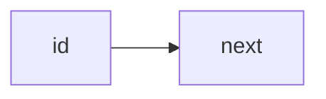
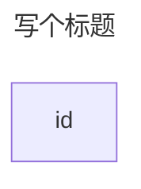
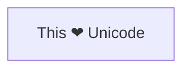
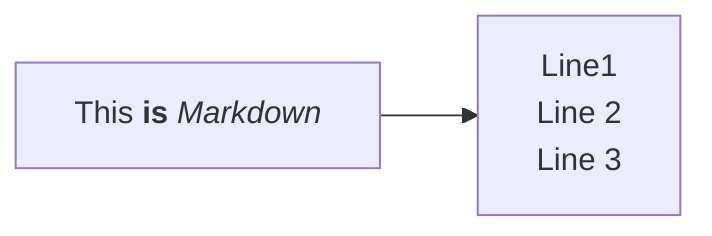
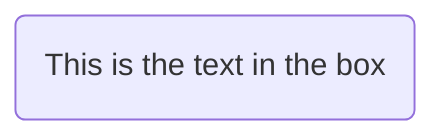
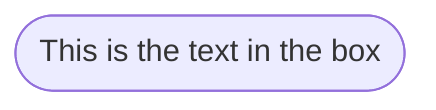

> https://mermaid.js.org/syntax/flowchart.html

# Flowchart 流程图 示例



flowchart 由 点（node） 和 边（edge） 组成。node 是各种各样的几何图形，edge 包括不同的箭头和不同的连线。

> 警告：
>
> 如果 node 命名中含有全小写的单词 end，会破坏图表。要将整个单词，或者部分字母大写，比如 END 或 End。或者用下面这种写法：
>
> ```mermaid
> graph TD
>   start --> state
>   state --> endnode["end"]
> ```

> 警告：
>
> 如果连接中后面的 node 的首字母要用 o 或 x 开头，要添加空格或将字母大写。例如：dev--- ops / dev---Ops

# 图表声明

既可以用 `flowchart`，也可以用 `graph`

# 标题



# 方向

紧随在 flowchart / graph 后的 2 个字母可以定义流程图的方向

| 缩写 | 含义                            | 方向     |
| ---- | ------------------------------- | -------- |
| TB   | Top to bottom                   | 从上往下 |
| TD   | Top-down/ same as top to bottom | 从上往下 |
| BT   | Bottom to top                   | 从下往上 |
| RL   | Right to left                   | 从右往左 |
| LR   | Left to right                   | 从左往右 |

# 节点

## 节点内的文本和 id


如果一个给同一个 id 指定了多个文本，那么最后一个文本会生效。


如果之后要给 node 定义 edge，可以省略文本定义【？】

### unicode 支持

可以使用 `"` 包裹 unicode 文本



### markdown 格式支持

可以使用 `"markdown"` 来包裹住 markdown 文本内容



## 节点形状

| 形状     | 语法       | 示例                  |
| -------- | ---------- | --------------------- |
| 圆角节点 | `id(text)` | [圆角节点](#圆角节点) |
| 半圆节点 | `id([text])` | [半圆节点](#半圆节点) |

### 圆角节点

a node with round edges



### 半圆节点

A stadium-shaped node



    id1{This is the text in the box}