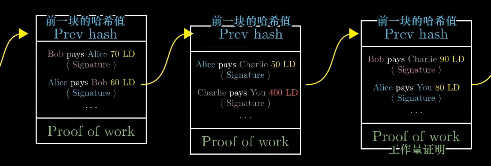
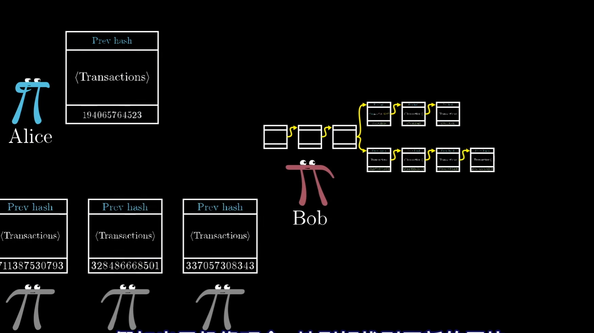

# 加密货币原理

> <https://www.bilibili.com/video/BV11x411i72w/>

$$
公共账本 Ledger - 信任 Trust + 密码学 Cryptography = 加密货币 Cryptocurrency
$$

## 1. 公共账本

假设有一群人，他们不选择使用现金立刻支付，而是将各自之间的交易内容，都写在了某个公共账本上。月底再结算。

协议 v1 如下：

- 任何人都可以在账本上添加新行
- 每月用真钱结算

例如：

- 小明 给 小红 支付 100元
- 小红 给 小白 支付 50元

问题是：

- 既然每个人都可以在上面写，怎么确保账本记录上的是真的？

## 2. 电子签名

为了确保记录不被伪造，需要在交易记录上添加签名

例如：

- 小明 给 小红 支付 100元 【小明签名】

计算机世界里的一切都很容易被复制，为此我们需要一个电子签名的算法：

1. 每个人都有生成一对 公钥（public key, pk） + 私钥（private / secret key， sk）
2. 签名函数：`Sign(Message, sk) = Signature`。可以用私钥和文本信息生成一段签名，通常是 256 个字节。
    1. 签名函数是一种特殊的哈希算法，特点是输入的轻微改变，就会引起结果的巨大变化，且没有简单算法可以由输出逆向出输入，目前来看最有效的方法就是随机猜测。但是 256 个比特所对应的解非常大到爆炸。
    2. 签名中隐含有 信息 的内容，这样其他人不能通过复制签名来伪造其他信息
3. 验证函数：`Verify(Message, Signature, pk) = True / False`
    1. 可以快速得知，签名是否由公钥所对应的私钥生成的
4. 由于签名函数的特性，当我们能通过验证函数验证出一个签名有效时，我们就可以认为是签名人知道公钥对应的私钥
5. 还有一点小漏洞需要补上：虽然签名保证了整条消息是真实可靠的，但是如果复制了整条消息，就出现了多笔有效交易，所以每笔交易应该有一个唯一id

现在的账本如下：

- 1 小明 给 小红 支付 100元 【小明签名】
- 2 小红 给 小白 支付 50元 【小红签名】

协议 v2 如下：

- 任何人都可以在账本上添加新行
- 每月用真钱结算
- 只有有签名的交易是有效的

问题是：

我们现在在每个月进行结算，如果 小红 在欠款巨大后，跑路了怎么办？

## 3. 不能超支

我们可以在账本的最初，给每个人增加一定的余额，并且要求每个人不能超支。

例如：

- 1 小明获得 100 元
- 2 小红获得 20 元
- 3 小明 给 小红 支付 120元 【小明签名】【超支无效】

协议 v3 如下：

- 任何人都可以在账本上添加新行
- 每月用真钱结算
- 只有有签名的交易是有效的
- 不能超支

这带来一个问题，我们如果想验证某一笔交易是否有效，就需要知道目前为止所有交易的历史。这对于所有加密货币都是必须的。

注意：这一点移除了 真钱 和 加密货币的联系。假设世界上所有人都在用这个账本，完全可以只用这个账本进行收支，不需要换回真钱。

我们可以将 账本 的中钱称为 Ledger Dollar, LD。

人们可以用真钱去换LD，例如小明给小红100美元，小红在账本中记录“给小明 100 LD”。但是这种交换并不在加密货币的协议中。

## 4. 加密货币的本质

从这里就可以看出来，加密货币的本质就是这个【账本】，也就是【交易的历史】。

问题是：

现在这个账本都是放在某个公共位置上的，例如某个网站。但是这需要这个中心位置的信任。

## 5. 去中心化：计算工作量 Computational work

让所有人保存一份账本。当小明一笔交易发生时，就广播给全世界，大家记录在各自的账本上。

但是，怎么样所有人都同意，接收到的是正确的账本呢？

例如 小明 收到了 小红 100LD 的转账，他怎么让所有人都相信这笔交易，好方便他接下来把其中 50LD 支付给 小白呢？

再例如，当你收到了一个广播波，怎么保证所有人都以同样的顺序记录了同样的交易呢？

这正是当年提出比特币那篇论文讨论的问题。找到一个协议，来决定是否接收交易，并以什么顺序接收，从而让世界上遵守同一个协议的所有人手上的账本都一样。

方案：哪个账本上的**计算工作量最大**，就信任哪个账本。

这样可以让交易欺诈和不一致的账本在计算成本上不可行。

### 5.1. 密码哈希函数 和 工作量证明

$$
SHA256("Message") = 000000000111111111110110101010
$$

哈希函数得到一个任意输入后，会输出一个看上去很随机的 256 位的二进制串，称为 Hash 或者 Digest（摘要）。

不过输出并不是随机的，同一个输入值得到的输出是固定的。但是只要稍微修改一下输入，得到的哈希值就会完全不同。

在这里使用的 SHA256，输入有一点修改后，输出就会完全无法预测，逆向的计算是不可行的。这种被称为 密码哈希函数 Cryptographic hash function。

尽管目前没有严格的证明表示逆向计算很困难，但是现在绝大数信息安全都是基于密码哈希函数和其性质。

那密码哈希函数是如何证明一个交易列表是和一个很大的计算量有关的呢？

想象一下，有人说：我找到了一个数字，如果把这个数字放在交易列表后面，那么整个交易列表的SHA256得到的哈希值前30位都是0. 那么找到这个数字的概率有多大呢？

对于一个随机的信息，哈希值前30都是0的概率是 2^30 分之一，大约是十亿分之一。由于这是一个密码哈希函数，只能瞎猜乱试十亿次才能找到这个数。

验证函数执行很快，所以我们很简单就可以证明他做了海量的计算，这就叫做 proof of work

### 5.2. 区块链 Blockchain

首先，将账本分成一个个的块 blocks，每个块里包含了一些 交易列表 和 对应的 proof of work。

正如每条记录都需要签名后才有效，每个区块也需要工作量证明后，才被认为是有效的。

为了让这些区块有一个标准的顺序，区块的头部需要包含上一个块的哈希值。

如：

现在允许全世界的人都可以建造区块，交易者在广播交易记录，然后有人收集起来，形成一个块，然后做很多计算工作，找到那个能让开头是很多个0的数字，并广播出新发现的区块。

为了奖励这些人，允许他在块的开头加上一笔特殊交易，凭空获得 10LD，称为 block reward。由于这个奖励不是别人支付的，所以也不需要签名；同时这样每个区块也会为经济体系里增加新的虚拟货币。建造区块的这个操作也被称为“挖矿” mining。因为这个操作需要很多工作量，也为经济注入了新的货币。

所以矿工做的事情其实是：接收交易信息，建造区块，广播区块，得到新的钱作为奖励。

### 5.3. 使用者：相信更大的工作量，得到去中心化的共识

对于使用者来说，不需要监听所有的交易，只需要监听矿工广播的块就行了。

关键是：当收到两条不同的区块链，他们的信息冲突，这时只保留最长的一条，也就是计算工作量更大的那条。如果一样长，就等一会儿。

### 5.4. 为什么这样的共识是可信的？

假设我们想构造一个假的区块。例如小明构造了一个假的区块，里面有一句：小明给了小红100LD。然后只将这个区块发给了小红，没有发给其他人，让大家以为他没花这100LD。

这样小明需要率先找到 proof of work 的那个数字，发给小红。由于小红同时也在收到其他人的块，发现出现了分叉。因为小红只会相信最长的那个链条，这时候小明就要比所有人都算得快才行，那除非他的算力强过剩下的所有人，否则总有一天，小红会否认掉那条错误的链。

注意，这意味着我们不能立刻相信新的块，而应该等这条链上再添加几个新的区块后，才可以信任这个块属于所有人都在用的那个链。

### 5.5. 区块链的 proof of work 的哈希前导0的个数

比特币会控制在每10分钟有一个块的速度，也就是说，随着这个游戏参与的人变多，这个数会不断变大，让发现一个新块需要的算力更多。

### 5.6. block rewards 的数量

最早一个块能奖励 50BTC，都是每隔一段时间（一定数量的区块），这个奖励就会减半。也就是说最终比特币的数量会恒定到 2100万，这是一个收敛的级数。

### 5.7. 矿工的收入

除了区块奖励，矿工也能收到交易手续费。

由于一个块只有 2400 笔交易左右（一个人为限制吧？），所以手续费决定了矿工会把哪些交易加入到新区块里。

