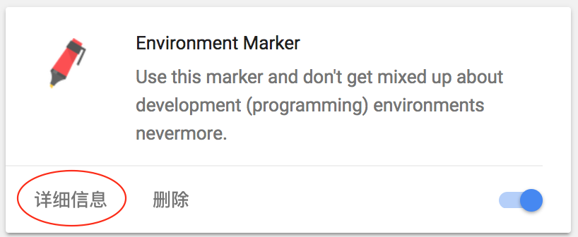
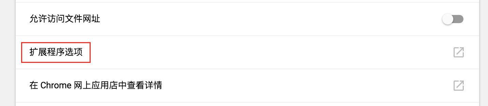
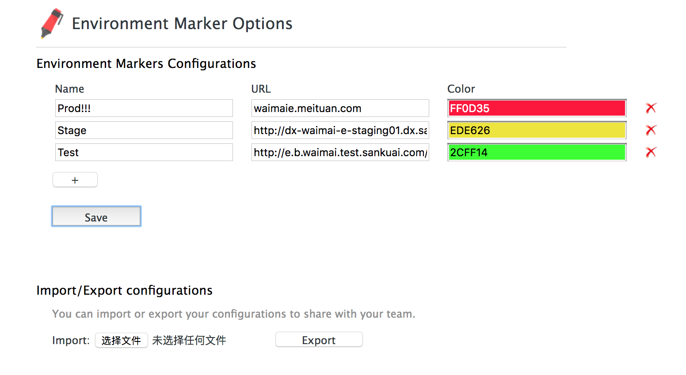

# 浏览器环境打标

1. 安装 Chrome 插件 ： Environment Marker
2. 打开 chrome://extensions/ ，找到 Environment Marker ，点击“详细信息”，然后点“扩展程序选项”
   
   
3. 对各个环境进行配置，选择提示的名称，测试环境的 URL 地址，和颜色（配置文件还可以导入导出，方便 team 共享，可以按照下载下边对应的配置文件直接导入即可）
   
